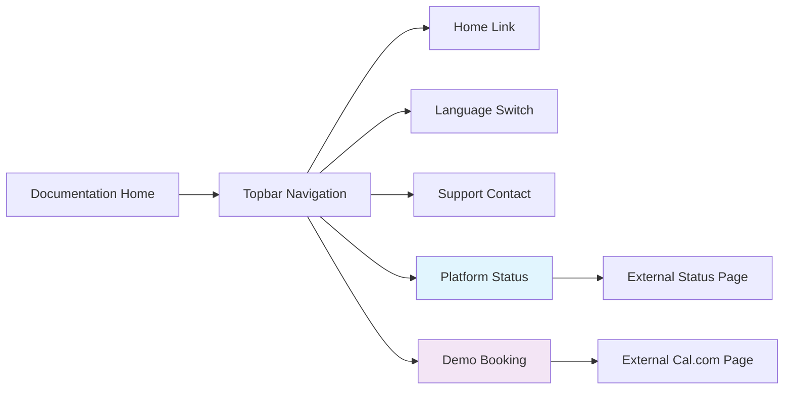

# Add Status and Demo Links to Mintlify Documentation

## Overview

This design outlines the implementation of two new navigation links in the Famulor documentation site: Platform Status and Book a Demo. These links will be strategically positioned after the API Referenz section in the topbar navigation to provide users with quick access to platform health information and demo scheduling.

## Technology Stack & Dependencies

- **Framework**: Mintlify documentation platform
- **Configuration File**: mint.json
- **Navigation Method**: topbarLinks array in Mintlify configuration
- **Target URLs**: 
  - Platform Status: https://status.famulor.io/
  - Book a Demo: https://cal.com/bek-group/demotermine

## Component Architecture

### Current Navigation Structure
The existing topbarLinks configuration includes:
- Home link to main website
- Language switcher to English documentation  
- Support email contact

### Proposed Navigation Enhancement

#### Link Configuration
The new links will be added to the `topbarLinks` array in mint.json with the following specifications:

**Platform Status Link**
- Display Name: "Platform Status" 
- URL: https://status.famulor.io/
- Purpose: Real-time platform health monitoring
- Target Audience: Technical users, developers, system administrators

**Book a Demo Link**  
- Display Name: "Demo buchen"
- URL: https://cal.com/bek-group/demotermine
- Purpose: Sales engagement and product demonstration scheduling
- Target Audience: Potential customers, sales prospects

#### Positioning Strategy
The links will be positioned after the Support link in the topbarLinks array to maintain logical navigation flow:
1. Home (website navigation)
2. 🇬🇧 English (localization)  
3. Support (assistance)
4. **Platform Status** (technical information)
5. **Demo buchen** (sales engagement)

## Implementation Details

### Configuration Structure
```json
{
  "topbarLinks": [
    {
      "name": "Home",
      "url": "https://www.famulor.io"
    },
    {
      "name": "🇬🇧 English", 
      "url": "https://docs.famulor.io/"
    },
    {
      "name": "Support",
      "url": "mailto:support@famulor.io"
    },
    {
      "name": "Platform Status",
      "url": "https://status.famulor.io/"
    },
    {
      "name": "Demo buchen", 
      "url": "https://cal.com/bek-group/demotermine"
    }
  ]
}
```

### Navigation Flow Architecture



### User Journey Integration

#### Technical User Path
1. Documentation Access → Platform Status → System Health Monitoring
2. Provides transparency for developers and system integrators
3. Reduces support inquiries related to platform availability

#### Sales Prospect Path  
1. Documentation Review → Demo Booking → Sales Engagement
2. Seamless transition from technical exploration to sales process
3. Captures qualified leads directly from documentation

## Design Considerations

### User Experience
- **Accessibility**: Links open in new tabs to preserve documentation context
- **Visibility**: Positioned prominently in topbar for immediate access
- **Consistency**: Follows existing topbarLinks pattern and styling

### Technical Considerations
- **External Dependencies**: Both links point to external services
- **Performance Impact**: Minimal - only adds navigation metadata
- **Maintenance**: URLs may require updates if services change

### Internationalization
- German language labels align with default locale (de)
- Platform Status uses English term (commonly understood technical terminology)
- Demo booking uses German "Demo buchen" for native audience

## Testing Strategy

### Functional Testing
- Verify links render correctly in topbar navigation
- Confirm external URLs are accessible and functional
- Test navigation behavior across different devices and browsers

### Visual Testing  
- Ensure proper spacing and alignment in topbar
- Verify links maintain Mintlify styling consistency
- Check responsive behavior on mobile devices

### Integration Testing
- Validate mint.json configuration syntax
- Test Mintlify build process with new configuration
- Confirm no conflicts with existing navigation elements