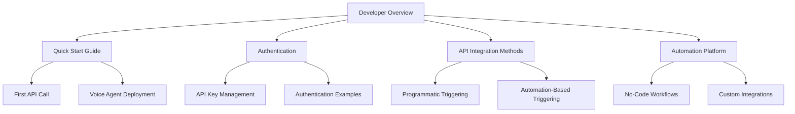
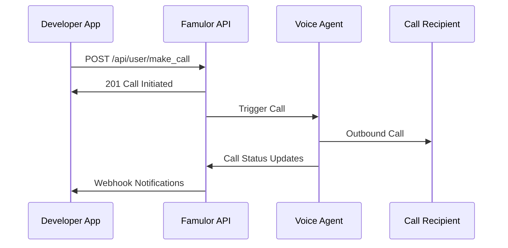
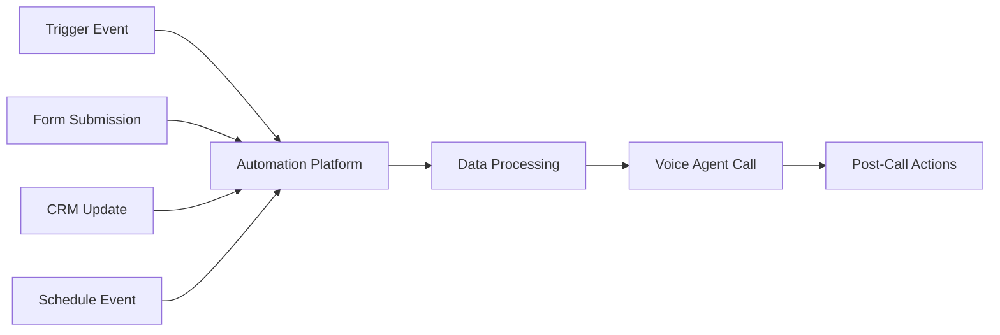
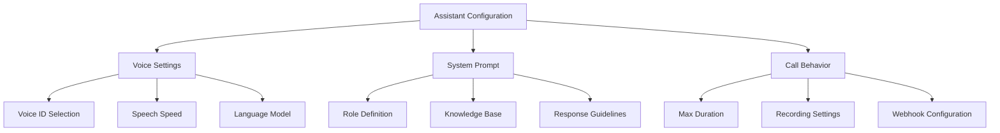
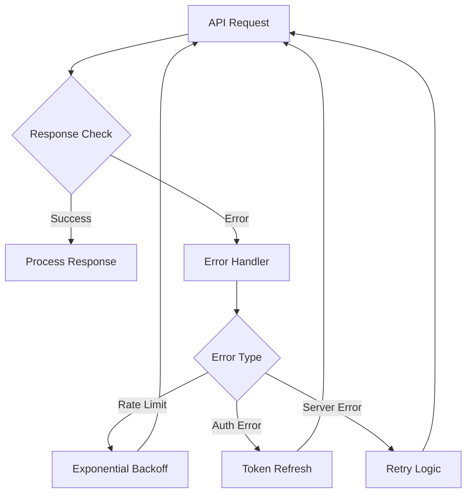

# Developer Page Setup Design Document

## Overview
This design document outlines the creation of a comprehensive developer section for the Famulor documentation platform. The page will serve as a central hub for developers wanting to integrate Famulor's Voice AI capabilities into their applications using the API and automation platform.

## Architecture

### Page Placement
The developer page will be positioned strategically in the navigation structure:
- **Location**: New top-level section after "Wichtige Begriffe" (Key Terminology)
- **Navigation Group**: "Für Entwickler" (For Developers)
- **URL Structure**: `/developers/overview`

### Content Organization
The developer section will be organized into logical subsections that progressively guide developers from basic concepts to advanced implementations.



## Component Architecture

### Developer Landing Page Structure
The main developer page will follow a progressive disclosure pattern:

1. **Hero Section**
   - Clear value proposition
   - Quick access to key developer resources
   - API status indicator

2. **Two Primary Integration Paths**
   - Programmatic API approach
   - No-code automation approach

3. **Quick Start Section**
   - Code examples
   - Authentication setup
   - First API call

4. **Resource Links**
   - API Reference integration
   - Automation platform connection

### Navigation Integration
The developer section will be added to the existing `mint.json` navigation structure:

```json
{
  "group": "Für Entwickler",
  "icon": "code",
  "pages": [
    "developers/overview",
    "developers/quick-start",
    "developers/authentication-guide",
    "developers/voice-agent-deployment"
  ]
}
```

## API Integration Layer

### Authentication Flow
The developer page will provide comprehensive authentication guidance:

1. **API Key Acquisition**
   - Step-by-step visual guide
   - Dashboard screenshots
   - Security best practices

2. **Request Authentication**
   - Bearer token implementation
   - Code examples in multiple languages
   - Error handling patterns

### Call Triggering Methods

#### Method 1: Programmatic API Calls
Direct API integration for real-time call initiation:



#### Method 2: Automation Platform Integration
No-code workflow approach for business process automation:



## Voice Agent Deployment Architecture

### Deployment Options
Multiple deployment patterns to accommodate different use cases:

1. **On-Demand Calling**
   - Real-time API calls
   - Dynamic parameter injection
   - Immediate response handling

2. **Campaign-Based Deployment**
   - Bulk lead processing
   - Scheduled execution
   - Progress tracking

3. **Event-Driven Activation**
   - Webhook triggers
   - Automation platform integration
   - Conditional logic

### Configuration Management
Voice agent configuration through API:



## Testing Strategy

### Developer Testing Environment
Comprehensive testing capabilities for developers:

1. **Sandbox Environment**
   - Isolated testing space
   - Mock phone numbers
   - Call simulation

2. **Testing Tools**
   - API response validation
   - Voice quality testing
   - Integration testing framework

3. **Debugging Features**
   - Call logs and transcripts
   - Error tracking
   - Performance metrics

### Code Examples and SDKs

#### Multi-Language Support
Code examples in popular programming languages:

- **JavaScript/Node.js**: Web applications and serverless functions
- **Python**: Data science and automation workflows
- **PHP**: Traditional web applications
- **cURL**: Quick testing and CI/CD integration

#### SDK Development Roadmap
Future SDK support for streamlined integration:

1. **JavaScript SDK**: Browser and Node.js support
2. **Python SDK**: API wrapper and helper functions
3. **Webhook SDK**: Event handling and validation

## Integration Patterns

### Common Use Cases
Documented integration patterns for typical scenarios:

1. **CRM Integration**
   - Lead qualification calls
   - Follow-up automation
   - Data synchronization

2. **E-commerce Applications**
   - Order confirmation calls
   - Customer support automation
   - Abandoned cart recovery

3. **Appointment Systems**
   - Booking confirmations
   - Reminder calls
   - Rescheduling automation

### Error Handling and Resilience
Robust error handling patterns:



## Content Structure

### Page Sections
Each developer page will contain:

1. **Introduction Section**
   - Technology overview
   - Prerequisites
   - Learning objectives

2. **Implementation Guide**
   - Step-by-step instructions
   - Code examples
   - Best practices

3. **Reference Links**
   - Related API endpoints
   - Automation platform connections
   - Additional resources

4. **Next Steps**
   - Progressive learning path
   - Advanced topics
   - Community resources

### Cross-Referencing Strategy
Comprehensive linking between related sections:

- **API Reference Integration**: Direct links to relevant API endpoints
- **Automation Platform**: Connections to no-code workflows
- **Best Practices**: Links to conversation design and optimization guides
- **Troubleshooting**: Integration with existing FAQ and support content

## Technical Implementation

### File Structure
Developer documentation organization:

```
developers/
├── overview.mdx              # Main developer landing page
├── quick-start.mdx          # Getting started guide
├── authentication-guide.mdx  # Detailed auth documentation
├── voice-agent-deployment.mdx # Deployment strategies
├── api-integration/         # API-specific guides
│   ├── making-calls.mdx
│   ├── managing-assistants.mdx
│   └── webhooks.mdx
└── automation-integration/  # Automation platform guides
    ├── workflow-creation.mdx
    └── custom-triggers.mdx
```

### Navigation Updates
Updates required in `mint.json`:

1. **New Navigation Group**: Addition of "Für Entwickler" section
2. **Cross-References**: Updates to existing API reference pages
3. **Anchor Links**: New developer-focused anchor in topbar

### SEO and Discoverability
Optimization for developer audiences:

1. **German Keywords**: Technical terms in German for local SEO
2. **Code Search**: Structured markup for code examples
3. **Progressive Disclosure**: Layered content for different skill levels
4. **Internal Linking**: Comprehensive cross-referencing

## Automation Platform Integration

### No-Code to Code Bridge
Seamless transition between automation platform and API:

1. **Export Capabilities**: Convert automation flows to API calls
2. **Hybrid Workflows**: Combine no-code and custom code
3. **Template Library**: Pre-built integration patterns

### Custom Function Development
Guide for creating custom automation functions:

1. **Function Architecture**: Structure and requirements
2. **API Integration**: Connecting custom functions to Famulor API
3. **Testing Framework**: Validation and debugging tools

## Migration and Compatibility

### Existing Content Integration
Smooth integration with current documentation:

1. **API Reference Enhancement**: Add developer-focused examples
2. **Automation Platform Links**: Cross-reference existing guides
3. **Best Practices Integration**: Connect with conversation design guides

### Future Extensibility
Design for future growth:

1. **SDK Integration**: Placeholder for future SDK documentation
2. **Advanced Features**: Expandable sections for new capabilities
3. **Community Contributions**: Framework for community-generated content