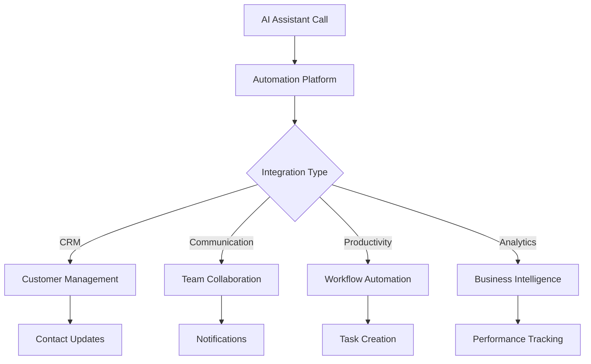
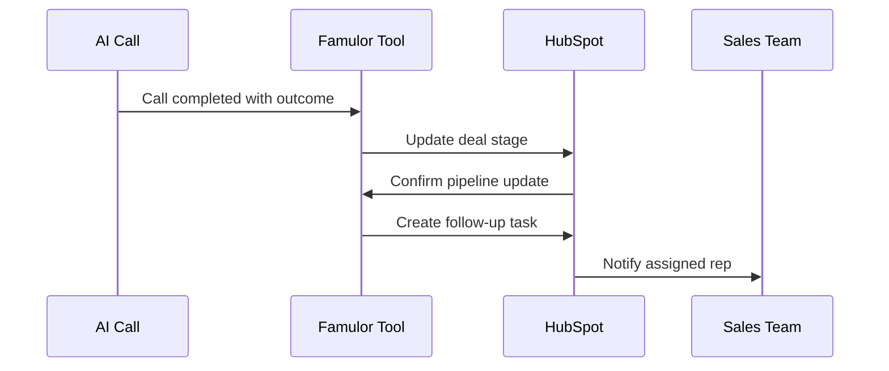
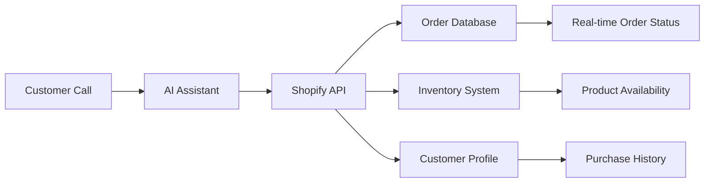
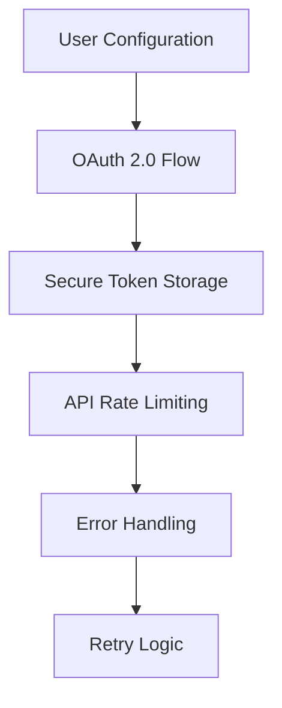

# Integration Case Study: Expanding Famulor's Third-Party Ecosystem

## Overview

This case study examines strategic integration opportunities for Famulor's No-Code Automation Platform, focusing on high-value third-party services currently without implemented actions. The analysis demonstrates how these integrations would enhance Famulor's AI-powered calling capabilities through comprehensive workflow automation.

## Technology Stack & Integration Architecture

### Current Integration Foundation
- **Famulor Tool**: Core component connecting AI assistants with automation flows
- **ActivePieces Engine**: No-code workflow automation engine
- **Webhook Infrastructure**: HTTP-based real-time data exchange
- **API Gateway**: Secure authentication and rate limiting
- **Real-time Processing**: Immediate data exchange during calls

### Integration Patterns

## Priority Integration Categories

### Category 1: Customer Relationship Management

#### HubSpot Integration Enhancement
**Current Gap**: Limited CRM automation beyond basic contact management
**Proposed Actions**:
- **Sync Deal Pipeline**: Automatically move deals through pipeline stages based on call outcomes
- **Create Marketing Campaigns**: Generate targeted campaigns from call insights
- **Schedule Follow-up Tasks**: Auto-create tasks with AI-suggested priorities
- **Update Lead Scoring**: Adjust lead scores based on conversation sentiment

**Implementation Flow**:

#### Pipedrive Integration
**Business Value**: Expand CRM options for European markets
**Proposed Actions**:
- **Activity Logging**: Record all call activities with detailed notes
- **Deal Progression**: Automatically advance deals based on conversation milestones
- **Revenue Forecasting**: Update revenue predictions from call outcomes
- **Team Performance Tracking**: Aggregate call metrics per sales representative

### Category 2: Communication & Collaboration

#### Slack Integration
**Current Gap**: No team communication automation
**Proposed Actions**:
- **Call Summary Broadcasting**: Send conversation summaries to relevant channels
- **Alert Notifications**: Notify teams of high-priority leads or issues
- **Meeting Scheduling**: Trigger calendar invites for follow-up meetings
- **Performance Dashboards**: Share daily/weekly call metrics

**Use Case Example**:
When an AI assistant completes a call with a qualified lead, automatically:
1. Post summary to #sales-leads channel
2. Tag the assigned sales rep
3. Create a follow-up meeting invite
4. Update lead status in CRM

#### Microsoft Teams Integration
**Target Market**: Enterprise customers using Microsoft ecosystem
**Proposed Actions**:
- **Channel Notifications**: Post call outcomes to project-specific channels
- **Calendar Integration**: Schedule follow-up meetings directly in Outlook
- **Document Creation**: Generate call reports in SharePoint
- **Task Assignment**: Create action items in Microsoft Planner

### Category 3: Productivity & Project Management

#### Notion Integration
**Business Value**: Capture and organize call insights in knowledge bases
**Proposed Actions**:
- **Call Documentation**: Create detailed call records in structured databases
- **Knowledge Base Updates**: Add conversation insights to company wikis
- **Project Tracking**: Link call outcomes to project milestones
- **Template Generation**: Create follow-up templates based on call types

#### Trello Integration
**Target Audience**: Small to medium businesses using visual project management
**Proposed Actions**:
- **Card Creation**: Generate Trello cards for each qualified lead
- **Pipeline Management**: Move cards through boards based on call stages
- **Due Date Setting**: Automatically set follow-up deadlines
- **Team Assignment**: Assign cards to team members based on call routing

#### Asana Integration
**Enterprise Focus**: Complex project workflows and team coordination
**Proposed Actions**:
- **Task Creation**: Generate tasks with call context and priorities
- **Project Timeline Updates**: Adjust project schedules based on client calls
- **Team Collaboration**: Share call insights across project teams
- **Goal Tracking**: Link call outcomes to business objectives

### Category 4: E-commerce & Sales

#### Shopify Integration
**Business Value**: Connect AI calling with e-commerce operations
**Proposed Actions**:
- **Order Status Inquiry**: Enable AI to check order status during customer calls
- **Inventory Verification**: Check product availability in real-time
- **Customer Support**: Access purchase history for personalized assistance
- **Abandoned Cart Recovery**: Trigger follow-up calls for incomplete purchases

**Implementation Architecture**:

#### Stripe Integration
**Financial Operations**: Payment processing and subscription management
**Proposed Actions**:
- **Payment Status Verification**: Check payment status during support calls
- **Subscription Management**: Handle plan upgrades/downgrades via voice
- **Billing Inquiry Resolution**: Provide billing details and resolve disputes
- **Refund Processing**: Initiate refunds through conversational interface

### Category 5: Analytics & Business Intelligence

#### Google Analytics Integration
**Data-Driven Insights**: Connect call outcomes with website behavior
**Proposed Actions**:
- **Conversion Tracking**: Link call conversions to marketing campaigns
- **Audience Segmentation**: Use call data to refine website targeting
- **ROI Measurement**: Calculate call-to-conversion ratios
- **Campaign Optimization**: Adjust marketing spend based on call quality

#### Mixpanel Integration
**Product Analytics**: Understand user behavior patterns
**Proposed Actions**:
- **Event Tracking**: Log call events as user interactions
- **Funnel Analysis**: Track progression from call to conversion
- **Cohort Studies**: Analyze user retention after phone interactions
- **A/B Testing**: Test different call scripts and measure outcomes

## Implementation Strategy

### Phase 1: High-Impact Integrations (Months 1-3)
1. **Slack**: Team communication and notifications
2. **Notion**: Knowledge management and documentation
3. **Shopify**: E-commerce customer support

### Phase 2: CRM Expansion (Months 4-6)
1. **Pipedrive**: European market CRM option
2. **Microsoft Teams**: Enterprise communication
3. **Stripe**: Payment and subscription management

### Phase 3: Advanced Analytics (Months 7-9)
1. **Google Analytics**: Marketing attribution
2. **Trello**: Visual project management
3. **Asana**: Enterprise project coordination

### Phase 4: Specialized Tools (Months 10-12)
1. **Mixpanel**: Advanced product analytics
2. **Discord**: Community engagement
3. **Calendly**: Advanced scheduling automation

## Technical Implementation Framework

### Authentication Architecture

### Data Flow Patterns

#### Real-time Sync Pattern
- **Use Case**: CRM updates, team notifications
- **Technology**: Webhooks + REST APIs
- **Latency**: <2 seconds

#### Batch Processing Pattern
- **Use Case**: Analytics, reporting
- **Technology**: Scheduled jobs + bulk APIs
- **Frequency**: Hourly/Daily

#### Event-Driven Pattern
- **Use Case**: Trigger-based automations
- **Technology**: Event queues + webhooks
- **Reliability**: 99.9% delivery guarantee

## Testing Strategy

### Integration Testing Framework
1. **Unit Tests**: Individual API connection validation
2. **Integration Tests**: End-to-end workflow verification
3. **Load Tests**: Performance under high call volumes
4. **Security Tests**: Authentication and data protection
5. **User Acceptance Tests**: Business workflow validation

### Monitoring & Observability
- **API Performance Metrics**: Response times, error rates
- **Integration Health Dashboards**: Real-time status monitoring
- **Alert Systems**: Immediate notification of integration failures
- **Usage Analytics**: Track most valuable integrations

## Business Impact Projections

### Productivity Gains
- **25% reduction** in manual data entry
- **40% faster** lead qualification process
- **60% improvement** in follow-up response times
- **30% increase** in team collaboration efficiency

