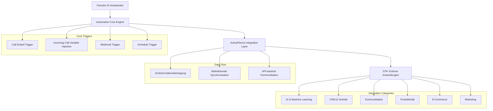
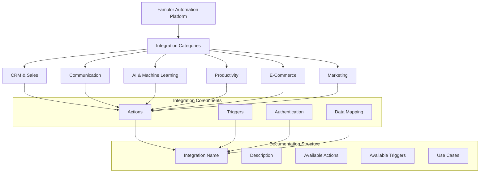

# Famulor Automation Platform - Umfassende Integrations-Datenbank

## Übersicht

Dieses Dokument dient als zentrale Datenbank für alle verfügbaren Integrationen der Famulor Automation Platform. Es ergänzt die bestehenden Integrationsdaten mit vollständigen Aktionen und Auslösern basierend auf der ActivePieces-Plattform und erweitert die "Branded Famulor Automation" Dokumentation.

## Architektur der Integrations-Engine



## Vollständige Integrations-Datenbank

### **A**

---
**Acumbamail**
* **Beschreibung:** E-Mail-Marketing-Plattform für Newsletter und Kampagnen-Management
* **Aktionen:**
    * **Remove Subscriber:** Einen Abonnenten aus einer Acumbamail-Liste entfernen
    * **Search Subscriber:** Einen Abonnenten in einer Acumbamail-Liste per E-Mail suchen
    * **Duplicate Template:** Eine bestehende E-Mail-Vorlage duplizieren
    * **Add/Update Subscriber:** Einen neuen Abonnenten hinzufügen oder einen bestehenden aktualisieren
    * **Create Subscriber List:** Eine neue Abonnentenliste erstellen
    * **Delete Subscriber List:** Eine Abonnentenliste löschen
    * **Unsubscribe Subscriber:** Einen Abonnenten von einer Liste abmelden

---
**Actual Budget**
* **Beschreibung:** Open-Source-Budgetierungs- und Finanzmanagement-Tool
* **Aktionen:**
    * **Get Budget:** Die Budgetübersicht für einen bestimmten Monat und ein bestimmtes Jahr abrufen
    * **Get Accounts:** Alle in Actual Budget konfigurierten Konten auflisten
    * **Get Categories:** Die in Actual Budget definierten Kategorien abrufen
    * **Import Transaction:** Eine einzelne Transaktion importieren
    * **Import Transactions:** Mehrere Transaktionen per Massenimport importieren

---
**ActiveCampaign**
* **Beschreibung:** All-in-One-Marketing-Automatisierungs- und CRM-Plattform
* **Aktionen:**
    * **Create Account:** Ein neues Konto in ActiveCampaign erstellen
    * **Create Contact:** Einen neuen Kontakt in ActiveCampaign erstellen
    * **Update Account:** Ein bestehendes ActiveCampaign-Konto aktualisieren
    * **Update Contact:** Einen bestehenden Kontakt in ActiveCampaign aktualisieren
    * **Add Tag to Contact:** Einem ActiveCampaign-Kontakt ein Tag hinzufügen
    * **Add Contact to Account:** Einen Kontakt zu einem ActiveCampaign-Konto hinzufügen
    * **Subscribe or Unsubscribe Contact From List:** Einen Kontakt zu einer Liste an- oder abmelden

---
**Afforai**
* **Beschreibung:** KI-gestützter Chatbot für dokumentenbasierte Antworten
* **Aktionen:**
    * **Ask Chatbot:** Eine Antwort von einem Afforai-Chatbot generieren, indem eine Frage gesendet wird

---
**Airtable**
* **Beschreibung:** KI-native App-Building-Plattform für benutzerdefinierte Business-Apps ohne Code
* **Aktionen:**
    * **Custom API Call:** Eine benutzerdefinierte API-Anfrage an Airtable stellen
    * **Find Airtable Record:** Einen Datensatz in einer Airtable-Basis finden
    * **Create Airtable Record:** Einen neuen Datensatz in einer Airtable-Tabelle erstellen
    * **Delete Airtable Record:** Einen Datensatz aus einer Airtable-Tabelle löschen
    * **Update Airtable Record:** Einen bestehenden Datensatz in Airtable aktualisieren
    * **Upload File to Column:** Eine Datei in eine Anhang-Spalte eines Airtable-Datensatzes hochladen

---
**AITable**
* **Beschreibung:** KI-gestützte Tabellenkalkulations- und Datenbank-Plattform
* **Aktionen:**
    * **Custom API Call:** Eine benutzerdefinierte API-Anfrage an einen bestimmten AITable-Endpunkt senden
    * **Find Records:** Datensätze in einem Datenblatt finden
    * **Create Record:** Einen neuen Datensatz in einem AITable-Datenblatt erstellen
    * **Update Record:** Einen bestehenden Datensatz in einem AITable-Datenblatt aktualisieren

---
**Airparser**
* **Beschreibung:** Dokumentenanalyse-Tool für automatische Datenextraktion
* **Aktionen:**
    * **Upload Document:** Ein Dokument zur Analyse in einen Airparser-Posteingang hochladen
    * **Get Data from Document:** Geparsed JSON-Daten aus einem bestimmten Dokument in Airparser abrufen

---
**Amazon S3**
* **Beschreibung:** Cloud-Speicherdienst von Amazon Web Services
* **Aktionen:**
    * **Read File:** Eine Datei aus einem Amazon S3-Bucket lesen
    * **Upload File:** Eine Datei in einen Amazon S3-Bucket hochladen

---
**Amazon SQS**
* **Beschreibung:** Message-Queue-Service von Amazon für asynchrone Kommunikation
* **Aktionen:**
    * **Send Message:** Eine Nachricht an eine Amazon SQS-Warteschlange senden

---
**Aminos**
* **Beschreibung:** Benutzer- und Identitätsverwaltungs-Platform
* **Aktionen:**
    * **Create User on Aminos One:** Einen neuen Benutzer in Aminos One erstellen

---
**AnyHook GraphQL**
* **Beschreibung:** GraphQL-Webhook-Service für Echtzeit-Datenübertragung
* **Aktionen:**
    * **Execute GraphQL Query:** Eine GraphQL-Abfrage an einen beliebigen Endpunkt ausführen
    * **Subscribe to GraphQL Subscription:** Echtzeit-Datenabonnements über GraphQL verwalten

---
**AnyHook Websocket**
* **Beschreibung:** WebSocket-Service für bidirektionale Echtzeit-Kommunikation
* **Aktionen:**
    * **Send WebSocket Message:** Eine Nachricht über WebSocket-Verbindung senden
    * **Listen to WebSocket Events:** Eingehende WebSocket-Nachrichten verarbeiten

---
**Anthropic Claude**
* **Beschreibung:** Fortgeschrittenes KI-Sprachmodell für natürliche Sprachverarbeitung
* **Aktionen:**
    * **Generate Text:** Text mit Claude AI generieren
    * **Chat Completion:** Konversations-basierte KI-Antworten erstellen
    * **Text Analysis:** Textinhalte analysieren und verstehen
    * **Content Moderation:** Inhalte auf Sicherheit und Angemessenheit prüfen

---
**Apify**
* **Beschreibung:** Web-Scraping- und Datenextraktions-Plattform
* **Aktionen:**
    * **Get user's Actors:** Die Liste der für den Benutzer verfügbaren Apify Actors abrufen
    * **Get last run details:** Details des letzten Laufs eines bestimmten Apify Actors abrufen
    * **Start an Apify Actor:** Einen Apify Actor Web Scraper starten
    * **Get Dataset Items:** Die Datensatzelemente aus einem abgeschlossenen Apify Actor-Lauf abrufen

---
**Apollo**
* **Beschreibung:** Sales Intelligence- und Lead-Generierungs-Plattform
* **Aktionen:**
    * **Search People:** Personen basierend auf spezifischen Kriterien suchen
    * **Search Companies:** Unternehmen in der Apollo-Datenbank finden
    * **Add Contact to Sequence:** Einen Kontakt zu einer E-Mail-Sequenz hinzufügen
    * **Create Contact:** Einen neuen Kontakt in Apollo erstellen
    * **Update Contact:** Bestehende Kontaktinformationen aktualisieren
    * **Export Search Results:** Suchergebnisse als CSV exportieren

---
**Approval**
* **Beschreibung:** Workflow-Genehmigungssystem für Geschäftsprozesse
* **Aktionen:**
    * **Send for Approval:** Ein Element zur Genehmigung senden
    * **Approve Item:** Ein genehmigungspflichtiges Element genehmigen
    * **Reject Item:** Ein genehmigungspflichtiges Element ablehnen
    * **Get Approval Status:** Den Status einer Genehmigungsanfrage abrufen
* **Auslöser:**
    * **Approval Requested:** Wird ausgelöst, wenn eine neue Genehmigung angefragt wird
    * **Approval Granted:** Wird ausgelöst, wenn eine Genehmigung erteilt wird
    * **Approval Rejected:** Wird ausgelöst, wenn eine Genehmigung abgelehnt wird

---
**Asana**
* **Beschreibung:** Projektmanagement- und Team-Kollaborations-Plattform
* **Aktionen:**
    * **Create Task:** Eine neue Aufgabe in einem Projekt erstellen
    * **Update Task:** Eine bestehende Aufgabe aktualisieren
    * **Delete Task:** Eine Aufgabe aus einem Projekt löschen
    * **Add Comment to Task:** Einen Kommentar zu einer Aufgabe hinzufügen
    * **Create Project:** Ein neues Projekt erstellen
    * **Add User to Project:** Einen Benutzer zu einem Projekt hinzufügen
    * **Set Task Due Date:** Ein Fälligkeitsdatum für eine Aufgabe festlegen
    * **Assign Task:** Eine Aufgabe einem Teammitglied zuweisen
    * **Custom API Call:** Benutzerdefinierte API-Aufrufe an Asana ausführen
* **Auslöser:**
    * **New Task Created:** Wird ausgelöst, wenn eine neue Aufgabe erstellt wird
    * **Task Updated:** Wird ausgelöst, wenn eine Aufgabe aktualisiert wird
    * **Task Completed:** Wird ausgelöst, wenn eine Aufgabe als abgeschlossen markiert wird

---
**AssemblyAI**
* **Beschreibung:** KI-gestützte Audio-Transkriptions- und Analyse-Plattform
* **Aktionen:**
    * **Transcribe Audio:** Audio-Dateien in Text transkribieren
    * **Analyze Audio Content:** Audio-Inhalte auf Sentiment und Themen analysieren
    * **Real-time Transcription:** Live-Audio-Streams transkribieren
    * **Extract Audio Insights:** Wichtige Informationen aus Audio-Dateien extrahieren
    * **Language Detection:** Die gesprochene Sprache in Audio-Dateien erkennen

---
**Azure Communication Services**
* **Beschreibung:** Cloud-Kommunikationsplattform von Microsoft Azure
* **Aktionen:**
    * **Send SMS:** SMS-Nachrichten über Azure senden
    * **Make Voice Call:** Sprachanrufe über Azure initiieren
    * **Send Email:** E-Mails über Azure Communication Services senden
    * **Create Chat Thread:** Einen neuen Chat-Thread erstellen
    * **Add Participant to Chat:** Einen Teilnehmer zu einem Chat hinzufügen

---
**Azure OpenAI**
* **Beschreibung:** OpenAI-Services integriert in Microsoft Azure Cloud
* **Aktionen:**
    * **Generate Text Completion:** Textvervollständigung mit Azure OpenAI
    * **Create Chat Completion:** Chat-basierte KI-Antworten generieren
    * **Generate Embeddings:** Text-Embeddings für semantische Suche erstellen
    * **Analyze Text:** Textinhalte mit OpenAI-Modellen analysieren
    * **Custom Model Inference:** Benutzerdefinierte Modell-Inferenz ausführen

### **B**

---
**Bannerbear**
* **Beschreibung:** Automatische Bild- und Video-Generierungs-API
* **Aktionen:**
    * **Create Image:** Dynamische Bilder basierend auf Vorlagen erstellen
    * **Create Video:** Automatisierte Videos generieren
    * **Generate Screenshot:** Screenshots von Webseiten erstellen
    * **Bulk Image Generation:** Mehrere Bilder gleichzeitig generieren
    * **Get Template List:** Verfügbare Vorlagen abrufen

---
**Baserow**
* **Beschreibung:** Open-Source-Alternative zu Airtable für Datenbank-Management
* **Aktionen:**
    * **Create Row:** Eine neue Zeile in einer Baserow-Tabelle erstellen
    * **Update Row:** Eine bestehende Zeile aktualisieren
    * **Delete Row:** Eine Zeile aus einer Tabelle löschen
    * **Get Rows:** Zeilen basierend auf Filterkriterien abrufen
    * **List Tables:** Alle Tabellen in einer Datenbank auflisten

---
**Beamer**
* **Beschreibung:** Changelog- und Update-Kommunikations-Tool
* **Aktionen:**
    * **Create Post:** Einen neuen Changelog-Eintrag erstellen
    * **Update Post:** Einen bestehenden Post aktualisieren
    * **Publish Post:** Einen Entwurf veröffentlichen
    * **Get Post Statistics:** Statistiken für einen Post abrufen
    * **Notify Subscribers:** Abonnenten über Updates benachrichtigen

---
**Bettermode**
* **Beschreibung:** Community-Management- und Engagement-Plattform
* **Aktionen:**
    * **Assign Badge to Member:** Einem Mitglied in Bettermode ein Abzeichen zuweisen
    * **Revoke Badge from Member:** Ein Abzeichen von einem Mitglied entfernen
    * **Create Question Post:** Einen Frage-Beitrag in Bettermode erstellen
    * **Custom API Call:** Einen benutzerdefinierten GraphQL-API-Aufruf an Bettermode ausführen
    * **Create Discussion Post:** Einen Diskussionsbeitrag in Bettermode veröffentlichen

---
**Binance**
* **Beschreibung:** Führende Kryptowährungs-Börsen-Plattform
* **Aktionen:**
    * **Fetch Pair Price:** Den aktuellen Preis für ein Kryptowährungspaar auf Binance abrufen
    * **Get Account Balance:** Kontosaldo in verschiedenen Kryptowährungen abrufen
    * **Place Order:** Kauf- oder Verkaufsorders erstellen
    * **Get Order History:** Handelshistorie abrufen
    * **Get Market Data:** Marktdaten und Preistrends abrufen

---
**Blackbaud**
* **Beschreibung:** Nonprofit-Management- und Fundraising-Software
* **Aktionen:**
    * **Create Gift:** Einen Geschenkdatensatz in Blackbaud erstellen
    * **Get Gift Subtypes:** Die verfügbaren Geschenk-Untertypen abrufen
    * **Get Fundraising List:** Details einer Spendenliste abrufen
    * **Search Contacts After Date:** Nach Kontakten suchen, die nach einem bestimmten Datum hinzugefügt wurden
    * **Upsert Contact on Email:** Einen Kontakt basierend auf der E-Mail-Adresse erstellen oder aktualisieren

---
**Blockscout**
* **Beschreibung:** Blockchain-Explorer für Ethereum-basierte Netzwerke
* **Aktionen:**
    * **Get Transaction Details:** Details einer Blockchain-Transaktion abrufen
    * **Get Address Balance:** Saldo einer Blockchain-Adresse abfragen
    * **Get Block Information:** Informationen über einen spezifischen Block abrufen
    * **Verify Smart Contract:** Smart Contracts verifizieren und validieren
    * **Search Tokens:** Token-Informationen in der Blockchain suchen

---
**Bloomerang**
* **Beschreibung:** Donor-Management- und Fundraising-CRM für Nonprofits
* **Aktionen:**
    * **Create Constituent:** Einen neuen Spender oder Kontakt erstellen
    * **Update Constituent:** Spenderinformationen aktualisieren
    * **Record Donation:** Eine Spende erfassen und verarbeiten
    * **Create Interaction:** Eine Interaktion mit einem Spender dokumentieren
    * **Generate Report:** Fundraising-Berichte erstellen

---
**Bonjoro**
* **Beschreibung:** Personalisierte Video-Messaging-Plattform für Kundenbindung
* **Aktionen:**
    * **Send Video Message:** Eine personalisierte Videonachricht senden
    * **Create Task:** Eine neue Aufgabe für Video-Outreach erstellen
    * **Update Contact:** Kontaktinformationen aktualisieren
    * **Track Video Views:** Video-Aufrufe und Engagement verfolgen
    * **Schedule Video:** Ein Video für späteren Versand planen

---
**Box**
* **Beschreibung:** Enterprise-Cloud-Content-Management und Collaboration
* **Aktionen:**
    * **Upload File:** Eine Datei in Box hochladen
    * **Download File:** Eine Datei von Box herunterladen
    * **Create Folder:** Einen neuen Ordner erstellen
    * **Share File:** Eine Datei mit anderen Benutzern teilen
    * **Move File:** Eine Datei in einen anderen Ordner verschieben
    * **Delete File:** Eine Datei dauerhaft löschen

---
**Brevo**
* **Beschreibung:** All-in-One-Digital-Marketing-Plattform (ehemals Sendinblue)
* **Aktionen:**
    * **Send Email:** E-Mails über Brevo versenden
    * **Create Contact:** Einen neuen Kontakt zur Liste hinzufügen
    * **Update Contact:** Kontaktinformationen aktualisieren
    * **Send SMS:** SMS-Nachrichten versenden
    * **Create Email Campaign:** E-Mail-Kampagnen erstellen und planen
    * **Get Campaign Statistics:** Kampagnen-Performance-Daten abrufen

---
**Brilliant Directories**
* **Beschreibung:** Software für die Erstellung und Verwaltung von Online-Verzeichnissen
* **Aktionen:**
    * **Create Listing:** Ein neues Verzeichnis-Listing erstellen
    * **Update Listing:** Ein bestehendes Listing aktualisieren
    * **Delete Listing:** Ein Listing aus dem Verzeichnis entfernen
    * **Search Listings:** Listings basierend auf Kriterien suchen
    * **Moderate Listing:** Listings für Veröffentlichung prüfen und genehmigen

---
**Bubble**
* **Beschreibung:** No-Code-Plattform für Web-App-Entwicklung
* **Aktionen:**
    * **Create Database Entry:** Einen neuen Datenbankeintrag in Bubble erstellen
    * **Update Database Entry:** Einen bestehenden Eintrag aktualisieren
    * **Delete Database Entry:** Einen Datenbankeintrag löschen
    * **Search Database:** Datenbankeinträge basierend auf Kriterien suchen
    * **Trigger Workflow:** Einen Bubble-Workflow extern auslösen

### **C**

---
**Cal.com**
* **Beschreibung:** Open-Source-Terminplanungs- und Kalender-Management-Platform
* **Aktionen:**
    * **Create Booking:** Einen neuen Termin erstellen
    * **Cancel Booking:** Einen bestehenden Termin stornieren
    * **Reschedule Booking:** Einen Termin neu planen
    * **Get Available Slots:** Verfügbare Terminzeiten abrufen
    * **Create Event Type:** Einen neuen Event-Typ für Buchungen erstellen
    * **Update User Profile:** Benutzerprofilinformationen aktualisieren
* **Auslöser:**
    * **New Booking Created:** Wird ausgelöst, wenn ein neuer Termin gebucht wird
    * **Booking Cancelled:** Wird ausgelöst, wenn ein Termin storniert wird
    * **Booking Rescheduled:** Wird ausgelöst, wenn ein Termin verschoben wird

---
**Calendly**
* **Beschreibung:** Terminplanungsplattform, die das Buchen von Meetings vereinfacht
* **Aktionen:**
    * **Create Scheduled Event:** Ein geplantes Event erstellen
    * **Cancel Scheduled Event:** Ein geplantes Event stornieren
    * **Get User Information:** Benutzerinformationen abrufen
    * **List Event Types:** Verfügbare Event-Typen auflisten
    * **Get Invitee Details:** Details über einen Event-Teilnehmer abrufen
* **Auslöser:**
    * **Invitee Created:** Wird ausgelöst, wenn ein neuer Teilnehmer ein Event bucht
    * **Invitee Cancelled:** Wird ausgelöst, wenn ein Teilnehmer ein Event storniert

---
**Campaign Monitor**
* **Beschreibung:** E-Mail-Marketing- und Automation-Plattform
* **Aktionen:**
    * **Add Subscriber:** Einen neuen Abonnenten zur Liste hinzufügen
    * **Remove Subscriber:** Einen Abonnenten von der Liste entfernen
    * **Send Campaign:** Eine E-Mail-Kampagne versenden
    * **Create List:** Eine neue E-Mail-Liste erstellen
    * **Update Subscriber:** Abonnenten-Informationen aktualisieren
    * **Get Campaign Reports:** Kampagnen-Performance-Berichte abrufen

---
**Captain-data**
* **Beschreibung:** Data-Enrichment- und Lead-Generation-Automation-Tool
* **Aktionen:**
    * **Enrich Contact Data:** Kontaktdaten mit zusätzlichen Informationen anreichern
    * **Find Email Addresses:** E-Mail-Adressen zu Personen und Unternehmen finden
    * **Generate Lead Lists:** Listen von qualifizierten Leads erstellen
    * **Verify Email Addresses:** E-Mail-Adressen auf Gültigkeit prüfen
    * **Export Data:** Angereicherte Daten in verschiedene Formate exportieren

---
**Cartloom**
* **Beschreibung:** E-Commerce-Plattform für Online-Shop-Management
* **Aktionen:**
    * **Create Product:** Ein neues Produkt im Shop erstellen
    * **Update Product:** Produktinformationen aktualisieren
    * **Process Order:** Eine Bestellung verarbeiten und bestätigen
    * **Update Inventory:** Lagerbestände aktualisieren
    * **Generate Invoice:** Rechnungen für Bestellungen erstellen
    * **Send Order Confirmation:** Bestellbestätigungen an Kunden senden

---
**Certopus**
* **Beschreibung:** Digitale Zertifikats- und Credential-Management-Plattform
* **Aktionen:**
    * **Issue Certificate:** Ein digitales Zertifikat ausstellen
    * **Verify Certificate:** Ein Zertifikat auf Authentizität prüfen
    * **Revoke Certificate:** Ein ausgestelltes Zertifikat widerrufen
    * **Update Certificate:** Zertifikatsinformationen aktualisieren
    * **Send Certificate:** Ein Zertifikat an den Empfänger senden

---
**Chainalysis Screening API**
* **Beschreibung:** Blockchain-Analyse und Compliance-Screening für Kryptowährungen
* **Aktionen:**
    * **Screen Address:** Eine Kryptowährungs-Adresse auf Risiken screenen
    * **Check Transaction:** Eine Blockchain-Transaktion analysieren
    * **Generate Risk Report:** Risikobericht für Adressen oder Transaktionen erstellen
    * **Monitor Address:** Eine Adresse für zukünftige Aktivitäten überwachen
    * **Compliance Check:** Compliance-Prüfungen durchführen

---
**ChargeKeep**
* **Beschreibung:** Recurring-Billing- und Subscription-Management-Plattform
* **Aktionen:**
    * **Create Subscription:** Ein neues Abonnement erstellen
    * **Cancel Subscription:** Ein bestehendes Abonnement kündigen
    * **Process Payment:** Eine Zahlung verarbeiten
    * **Update Billing Information:** Rechnungsinformationen aktualisieren
    * **Generate Invoice:** Rechnungen für Abonnements erstellen
    * **Send Payment Reminder:** Zahlungserinnerungen senden

---
**Chatbase**
* **Beschreibung:** KI-Chatbot-Training und -Management-Plattform
* **Aktionen:**
    * **Train Chatbot:** Einen Chatbot mit neuen Daten trainieren
    * **Send Message:** Eine Nachricht an den Chatbot senden
    * **Get Response:** Eine Antwort vom Chatbot abrufen
    * **Update Knowledge Base:** Die Wissensbasis des Chatbots aktualisieren
    * **Analyze Conversations:** Chatbot-Gespräche analysieren

---
**Clarifai**
* **Beschreibung:** KI-gestützte Bild- und Video-Erkennungs-API
* **Aktionen:**
    * **Classify Image:** Bilder automatisch klassifizieren und taggen
    * **Detect Objects:** Objekte in Bildern erkennen und lokalisieren
    * **Analyze Video:** Video-Inhalte automatisch analysieren
    * **Extract Text from Image:** Text aus Bildern extrahieren (OCR)
    * **Moderate Content:** Inhalte auf Angemessenheit prüfen

---
**Clearout**
* **Beschreibung:** E-Mail-Verifizierungs- und List-Cleaning-Service
* **Aktionen:**
    * **Verify Single Email:** Eine einzelne E-Mail-Adresse verifizieren
    * **Bulk Email Verification:** Große E-Mail-Listen in Batches verifizieren
    * **Check Domain Health:** Die Gesundheit einer E-Mail-Domain prüfen
    * **Clean Email List:** Eine E-Mail-Liste von ungültigen Adressen bereinigen
    * **Get Verification Results:** Ergebnisse der E-Mail-Verifizierung abrufen

---
**ClickUp**
* **Beschreibung:** All-in-One-Produktivitäts- und Projektmanagement-Plattform
* **Aktionen:**
    * **Create Task:** Eine neue Aufgabe in einem ClickUp-Arbeitsbereich erstellen
    * **Update Task:** Eine bestehende Aufgabe aktualisieren
    * **Create List:** Eine neue Aufgabenliste erstellen
    * **Add Comment:** Einen Kommentar zu einer Aufgabe hinzufügen
    * **Track Time:** Arbeitszeit für eine Aufgabe erfassen
    * **Create Space:** Einen neuen Arbeitsbereich erstellen
    * **Assign Task:** Eine Aufgabe einem Teammitglied zuweisen
* **Auslöser:**
    * **Task Created:** Wird ausgelöst, wenn eine neue Aufgabe erstellt wird
    * **Task Updated:** Wird ausgelöst, wenn eine Aufgabe aktualisiert wird
    * **Task Status Changed:** Wird ausgelöst, wenn sich der Status einer Aufgabe ändert

---
**Clockodo**
* **Beschreibung:** Zeiterfassungs- und Projektmanagement-Tool
* **Aktionen:**
    * **Start Time Entry:** Eine neue Zeiterfassung starten
    * **Stop Time Entry:** Eine laufende Zeiterfassung beenden
    * **Create Project:** Ein neues Projekt erstellen
    * **Add Client:** Einen neuen Kunden hinzufügen
    * **Generate Time Report:** Zeitberichte generieren
    * **Update Entry:** Eine Zeiterfassung nachträglich bearbeiten

---
**Coda**
* **Beschreibung:** Kollaborative Dokumenten- und Datenbank-Plattform
* **Aktionen:**
    * **Create Row:** Eine neue Zeile in einer Coda-Tabelle erstellen
    * **Update Row:** Eine bestehende Zeile aktualisieren
    * **Get Document:** Ein Coda-Dokument abrufen
    * **List Tables:** Alle Tabellen in einem Dokument auflisten
    * **Execute Formula:** Eine Coda-Formel ausführen
    * **Create Document:** Ein neues Coda-Dokument erstellen

---
**Cognito Forms**
* **Beschreibung:** Online-Formular-Builder mit erweiterten Funktionen
* **Aktionen:**
    * **Submit Form Entry:** Einen neuen Formulareintrag erstellen
    * **Get Form Entries:** Alle Einträge eines Formulars abrufen
    * **Update Entry:** Einen bestehenden Formulareintrag aktualisieren
    * **Delete Entry:** Einen Formulareintrag löschen
    * **Export Entries:** Formulareinträge in verschiedene Formate exportieren
* **Auslöser:**
    * **New Form Submission:** Wird ausgelöst, wenn ein neues Formular eingereicht wird

---
**Confluence**
* **Beschreibung:** Team-Collaboration- und Wissensdokumentation-Plattform von Atlassian
* **Aktionen:**
    * **Create Page:** Eine neue Confluence-Seite erstellen
    * **Update Page:** Eine bestehende Seite aktualisieren
    * **Delete Page:** Eine Seite löschen
    * **Add Comment:** Einen Kommentar zu einer Seite hinzufügen
    * **Create Space:** Einen neuen Confluence-Space erstellen
    * **Search Content:** Inhalte in Confluence durchsuchen

---
**Connections**
* **Beschreibung:** Netzwerk- und Beziehungsmanagement-Tool
* **Aktionen:**
    * **Add Contact:** Einen neuen Kontakt hinzufügen
    * **Update Relationship:** Beziehungsinformationen aktualisieren
    * **Track Interaction:** Eine Interaktion mit einem Kontakt dokumentieren
    * **Set Reminder:** Erinnerungen für Follow-ups setzen
    * **Generate Network Map:** Eine Netzwerkkarte erstellen

---
**Constant Contact**
* **Beschreibung:** E-Mail-Marketing- und Event-Management-Plattform
* **Aktionen:**
    * **Add Contact:** Einen Kontakt zur E-Mail-Liste hinzufügen
    * **Send Email Campaign:** Eine E-Mail-Kampagne versenden
    * **Create Event:** Ein neues Event erstellen
    * **Update Contact List:** Kontaktlisten aktualisieren
    * **Track Email Performance:** E-Mail-Performance verfolgen
    * **Manage Subscriptions:** Abonnement-Einstellungen verwalten

---
**Contentful**
* **Beschreibung:** Headless CMS für digitale Content-Verwaltung
* **Aktionen:**
    * **Create Entry:** Einen neuen Content-Eintrag erstellen
    * **Update Entry:** Einen bestehenden Eintrag aktualisieren
    * **Publish Entry:** Einen Content-Eintrag veröffentlichen
    * **Delete Entry:** Einen Content-Eintrag löschen
    * **Upload Asset:** Eine Mediendatei hochladen
    * **Get Entry:** Einen spezifischen Content-Eintrag abrufen

---
**Contiguity**
* **Beschreibung:** Business-Process-Management und Workflow-Automatisierung
* **Aktionen:**
    * **Start Process:** Einen Geschäftsprozess initiieren
    * **Complete Task:** Eine Prozess-Aufgabe abschließen
    * **Assign Task:** Eine Aufgabe einem Benutzer zuweisen
    * **Update Process Data:** Prozessdaten aktualisieren
    * **Generate Process Report:** Prozessberichte erstellen

---
**ConvertKit**
* **Beschreibung:** E-Mail-Marketing-Plattform für Content-Ersteller
* **Aktionen:**
    * **Add Subscriber:** Einen Abonnenten hinzufügen
    * **Remove Subscriber:** Einen Abonnenten entfernen
    * **Send Broadcast:** Eine Broadcast-E-Mail senden
    * **Add Tag:** Ein Tag zu einem Abonnenten hinzufügen
    * **Create Sequence:** Eine E-Mail-Sequenz erstellen
    * **Update Custom Field:** Benutzerdefinierte Felder aktualisieren

---
**Copy.ai**
* **Beschreibung:** KI-gestützte Content-Erstellungs- und Copywriting-Plattform
* **Aktionen:**
    * **Generate Copy:** KI-generierten Text für verschiedene Zwecke erstellen
    * **Create Blog Post:** Blog-Artikel mit KI generieren
    * **Write Product Description:** Produktbeschreibungen automatisch erstellen
    * **Generate Social Media Posts:** Social-Media-Inhalte erstellen
    * **Create Ad Copy:** Werbetexte für verschiedene Plattformen generieren

---
**Crypto**
* **Beschreibung:** Kryptowährungs-Daten und -Trading-Integration
* **Aktionen:**
    * **Get Crypto Price:** Aktuelle Kryptowährungspreise abrufen
    * **Get Market Data:** Marktdaten und -trends abrufen
    * **Track Portfolio:** Kryptowährungs-Portfolio verfolgen
    * **Set Price Alert:** Preisalarme für bestimmte Coins setzen
    * **Get Trading Volume:** Handelsvolumen-Daten abrufen

---
**CSV**
* **Beschreibung:** CSV-Datei-Verarbeitung und -Management
* **Aktionen:**
    * **Read CSV File:** CSV-Dateien lesen und verarbeiten
    * **Write CSV File:** Daten in CSV-Format schreiben
    * **Parse CSV Data:** CSV-Daten analysieren und strukturieren
    * **Convert CSV to JSON:** CSV-Daten in JSON-Format konvertieren
    * **Merge CSV Files:** Mehrere CSV-Dateien zusammenführen

---
**Customer.io**
* **Beschreibung:** Customer-Engagement- und Marketing-Automatisierungs-Plattform
* **Aktionen:**
    * **Track Customer Event:** Kundenereignisse verfolgen und aufzeichnen
    * **Send Transactional Email:** Transaktions-E-Mails senden
    * **Update Customer Profile:** Kundenprofile aktualisieren
    * **Add Customer to Segment:** Kunden zu Segmenten hinzufügen
    * **Trigger Campaign:** Marketing-Kampagnen auslösen
    * **Track Page View:** Seitenaufrufe verfolgen

### **D**

---
**Dappier**
* **Beschreibung:** KI-gestützte Daten-Intelligenz- und Analytics-Plattform
* **Aktionen:**
    * **Analyze Data:** Datensätze mit KI analysieren
    * **Generate Insights:** Automatische Erkenntnisse aus Daten generieren
    * **Create Report:** Datenberichte automatisch erstellen
    * **Process Dataset:** Große Datensätze verarbeiten und strukturieren
    * **Export Analysis:** Analyseergebnisse in verschiedene Formate exportieren

---
**Data Mapper**
* **Beschreibung:** Daten-Mapping- und Transformations-Tool
* **Aktionen:**
    * **Transform Data:** Datenstrukturen transformieren und konvertieren
    * **Map Fields:** Datenfelder zwischen verschiedenen Systemen zuordnen
    * **Validate Data:** Datenqualität und -integrität prüfen
    * **Clean Data:** Daten bereinigen und normalisieren
    * **Merge Datasets:** Verschiedene Datensätze zusammenführen

---
**Data Summarizer**
* **Beschreibung:** KI-gestützte Daten-Zusammenfassungs- und Analyse-Tool
* **Aktionen:**
    * **Summarize Dataset:** Große Datensätze automatisch zusammenfassen
    * **Generate Key Metrics:** Wichtige Kennzahlen aus Daten extrahieren
    * **Create Data Overview:** Übersichtliche Daten-Dashboards erstellen
    * **Identify Trends:** Trends und Muster in Daten erkennen
    * **Export Summary:** Zusammenfassungen in verschiedene Formate exportieren

---
**Date Helper**
* **Beschreibung:** Datum- und Zeit-Manipulations-Utility
* **Aktionen:**
    * **Format Date:** Datumsformate konvertieren und anpassen
    * **Calculate Date Difference:** Zeiträume zwischen Daten berechnen
    * **Add/Subtract Time:** Zeitperioden zu Daten hinzufügen oder subtrahieren
    * **Get Current Time:** Aktuelle Zeit in verschiedenen Zeitzonen abrufen
    * **Parse Date String:** Datumsstrings in strukturierte Formate konvertieren

---
**Dato CMS**
* **Beschreibung:** Headless CMS für Entwickler und Content-Teams
* **Aktionen:**
    * **Create Record:** Einen neuen Content-Datensatz erstellen
    * **Update Record:** Einen bestehenden Datensatz aktualisieren
    * **Delete Record:** Einen Content-Datensatz löschen
    * **Upload Asset:** Mediendateien hochladen und verwalten
    * **Publish Record:** Content-Einträge veröffentlichen
    * **Query Content:** Content basierend auf Kriterien abfragen

---
**DeepL**
* **Beschreibung:** KI-gestützte Übersetzungs-API mit hoher Qualität
* **Aktionen:**
    * **Translate Text:** Texte zwischen verschiedenen Sprachen übersetzen
    * **Detect Language:** Die Sprache eines Textes automatisch erkennen
    * **Get Usage Statistics:** Übersetzungs-Nutzungsstatistiken abrufen
    * **Translate Document:** Ganze Dokumente übersetzen
    * **Get Supported Languages:** Liste unterstützter Sprachen abrufen

---
**Delay**
* **Beschreibung:** Workflow-Verzögerungs- und Timing-Kontrolle
* **Aktionen:**
    * **Add Delay:** Eine Wartezeit in den Workflow einfügen
    * **Schedule Action:** Eine Aktion für einen späteren Zeitpunkt planen
    * **Set Timer:** Timer für zeitbasierte Aktionen setzen
    * **Pause Workflow:** Workflow temporär pausieren
    * **Resume Workflow:** Pausierte Workflows fortsetzen

---
**Devin AI**
* **Beschreibung:** KI-Entwicklungsassistent für Code-Generation und -Optimierung
* **Aktionen:**
    * **Generate Code:** Programmcode basierend auf Anforderungen generieren
    * **Review Code:** Code-Qualität und -Standards überprüfen
    * **Debug Code:** Fehler in Code automatisch identifizieren und beheben
    * **Optimize Performance:** Code-Performance analysieren und verbessern
    * **Create Documentation:** Automatische Code-Dokumentation erstellen

---
**Discourse**
* **Beschreibung:** Open-Source-Community-Forum- und Diskussions-Plattform
* **Aktionen:**
    * **Create Topic:** Ein neues Diskussionsthema erstellen
    * **Reply to Topic:** Auf ein Forumthema antworten
    * **Create User:** Einen neuen Benutzer im Forum erstellen
    * **Moderate Post:** Beiträge moderieren und verwalten
    * **Send Private Message:** Private Nachrichten zwischen Benutzern senden
    * **Update User Profile:** Benutzerprofile aktualisieren

---
**Discord**
* **Beschreibung:** Kommunikationsplattform für Communities und Teams mit Sprach- und Textchats
* **Aktionen:**
    * **Send Message:** Eine Nachricht in einen Discord-Channel senden
    * **Create Channel:** Einen neuen Discord-Channel erstellen
    * **Add Role to User:** Einem Benutzer eine Rolle zuweisen
    * **Ban User:** Einen Benutzer vom Server ausschließen
    * **Create Invite:** Eine Einladung zum Discord-Server erstellen
    * **Send Direct Message:** Eine private Direktnachricht senden
    * **Update Server Settings:** Server-Einstellungen verwalten

---
**Drip**
* **Beschreibung:** E-Commerce-fokussierte E-Mail-Marketing-Automatisierung
* **Aktionen:**
    * **Add Subscriber:** Einen Abonnenten zur Liste hinzufügen
    * **Remove Subscriber:** Einen Abonnenten entfernen
    * **Send Email:** Eine E-Mail an Abonnenten senden
    * **Add Tag:** Tags zu Abonnenten hinzufügen
    * **Track Event:** Kundenereignisse für Automatisierung verfolgen
    * **Create Campaign:** E-Mail-Kampagnen erstellen und verwalten

---
**Dropbox**
* **Beschreibung:** Cloud-Speicher- und Dateifreigabe-Plattform
* **Aktionen:**
    * **Upload File:** Dateien in Dropbox hochladen
    * **Download File:** Dateien von Dropbox herunterladen
    * **Create Folder:** Neue Ordner erstellen
    * **Share File:** Dateien mit anderen teilen
    * **Move File:** Dateien zwischen Ordnern verschieben
    * **Delete File:** Dateien dauerhaft löschen
    * **Get File Link:** Öffentliche Links für Dateien erstellen

---
**Dust**
* **Beschreibung:** KI-Assistenten-Plattform für Unternehmen
* **Aktionen:**
    * **Create Assistant:** Einen neuen KI-Assistenten erstellen
    * **Train Assistant:** Assistenten mit Unternehmensdaten trainieren
    * **Ask Question:** Eine Frage an den KI-Assistenten stellen
    * **Update Knowledge Base:** Wissensbasis des Assistenten aktualisieren
    * **Generate Response:** Automatische Antworten generieren

### **E**

---
**ElevenLabs**
* **Beschreibung:** KI-gestützte Sprach-Synthese und Voice-Cloning-Plattform
* **Aktionen:**
    * **Generate Speech:** Text in natürlich klingende Sprache umwandeln
    * **Clone Voice:** Stimmen klonen und reproduzieren
    * **Create Custom Voice:** Benutzerdefinierte Stimmen erstellen
    * **Generate Audio File:** Audio-Dateien aus Text generieren
    * **List Available Voices:** Verfügbare Stimmen und Sprachen auflisten

---
**Ethereum Name Service (ENS)**
* **Beschreibung:** Blockchain-basiertes Domain-Namenssystem für Ethereum
* **Aktionen:**
    * **Resolve ENS Name:** ENS-Namen zu Ethereum-Adressen auflösen
    * **Register Domain:** Neue ENS-Domains registrieren
    * **Update Domain Records:** DNS-Records für ENS-Domains aktualisieren
    * **Transfer Domain:** Domain-Eigentumsrechte übertragen
    * **Check Domain Availability:** Verfügbarkeit von ENS-Domains prüfen

### **F**

---
**Facebook Leads**
* **Beschreibung:** Lead-Generation- und Management-Integration für Facebook Ads
* **Aktionen:**
    * **Get Lead Information:** Informationen über generierte Leads abrufen
    * **Export Leads:** Leads in verschiedene Systeme exportieren
    * **Update Lead Status:** Status von Leads verwalten und aktualisieren
    * **Create Custom Audience:** Zielgruppen basierend auf Leads erstellen
* **Auslöser:**
    * **New Lead Generated:** Wird ausgelöst, wenn ein neuer Lead über Facebook generiert wird

---
**Facebook Pages**
* **Beschreibung:** Facebook-Seiten-Management und Content-Veröffentlichung
* **Aktionen:**
    * **Post to Page:** Inhalte auf Facebook-Seite veröffentlichen
    * **Schedule Post:** Beiträge für späteren Zeitpunkt planen
    * **Get Page Insights:** Analytics und Leistungsdaten der Seite abrufen
    * **Respond to Messages:** Auf Nachrichten an die Seite antworten
    * **Update Page Information:** Seiteninformationen aktualisieren

---
**Figma**
* **Beschreibung:** Kollaborative Design- und Prototyping-Plattform
* **Aktionen:**
    * **Get File Content:** Figma-Dateiinhalte abrufen
    * **Export Design:** Designs in verschiedene Formate exportieren
    * **Create Comment:** Kommentare zu Designs hinzufügen
    * **Update Component:** Design-Komponenten aktualisieren
    * **Share File:** Design-Dateien mit Teams teilen

---
**Files Helper**
* **Beschreibung:** Datei-Verarbeitungs- und -Management-Utility
* **Aktionen:**
    * **Read File Content:** Dateiinhalte in verschiedenen Formaten lesen
    * **Convert File Format:** Dateien zwischen verschiedenen Formaten konvertieren
    * **Compress File:** Dateien komprimieren und archivieren
    * **Extract Archive:** Archive entpacken und Inhalte extrahieren
    * **Generate File Hash:** Prüfsummen und Hashes für Dateien erstellen

---
**Fireflies.ai**
* **Beschreibung:** KI-gestützte Meeting-Transkription und -Analyse
* **Aktionen:**
    * **Transcribe Meeting:** Meeting-Audio in Text transkribieren
    * **Generate Summary:** Automatische Meeting-Zusammenfassungen erstellen
    * **Extract Action Items:** Aufgaben und To-dos aus Meetings extrahieren
    * **Search Transcripts:** Durchsuchbare Meeting-Transkripte erstellen
    * **Share Recording:** Meeting-Aufzeichnungen und Transkripte teilen

---
**Fliqr AI**
* **Beschreibung:** KI-gestützte Bild- und Video-Bearbeitungs-Plattform
* **Aktionen:**
    * **Enhance Image:** Bilder automatisch verbessern und optimieren
    * **Generate Thumbnail:** Automatische Thumbnail-Generierung für Videos
    * **Apply Filters:** KI-gestützte Filter auf Medien anwenden
    * **Remove Background:** Hintergründe automatisch entfernen
    * **Upscale Image:** Bildauflösung mittels KI erhöhen

---
**Flowise**
* **Beschreibung:** No-Code-KI-Workflow-Builder für LLM-Anwendungen
* **Aktionen:**
    * **Create Chatflow:** Neue KI-Chatflows erstellen
    * **Execute Flow:** KI-Workflows ausführen und Ergebnisse abrufen
    * **Update Model Configuration:** KI-Modell-Einstellungen anpassen
    * **Train Custom Model:** Benutzerdefinierte KI-Modelle trainieren
    * **Export Flow:** KI-Workflows exportieren und teilen

---
**Flowlu**
* **Beschreibung:** All-in-One-Business-Management- und CRM-Plattform
* **Aktionen:**
    * **Create Project:** Neue Projekte erstellen und verwalten
    * **Add Task:** Aufgaben zu Projekten hinzufügen
    * **Create Contact:** Neue Kontakte im CRM erstellen
    * **Update Deal:** Verkaufschancen aktualisieren
    * **Generate Invoice:** Rechnungen erstellen und versenden
    * **Track Time:** Arbeitszeit für Projekte erfassen

---
**Formbricks**
* **Beschreibung:** Open-Source-Erfahrungs-Management und User-Feedback-Plattform
* **Aktionen:**
    * **Create Survey:** Neue Umfragen und Feedback-Formulare erstellen
    * **Send Survey:** Umfragen an Zielgruppen versenden
    * **Collect Response:** Antworten und Feedback sammeln
    * **Analyze Results:** Umfrageergebnisse analysieren und auswerten
    * **Export Data:** Feedback-Daten in verschiedene Formate exportieren

---
**Frame**
* **Beschreibung:** Kollaborative Whiteboard- und Brainstorming-Plattform
* **Aktionen:**
    * **Create Board:** Neue Whiteboards für Zusammenarbeit erstellen
    * **Add Content:** Inhalte und Elemente zu Boards hinzufügen
    * **Share Board:** Boards mit Teammitgliedern teilen
    * **Export Board:** Board-Inhalte in verschiedene Formate exportieren
    * **Create Template:** Wiederverwendbare Board-Vorlagen erstellen

---
**Freshdesk**
* **Beschreibung:** Cloud-basierte Kundensupport- und Helpdesk-Lösung
* **Aktionen:**
    * **Create Ticket:** Neue Support-Tickets erstellen
    * **Update Ticket:** Bestehende Tickets aktualisieren
    * **Add Note to Ticket:** Notizen und Kommentare zu Tickets hinzufügen
    * **Assign Ticket:** Tickets Agenten zuweisen
    * **Close Ticket:** Support-Tickets schließen und lösen
    * **Create Contact:** Neue Kundenkontakte erstellen

---
**Freshsales**
* **Beschreibung:** CRM- und Sales-Management-Plattform von Freshworks
* **Aktionen:**
    * **Create Lead:** Neue Leads im CRM erstellen
    * **Update Contact:** Kontaktinformationen aktualisieren
    * **Create Deal:** Neue Verkaufschancen anlegen
    * **Update Deal Stage:** Deal-Status und -Phase aktualisieren
    * **Add Activity:** Verkaufsaktivitäten dokumentieren
    * **Send Email:** E-Mails direkt aus dem CRM versenden

### **G**

---
**Gameball**
* **Beschreibung:** Customer-Engagement- und Loyalitätsprogramm-Plattform
* **Aktionen:**
    * **Award Points:** Punkte an Kunden vergeben
    * **Create Challenge:** Neue Herausforderungen für Kunden erstellen
    * **Track Event:** Kundenereignisse für Belohnungen verfolgen
    * **Update Customer Profile:** Kundenprofile aktualisieren
    * **Send Notification:** Benachrichtigungen an Kunden senden

---
**GCloud Pub/Sub**
* **Beschreibung:** Google Cloud Messaging- und Event-Streaming-Service
* **Aktionen:**
    * **Publish Message:** Nachrichten zu Pub/Sub-Topics veröffentlichen
    * **Create Subscription:** Neue Message-Subscriptions erstellen
    * **Pull Messages:** Nachrichten aus Subscriptions abrufen
    * **Create Topic:** Neue Pub/Sub-Topics erstellen
    * **Delete Subscription:** Message-Subscriptions löschen

---
**GenerateBanners**
* **Beschreibung:** Automatische Banner- und Grafik-Generierungs-Service
* **Aktionen:**
    * **Create Banner:** Automatisch Banner basierend auf Vorlagen erstellen
    * **Generate Social Media Graphics:** Grafiken für soziale Medien generieren
    * **Create Ad Creative:** Werbegrafiken und Creatives erstellen
    * **Batch Generate:** Mehrere Banner gleichzeitig generieren
    * **Apply Branding:** Unternehmens-Branding auf Grafiken anwenden

---
**GhostCMS**
* **Beschreibung:** Publishing-Plattform für professionelle Blogger und Content-Ersteller
* **Aktionen:**
    * **Create Post:** Neue Blog-Posts erstellen
    * **Update Post:** Bestehende Posts aktualisieren
    * **Publish Post:** Entwürfe veröffentlichen
    * **Create Page:** Statische Seiten erstellen
    * **Add Author:** Neue Autoren hinzufügen
    * **Update Site Settings:** Website-Einstellungen verwalten

---
**GitHub**
* **Beschreibung:** Versionskontrolle und Kollaborations-Plattform für Entwickler
* **Aktionen:**
    * **Create Repository:** Neue Code-Repositories erstellen
    * **Create Issue:** Neue Issues und Bug-Reports erstellen
    * **Create Pull Request:** Pull Requests für Code-Reviews erstellen
    * **Add Collaborator:** Mitarbeiter zu Repositories hinzufügen
    * **Merge Pull Request:** Pull Requests genehmigen und mergen
    * **Create Release:** Software-Releases erstellen und verwalten
* **Auslöser:**
    * **Push to Repository:** Wird ausgelöst bei neuen Code-Commits
    * **Pull Request Created:** Wird ausgelöst bei neuen Pull Requests
    * **Issue Created:** Wird ausgelöst bei neuen Issues

---
**GitLab**
* **Beschreibung:** DevOps-Plattform für Code-Management und CI/CD
* **Aktionen:**
    * **Create Project:** Neue GitLab-Projekte erstellen
    * **Create Issue:** Issues und Tasks erstellen
    * **Create Merge Request:** Merge Requests für Code-Integration erstellen
    * **Trigger Pipeline:** CI/CD-Pipelines manuell starten
    * **Add Project Member:** Teammitglieder zu Projekten hinzufügen
    * **Create Branch:** Neue Entwicklungsbranches erstellen

---
**Gmail**
* **Beschreibung:** Googles sicherer, intelligenter und benutzerfreundlicher E-Mail-Service
* **Aktionen:**
    * **Send Email:** E-Mails über Gmail versenden
    * **Reply to Email:** Auf erhaltene E-Mails antworten
    * **Create Draft:** E-Mail-Entwürfe erstellen
    * **Add Label:** Labels zu E-Mails hinzufügen
    * **Archive Email:** E-Mails archivieren
    * **Search Emails:** E-Mails durchsuchen und filtern
    * **Send Attachment# Famulor Automation - Integration Data Enrichment

## Overview

This design outlines the comprehensive enrichment of Famulor's automation platform integration catalog, expanding from basic listings to detailed functional specifications for all 379+ integrations. The project focuses on completing missing actions and triggers for integrations currently marked as "Keine Aktionen oder Auslöser aufgeführt" by researching ActivePieces specifications and enhancing the branded Famulor Automation experience.

## Architecture

The integration data enrichment follows a structured approach to categorize and document all available integrations within the Famulor Automation ecosystem.



## Integration Data Model

### Core Integration Structure

Each integration within the Famulor Automation platform follows a standardized data model:

| Field | Type | Description |
|-------|------|-------------|
| name | String | Official integration name |
| category | Enum | Primary functional category |
| description | String | Brief functional overview |
| actions | Array | Available automation actions |
| triggers | Array | Available workflow triggers |
| authentication | Object | Authentication method details |
| status | Enum | Integration availability status |

### Action Specification Schema

``typescript
interface Action {
  name: string;
  description: string;
  parameters: Parameter[];
  requiredFields: string[];
  responseSchema: object;
}
```

### Trigger Specification Schema

``typescript
interface Trigger {
  name: string;
  description: string;
  eventType: string;
  dataSchema: object;
  conditions: Condition[];
}
```

## Enhanced Integration Catalog

### A - Enhanced Integrations

#### **Apollo**
* **Beschreibung:** Sales intelligence und Lead-Generation-Plattform mit über 265 Millionen Kontakten
* **Aktionen:**
    * **Find Person:** Suche nach Personen basierend auf E-Mail oder LinkedIn-Profil
    * **Find Company:** Unternehmensinformationen basierend auf Domain oder Name abrufen
    * **Add Contact to Sequence:** Kontakt zu E-Mail-Sequenz hinzufügen
    * **Create Contact:** Neuen Kontakt in Apollo-Datenbank erstellen
    * **Search People:** Erweiterte Personensuche mit Filtern
    * **Search Companies:** Unternehmenssuche mit detaillierten Kriterien
* **Auslöser:**
    * **New Contact Added:** Wird ausgelöst, wenn neuer Kontakt hinzugefügt wird
    * **Sequence Completed:** Aktiviert sich bei Abschluss einer E-Mail-Sequenz

#### **Approval**
* **Beschreibung:** Workflow-Management-System für Genehmigungsprozesse
* **Aktionen:**
    * **Create Approval Request:** Neue Genehmigungsanfrage erstellen
    * **Approve Request:** Genehmigungsanfrage genehmigen
    * **Reject Request:** Genehmigungsanfrage ablehnen
    * **Get Approval Status:** Status einer Genehmigung abrufen
    * **Update Approval:** Genehmigungsdetails aktualisieren
* **Auslöser:**
    * **Approval Requested:** Wird bei neuer Genehmigungsanfrage ausgelöst
    * **Approval Completed:** Aktiviert sich bei abgeschlossener Genehmigung
    * **Approval Rejected:** Auslöser bei abgelehnter Genehmigung

#### **Asana**
* **Beschreibung:** Projektmanagement und Team-Kollaborationsplattform
* **Aktionen:**
    * **Create Task:** Neue Aufgabe in Projekt erstellen
    * **Update Task:** Bestehende Aufgabe aktualisieren
    * **Complete Task:** Aufgabe als abgeschlossen markieren
    * **Create Project:** Neues Projekt erstellen
    * **Add Task Comment:** Kommentar zu Aufgabe hinzufügen
    * **Assign Task:** Aufgabe an Teammitglied zuweisen
    * **Set Task Due Date:** Fälligkeitsdatum für Aufgabe setzen
    * **Create Subtask:** Unteraufgabe erstellen
    * **Get Task Details:** Aufgabendetails abrufen
    * **Search Tasks:** Aufgaben nach Kriterien suchen
* **Auslöser:**
    * **New Task Created:** Wird bei Erstellung neuer Aufgabe ausgelöst
    * **Task Completed:** Aktiviert sich bei Aufgabenabschluss
    * **Task Updated:** Auslöser bei Aufgabenaktualisierung
    * **Due Date Approaching:** Wird vor Fälligkeitsdatum ausgelöst

#### **AssemblyAI**
* **Beschreibung:** KI-Sprachverarbeitung und Transkriptions-API
* **Aktionen:**
    * **Transcribe Audio:** Audio-Datei zu Text transkribieren
    * **Real-time Transcription:** Live-Audio-Transkription starten
    * **Sentiment Analysis:** Stimmungsanalyse von Audio durchführen
    * **Speaker Diarization:** Sprecher in Audio identifizieren
    * **Content Moderation:** Audio-Inhalte auf Verstöße prüfen
    * **Key Phrase Extraction:** Wichtige Phrasen aus Audio extrahieren
    * **Language Detection:** Sprache in Audio erkennen
* **Auslöser:**
    * **Transcription Completed:** Wird bei abgeschlossener Transkription ausgelöst
    * **Sentiment Detected:** Aktiviert sich bei bestimmter Stimmung
    * **Content Flagged:** Auslöser bei problematischen Inhalten

#### **Anthropic Claude**
* **Beschreibung:** KI-Assistent für fortgeschrittene Textverarbeitung und Konversation
* **Aktionen:**
    * **Generate Text:** Text basierend auf Prompt generieren
    * **Analyze Content:** Textinhalt analysieren und bewerten
    * **Summarize Text:** Textzusammenfassung erstellen
    * **Extract Information:** Spezifische Informationen aus Text extrahieren
    * **Classify Text:** Text in Kategorien einordnen
    * **Answer Questions:** Fragen basierend auf Kontext beantworten
    * **Translate Text:** Text zwischen Sprachen übersetzen
* **Auslöser:**
    * **Analysis Complete:** Wird bei abgeschlossener Textanalyse ausgelöst
    * **Content Generated:** Aktiviert sich bei generiertem Inhalt

### B - Enhanced Integrations

#### **Bannerbear**
* **Beschreibung:** Automatische Bild- und Video-Generierung für Marketing
* **Aktionen:**
    * **Create Image:** Dynamisches Bild basierend auf Vorlage erstellen
    * **Generate Video:** Video aus Vorlagen und Daten generieren
    * **Create Animated GIF:** Animierte GIF-Datei erstellen
    * **Bulk Image Generation:** Mehrere Bilder gleichzeitig generieren
    * **Update Template:** Bildvorlage aktualisieren
    * **Get Image Status:** Status der Bildgenerierung abrufen
* **Auslöser:**
    * **Image Generated:** Wird bei fertiggestelltem Bild ausgelöst
    * **Video Complete:** Aktiviert sich bei abgeschlossener Videogenerierung

#### **Baserow**
* **Beschreibung:** Open-Source No-Code-Datenbank-Alternative zu Airtable
* **Aktionen:**
    * **Create Row:** Neue Zeile in Tabelle erstellen
    * **Update Row:** Bestehende Zeile aktualisieren
    * **Delete Row:** Zeile aus Tabelle löschen
    * **Get Row:** Spezifische Zeile abrufen
    * **List Rows:** Mehrere Zeilen auflisten
    * **Create Table:** Neue Tabelle erstellen
    * **Search Rows:** Zeilen nach Kriterien suchen
* **Auslöser:**
    * **New Row Created:** Wird bei neuer Zeile ausgelöst
    * **Row Updated:** Aktiviert sich bei Zeilenaktualisierung
    * **Row Deleted:** Auslöser bei gelöschter Zeile

### C - Enhanced Integrations

#### **Cal.com**
* **Beschreibung:** Open-Source-Terminplanungsplattform für flexible Buchungen
* **Aktionen:**
    * **Create Booking:** Neuen Termin buchen
    * **Cancel Booking:** Bestehenden Termin stornieren
    * **Reschedule Booking:** Termin verschieben
    * **Get Availability:** Verfügbare Zeitslots abrufen
    * **Create Event Type:** Neuen Ereignistyp erstellen
    * **Update Event Type:** Ereignistyp-Einstellungen ändern
    * **Get Booking Details:** Termindetails abrufen
* **Auslöser:**
    * **Booking Created:** Wird bei neuer Buchung ausgelöst
    * **Booking Cancelled:** Aktiviert sich bei Terminabsage
    * **Booking Rescheduled:** Auslöser bei Terminverschiebung

#### **Calendly**
* **Aktionen:**
    * **Create Scheduled Event:** Geplanten Termin erstellen
    * **Cancel Scheduled Event:** Geplanten Termin absagen
    * **Get Event Details:** Ereignisdetails abrufen
    * **List Scheduled Events:** Alle geplanten Termine auflisten
    * **Get User Info:** Benutzerinformationen abrufen
    * **Create Event Type:** Neuen Termintyp erstellen
* **Auslöser:**
    * **Invitee Created:** Wird bei neuer Terminbuchung ausgelöst
    * **Invitee Cancelled:** Aktiviert sich bei Terminabsage

### D - Enhanced Integrations

#### **Discord**
* **Aktionen:**
    * **Send Message:** Nachricht in Channel senden
    * **Create Channel:** Neuen Discord-Channel erstellen
    * **Send Direct Message:** Private Nachricht senden
    * **Add Role to Member:** Rolle einem Mitglied zuweisen
    * **Remove Role from Member:** Rolle von Mitglied entfernen
    * **Create Invite:** Einladungslink erstellen
    * **Ban Member:** Mitglied vom Server bannen
    * **Kick Member:** Mitglied vom Server entfernen
* **Auslöser:**
    * **New Message:** Wird bei neuer Nachricht ausgelöst
    * **Member Joined:** Aktiviert sich bei neuem Server-Mitglied
    * **Member Left:** Auslöser bei verlassendem Mitglied
    * **Reaction Added:** Wird bei hinzugefügter Reaktion ausgelöst

### G - Enhanced Integrations

#### **Gmail**
* **Aktionen:**
    * **Send Email:** E-Mail versenden
    * **Reply to Email:** Auf E-Mail antworten
    * **Forward Email:** E-Mail weiterleiten
    * **Create Draft:** E-Mail-Entwurf erstellen
    * **Mark as Read:** E-Mail als gelesen markieren
    * **Mark as Unread:** E-Mail als ungelesen markieren
    * **Add Label:** Label zu E-Mail hinzufügen
    * **Remove Label:** Label von E-Mail entfernen
    * **Search Emails:** E-Mails nach Kriterien suchen
    * **Get Email:** Spezifische E-Mail abrufen
* **Auslöser:**
    * **New Email:** Wird bei neuer E-Mail ausgelöst
    * **Email Starred:** Aktiviert sich bei markierter E-Mail
    * **Label Added:** Auslöser bei hinzugefügtem Label

#### **Google Calendar**
* **Aktionen:**
    * **Create Event:** Neues Kalenderereignis erstellen
    * **Update Event:** Bestehendes Ereignis aktualisieren
    * **Delete Event:** Ereignis aus Kalender löschen
    * **List Events:** Ereignisse in Zeitraum auflisten
    * **Find Event:** Spezifisches Ereignis suchen
    * **Add Attendee:** Teilnehmer zu Ereignis hinzufügen
    * **Remove Attendee:** Teilnehmer von Ereignis entfernen
    * **Create Calendar:** Neuen Kalender erstellen
* **Auslöser:**
    * **Event Created:** Wird bei neuem Ereignis ausgelöst
    * **Event Updated:** Aktiviert sich bei Ereignisänderung
    * **Event Starting Soon:** Auslöser vor Ereignisbeginn
    * **Event Ended:** Wird bei Ereignisende ausgelöst

#### **Google Drive**
* **Aktionen:**
    * **Upload File:** Datei in Google Drive hochladen
    * **Create Folder:** Neuen Ordner erstellen
    * **Move File:** Datei in anderen Ordner verschieben
    * **Copy File:** Datei kopieren
    * **Delete File:** Datei löschen
    * **Share File:** Datei freigeben
    * **Download File:** Datei herunterladen
    * **Search Files:** Dateien nach Kriterien suchen
    * **Get File Info:** Dateiinformationen abrufen
* **Auslöser:**
    * **New File:** Wird bei neuer Datei ausgelöst
    * **File Updated:** Aktiviert sich bei Dateiänderung
    * **File Shared:** Auslöser bei Dateifreigabe

#### **Google Sheets**
* **Aktionen:**
    * **Create Spreadsheet:** Neue Tabelle erstellen
    * **Add Row:** Neue Zeile hinzufügen
    * **Update Row:** Bestehende Zeile aktualisieren
    * **Delete Row:** Zeile löschen
    * **Get Cell Value:** Zellwert abrufen
    * **Update Cell:** Zellwert aktualisieren
    * **Clear Range:** Bereich leeren
    * **Copy Sheet:** Arbeitsblatt kopieren
    * **Create Sheet:** Neues Arbeitsblatt erstellen
* **Auslöser:**
    * **New Row Added:** Wird bei neuer Zeile ausgelöst
    * **Row Updated:** Aktiviert sich bei Zeilenänderung
    * **Cell Updated:** Auslöser bei Zelländerung

### H - Enhanced Integrations

#### **HubSpot**
* **Aktionen:**
    * **Create Contact:** Neuen Kontakt erstellen
    * **Update Contact:** Kontakt aktualisieren
    * **Create Deal:** Neues Geschäft erstellen
    * **Update Deal:** Geschäft aktualisieren
    * **Create Company:** Neues Unternehmen erstellen
    * **Update Company:** Unternehmen aktualisieren
    * **Create Task:** Neue Aufgabe erstellen
    * **Send Email:** E-Mail über HubSpot versenden
    * **Add Note:** Notiz zu Kontakt hinzufügen
    * **Create Ticket:** Support-Ticket erstellen
* **Auslöser:**
    * **Contact Created:** Wird bei neuem Kontakt ausgelöst
    * **Deal Updated:** Aktiviert sich bei Geschäftsänderung
    * **Email Opened:** Auslöser bei geöffneter E-Mail
    * **Form Submitted:** Wird bei Formulareinreichung ausgelöst

### M - Enhanced Integrations

#### **Mailchimp**
* **Aktionen:**
    * **Add Subscriber:** Abonnenten zu Liste hinzufügen
    * **Update Subscriber:** Abonnentendaten aktualisieren
    * **Remove Subscriber:** Abonnenten von Liste entfernen
    * **Create Campaign:** E-Mail-Kampagne erstellen
    * **Send Campaign:** Kampagne versenden
    * **Create List:** Neue E-Mail-Liste erstellen
    * **Add Tag:** Tag zu Abonnent hinzufügen
    * **Remove Tag:** Tag von Abonnent entfernen
* **Auslöser:**
    * **New Subscriber:** Wird bei neuem Abonnenten ausgelöst
    * **Subscriber Updated:** Aktiviert sich bei Abonnentenänderung
    * **Campaign Sent:** Auslöser bei versendeter Kampagne
    * **Email Opened:** Wird bei geöffneter E-Mail ausgelöst

### N - Enhanced Integrations

#### **Notion**
* **Aktionen:**
    * **Create Page:** Neue Seite erstellen
    * **Update Page:** Seite aktualisieren
    * **Create Database Entry:** Neuen Datenbankeintrag erstellen
    * **Update Database Entry:** Datenbankeintrag aktualisieren
    * **Query Database:** Datenbank nach Kriterien abfragen
    * **Archive Page:** Seite archivieren
    * **Add Comment:** Kommentar zu Seite hinzufügen
    * **Search Pages:** Seiten durchsuchen
* **Auslöser:**
    * **Page Created:** Wird bei neuer Seite ausgelöst
    * **Page Updated:** Aktiviert sich bei Seitenänderung
    * **Database Entry Created:** Auslöser bei neuem Datenbankeintrag

### P - Enhanced Integrations

#### **Pipedrive**
* **Aktionen:**
    * **Create Person:** Neue Person erstellen
    * **Update Person:** Person aktualisieren
    * **Create Deal:** Neues Geschäft erstellen
    * **Update Deal:** Geschäft aktualisieren
    * **Create Organization:** Neue Organisation erstellen
    * **Update Organization:** Organisation aktualisieren
    * **Create Activity:** Neue Aktivität erstellen
    * **Add Note:** Notiz hinzufügen
    * **Search Deals:** Geschäfte suchen
* **Auslöser:**
    * **Deal Created:** Wird bei neuem Geschäft ausgelöst
    * **Deal Updated:** Aktiviert sich bei Geschäftsänderung
    * **Person Created:** Auslöser bei neuer Person
    * **Activity Completed:** Wird bei abgeschlossener Aktivität ausgelöst

### S - Enhanced Integrations

#### **Slack**
* **Aktionen:**
    * **Send Message:** Nachricht in Channel senden
    * **Send Direct Message:** Private Nachricht senden
    * **Create Channel:** Neuen Channel erstellen
    * **Invite to Channel:** Benutzer zu Channel einladen
    * **Set Channel Topic:** Channel-Thema setzen
    * **Upload File:** Datei hochladen
    * **Add Reaction:** Reaktion zu Nachricht hinzufügen
    * **Pin Message:** Nachricht anheften
* **Auslöser:**
    * **New Message:** Wird bei neuer Nachricht ausgelöst
    * **Mention:** Aktiviert sich bei Erwähnung
    * **File Shared:** Auslöser bei geteilter Datei
    * **Channel Created:** Wird bei neuem Channel ausgelöst

#### **Stripe**
* **Aktionen:**
    * **Create Customer:** Neuen Kunden erstellen
    * **Update Customer:** Kundendaten aktualisieren
    * **Create Payment Intent:** Zahlungsabsicht erstellen
    * **Capture Payment:** Zahlung erfassen
    * **Refund Payment:** Zahlung erstatten
    * **Create Subscription:** Abonnement erstellen
    * **Cancel Subscription:** Abonnement kündigen
    * **Create Invoice:** Rechnung erstellen
* **Auslöser:**
    * **Payment Succeeded:** Wird bei erfolgreicher Zahlung ausgelöst
    * **Payment Failed:** Aktiviert sich bei fehlgeschlagener Zahlung
    * **Subscription Created:** Auslöser bei neuem Abonnement
    * **Customer Created:** Wird bei neuem Kunden ausgelöst

### T - Enhanced Integrations

#### **Trello**
* **Aktionen:**
    * **Create Card:** Neue Karte erstellen
    * **Update Card:** Karte aktualisieren
    * **Move Card:** Karte zwischen Listen verschieben
    * **Add Member to Card:** Mitglied zu Karte hinzufügen
    * **Add Comment:** Kommentar zu Karte hinzufügen
    * **Create List:** Neue Liste erstellen
    * **Archive Card:** Karte archivieren
    * **Add Label:** Label zu Karte hinzufügen
* **Auslöser:**
    * **Card Created:** Wird bei neuer Karte ausgelöst
    * **Card Updated:** Aktiviert sich bei Kartenänderung
    * **Card Moved:** Auslöser bei verschobener Karte
    * **Due Date Approaching:** Wird vor Fälligkeitsdatum ausgelöst

## Integration Testing Strategy

### Automated Testing Framework

``mermaid
graph LR
    A[Integration Specs] --> B[Test Generation]
    B --> C[Action Testing]
    B --> D[Trigger Testing]
    C --> E[Response Validation]
    D --> F[Event Simulation]
    E --> G[Test Reports]
    F --> G
```

### Test Coverage Requirements

| Test Type | Coverage Target | Description |
|-----------|----------------|-------------|
| Action Tests | 100% | All integration actions tested |
| Trigger Tests | 100% | All triggers validated |
| Authentication | 100% | All auth methods verified |
| Error Handling | 95% | Error scenarios covered |
| Performance | 90% | Response time validation |

## Documentation Standards

### Integration Documentation Template

Each integration must include:

1. **Overview Section**
   - Service description
   - Primary use cases
   - Authentication method

2. **Actions Documentation**
   - Action name and description
   - Required parameters
   - Optional parameters
   - Response schema
   - Example usage

3. **Triggers Documentation**
   - Trigger name and description
   - Event conditions
   - Data payload schema
   - Example webhook payload

4. **Authentication Guide**
   - Setup instructions
   - Required credentials
   - Scopes and permissions

## Implementation Guidelines

### Data Validation Framework

``typescript
interface IntegrationValidator {
  validateAction(action: Action): ValidationResult;
  validateTrigger(trigger: Trigger): ValidationResult;
  validateAuthentication(auth: AuthConfig): ValidationResult;
}
```

### Quality Assurance Checklist

- [ ] All missing actions and triggers documented
- [ ] Action parameters validated
- [ ] Trigger conditions specified
- [ ] Authentication methods verified
- [ ] Example use cases provided
- [ ] Error scenarios documented
- [ ] Performance benchmarks established
- [ ] Security requirements met


