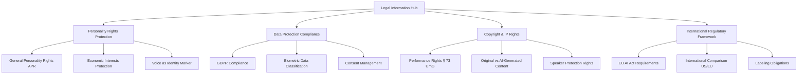
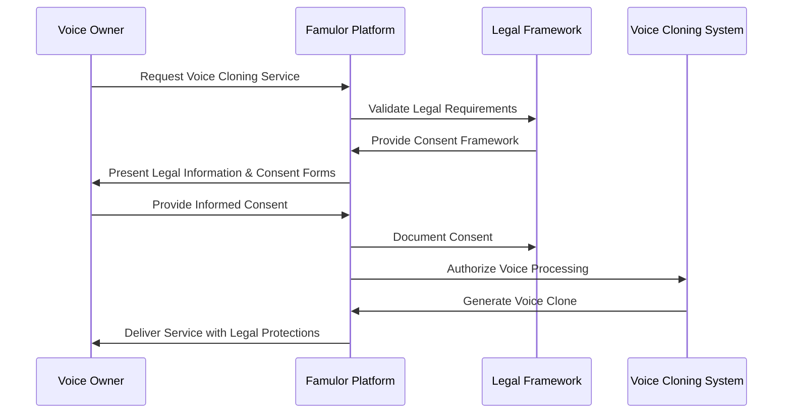
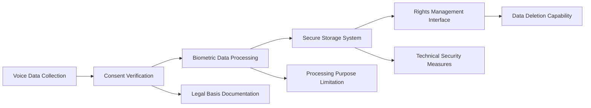

# Legal Information for Voice Cloning Feature Design

## Overview

This design document outlines the legal framework and compliance requirements for implementing voice cloning features within the Famulor AI platform. The design addresses comprehensive legal considerations including personality rights, data protection, copyright, and international regulatory compliance for voice cloning technology in German-speaking markets.

### Project Context
- **Repository Type**: Full-Stack Documentation Platform (Mintlify-based)
- **Target Markets**: Germany, Austria, Switzerland
- **Legal Framework**: EU GDPR, national personality rights, AI Act compliance
- **Core Technology**: AI-powered voice synthesis and cloning capabilities

## Technology Stack & Dependencies

### Documentation Platform
- **Framework**: Mintlify documentation platform
- **Localization**: German (primary) with English support
- **Configuration**: mint.json with multi-language support
- **Deployment**: Web-based documentation system

### Legal Documentation Requirements
- **Compliance Framework**: GDPR, national data protection laws
- **Content Management**: Structured legal information delivery
- **User Interface**: Clear consent mechanisms and legal notices
- **Integration Points**: Voice cloning consent workflows

## Architecture

### Legal Documentation Structure

### Consent Management Architecture

## Legal Framework Components

### 1. Personality Rights Protection System

#### Core Protection Elements
- **Identity Marker Recognition**: Voice as fundamental personal characteristic
- **Constitutional Foundation**: Art. 1 Abs. 1 and Art. 2 Abs. 1 Grundgesetz (GG)
- **Civil Law Integration**: § 823 Abs. 1 BGB as "other right"
- **Self-Determination Principle**: Individual control over voice usage

#### Implementation Requirements
- Explicit consent mechanisms for voice recording and processing
- Clear documentation of usage rights and limitations
- Protection against unauthorized voice imitation
- Economic interests safeguarding for professional speakers

### 2. Data Protection Compliance Framework

#### GDPR Classification System
- **Biometric Data Status**: Voice as unique identification marker
- **Special Category Protection**: Enhanced security requirements under Art. 9 GDPR
- **Processing Legitimacy**: Explicit consent requirement for voice data processing
- **Rights Management**: Comprehensive data subject rights implementation

#### Technical Implementation

### 3. Copyright and Performance Rights Management

#### Performance Rights Protection (§ 73 UrhG)
- **Artistic Performance Recognition**: Voice interpretation as protected creative work
- **Speaker Rights Framework**: Comprehensive protection for voice artists
- **Compensation Requirements**: Fair remuneration for voice usage
- **Attribution Rights**: Proper crediting of original voice performers

#### Original vs AI-Generated Content Distinction
- **Human Creation Standard**: Copyright protection limited to human-generated content
- **AI-Generated Exclusion**: No copyright protection for synthetic voice output
- **Performance Rights Preservation**: Original speaker rights remain intact
- **Licensing Framework**: Clear separation of rights and obligations

### 4. International Regulatory Compliance

#### EU AI Act Integration
- **Labeling Requirements**: Mandatory identification of AI-generated content
- **Transparency Obligations**: Clear disclosure of synthetic voice usage
- **Implementation Timeline**: Compliance by August 1, 2026
- **Exception Framework**: Artistic and editorial exemptions

#### Comparative Legal Analysis

| Aspect | Germany/EU | USA (Tennessee ELVIS Act) |
|--------|------------|---------------------------|
| **Protection Scope** | Personality rights, GDPR, IP law | Explicit voice cloning prohibition |
| **Legal Remedies** | Civil law, data protection sanctions | Civil and criminal penalties |
| **Consent Requirements** | GDPR explicit consent | Written authorization |
| **Enforcement** | Civil courts, data protection authorities | State criminal prosecution |

## Consent Management System

### Multi-Jurisdiction Consent Framework

#### German Consent Requirements
- **Legal Foundation**: GDPR Art. 6, 9 compliance
- **Documentation Standards**: Written consent with clear purpose definition
- **Withdrawal Rights**: Unconditional revocation capability
- **Commercial Usage Disclosure**: Separate consent for economic exploitation

#### Austrian Implementation Specifics
- **GDVO Integration**: National data protection law compliance
- **Consent Documentation**: Enhanced record-keeping requirements
- **Cross-Border Processing**: EU adequacy decision utilization
- **Rights Exercise Facilitation**: Streamlined data subject request processing

#### Swiss Regulatory Adaptation
- **Federal Data Protection Act**: Swiss FADP compliance integration
- **Adequacy Framework**: EU-Swiss data transfer facilitation
- **Cantonal Variations**: Regional legal requirement accommodation
- **International Transfer Controls**: Non-EU data processing restrictions

### Contract Templates Integration

The system provides jurisdiction-specific contract templates covering:

1. **Comprehensive Consent Documentation**
   - Purpose specification and scope limitation
   - Processing duration and data retention policies
   - Third-party sharing restrictions and safeguards
   - Commercial usage rights and compensation frameworks

2. **Rights Management Integration**
   - Data subject access request facilitation
   - Automated consent withdrawal processing
   - Regular consent renewal and validation
   - Audit trail maintenance for compliance demonstration

3. **Risk Mitigation Framework**
   - Unauthorized usage prevention measures
   - Identity theft protection protocols
   - Reputational damage limitation strategies
   - Legal liability distribution mechanisms

## Criminal Law Considerations

### Fraud Prevention Framework

#### Social Engineering Protection
- **Voice Authentication Limitations**: Recognition of cloned voice risks
- **Multi-Factor Verification**: Enhanced authentication requirements
- **Awareness Campaign Integration**: User education on voice cloning fraud
- **Incident Response Protocols**: Systematic fraud detection and response

#### Deepfake Mitigation Strategies
- **Content Verification Systems**: Technical authenticity validation
- **Watermarking Requirements**: Embedded identification markers
- **Detection Technology Integration**: AI-powered fake content identification
- **Legal Enforcement Coordination**: Cooperation with law enforcement agencies

### Regulatory Compliance Monitoring

#### Ongoing Legal Development Tracking
- **Legislative Update Monitoring**: Continuous legal framework evolution tracking
- **Judicial Decision Integration**: Case law development incorporation
- **Regulatory Guidance Compliance**: Authority guidance implementation
- **International Standard Alignment**: Cross-border regulatory harmonization

## Testing Strategy

### Legal Compliance Validation

#### Consent Process Testing
- **User Journey Validation**: End-to-end consent workflow verification
- **Legal Requirement Coverage**: Comprehensive compliance checkpoint testing
- **Cross-Jurisdiction Compatibility**: Multi-country legal framework validation
- **Accessibility Compliance**: Universal design principle implementation

#### Privacy Impact Assessment
- **Data Flow Analysis**: Comprehensive data processing mapping
- **Risk Assessment Framework**: Systematic privacy risk evaluation
- **Mitigation Strategy Validation**: Control effectiveness verification
- **Third-Party Integration Review**: Vendor compliance assessment

### Documentation Quality Assurance

#### Legal Content Review Process
- **Expert Legal Review**: Professional legal validation
- **Regulatory Compliance Verification**: Authority requirement alignment
- **User Comprehension Testing**: Plain language accessibility validation
- **Translation Accuracy Assessment**: Multi-language legal precision verification

#### Update and Maintenance Framework
- **Regular Content Refresh**: Periodic legal information updates
- **Regulatory Change Integration**: Dynamic legal framework adaptation
- **User Feedback Integration**: Continuous improvement based on user experience
- **Audit Trail Maintenance**: Comprehensive change documentation

## Implementation Roadmap

### Phase 1: Foundation Implementation
- Legal framework documentation completion
- Basic consent management system deployment
- German jurisdiction compliance establishment
- Initial user interface development

### Phase 2: Multi-Jurisdiction Expansion
- Austrian and Swiss legal framework integration
- Advanced consent template system implementation
- Cross-border data processing capability establishment
- Enhanced user rights management system

### Phase 3: Advanced Compliance Features
- AI Act compliance system implementation
- Automated legal update integration
- Advanced fraud detection system deployment
- Comprehensive audit and reporting system

### Phase 4: Continuous Optimization
- User experience enhancement based on feedback
- Legal framework evolution adaptation
- International best practice integration
- Advanced technology integration for compliance automation

## Risk Management

### Legal Compliance Risks
- **Regulatory Change Impact**: Systematic monitoring and adaptation processes
- **Cross-Jurisdiction Conflicts**: Expert legal consultation and resolution frameworks
- **User Rights Violations**: Proactive prevention and remediation systems
- **Third-Party Compliance Gaps**: Comprehensive vendor management and oversight

### Technical Implementation Risks
- **System Integration Challenges**: Phased deployment and testing strategies
- **User Adoption Barriers**: Comprehensive training and support systems
- **Data Security Vulnerabilities**: Multi-layered security framework implementation
- **Scalability Limitations**: Future-proof architecture design and implementation

This legal information design provides a comprehensive framework for implementing voice cloning features while ensuring full compliance with applicable legal requirements across German-speaking jurisdictions. The design emphasizes user protection, regulatory compliance, and sustainable business practices in the rapidly evolving voice AI landscape.