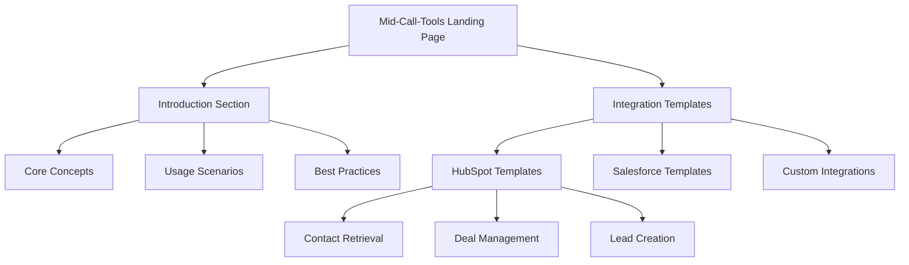
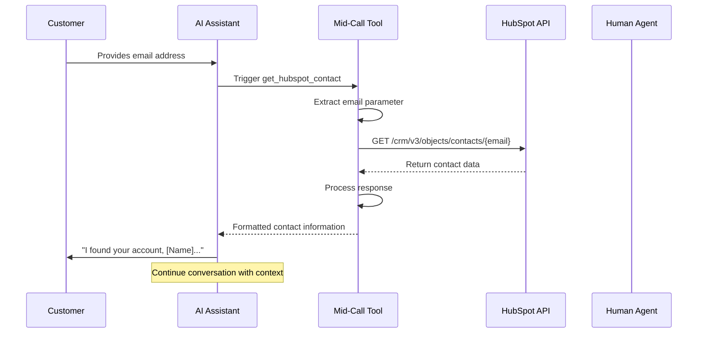

# Mid-Call-Tools Documentation Design

## Overview

This design document outlines the creation of a new documentation section for Mid-Call-Tools (Werkzeuge während des Anrufs) under the No-Code Automation Platform. The section will explain what Mid-Call-Tools are and provide practical implementation templates for popular CRM integrations, starting with HubSpot.

## Architecture

### Documentation Structure

```
No-Code Automation Platform/
└── Mid-Call-Tools/
    ├── Introduction/
    │   ├── What are Mid-Call-Tools
    │   ├── When to Use Mid-Call-Tools
    │   └── Benefits and Use Cases
    └── Integration Templates/
        ├── HubSpot Integration
        │   ├── Contact Retrieval
        │   ├── Deal Management
        │   └── Lead Creation
        ├── Salesforce Integration
        ├── Google Sheets Integration
        └── Custom API Integration
```

### Content Framework



## Documentation Content Design

### 1. Introduction Page: "Was sind Mid-Call-Tools?"

#### Core Definition Section
- **Primary Purpose**: Tools that execute during active phone conversations
- **Key Differentiator**: Real-time data access vs. pre/post-call processing
- **Technical Foundation**: API-based external system integration

#### Functionality Overview Table

| Feature | Description | Example Use Case |
|---------|-------------|------------------|
| Real-time Data Retrieval | Fetch customer information during calls | "Let me check your account status..." |
| Dynamic Response Generation | Adapt conversation based on retrieved data | Personalized product recommendations |
| External System Integration | Connect to CRM, inventory, scheduling systems | Check appointment availability |
| Context-Aware Processing | Extract conversation parameters automatically | Customer ID from natural speech |

#### Benefits and Use Cases

**Primary Benefits:**
- Enhanced customer experience through personalized interactions
- Real-time access to business data during conversations
- Automated data collection and processing
- Seamless integration with existing business systems

**Common Use Cases:**
- Customer verification and account lookup
- Inventory and availability checking
- Appointment scheduling and management
- Order status and tracking information
- Lead qualification and scoring

### 2. Integration Templates Section

#### HubSpot Contact Retrieval Template

**Template Configuration:**

```yaml
Tool Configuration:
  Name: get_hubspot_contact
  Description: "Ruft einen Kontakt aus HubSpot anhand der E-Mail-Adresse ab."
  
Technical Settings:
  Function Name: get_hubspot_contact
  HTTP Method: GET
  Timeout: 5000ms
  URL: https://api.hubapi.com/crm/v3/objects/contacts/{email}
  
Headers:
  Authorization: "Bearer HUBSPOT_API_KEY"
  Content-Type: "application/json"
  
Query Parameters:
  idProperty: "email"
  properties: "firstname,lastname,company,phone,lastmodifieddate"
  
Parameter Schema:
  email:
    type: string
    description: "E-Mail-Adresse des Kontakts"
    required: true
```

#### Configuration Form Fields

| Field | Value | Description |
|-------|--------|-------------|
| **Funktionsname** | `get_hubspot_contact` | Technischer Name ohne Leerzeichen |
| **Funktionsbeschreibung** | "Ruft einen Kontakt aus HubSpot anhand der E-Mail-Adresse ab. Erklären Sie dem Agenten, wann und wie diese Funktion verwendet werden soll." | Agent-Anweisungen |
| **HTTP-Methode** | GET | Daten abrufen |
| **Timeout** | 5000ms | Maximale Wartezeit |
| **URL** | `https://api.hubapi.com/crm/v3/objects/contacts/{email}` | API-Endpunkt mit dynamischen Parametern |

#### Parameter Definition

```json
{
  "type": "object",
  "properties": {
    "email": {
      "type": "string",
      "description": "E-Mail-Adresse des Kontakts"
    }
  },
  "required": ["email"]
}
```

### 3. Implementation Workflow



### 4. Response Data Structure

#### HubSpot API Response Example

```json
{
  "id": "12345",
  "properties": {
    "firstname": "Max",
    "lastname": "Mustermann", 
    "company": "Beispiel GmbH",
    "phone": "+49 123 456789",
    "email": "max.mustermann@beispiel.de",
    "lastmodifieddate": "2024-01-15T10:30:00Z"
  }
}
```

#### AI Assistant Usage Context

**Natural Language Integration:**
- "Ich sehe, dass Sie Max Mustermann von Beispiel GmbH sind..."
- "Ihr Konto wurde zuletzt am 15. Januar aktualisiert..."
- "Ihre registrierte Telefonnummer ist +49 123 456789..."

### 5. Configuration Best Practices

#### Security Considerations

| Aspect | Recommendation | Implementation |
|--------|---------------|----------------|
| **API Authentication** | Use environment variables for API keys | `Bearer ${HUBSPOT_API_KEY}` |
| **Data Privacy** | Limit retrieved properties to necessary fields | Specify minimal property list |
| **Error Handling** | Implement fallback responses | "Entschuldigung, ich kann momentan nicht auf Ihre Daten zugreifen..." |
| **Rate Limiting** | Respect API limits | Configure appropriate timeout values |

#### Performance Optimization

**Timeout Configuration:**
- Standard timeout: 5000ms (5 seconds)
- Maximum recommended: 10000ms (10 seconds)
- Critical calls: 3000ms (3 seconds)

**Caching Strategy:**
- Cache frequently accessed contact data
- Implement cache invalidation policies
- Consider conversation-scoped caching

### 6. Testing and Validation

#### Tool Testing Process

**Automated Testing Configuration:**
- String parameters default to "test"
- Number parameters default to 1
- Boolean parameters default to true

**Manual Testing Checklist:**
- [ ] Valid email address handling
- [ ] Invalid email address error handling
- [ ] API authentication verification
- [ ] Response time measurement
- [ ] Error response handling
- [ ] Natural language integration

#### Common Error Scenarios

| Error Type | Cause | Resolution |
|------------|-------|------------|
| **404 Not Found** | Contact doesn't exist | Graceful fallback message |
| **401 Unauthorized** | Invalid API key | Check authentication configuration |
| **429 Rate Limited** | Too many requests | Implement retry logic |
| **Timeout** | Slow API response | Adjust timeout settings |

### 7. Extension Templates

#### Additional HubSpot Integration Templates

**Deal Lookup Template:**
```yaml
Function: get_hubspot_deal
Endpoint: /crm/v3/objects/deals/{deal_id}
Parameters:
  - deal_id: string (Deal ID or custom property)
Use Case: "Let me check the status of your proposal..."
```

**Lead Creation Template:**
```yaml
Function: create_hubspot_lead
Method: POST
Endpoint: /crm/v3/objects/contacts
Use Case: "I'll create a new contact record for you..."
```

**Company Information Template:**
```yaml
Function: get_hubspot_company
Endpoint: /crm/v3/objects/companies/{company_id}
Use Case: "Let me look up your company information..."
```

## Technical Implementation Guidelines

### 1. URL Parameter Substitution

**Dynamic Parameter Usage:**
- Use `{parameter_name}` syntax in URLs
- Parameters are automatically substituted during runtime
- Support for multiple parameters in single URL

**Example Implementation:**
```
Original URL: https://api.hubspot.com/crm/v3/objects/contacts/{email}
Runtime URL: https://api.hubspot.com/crm/v3/objects/contacts/customer@example.com
```

### 2. Header Configuration

**Authentication Headers:**
```json
{
  "Authorization": "Bearer HUBSPOT_API_KEY",
  "Content-Type": "application/json",
  "User-Agent": "Famulor-MidCall-Tool/1.0"
}
```

**Dynamic Header Values:**
- Support for environment variable substitution
- Secure credential management
- API version specification

### 3. Query Parameter Management

**HubSpot-Specific Parameters:**
- `idProperty`: Specifies which property to use for lookup
- `properties`: Comma-separated list of properties to retrieve
- `associations`: Include associated objects (deals, companies)

**Performance Optimization:**
- Request only necessary properties
- Use property groups for related data
- Implement selective data retrieval

## Documentation Standards

### 1. Content Localization

**German Language Requirements:**
- All user-facing content in German
- Technical terms with German explanations
- Code examples with German comments
- Error messages in German

### 2. Visual Design Elements

**Mermaid Diagrams:**
- Sequence diagrams for API interactions
- Flowcharts for decision logic
- System architecture diagrams
- Data flow visualizations

**Table Formatting:**
- Configuration tables for quick reference
- Parameter specification tables
- Error code reference tables
- Best practices checklists

### 3. Code Examples

**Template Structure:**
- Complete configuration examples
- Step-by-step setup instructions
- Common customization scenarios
- Troubleshooting guides

**Documentation Format:**
- YAML for configuration examples
- JSON for API responses
- Markdown tables for reference data
- Mermaid for visual workflows