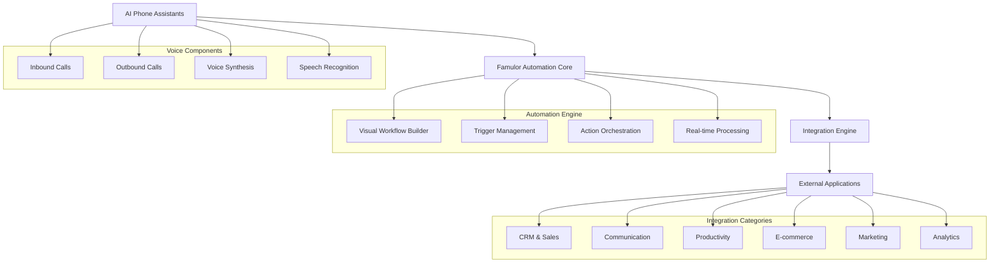
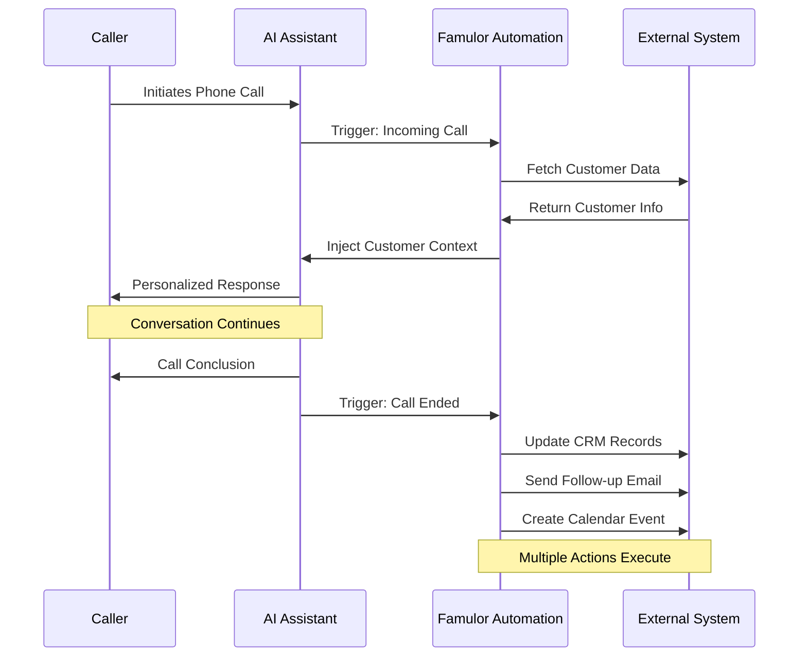
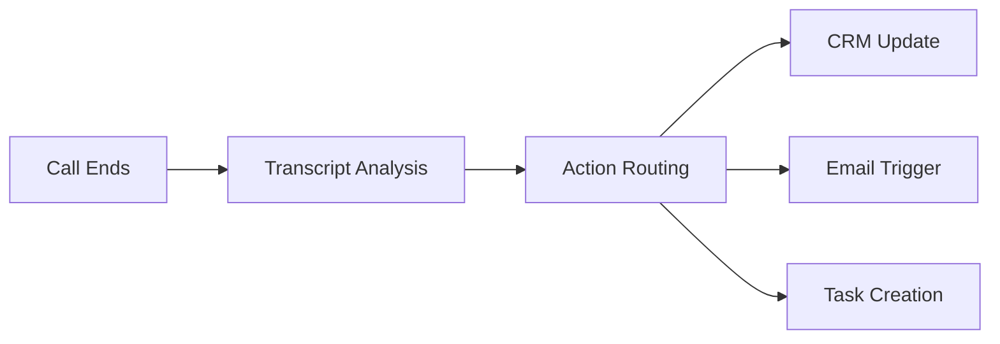
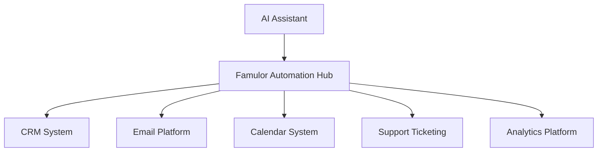

# Famulor Automation - No-Code Platform Design

## Overview

Famulor Automation is a comprehensive no-code automation platform that connects AI phone assistants with over 379 external applications and services. The platform enables businesses to create sophisticated call automation workflows without writing code, integrating voice interactions with external systems to streamline operations and enhance customer experiences.

## Architecture Overview

The Famulor Automation platform follows a modular architecture that seamlessly integrates voice agents with workflow orchestration and external integrations.

## Core Automation Triggers

### Call-Based Triggers

#### Call Ended Trigger
- Activates immediately when an AI call concludes
- Provides access to complete conversation transcript and AI responses
- Includes call duration, status, and detailed metadata
- Enables post-call automation such as CRM updates and follow-up actions

#### Incoming Call Variable Injection
- Activates before the AI assistant answers an incoming call
- Enriches AI context with real-time customer data
- Adapts conversation flow based on caller information
- Enables personalized interactions from the first moment

## Integration Categories

### Artificial Intelligence & Machine Learning

#### OpenAI
**Integration Capabilities:**
- Advanced text processing and analysis
- Conversation enhancement and summarization
- Sentiment analysis of call transcripts

**AI Phone Assistant Use Cases:**
- **Call Transcript Analysis**: After each call, automatically analyze conversation sentiment and extract key insights to improve future interactions
- **Dynamic Response Generation**: Generate contextual follow-up responses based on conversation patterns
- **Lead Qualification Scoring**: Use AI to score leads based on conversation quality and customer responses

#### Anthropic Claude
**Integration Capabilities:**
- Natural language understanding and generation
- Content analysis and processing
- Advanced reasoning capabilities

**AI Phone Assistant Use Cases:**
- **Conversation Quality Assessment**: Analyze call quality and provide coaching recommendations for AI assistant improvement
- **Complex Query Resolution**: Handle sophisticated customer inquiries that require multi-step reasoning
- **Compliance Monitoring**: Ensure conversations meet regulatory requirements through automated analysis

### Customer Relationship Management (CRM)

#### HubSpot
**Integration Capabilities:**
- Contact and lead management
- Deal tracking and pipeline automation
- Marketing automation workflows

**AI Phone Assistant Use Cases:**
- **Automatic Contact Creation**: Create new contacts from inbound calls with extracted information from conversations
- **Deal Progression**: Move deals through pipeline stages based on call outcomes and customer responses
- **Follow-up Campaign Triggers**: Automatically enroll contacts in email sequences based on call results

#### Salesforce
**Integration Capabilities:**
- Comprehensive CRM operations
- Custom object management
- Advanced reporting and analytics

**AI Phone Assistant Use Cases:**
- **Real-time Data Injection**: Pull customer history and preferences before calls to personalize conversations
- **Opportunity Management**: Create and update sales opportunities based on call discussions
- **Activity Logging**: Automatically log all call activities with detailed transcripts and outcomes

#### Zoho CRM
**Integration Capabilities:**
- Lead management and scoring
- Sales automation
- Customer communication tracking

**AI Phone Assistant Use Cases:**
- **Lead Nurturing Automation**: Automatically schedule follow-up calls based on lead engagement levels
- **Customer Onboarding**: Trigger onboarding sequences when new customers are identified during calls
- **Sales Territory Management**: Route calls and leads to appropriate sales representatives based on geographic data

#### Pipedrive
**Integration Capabilities:**
- Visual pipeline management
- Activity scheduling
- Deal tracking

**AI Phone Assistant Use Cases:**
- **Pipeline Velocity Optimization**: Track how phone interactions accelerate deal progression
- **Automated Activity Creation**: Schedule follow-up activities based on call outcomes
- **Revenue Forecasting**: Use call data to improve sales predictions and pipeline accuracy

### Communication Platforms

#### Slack
**Integration Capabilities:**
- Channel messaging and notifications
- File sharing and collaboration
- Workflow automation

**AI Phone Assistant Use Cases:**
- **Instant Call Alerts**: Notify sales teams immediately when high-value prospects call
- **Conversation Summaries**: Post automated call summaries to relevant team channels
- **Emergency Escalation**: Alert managers when calls require immediate human intervention

#### Microsoft Teams
**Integration Capabilities:**
- Team collaboration and messaging
- Meeting scheduling and management
- File and document sharing

**AI Phone Assistant Use Cases:**
- **Team Call Handoffs**: Seamlessly transfer calls to available team members through Teams integration
- **Meeting Scheduling**: Schedule follow-up meetings directly through Teams based on call discussions
- **Department Notifications**: Alert specific departments when calls mention their services or products

#### Discord
**Integration Capabilities:**
- Community messaging and voice
- Bot integration
- Server management

**AI Phone Assistant Use Cases:**
- **Community Support**: Connect phone support with Discord community channels for ongoing assistance
- **Event Notifications**: Announce scheduled calls or important customer contacts to community moderators
- **Customer Feedback Loop**: Share anonymized call feedback with community teams for product improvement

### Email Marketing & Communication

#### Gmail
**Integration Capabilities:**
- Email sending and receiving
- Contact management
- Label and organization systems

**AI Phone Assistant Use Cases:**
- **Automated Follow-up Emails**: Send personalized follow-up emails immediately after calls with relevant attachments
- **Appointment Confirmations**: Automatically send calendar invites and confirmation emails for scheduled appointments
- **Lead Nurturing Sequences**: Trigger email sequences based on caller interest levels expressed during conversations

#### Mailchimp
**Integration Capabilities:**
- Email campaign management
- Audience segmentation
- Marketing automation

**AI Phone Assistant Use Cases:**
- **Audience Segmentation**: Automatically segment email lists based on phone conversation topics and outcomes
- **Behavioral Triggers**: Start email campaigns when specific keywords or phrases are mentioned during calls
- **Campaign Performance Tracking**: Measure how phone calls influence email engagement and conversion rates

#### ActiveCampaign
**Integration Capabilities:**
- Advanced email automation
- CRM and sales automation
- Behavioral tracking

**AI Phone Assistant Use Cases:**
- **Dynamic Content Personalization**: Use call insights to personalize future email content and offers
- **Lead Scoring Integration**: Combine phone interaction data with email engagement for comprehensive lead scoring
- **Cross-channel Journey Mapping**: Create unified customer journeys that span phone calls and email interactions

### Productivity & Project Management

#### Google Sheets
**Integration Capabilities:**
- Spreadsheet data management
- Real-time collaboration
- Formula and calculation automation

**AI Phone Assistant Use Cases:**
- **Call Logging Database**: Automatically populate spreadsheets with call details, outcomes, and next steps
- **Lead Tracking Dashboard**: Maintain real-time lead status updates from phone conversations
- **Performance Analytics**: Track call metrics and conversion rates for team performance analysis

#### Notion
**Integration Capabilities:**
- Knowledge base management
- Project tracking
- Database operations

**AI Phone Assistant Use Cases:**
- **Customer Knowledge Base**: Build comprehensive customer profiles with call history and preferences
- **Project Initiation**: Create new project pages when customers request services during calls
- **Team Collaboration**: Share call insights and action items with project teams through Notion pages

#### ClickUp
**Integration Capabilities:**
- Task and project management
- Team collaboration
- Goal tracking

**AI Phone Assistant Use Cases:**
- **Automatic Task Creation**: Generate tasks for team members based on commitments made during calls
- **Project Status Updates**: Update project progress when customers provide feedback during check-in calls
- **Customer Request Tracking**: Convert customer requests into trackable tasks with automatic assignment

#### Airtable
**Integration Capabilities:**
- Database and spreadsheet hybrid
- Record linking and relationships
- Automation and workflows

**AI Phone Assistant Use Cases:**
- **Customer Journey Tracking**: Map complete customer journeys with linked records across touchpoints
- **Inventory Management**: Update product availability when customers inquire about specific items
- **Service Request Management**: Create and track service requests with detailed call context

### Calendar & Scheduling

#### Google Calendar
**Integration Capabilities:**
- Event creation and management
- Calendar sharing and permissions
- Meeting room booking

**AI Phone Assistant Use Cases:**
- **Intelligent Scheduling**: Check availability and book appointments directly during phone conversations
- **Buffer Time Management**: Automatically add preparation time before important client calls
- **Multi-timezone Coordination**: Handle international client scheduling with automatic timezone conversion

#### Calendly
**Integration Capabilities:**
- Automated scheduling
- Calendar integration
- Meeting preferences management

**AI Phone Assistant Use Cases:**
- **Instant Booking Links**: Share booking links via SMS immediately after calls for easy scheduling
- **Service-specific Scheduling**: Route different types of appointments to appropriate calendars based on call content
- **Follow-up Automation**: Automatically schedule follow-up calls based on conversation outcomes

#### Microsoft Outlook Calendar
**Integration Capabilities:**
- Enterprise calendar management
- Meeting scheduling and invitations
- Resource booking

**AI Phone Assistant Use Cases:**
- **Enterprise Meeting Coordination**: Schedule complex multi-party meetings discussed during sales calls
- **Resource Allocation**: Book conference rooms and equipment when customers schedule on-site visits
- **Reminder Automation**: Set automatic reminders for important customer commitments made during calls

### E-commerce & Payment Processing

#### Shopify
**Integration Capabilities:**
- Product catalog management
- Order processing
- Customer data management

**AI Phone Assistant Use Cases:**
- **Order Status Inquiries**: Provide real-time order updates when customers call for information
- **Product Recommendations**: Suggest products based on customer conversation history and preferences
- **Return Processing**: Initiate return workflows when customers express dissatisfaction during calls

#### WooCommerce
**Integration Capabilities:**
- WordPress e-commerce integration
- Product and inventory management
- Order fulfillment

**AI Phone Assistant Use Cases:**
- **Abandoned Cart Recovery**: Call customers who left items in cart and complete purchases over the phone
- **Inventory Alerts**: Notify customers when out-of-stock items become available
- **Upselling Opportunities**: Identify cross-sell opportunities during support calls and update orders

#### Stripe
**Integration Capabilities:**
- Payment processing
- Subscription management
- Financial reporting

**AI Phone Assistant Use Cases:**
- **Payment Issue Resolution**: Handle payment failures and update payment methods during support calls
- **Subscription Management**: Upgrade, downgrade, or modify subscriptions based on customer requests
- **Billing Inquiries**: Provide detailed billing information and resolve disputes through phone support

### Marketing & Analytics

#### Google Analytics
**Integration Capabilities:**
- Website traffic analysis
- Conversion tracking
- User behavior insights

**AI Phone Assistant Use Cases:**
- **Call Attribution Tracking**: Connect phone calls to specific marketing campaigns and traffic sources
- **Conversion Path Analysis**: Understand how phone calls fit into the customer journey
- **ROI Measurement**: Calculate the impact of phone interactions on overall marketing performance

#### Facebook/Meta Ads
**Integration Capabilities:**
- Ad campaign management
- Audience targeting
- Performance optimization

**AI Phone Assistant Use Cases:**
- **Lead Quality Feedback**: Update ad targeting based on the quality of leads generated from phone calls
- **Campaign Optimization**: Adjust ad spend based on phone conversion rates from different campaigns
- **Custom Audience Creation**: Build custom audiences from phone call data for retargeting campaigns

#### Mixpanel
**Integration Capabilities:**
- Event tracking and analytics
- User behavior analysis
- Cohort analysis

**AI Phone Assistant Use Cases:**
- **Call Journey Analytics**: Track customer interactions from first call to conversion
- **Feature Usage Correlation**: Analyze which discussed features lead to successful outcomes
- **Retention Analysis**: Measure how phone support impacts customer retention rates

### Forms & Survey Platforms

#### Typeform
**Integration Capabilities:**
- Interactive form creation
- Response collection and analysis
- Conditional logic

**AI Phone Assistant Use Cases:**
- **Post-call Surveys**: Automatically send satisfaction surveys after support calls
- **Lead Qualification**: Trigger detailed qualification forms when prospects show interest during calls
- **Feedback Collection**: Gather specific feedback about services discussed during phone conversations

#### JotForm
**Integration Capabilities:**
- Form building and hosting
- Payment form integration
- Response management

**AI Phone Assistant Use Cases:**
- **Service Request Forms**: Send detailed service request forms when customers inquire about complex services
- **Registration Processes**: Complete event or service registrations started during phone conversations
- **Document Collection**: Request necessary documents through forms after initial phone consultations

### File Storage & Management

#### Google Drive
**Integration Capabilities:**
- Cloud file storage and sharing
- Document collaboration
- File organization

**AI Phone Assistant Use Cases:**
- **Document Sharing**: Instantly share relevant documents mentioned during calls
- **Contract Management**: Store and organize contracts discussed or signed as a result of phone calls
- **Call Recording Storage**: Organize and store call recordings with easy access for team members

#### Dropbox
**Integration Capabilities:**
- File synchronization and sharing
- Version control
- Collaboration tools

**AI Phone Assistant Use Cases:**
- **Client File Access**: Provide immediate access to client files during support calls
- **Proposal Delivery**: Share proposals and quotes immediately after sales calls
- **Team Collaboration**: Share call insights and customer files with relevant team members

### Customer Support

#### Zendesk
**Integration Capabilities:**
- Ticket management and tracking
- Customer communication history
- Knowledge base integration

**AI Phone Assistant Use Cases:**
- **Ticket Creation**: Automatically create support tickets for issues identified during phone calls
- **Issue Escalation**: Escalate complex problems to appropriate support tiers based on call analysis
- **Customer History Access**: Pull complete customer support history before answering calls for context

#### Freshdesk
**Integration Capabilities:**
- Multi-channel support management
- Automation and workflows
- Performance reporting

**AI Phone Assistant Use Cases:**
- **Omnichannel Experience**: Connect phone support with email and chat histories for seamless service
- **SLA Management**: Ensure service level agreements are met by tracking call resolution times
- **Agent Performance**: Analyze phone support quality to improve overall team performance

### Social Media Management

#### Twitter/X
**Integration Capabilities:**
- Tweet posting and management
- Direct message handling
- Social listening

**AI Phone Assistant Use Cases:**
- **Social Media Escalation**: Connect phone support with social media complaints for comprehensive resolution
- **Brand Monitoring**: Alert teams when customers mention brand issues during calls
- **Community Engagement**: Share positive customer feedback from calls on social media (with permission)

#### LinkedIn
**Integration Capabilities:**
- Professional networking
- Lead generation
- Company page management

**AI Phone Assistant Use Cases:**
- **Professional Networking**: Connect with business prospects on LinkedIn after successful sales calls
- **Lead Research**: Gather professional background information before important business calls
- **Relationship Building**: Track professional relationships developed through phone interactions

### Webhooks & Custom Integrations

#### HTTP Webhooks
**Integration Capabilities:**
- Custom API integrations
- Real-time data transmission
- Flexible data formatting

**AI Phone Assistant Use Cases:**
- **Custom System Integration**: Connect with proprietary business systems for specialized workflows
- **Real-time Notifications**: Send instant alerts to custom applications when specific call events occur
- **Data Synchronization**: Keep internal systems updated with call data and customer interactions

## Data Flow Architecture

## Integration Categories Summary

| Category | Count | Key Benefits |
|----------|--------|--------------|
| CRM & Sales | 45+ | Automated lead management, deal tracking |
| Communication | 35+ | Team collaboration, instant notifications |
| Productivity | 60+ | Task automation, project management |
| E-commerce | 25+ | Order management, customer service |
| Marketing | 40+ | Campaign optimization, analytics |
| Forms & Surveys | 15+ | Data collection, feedback gathering |
| File Management | 20+ | Document sharing, storage automation |
| Customer Support | 30+ | Ticket creation, issue tracking |
| Calendar & Scheduling | 18+ | Appointment booking, time management |
| Social Media | 12+ | Brand monitoring, engagement tracking |

## Implementation Patterns

### Real-time Data Injection Pattern

### Post-call Automation Pattern

### Multi-system Synchronization Pattern

## Security & Compliance

### Data Protection
- End-to-end encryption for all integrations
- SOC 2 Type II compliance framework
- GDPR and CCPA data handling compliance
- Role-based access control for sensitive integrations

### API Security
- OAuth 2.0 authentication for supported platforms
- API key management with rotation capabilities
- Rate limiting and throttling protection
- Audit logging for all integration activities

## Testing Strategy

### Integration Testing
- Automated testing for all 379+ integrations
- Real-time monitoring of integration health
- Fallback mechanisms for integration failures
- Performance testing under load conditions

### Call Flow Testing
- End-to-end call scenario testing
- Integration trigger validation
- Data accuracy verification
- Response time optimization

## Performance Optimization

### Response Time Targets
- Real-time data injection: < 500ms
- Post-call automation: < 2 seconds
- Integration health checks: < 100ms
- Bulk data processing: < 30 seconds

### Scalability Measures
- Horizontal scaling for high-volume integrations
- Queue management for delayed processing
- Circuit breaker patterns for failing integrations
- Load balancing across integration endpoints