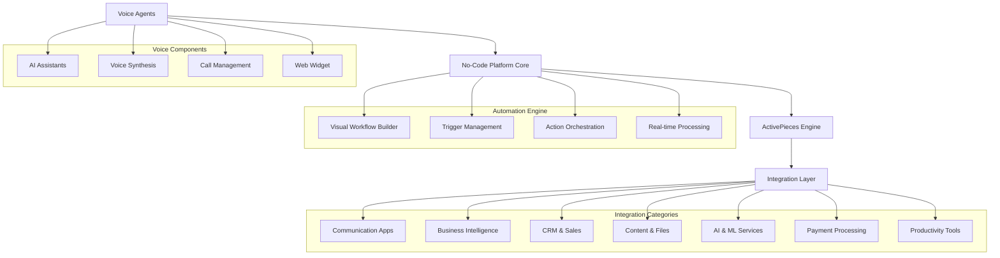
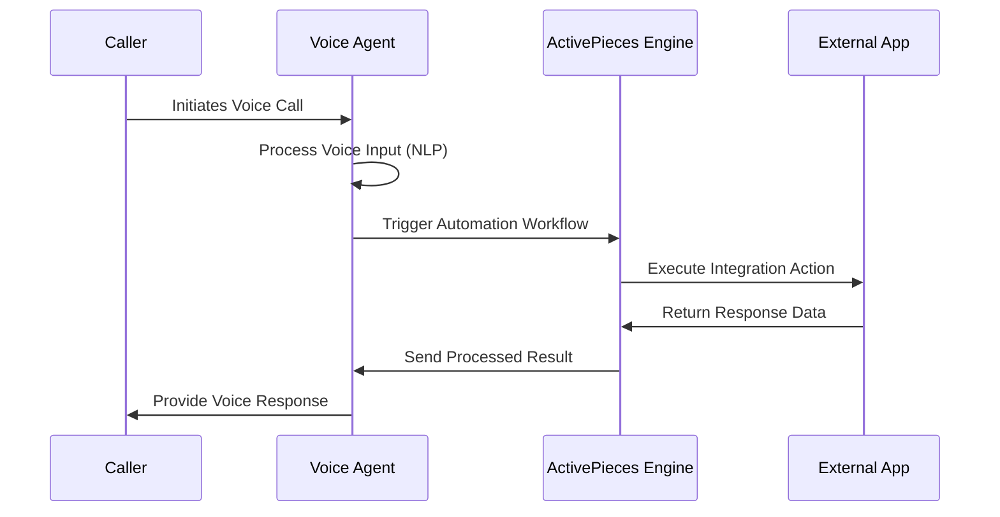
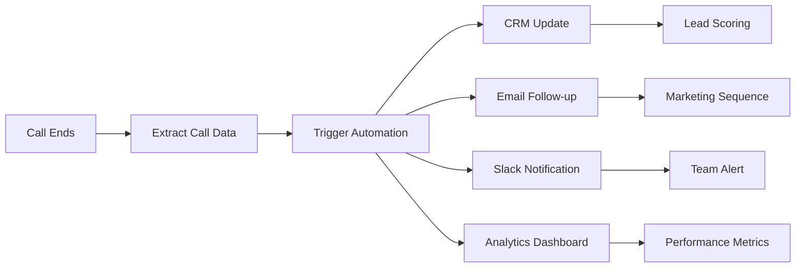

# No-Code Automation Platform with ActivePieces Integration

## Overview

The No-Code Automation Platform is a comprehensive workflow automation system that integrates ActivePieces' extensive connector ecosystem with Famulor's Voice Agents technology. This platform enables users to create sophisticated automation workflows without coding, connecting voice interactions with over 379 external applications and services.

The system leverages ActivePieces' embedded solution to provide native integration capabilities while maintaining seamless connectivity with Voice Agents for AI-powered phone interactions, creating end-to-end automation workflows that span voice communications and business applications.

## Technology Stack & Dependencies

### Core Platform Components
- **ActivePieces Embedding**: Native integration engine with 379+ connectors
- **Famulor Voice Agents**: AI-powered phone interaction system
- **No-Code Visual Builder**: Drag-and-drop workflow designer
- **Real-time Processing Engine**: Event-driven automation execution
- **Webhook Infrastructure**: Bi-directional API communication layer

### Voice Integration Technologies
- **ElevenLabs Voice Engine**: Natural voice synthesis and cloning
- **Natural Language Processing**: Real-time speech understanding
- **Call Management System**: Inbound/outbound call orchestration
- **Voice Widget**: Web-based voice interaction embedding

### Security & Compliance
- **SOC 2 Type II Compliance**: Enterprise-grade security standards
- **OAuth 2.0 Authentication**: Secure third-party app connections
- **Data Encryption**: End-to-end encryption for voice and data workflows

## Architecture Overview



## Integration Categories & Available Connectors

### Artificial Intelligence & Machine Learning
- **OpenAI**: GPT models, image generation, text processing
  - *Voice Use Case*: Customer calls asking complex product questions → Voice Agent uses OpenAI to generate detailed, contextual responses → Provides intelligent answers beyond pre-scripted responses
- **Anthropic Claude**: Advanced conversational AI
  - *Voice Use Case*: Legal consultation call → Voice Agent leverages Claude for complex reasoning → Provides nuanced legal guidance while escalating when needed
- **Pinecone**: Vector database and similarity search
  - *Voice Use Case*: "Find similar customers to me" request → Voice Agent queries Pinecone with caller profile → Returns matched customer recommendations and personalized offers
- **Qdrant**: Vector database operations
  - *Voice Use Case*: Technical support call → Voice Agent searches Qdrant knowledge base using voice description → Finds exact solution from similar past issues
- **Zoo**: 3D model generation from text
  - *Voice Use Case*: Product design consultation → Customer describes requirements via voice → Voice Agent triggers Zoo to generate 3D prototype → Sends visual concept via email
- **Data Summarizer**: Automated data analysis and insights
  - *Voice Use Case*: Business review call → Voice Agent analyzes recent performance data → Provides spoken summary of key metrics and trends

### Communication Platforms
- **Slack**: Channel messaging, notifications, file sharing
  - *Voice Use Case*: Customer complaint call → Voice Agent logs issue details → Automatically posts to #customer-support Slack channel → Team gets instant notification with call summary
- **Microsoft Teams**: Team collaboration, meetings, chat
  - *Voice Use Case*: Urgent technical issue reported → Voice Agent assesses severity → Immediately sends Teams message to on-call engineers → Includes caller info and problem description
- **Discord**: Community management, notifications
  - *Voice Use Case*: Gaming support call → Voice Agent identifies player issue → Posts to relevant Discord server channel → Community managers get real-time player feedback
- **Zoom**: Video conferencing, webinar management
  - *Voice Use Case*: Sales call requests demo → Voice Agent schedules Zoom meeting → Sends calendar invite → Provides meeting link and preparation materials
- **ntfy**: Push notification management
  - *Voice Use Case*: Critical system alert reported → Voice Agent validates issue → Sends ntfy push notification to all administrators → Ensures immediate response team activation

### Customer Relationship Management
- **HubSpot**: Contact management, deal tracking, marketing automation
  - *Voice Use Case*: Prospect calls for information → Voice Agent identifies caller → Fetches HubSpot contact history → Provides personalized conversation based on previous interactions → Updates deal stage automatically
- **Salesforce**: CRM operations, lead management
  - *Voice Use Case*: Customer service call → Voice Agent pulls Salesforce account details → Reviews case history and preferences → Resolves issue while updating case notes in real-time
- **Zoho CRM**: Customer data, pipeline management
  - *Voice Use Case*: Follow-up sales call → Voice Agent accesses Zoho pipeline data → Discusses specific deal progress → Moves opportunity to next stage based on conversation outcome
- **Microsoft Dynamics CRM**: Enterprise CRM operations
  - *Voice Use Case*: Enterprise client check-in → Voice Agent retrieves comprehensive Dynamics profile → Discusses account health and renewal timeline → Schedules appropriate follow-up actions
- **Pipedrive**: Sales pipeline management
  - *Voice Use Case*: Qualification call → Voice Agent asks discovery questions → Scores lead based on responses → Creates new Pipedrive deal with qualification notes

### Email & Marketing Automation
- **Gmail**: Email operations, automated responses
  - *Voice Use Case*: Customer requests quote → Voice Agent gathers requirements → Generates detailed quote → Sends professional Gmail with pricing and terms → Sets follow-up reminder
- **Microsoft Outlook**: Calendar, contacts, email management
  - *Voice Use Case*: Meeting request call → Voice Agent checks Outlook calendar availability → Schedules appointment → Sends Outlook meeting invite with agenda → Sets pre-meeting reminders
- **Mailchimp**: Email campaigns, audience management
  - *Voice Use Case*: Newsletter signup during call → Voice Agent captures preferences → Adds contact to appropriate Mailchimp list → Triggers welcome email sequence
- **ActiveCampaign**: Marketing automation, email sequences
  - *Voice Use Case*: Product interest expressed → Voice Agent tags contact in ActiveCampaign → Triggers targeted email nurture sequence → Tracks engagement for sales follow-up
- **Zoho Mail**: Professional email management
  - *Voice Use Case*: Support ticket escalation → Voice Agent creates Zoho Mail ticket → Routes to appropriate department → Sends confirmation email with ticket number

### Business Intelligence & Analytics
- **Google Sheets**: Spreadsheet operations, data analysis
  - *Voice Use Case*: Sales performance inquiry → Voice Agent queries Google Sheets dashboard → Provides real-time revenue metrics → Explains trends and forecasts based on current data
- **Microsoft Excel 365**: Advanced spreadsheet functions
  - *Voice Use Case*: Budget approval call → Voice Agent accesses Excel financial models → Calculates impact of requested changes → Provides immediate budget variance analysis
- **Microsoft Power BI**: Dashboard creation, data visualization
  - *Voice Use Case*: Executive briefing call → Voice Agent pulls Power BI metrics → Describes key performance indicators → Identifies areas requiring attention
- **Airtable**: Database management, collaborative tables
  - *Voice Use Case*: Project status inquiry → Voice Agent checks Airtable project database → Reports current milestone progress → Updates stakeholder communication log

### Content Management & File Operations
- **Google Drive**: Cloud storage, file management
  - *Voice Use Case*: Document request call → Voice Agent locates file in Google Drive → Shares document link via email → Provides access permissions based on caller role
- **Microsoft OneDrive**: File synchronization, sharing
  - *Voice Use Case*: Collaboration request → Voice Agent creates OneDrive folder → Sets up sharing permissions → Invites team members mentioned in call
- **Dropbox**: Cloud storage operations
  - *Voice Use Case*: Large file transfer needed → Voice Agent creates Dropbox transfer link → Sends secure download link → Sets expiration based on sensitivity
- **Microsoft SharePoint**: Document collaboration
  - *Voice Use Case*: Team project inquiry → Voice Agent accesses SharePoint site → Reports document status and recent changes → Notifies relevant team members
- **GhostCMS**: Content publishing, blog management
  - *Voice Use Case*: Content update request → Voice Agent creates GhostCMS draft → Schedules publication → Notifies content team for review
- **TotalCMS**: Website content management
  - *Voice Use Case*: Website update call → Voice Agent logs change request → Creates TotalCMS task → Assigns to web development team
- **File Helper**: File processing, format conversion
  - *Voice Use Case*: File format issue → Voice Agent receives file via email → Uses File Helper to convert format → Returns converted file to caller
- **Image Helper**: Image manipulation, optimization
  - *Voice Use Case*: Marketing asset request → Voice Agent processes image requirements → Uses Image Helper to resize/optimize → Delivers final assets

### Productivity & Project Management
- **ClickUp**: Project management, task automation
  - *Voice Use Case*: Project update call → Voice Agent creates ClickUp tasks from discussion → Assigns team members → Sets deadlines based on conversation commitments
- **Microsoft To Do**: Task management, reminders
  - *Voice Use Case*: Personal assistant call → Voice Agent adds tasks to Microsoft To Do → Sets priority levels → Creates reminders for important deadlines
- **Notion**: Workspace management, documentation
  - *Voice Use Case*: Knowledge base inquiry → Voice Agent searches Notion workspace → Provides answers from documentation → Updates pages with new information gathered
- **Trello**: Kanban boards, project tracking
  - *Voice Use Case*: Sprint planning call → Voice Agent creates Trello cards → Moves tasks between columns → Updates team on board progress
- **Asana**: Team collaboration, project planning
  - *Voice Use Case*: Team coordination call → Voice Agent updates Asana project timeline → Adjusts task dependencies → Notifies affected team members

### E-commerce & Payment Processing
- **Shopify**: E-commerce operations, order management
  - *Voice Use Case*: Order inquiry call → Voice Agent looks up Shopify order status → Provides shipping updates → Processes refund requests when authorized
- **WooCommerce**: WordPress e-commerce integration
  - *Voice Use Case*: Product support call → Voice Agent accesses WooCommerce inventory → Checks product availability → Places order for customer during call
- **Stripe**: Payment processing, subscription management
  - *Voice Use Case*: Billing inquiry → Voice Agent reviews Stripe subscription → Explains charges and usage → Processes payment method updates
- **Square**: Point of sale, payment handling
  - *Voice Use Case*: In-store purchase assistance → Voice Agent connects to Square POS → Processes phone orders → Arranges pickup or delivery
- **PayPal**: Payment operations, invoicing
  - *Voice Use Case*: Invoice follow-up call → Voice Agent checks PayPal payment status → Sends payment reminders → Updates accounting records

### Scheduling & Calendar Integration
- **Cal.com**: Advanced scheduling, appointment booking
  - *Voice Use Case*: Appointment booking call → Voice Agent checks Cal.com availability → Offers time slots → Books appointment with automatic confirmations and reminders
- **Google Calendar**: Event management, scheduling
  - *Voice Use Case*: Meeting coordination → Voice Agent checks multiple Google Calendars → Finds common availability → Schedules team meeting with location details
- **Microsoft Outlook Calendar**: Professional calendar operations
  - *Voice Use Case*: Executive scheduling → Voice Agent manages complex Outlook calendar → Coordinates with multiple assistants → Handles travel and preparation time
- **Calendly**: Automated scheduling workflows
  - *Voice Use Case*: Service booking → Voice Agent provides Calendly link during call → Customer books immediately → Sends confirmation with preparation instructions

### Developer Tools & APIs
- **GitHub**: Repository management, code deployment
  - *Voice Use Case*: Bug report call → Voice Agent creates GitHub issue → Assigns to appropriate developer → Triggers automated testing workflow
- **GitLab**: DevOps workflows, CI/CD integration
  - *Voice Use Case*: Deployment request → Voice Agent validates GitLab pipeline status → Triggers production deployment → Monitors rollout progress
- **Webhook**: Custom API integrations
  - *Voice Use Case*: System integration need → Voice Agent receives custom data → Sends webhook to internal systems → Triggers business-specific workflows
- **HTTP Requests**: RESTful API communications
  - *Voice Use Case*: Third-party data needed → Voice Agent makes HTTP request to external API → Processes response → Provides real-time information to caller
- **JSON**: Data transformation and processing
  - *Voice Use Case*: Data format conversion → Voice Agent receives complex data → Transforms JSON structure → Sends formatted data to target system

### Cloud Infrastructure & Databases
- **AWS**: Cloud services integration
  - *Voice Use Case*: Infrastructure monitoring → Voice Agent queries AWS CloudWatch → Reports system health and alerts → Triggers auto-scaling when needed
- **Google Cloud**: Platform services
  - *Voice Use Case*: Data analysis request → Voice Agent initiates Google Cloud ML pipeline → Processes caller's data → Returns insights via voice synthesis
- **Microsoft Azure**: Enterprise cloud operations
  - *Voice Use Case*: Enterprise system status → Voice Agent checks Azure service health → Reports availability metrics → Escalates issues to operations team
- **MySQL**: Database operations
  - *Voice Use Case*: Customer data lookup → Voice Agent queries MySQL customer database → Retrieves account information → Updates records with call notes
- **PostgreSQL**: Advanced database management
  - *Voice Use Case*: Complex reporting request → Voice Agent runs PostgreSQL analytics query → Generates real-time reports → Explains findings to caller
- **MongoDB**: NoSQL database integration
  - *Voice Use Case*: Document search → Voice Agent queries MongoDB collection → Finds relevant documents → Provides document summaries via voice

### Accounting & Finance
- **QuickBooks**: Financial management, invoicing
  - *Voice Use Case*: Invoice inquiry call → Voice Agent looks up QuickBooks invoice → Provides payment status → Processes payment over phone securely
- **Xero**: Accounting operations, financial reporting
  - *Voice Use Case*: Financial review call → Voice Agent generates Xero report → Explains cash flow trends → Discusses budget recommendations
- **Zoho Books**: Comprehensive accounting software
  - *Voice Use Case*: Expense approval call → Voice Agent reviews Zoho Books expense → Validates against policy → Approves or requests additional documentation
- **Zoho Invoice**: Invoice generation, payment tracking
  - *Voice Use Case*: Service completion call → Voice Agent creates Zoho Invoice → Sends to client → Sets up payment reminders
- **Microsoft Dynamics 365 Business Central**: ERP operations
  - *Voice Use Case*: Enterprise financial query → Voice Agent accesses Dynamics ERP → Provides comprehensive financial analysis → Generates executive reports

### Customer Support & Helpdesk
- **Zendesk**: Ticket management, customer support
  - *Voice Use Case*: Support call → Voice Agent creates Zendesk ticket → Routes to appropriate agent → Provides ticket number → Sends follow-up survey
- **Intercom**: Live chat, customer messaging
  - *Voice Use Case*: Multi-channel support → Voice Agent logs Intercom conversation → Continues support via voice → Maintains conversation history across channels
- **Zoho Desk**: Helpdesk operations, ticket routing
  - *Voice Use Case*: Technical issue → Voice Agent creates Zoho Desk ticket → Assigns to specialist → Monitors resolution progress → Updates caller automatically
- **Freshdesk**: Customer service automation
  - *Voice Use Case*: Service request → Voice Agent creates Freshdesk case → Triggers automated workflows → Sends status updates → Schedules follow-up calls

### Forms & Survey Management
- **Typeform**: Dynamic forms, survey collection
  - *Voice Use Case*: Survey completion → Voice Agent conducts Typeform survey via voice → Records responses → Triggers follow-up based on answers
- **Google Forms**: Simple form creation, data collection
  - *Voice Use Case*: Registration process → Voice Agent collects Google Form data via conversation → Submits form automatically → Sends confirmation details
- **Jotform**: Advanced form builder
  - *Voice Use Case*: Application intake → Voice Agent walks through Jotform questions → Validates responses → Processes application immediately
- **Microsoft Forms**: Enterprise form solutions
  - *Voice Use Case*: Employee feedback → Voice Agent conducts Microsoft Forms survey → Ensures anonymity → Compiles results for management
- **Human Input**: Manual workflow interventions
  - *Voice Use Case*: Complex decision needed → Voice Agent escalates to human → Provides context → Waits for manual approval → Continues automated process

### Social Media Management
- **Twitter/X**: Social media automation
  - *Voice Use Case*: Social media inquiry → Voice Agent monitors Twitter mentions → Responds to customer complaints → Escalates to social media team when needed
- **Facebook**: Social media posting, engagement
  - *Voice Use Case*: Event promotion call → Voice Agent creates Facebook event → Schedules promotional posts → Manages RSVPs and updates
- **LinkedIn**: Professional networking automation
  - *Voice Use Case*: Professional contact request → Voice Agent sends LinkedIn connection → Includes personalized message → Tracks networking goals
- **Instagram**: Content publishing, engagement
  - *Voice Use Case*: Content marketing call → Voice Agent schedules Instagram posts → Manages hashtag strategies → Reports engagement metrics

### Storage & Data Management
- **Storage**: Key-value database operations
  - *Voice Use Case*: Configuration update → Voice Agent stores caller preferences → Retrieves settings for future calls → Maintains personalized experience
- **FTP/SFTP**: File transfer protocols
  - *Voice Use Case*: File delivery request → Voice Agent uploads files to SFTP server → Provides secure download instructions → Monitors transfer completion
- **RSS**: Content syndication, news feeds
  - *Voice Use Case*: News briefing call → Voice Agent reads latest RSS updates → Summarizes relevant industry news → Sends detailed newsletter
- **CSV**: Data import/export operations
  - *Voice Use Case*: Data report request → Voice Agent exports data to CSV → Formats for specific requirements → Emails report to stakeholders

## Voice Agent Integration Architecture

### Voice-Triggered Automations



### Mid-Call Integration Capabilities

#### Real-time Data Retrieval
- **CRM Lookup**: Fetch customer information during calls
- **Calendar Availability**: Check scheduling in real-time
- **Inventory Status**: Query product availability
- **Account Balance**: Retrieve financial information

#### Live Action Execution
- **Appointment Booking**: Schedule meetings via Cal.com/Google Calendar
- **Order Processing**: Create orders in e-commerce systems
- **Ticket Creation**: Generate support tickets in helpdesk systems
- **Lead Qualification**: Update CRM records with call outcomes

### Post-Call Automation Workflows

#### Data Processing & Distribution


## Workflow Builder Interface

### Visual Automation Designer

#### Core Components
- **Trigger Nodes**: Voice events, webhooks, scheduled actions
- **Integration Nodes**: ActivePieces connectors
- **Logic Nodes**: Conditional branching, data transformation
- **Action Nodes**: External system operations

#### Voice-Specific Triggers
- **Call Started**: Initiate workflow on call beginning
- **Call Ended**: Trigger post-call processes
- **Keyword Detection**: Activate on specific voice commands
- **Sentiment Analysis**: React to caller emotion changes
- **Intent Recognition**: Respond to identified user intentions

### Workflow Templates

#### Customer Service Automation
```
Voice Call → Identify Caller → 
Fetch CRM Data → Provide Personalized Response → 
Update Interaction Log → Send Follow-up Email
```

#### Lead Qualification Process
```
Inbound Call → Qualification Questions → 
Score Responses → Update CRM → 
Schedule Follow-up → Notify Sales Team → 
Add to Marketing Automation
```

#### Appointment Booking Flow
```
Scheduling Request → Check Calendar Availability → 
Present Options → Confirm Booking → 
Create Calendar Event → Send Confirmation → 
Set Reminders
```

## Integration Configuration Management

### Connection Authentication
- **OAuth 2.0 Flows**: Secure app authorization
- **API Key Management**: Encrypted credential storage
- **Token Refresh**: Automatic authentication renewal
- **Permission Scoping**: Granular access control

### Data Mapping & Transformation
- **Field Mapping**: Visual data connection interface
- **Data Validation**: Input verification and sanitization
- **Format Conversion**: JSON, XML, CSV transformations
- **Custom Scripting**: Advanced data manipulation

### Error Handling & Reliability
- **Retry Mechanisms**: Automatic failure recovery
- **Fallback Actions**: Alternative execution paths
- **Error Logging**: Comprehensive failure tracking
- **Monitoring Dashboard**: Real-time system health

## Advanced Features

### AI-Powered Workflow Intelligence
- **Intent-Based Routing**: Automatic workflow selection
- **Predictive Actions**: ML-driven next-step suggestions
- **Conversation Analytics**: Voice interaction insights
- **Performance Optimization**: AI-suggested improvements

### Multi-Modal Integration
- **Voice + Chat**: Seamless channel switching
- **Voice + Email**: Integrated communication workflows
- **Voice + SMS**: Text follow-up automation
- **Voice + Web Widget**: Cross-platform continuity

### Enterprise Capabilities
- **Role-Based Access**: Team permission management
- **Audit Logging**: Complete action tracking
- **Compliance Monitoring**: Regulatory requirement adherence
- **Scalable Architecture**: High-volume call handling

## Testing Strategy

### Voice Integration Testing
- **Call Simulation**: Automated voice interaction testing
- **Integration Validation**: End-to-end workflow verification
- **Performance Testing**: High-volume call handling
- **Error Scenario Testing**: Failure condition validation

### Integration Testing Framework
- **Mock Services**: Simulated external app responses
- **Data Validation**: Input/output verification
- **Authentication Testing**: Connection security validation
- **Load Testing**: Concurrent workflow execution

### Monitoring & Analytics
- **Real-time Dashboards**: Live system performance
- **Call Quality Metrics**: Voice interaction analysis
- **Integration Success Rates**: Connector reliability tracking
- **User Behavior Analytics**: Workflow usage patterns

## Data Flow Architecture

### Voice Data Processing


### Integration Data Pipeline
- **Ingestion Layer**: Voice data capture and preprocessing
- **Processing Layer**: Business logic and transformation
- **Integration Layer**: External system communication
- **Storage Layer**: Conversation and workflow history
- **Analytics Layer**: Performance metrics and insights

## Security & Compliance

### Voice Data Protection
- **End-to-End Encryption**: Voice stream security
- **PII Redaction**: Sensitive information masking
- **Consent Management**: Voice recording permissions
- **Data Retention**: Configurable storage policies

### Integration Security
- **OAuth 2.0 Implementation**: Secure app connections
- **API Rate Limiting**: Abuse prevention mechanisms
- **Credential Encryption**: Secure key storage
- **Audit Trails**: Complete action logging

### Compliance Framework
- **GDPR Compliance**: European data protection
- **CCPA Adherence**: California privacy regulations
- **SOC 2 Type II**: Enterprise security standards
- **HIPAA Compatibility**: Healthcare data protection