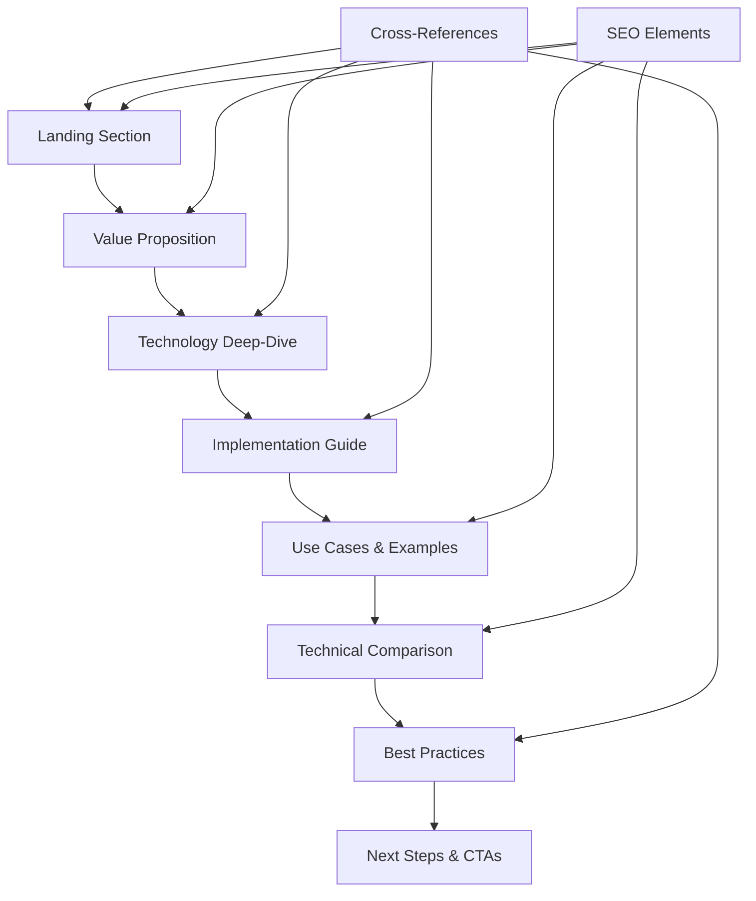
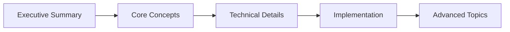

# Whitepaper Optimization Design Document

## Overview

This design document outlines the optimization strategy for the "KI-Telefonie der Zukunft" whitepaper (`resources/whitepaper-ki-telefonie-zukunft.mdx`) to enhance SEO performance, improve user engagement, and align with modern documentation best practices based on the existing Famulor documentation structure.

## Repository Type

**Full-Stack Documentation Platform** - Comprehensive German-language documentation for Famulor's AI telephony platform using Mintlify, with structured navigation, multilingual support, and integrated API references.

## Architecture

### Current State Analysis

The whitepaper exists as a standalone resource with basic structure but lacks:
- Advanced SEO optimization
- Progressive disclosure patterns
- Comprehensive internal linking
- Modern content formatting
- User journey optimization

### Target Architecture



## Content Optimization Strategy

### 1. SEO Enhancement Framework

#### Keyword Strategy
- **Primary Keywords**: "KI-Telefonie", "Voice AI", "Conversational AI", "Famulor"
- **Secondary Keywords**: "Large Language Models", "Text-to-Speech", "Kundenerlebnis", "AI-Assistenten"
- **Long-tail Keywords**: "KI-Telefonie der Zukunft", "Voice AI Implementation", "Generative Sprachmodelle"

#### Content Structure for SEO
- Semantic HTML structure with proper heading hierarchy
- Meta descriptions and title optimization
- Internal linking strategy with anchor text variation
- Content length optimization (target: 11-18KB as per memory guidelines)

### 2. Progressive Disclosure Implementation

#### Information Hierarchy


#### Expandable Sections
- Collapsible technical deep-dives
- Optional advanced configuration examples
- Supplementary use case scenarios

### 3. Modern Content Formatting

#### Interactive Elements
- **CardGroup components** for related topics
- **Tabs** for different implementation approaches
- **Accordions** for FAQ sections
- **Code blocks** with syntax highlighting
- **Mermaid diagrams** for process flows

#### Visual Enhancement
- Hero section with compelling value proposition
- Progress indicators for multi-step processes
- Visual comparison tables
- Interactive decision trees

### 4. Internal Linking Strategy

#### Hub Page Structure
Create comprehensive cross-references to:
- `/ai-assistants/what-is-ai-assistant` - Core concept definitions
- `/ai-assistants/system-prompt` - Implementation details
- `/ai-assistants/custom-gpt` - Optimization tools
- `/conversation-design/prompt-basics` - Design principles
- `/sales/gespraechsfuehrung-und-einwandbehandlung` - Practical applications

#### Related Topics Sections
Implement "Related Topics" CardGroups throughout:
- After technology explanations → link to implementation guides
- After use cases → link to best practices
- After comparisons → link to getting started guides

## Content Structure Redesign

### 1. Enhanced Landing Section
```markdown
<Card>
  <CardHeader>
    <Title>Die Zukunft der KI-Telefonie ist da</Title>
    <Subtitle>Revolutionäre Conversational AI transformiert Kundeninteraktionen</Subtitle>
    <Badge>Powered by Large Language Models</Badge>
  </CardHeader>
</Card>

<CardGroup cols={3}>
  <Card title="🚀 Sofort starten" href="/getting-started/core-concepts">
    Erstelle deinen ersten AI-Assistenten in 5 Minuten
  </Card>
  <Card title="🎯 Live Demo" href="https://www.famulor.io">
    Erlebe Famulor's Voice AI in Aktion
  </Card>
  <Card title="🧠 Custom GPT" href="/ai-assistants/custom-gpt">
    Optimiere Prompts mit unserem AI-Tool
  </Card>
</CardGroup>
```

### 2. Technology Comparison Table
| Feature | Intent-basierte Systeme | Famulor Conversational AI |
|---------|------------------------|----------------------------|
| Flexibilität | ❌ Begrenzt auf vorprogrammierte Pfade | ✅ Adaptive Antworten basierend auf Kontext |
| Natürlichkeit | ❌ Roboterhaft, vorhersagbar | ✅ Menschenähnliche Gespräche |
| Skalierbarkeit | ❌ Manuelle Erweiterung für jeden Fall | ✅ Automatische Anpassung an neue Szenarien |
| Implementierung | ⚠️ Komplexe Dialogbaum-Programmierung | ✅ Einfache Prompt-Konfiguration |

### 3. Interactive Decision Tree

```mermaid
graph TD
    A[Ihr Anwendungsfall] --> B{Kundensupport?}
    A --> C{Verkauf & Lead-Gen?}
    A --> D{Terminplanung?}
    
    B -->|Ja| E[First-Level Support Guide]
    C -->|Ja| F[Sales Best Practices]
    D -->|Ja| G[Appointment Booking Setup]
    
    E --> H[/ai-assistants/example-prompts/first-level-support]
    F --> I[/sales/gespraechsfuehrung-und-einwandbehandlung]
    G --> J[/ai-assistants/example-prompts/appointment-booking]
```

### 4. Implementation Roadmap

<Steps>
  <Step title="Strategische Planung">
    Definiere Anwendungsfälle und KPIs
    - [Custom GPT für Prompt-Optimierung](/ai-assistants/custom-gpt)
    - [Best Practices Dokumentation](/ai-assistants/assistant-best-practices)
  </Step>
  
  <Step title="Technische Implementierung">
    Setup und Konfiguration deines AI-Assistenten
    - [Ersten Assistenten erstellen](/ai-assistants/creating-and-editing)
    - [System Prompts optimieren](/ai-assistants/system-prompt)
  </Step>
  
  <Step title="Testing & Optimierung">
    Performance-Monitoring und Verbesserung
    - [Testing-Strategien](/ai-assistants/testing)
    - [Conversation Design](/conversation-design/prompt-basics)
  </Step>
</Steps>

## User Journey Optimization

### 1. Multiple Entry Points

#### New User Journey
1. **Landing** → Value Proposition & Demo CTA
2. **Education** → Technology explanation with interactive elements
3. **Conviction** → Comparison tables and use cases
4. **Action** → Quick start guide and setup

#### Technical User Journey
1. **Deep Dive** → LLM architecture and implementation details
2. **Configuration** → Advanced prompt engineering techniques
3. **Integration** → API references and automation flows
4. **Optimization** → Performance tuning and best practices

#### Business User Journey
1. **ROI Focus** → Business value and case studies
2. **Use Cases** → Industry-specific applications
3. **Implementation** → Step-by-step deployment guide
4. **Success Metrics** → KPI tracking and reporting

### 2. Cross-Navigation Strategy

#### Related Documentation Links
- After technology sections → Implementation guides
- After use cases → Specific prompt examples
- After comparisons → Getting started tutorials
- After implementation → Advanced configuration

## Testing Strategy

### 1. Content Performance Metrics
- **Reading Time**: Target 8-12 minutes for complete document
- **Engagement**: Track section completion rates
- **Conversion**: Monitor CTA click-through rates
- **SEO**: Search ranking improvements for target keywords

### 2. User Feedback Integration
- **Section-specific feedback** collection
- **Difficulty ratings** for technical content
- **Missing information** identification
- **Cross-reference effectiveness** tracking

### 3. A/B Testing Elements
- **Hero section** messaging and CTAs
- **Content ordering** and progressive disclosure
- **Visual elements** placement and styling
- **Cross-linking** strategies and anchor text

## Technical Implementation Details

### 1. Mermaid Diagram Integration
- Process flows for AI conversation handling
- Decision trees for implementation choices
- Architecture diagrams for system overview
- Comparison charts for technology evaluation

### 2. Interactive Components
- **Expandable sections** for optional technical details
- **Tabbed content** for different user types
- **Progressive disclosure** for complex topics
- **Cross-reference cards** for related topics

### 3. SEO Technical Implementation
- **Structured data** markup for rich snippets
- **Internal linking** with descriptive anchor text
- **Meta tag optimization** for social sharing
- **Content clustering** around topic authority

## Next Steps Implementation Plan

### Phase 1: Content Restructuring (Week 1)
1. Implement new content hierarchy
2. Add interactive elements and visual components
3. Create comprehensive cross-reference network
4. Optimize for primary and secondary keywords

### Phase 2: User Experience Enhancement (Week 2)
1. Implement progressive disclosure patterns
2. Add decision trees and interactive elements
3. Create user journey-specific entry points
4. Integrate feedback collection mechanisms

### Phase 3: SEO & Performance Optimization (Week 3)
1. Technical SEO implementation
2. Content length and keyword density optimization
3. Internal linking strategy deployment
4. Performance monitoring setup

### Phase 4: Testing & Iteration (Week 4)
1. A/B testing implementation
2. User feedback analysis
3. Performance metrics evaluation
4. Continuous improvement planning