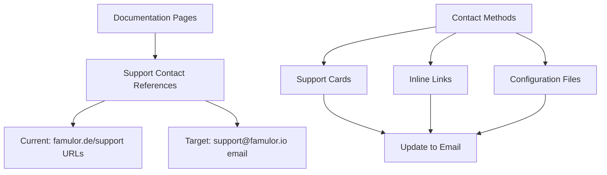

# Email Standardization Design - Famulor Documentation

## Overview

This design document outlines the standardization of email addresses across the Famulor documentation project. The task involves updating all email references to use the standardized support email "support@famulor.io" instead of other email addresses or support URLs.

## Project Analysis

### Repository Type
The project is a **Documentation Site** built with Mintlify framework, containing German-language technical documentation for the Famulor AI phone assistant platform.

### Current State
The documentation currently uses various support contact methods:
- Support URLs pointing to `https://famulor.de/support` 
- Support links in multiple documentation pages
- No direct email addresses found in current scan

## Architecture

### Documentation Structure
```
Famulor-docs-de/
├── ai-assistants/              # AI assistant documentation
├── automation-platform/       # Automation platform docs
├── api-reference/             # API documentation
├── mint.json                  # Mintlify configuration
└── Various .mdx files         # Content pages
```

### Email Contact Architecture



## Email Standardization Strategy

### Contact Reference Patterns Identified

1. **Support Cards in Documentation**
   - Current: `href="https://famulor.de/support"`
   - Target: `href="mailto:support@famulor.io"`

2. **Inline Support Links**
   - Current: `[https://www.famulor.de/support](https://www.famulor.de/support)`
   - Target: `[support@famulor.io](mailto:support@famulor.io)`

3. **Configuration Files**
   - Current: `"url": "https://famulor.de/support"` in mint.json
   - Target: Update to email contact method

### Files Requiring Updates

| File Path | Update Type | Current Reference |
|-----------|-------------|-------------------|
| `/mint.json` | topbarLinks support URL | `https://famulor.de/support` |
| `/ai-assistants/assistant-best-practices.mdx` | Support link | `https://www.famulor.de/support` |
| `/ai-assistants/example-prompts/*.mdx` | Support cards | Multiple `https://famulor.de/support` |
| `/ai-assistants/web-widget.mdx` | Support card | `https://famulor.de/support` |

### Update Implementation Pattern

```markdown
<!-- Before -->
<Card title="Support kontaktieren" icon="headphones" color="blue" href="https://famulor.de/support">
  Benötigen Sie Hilfe? Kontaktieren Sie unser Support-Team.
</Card>

<!-- After -->
<Card title="Support kontaktieren" icon="headphones" color="blue" href="mailto:support@famulor.io">
  Benötigen Sie Hilfe? Kontaktieren Sie unser Support-Team unter support@famulor.io.
</Card>
```

## Implementation Approach

### Phase 1: Configuration Updates
- Update mint.json topbar support link
- Change from URL to email contact method

### Phase 2: Documentation Content Updates  
- Update all support card components
- Update inline support links
- Ensure consistent email format: `support@famulor.io`

### Phase 3: Content Consistency
- Review all "Hilfe benötigt?" sections
- Standardize support contact language
- Ensure email links use `mailto:` protocol

## Data Model Updates

### Contact Information Schema
```yaml
supportContact:
  email: "support@famulor.io"
  displayText: "support@famulor.io"
  linkProtocol: "mailto:"
  fullLink: "mailto:support@famulor.io"
```

### Link Format Standards
- **Email Links**: `[support@famulor.io](mailto:support@famulor.io)`
- **Card Components**: `href="mailto:support@famulor.io"`
- **Display Text**: Include email in user-visible text

## Testing Strategy

### Validation Checks
1. **Link Functionality**: All mailto links open email client correctly
2. **Content Consistency**: All support references use same email
3. **Documentation Build**: Mintlify build succeeds after changes
4. **Mobile Compatibility**: Email links work on mobile devices

### Testing Approach
```bash
# Build verification
mintlify dev

# Link validation  
grep -r "support@famulor.io" .
grep -r "famulor.de/support" .  # Should return no results
```

## Migration Benefits

### User Experience Improvements
- **Direct Contact**: Users can contact support directly via email
- **Offline Access**: Email works without internet browser
- **Mobile Friendly**: Better mobile device integration
- **Consistent Experience**: Unified contact method across all documentation

### Maintenance Benefits
- **Centralized Contact**: Single email address to maintain
- **Reduced Dependencies**: No external support page dependencies
- **Simplified Updates**: Easier to update single email vs multiple URLs

## Risk Considerations

### Potential Issues
1. **Email Client Dependencies**: Users need configured email client
2. **Spam Filtering**: Email might be filtered by corporate firewalls
3. **Response Expectations**: Direct email implies faster response times

### Mitigation Strategies
- Provide alternative contact methods if needed
- Clear response time expectations in email text
- Maintain fallback support options