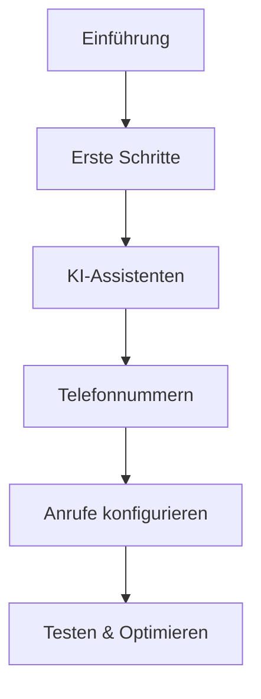
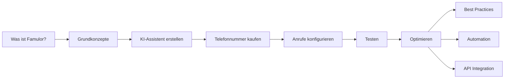

# Documentation Interlinking Optimization Design
## Domain: https://docs.famulor.de/

## Overview

This design outlines a comprehensive strategy to improve internal linking (Intereverlinkung) throughout the Famulor German documentation. The goal is to create a well-connected knowledge base that guides users through their journey while ensuring all links are accurate and follow consistent patterns.

## Current State Analysis

### Repository Structure
The documentation is built using Mintlify framework with the following main sections:
- **Einführung (Introduction)**: 3 pages
- **Erste Schritte (Getting Started)**: 2 pages  
- **KI-Assistenten Übersicht (AI Assistants Overview)**: 14 pages
- **Telefonnummern (Phone Numbers)**: 5 pages
- **Ein-/Ausgehende Anrufe (Inbound/Outbound Calls)**: 7 pages
- **API Referenz (API Reference)**: 13 endpoints
- **Automatisierung (Automation)**: 12 pages
- **Vertrieb & Best Practices (Sales)**: 7 pages
- **Fehlerbehebung (Troubleshooting)**: 4 pages

### Current Linking Issues Identified
- **Minimal cross-referencing**: Most pages exist in isolation
- **Missing contextual links**: Users cannot easily navigate between related concepts
- **Inconsistent link patterns**: No standardized approach to internal linking
- **Poor user journey guidance**: No clear path progression through documentation

## Interlinking Strategy

### 1. Link Classification System

#### 1.1 Navigation Links (Primäre Navigation)


#### 1.2 Contextual Links (Kontextuelle Verweise)
- **Prerequisite Links**: "Bevor Sie beginnen, lesen Sie..."
- **Next Steps Links**: "Als nächstes..."
- **Related Concepts**: "Siehe auch..."
- **Deep Dive Links**: "Für weitere Details..."

#### 1.3 Quick Reference Links (Schnellreferenzen)
- **API endpoints** from concept pages
- **Troubleshooting** from feature pages
- **Best practices** from technical guides

### 2. Core Link Patterns

#### 2.1 User Journey Links
| From Section | To Section | Link Type | Example |
|-------------|------------|-----------|---------|
| Introduction | Getting Started | Next Step | "Bereit anzufangen? Siehe [Grundkonzepte](/getting-started/core-concepts)" |
| Core Concepts | AI Assistants | Deep Dive | "Erstellen Sie Ihren ersten [KI-Assistenten](/ai-assistants/creating-and-editing)" |
| AI Assistants | Phone Numbers | Prerequisite | "Sie benötigen eine [Telefonnummer](/phone-numbers/purchasing-and-managing)" |

#### 2.2 Cross-Reference Links
| Concept | Related Pages | Link Pattern |
|---------|---------------|--------------|
| Assistant Modes | Best Practices, Voice Selection | "Optimieren Sie mit [Best Practices](/ai-assistants/assistant-best-practices)" |
| Billing | Phone Numbers, Usage | "Verstehen Sie [Nutzungskosten](/pricing/usage-based)" |
| Troubleshooting | All feature pages | "Bei Problemen siehe [Fehlerbehebung](/troubleshooting/ai-behavior)" |

### 3. Page-Specific Link Enhancements

#### 3.1 Landing Pages (Übersichtsseiten)
Each section landing page should include:
- **Quick navigation cards** to sub-topics
- **Prerequisites** section with links
- **Related resources** section

#### 3.2 Tutorial Pages
- **Previous/Next** navigation
- **Prerequisites** clearly linked
- **Troubleshooting** links at the bottom

#### 3.3 Reference Pages
- **Concept explanations** linked
- **Usage examples** with links to tutorials
- **Related API endpoints** cross-referenced

### 4. Link Implementation Strategy

#### 4.1 Standard Link Patterns

```markdown
## Standard Inline Links
Siehe [Assistenten-Modi](/ai-assistants/assistant-modes) für Details.

## Card Group References
<CardGroup cols={2}>
<Card title="Nächste Schritte" icon="arrow-right" href="/getting-started/core-concepts">
Verstehen Sie die Grundlagen
</Card>
<Card title="Erweiterte Konfiguration" icon="gear" href="/ai-assistants/assistant-best-practices">
Optimieren Sie Ihre Einstellungen
</Card>
</CardGroup>

## Info Boxes with Links
<Info>
Für Preisdetails siehe [Kostenübersicht](/pricing/overview).
</Info>

## Step References
<Step title="Konfiguration">
Folgen Sie der [Telefonnummern-Anleitung](/phone-numbers/purchasing-and-managing).
</Step>
```

#### 4.2 Section Footer Navigation
Each page should end with related links:
```markdown
---

## Verwandte Themen

<CardGroup cols={3}>
<Card title="System Prompts" icon="pen" href="/ai-assistants/system-prompt">
Definieren Sie das Verhalten Ihres Assistenten
</Card>
<Card title="Stimmauswahl" icon="microphone" href="/ai-assistants/voice-selection">
Wählen Sie die perfekte Stimme
</Card>
<Card title="Testing" icon="flask" href="/ai-assistants/testing">
Testen Sie Ihren Assistenten
</Card>
</CardGroup>
```

### 5. Navigation Flow Optimization

#### 5.1 User Journey Flows



#### 5.2 Hub Pages Strategy
Create dedicated hub pages for complex topics:

**KI-Assistenten Hub** (`/ai-assistants/index`)
- Overview with links to all sub-topics
- Quick start guide with step-by-step links
- Advanced configuration matrix

**Anruf-Management Hub** (`/calls/index`)  
- Inbound vs Outbound comparison
- Configuration workflows
- Troubleshooting quick links

### 6. Link Validation Framework

#### 6.1 Link Categories for Review
- **Internal absolute links**: `/section/page` format
- **Relative links**: Between related pages
- **External links**: To app.famulor.de, www.famulor.de
- **API reference links**: From concept to API docs

#### 6.2 Link Consistency Rules
- Use **descriptive link text**: "Siehe Assistenten-Modi" not "hier klicken"
- **Consistent URL patterns**: `/section/topic` format
- **Proper anchor links**: `#section-name` for page sections
- **External link indicators**: Clear marking for external URLs

### 7. Content Enhancement with Links

#### 7.1 Contextual Cross-References
Add inline references where concepts connect:
```markdown
Der **Dualplex-Modus** (siehe [Assistenten-Modi](/ai-assistants/assistant-modes)) 
kombiniert die Geschwindigkeit von Speech-to-Speech mit hochwertigen 
[ElevenLabs-Stimmen](/ai-assistants/voice-selection).
```

#### 7.2 Progressive Disclosure
Link to deeper information without overwhelming beginners:
```markdown
## Grundlagen
Einfache Erklärung hier...

<Tip>
Für erweiterte Konfiguration siehe [Best Practices](/ai-assistants/assistant-best-practices).
</Tip>
```

### 8. Implementation Roadmap

#### Phase 1: Core Journey Links
1. **Introduction → Getting Started** pathway
2. **Getting Started → First Assistant** workflow  
3. **Assistant Creation → Phone Numbers** connection
4. **Testing → Optimization** flow

#### Phase 2: Cross-Reference Network
1. **Best Practices** cross-links throughout AI Assistants
2. **Troubleshooting** links from all feature pages
3. **API Reference** connections from concept pages
4. **Pricing** links where costs are mentioned

#### Phase 3: Advanced Navigation
1. **Hub pages** for complex topics
2. **Related topics** footers on all pages
3. **Progressive disclosure** patterns
4. **Search-optimized** anchor links

### 9. Quality Assurance

#### 9.1 Link Testing Protocol
- **Functional testing**: All links work correctly
- **Path validation**: User journeys are complete
- **Consistency check**: Link patterns are uniform
- **Accessibility**: Links are properly labeled

#### 9.2 User Experience Validation
- **Task completion**: Users can complete common workflows
- **Information findability**: Related concepts are discoverable
- **Logical progression**: Learning path is intuitive
- **Exit points**: Clear next steps from every page

### 10. Link Maintenance

#### 10.1 Regular Review Process
- **Monthly link audits**: Check for broken links
- **Content updates**: Ensure links remain relevant
- **User feedback**: Monitor support requests for navigation issues
- **Analytics review**: Track user navigation patterns

#### 10.2 Documentation Standards
- **Link guidelines**: Team standards for adding new links
- **Review checklist**: Pre-publish link validation
- **Update procedures**: When restructuring content
- **Migration planning**: For major site changes

## Expected Outcomes

### User Experience Improvements
- **Reduced support tickets**: Better self-service navigation
- **Increased engagement**: Users explore more documentation  
- **Faster task completion**: Clear paths to solutions
- **Better retention**: Users can find information when needed

### Content Discoverability
- **Related content exposure**: Users discover relevant features
- **Complete workflow guidance**: End-to-end user journeys
- **Reduced dead ends**: Always clear next steps
- **Improved search experience**: Better content interconnection

### Maintenance Benefits  
- **Structured approach**: Consistent link patterns
- **Quality assurance**: Regular validation processes
- **Team collaboration**: Clear guidelines for contributors
- **Scalable growth**: Framework for adding new content

This comprehensive interlinking strategy will transform the Famulor documentation from a collection of isolated pages into a cohesive, navigable knowledge base that guides users through their entire journey with the platform.