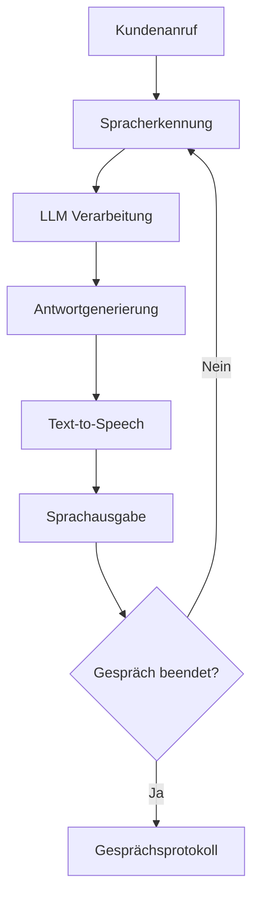
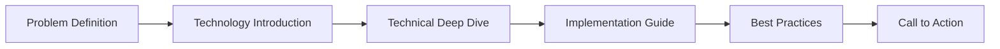

# Whitepaper Integration Design: "KI-Telefonie der Zukunft: Famulor"

## Overview

This design document outlines the integration of a comprehensive German-language whitepaper titled "KI-Telefonie der Zukunft: Wie die Gesprächs-KI von Famulor Kundenanrufe revolutioniert" into the existing Famulor documentation platform. The whitepaper serves as an educational and thought leadership piece that explains the technical architecture and advantages of Famulor's conversational AI technology over traditional intent-based systems.

## Technology Stack & Dependencies

- **Documentation Framework**: Mintlify (React-based static site generator)
- **Content Format**: Markdown (.mdx)
- **Localization**: German (de) as primary language
- **Configuration**: mint.json for navigation and site structure
- **Visual Elements**: Mermaid diagrams for technical illustrations

## Content Architecture

### Target Content Structure
The whitepaper will be positioned as a comprehensive technical resource within the documentation hierarchy. Based on the existing navigation structure, it will be placed in a dedicated "Ressourcen" (Resources) section.

### Content Organization

#### 1. Document Positioning
- **Location**: `/resources/whitepaper-ki-telefonie-zukunft.mdx`
- **Navigation Category**: New "Whitepapers & Ressourcen" section
- **Content Type**: Educational/Technical thought leadership

#### 2. Content Sections Structure

```markdown
# KI-Telefonie der Zukunft: Wie die Gesprächs-KI von Famulor Kundenanrufe revolutioniert

## Einführung
## Wie Famulor funktioniert
## Von Intent-basierten Systemen zur Conversational AI
## Large Language Models (LLMs) im Detail
## Voice AI: Generative Sprache mit Transformer-basierten Modellen
## Warum 100% Abdeckung statistisch unwahrscheinlich ist
## Famulor Voice Agent Training: Schritt-für-Schritt-Anleitung
```

#### 3. Technical Diagram Integration



## Component Architecture

### Page Structure Components

#### 1. Header Section
- **Title**: "KI-Telefonie der Zukunft"
- **Subtitle**: Technology explanation and value proposition
- **Author**: Attribution to platform expertise
- **CTA Buttons**: Demo request and agent creation links

#### 2. Content Sections
- **Educational Content**: Technical explanations with accessible language
- **Visual Elements**: Flowcharts and system architecture diagrams
- **Interactive Elements**: Call-to-action buttons for deeper engagement
- **Cross-References**: Links to relevant documentation sections

#### 3. Navigation Integration
- **Breadcrumb**: Home > Ressourcen > Whitepapers > KI-Telefonie der Zukunft
- **Related Content**: Links to AI Assistant documentation
- **Next Steps**: Guide users to getting started or demo sections

### Document Flow Architecture

#### Information Architecture Flow


## Data Flow Between Layers

### Content Relationship Model

#### 1. Content Hierarchy
```
Whitepaper (Educational)
├── Links to → AI Assistants Documentation
├── References → System Architecture
├── Connects to → Getting Started Guide
└── Leads to → Demo/Contact Forms
```

#### 2. User Journey Integration
- **Discovery**: SEO-optimized whitepaper serves as entry point
- **Education**: Comprehensive technical explanation builds trust
- **Engagement**: Clear CTAs guide to platform trial
- **Conversion**: Seamless transition to documentation and setup

### Cross-Platform Integration

#### Internal Linking Strategy
- **Bidirectional Links**: Whitepaper references core documentation
- **Topic Clustering**: Related content suggestions
- **Progressive Disclosure**: From whitepaper to detailed technical docs

#### SEO and Content Strategy
- **German Keywords**: "KI-Telefonie", "Conversational AI", "LLM-basierte Systeme"
- **Long-form Content**: 11-18KB target for comprehensive coverage
- **Semantic Structure**: H1-H6 hierarchy for search optimization

## Technical Implementation Details

### File Structure Integration

#### 1. New Navigation Section
```json
{
  "group": "Ressourcen & Whitepapers",
  "icon": "graduation-cap",
  "pages": [
    "resources/whitepaper-ki-telefonie-zukunft",
    "resources/case-studies",
    "resources/technical-guides"
  ]
}
```

#### 2. Content Template Structure
```markdown
---
title: "KI-Telefonie der Zukunft"
description: "Wie die Gesprächs-KI von Famulor Kundenanrufe revolutioniert"
icon: "brain-circuit"
---

<Card>
  <CardHeader>
    <Title>KI-Telefonie der Zukunft</Title>
    <Subtitle>Revolutionäre Gesprächs-KI Technologie</Subtitle>
  </CardHeader>
</Card>

<ButtonGroup>
  <Button href="https://app.famulor.de/demo">Kostenlose Demo anfordern ⚡</Button>
  <Button href="/getting-started/core-concepts">Agent erstellen</Button>
</ButtonGroup>
```

### Visual Element Integration

#### 1. Mermaid Diagrams
- **System Architecture**: End-to-end conversation flow
- **Technology Comparison**: Intent-based vs. LLM-based systems
- **Training Process**: Step-by-step agent optimization

#### 2. Component Integration
- **CardGroup**: For feature comparisons
- **Accordion**: For FAQ sections
- **CodeBlock**: For technical examples (system prompts)

## Content Migration Strategy

### Brand Transformation Process

#### 1. Terminology Replacement
- `BEK-Agent` → `Famulor`
- `BEK Voice Agent` → `Famulor AI-Assistent`
- `BEK-Agent Conversational AI` → `Famulor Gesprächs-KI`

#### 2. Content Adaptation
- **Platform-Specific Examples**: Reference Famulor dashboard and features
- **Brand Voice**: Align with existing documentation tone
- **Technical Accuracy**: Ensure descriptions match Famulor's actual capabilities

### Quality Assurance

#### 1. Content Validation
- **Technical Accuracy**: Verify all technical claims align with platform capabilities
- **Brand Consistency**: Ensure messaging matches existing documentation
- **Link Integrity**: Validate all internal and external references

#### 2. User Experience Testing
- **Navigation Flow**: Test whitepaper discovery and reading experience
- **Conversion Path**: Validate CTA effectiveness and user journey
- **Mobile Optimization**: Ensure responsive design compliance

## Integration with Existing Documentation

### Content Relationships

#### 1. Reference Architecture
- **AI Assistants Section**: Deep technical links to assistant creation
- **Getting Started**: Simplified onboarding after whitepaper reading
- **API Documentation**: Technical implementation details for developers

#### 2. Cross-Linking Strategy
```markdown
## Related Documentation
<CardGroup cols={2}>
  <Card title="AI-Assistenten erstellen" href="/ai-assistants/creating-and-editing">
    Praktische Anleitung zur Erstellung Ihres ersten Famulor AI-Assistenten
  </Card>
  <Card title="System Prompts" href="/ai-assistants/system-prompt">
    Detaillierte Anleitung zur Optimierung von Gesprächs-KI
  </Card>
</CardGroup>
```

## Performance Considerations

### Content Optimization

#### 1. Loading Performance
- **Image Optimization**: Compress diagram images for fast loading
- **Lazy Loading**: Implement for non-critical visual elements
- **Content Chunking**: Break long sections into digestible segments

#### 2. SEO Optimization
- **Semantic HTML**: Proper heading hierarchy for search engines
- **Meta Descriptions**: German-language SEO optimization
- **Internal Linking**: Strategic keyword-based link structure

### Scalability Considerations

#### 1. Future Whitepaper Integration
- **Template System**: Reusable components for future whitepapers
- **Content Management**: Structured approach for additional resources
- **Analytics Integration**: Track engagement and conversion metrics

#### 2. Multilingual Expansion
- **English Translation**: Prepare structure for potential English version
- **Localization Framework**: Maintain consistency across languages
- **Content Synchronization**: Version control for multilingual content

## Testing Strategy

### Content Testing Approach

#### 1. Technical Validation
- **Link Testing**: Automated checking of all internal/external links
- **Syntax Validation**: Markdown and Mermaid diagram rendering
- **Cross-Browser Testing**: Ensure compatibility across browsers

#### 2. User Experience Testing
- **Reading Flow**: Validate content progression and comprehension
- **Conversion Testing**: Measure CTA effectiveness
- **Mobile Experience**: Test responsive design and readability

### Performance Testing

#### 1. Load Testing
- **Page Speed**: Measure loading times with all content and diagrams
- **SEO Validation**: Test search engine discoverability
- **Analytics Setup**: Implement tracking for content engagement

#### 2. Integration Testing
- **Navigation Flow**: Test integration with existing documentation structure
- **Search Functionality**: Validate whitepaper discoverability via site search
- **Mobile Navigation**: Ensure seamless mobile user experience