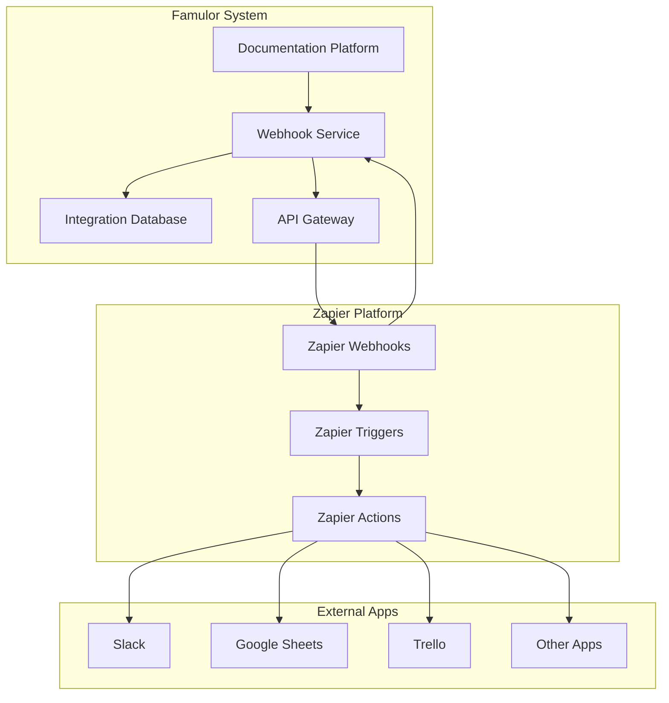
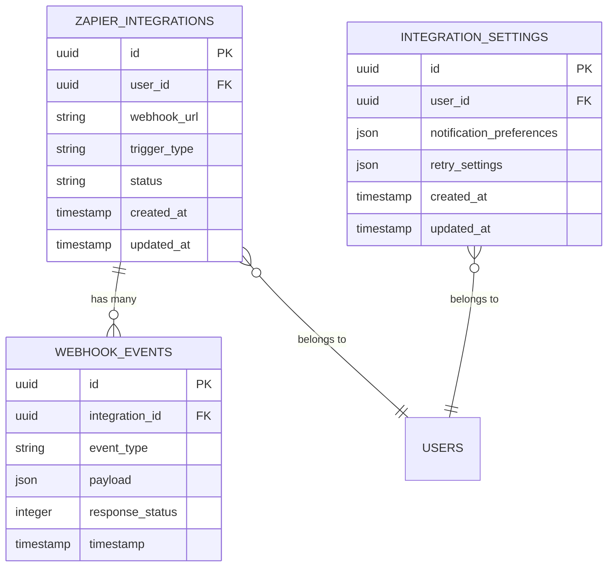
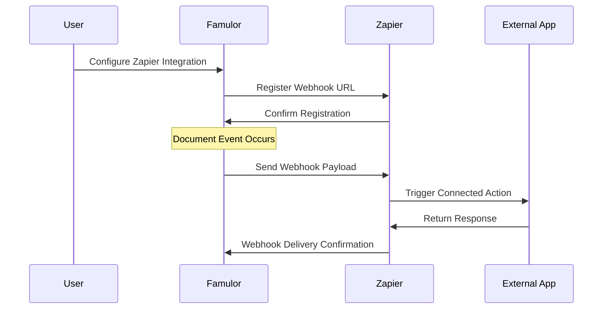
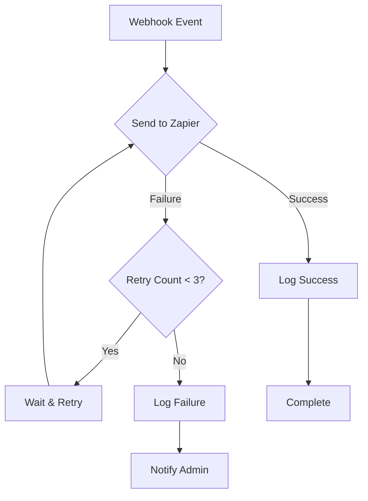
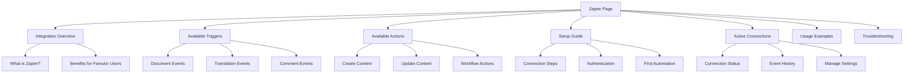

# Zapier Integration Design

## Overview

This design document outlines the implementation of Zapier integration for the Famulor documentation platform. The integration will enable users to connect Famulor with hundreds of other applications through Zapier's automation platform, allowing for automated workflows and data synchronization.

## Architecture

The Zapier integration follows a webhook-based architecture that enables real-time communication between Famulor and external applications through Zapier's platform.



## Integration Database

The Integration Database serves as the central storage system for managing integration configurations, webhook endpoints, and event tracking for the Zapier integration.

### Database Schema

| Table | Purpose | Key Fields |
|-------|---------|------------|
| `zapier_integrations` | Store active Zapier connections | `id`, `user_id`, `webhook_url`, `trigger_type`, `status`, `created_at` |
| `webhook_events` | Log all webhook events | `id`, `integration_id`, `event_type`, `payload`, `response_status`, `timestamp` |
| `integration_settings` | Store user preferences | `id`, `user_id`, `notification_preferences`, `retry_settings` |

### Data Models



## Zapier Integration

The Zapier integration enables seamless automation between Famulor and external applications through a comprehensive webhook-based system.

**Integration URL**: [https://zapier.com/developer/public-invite/230037/92504c8a528059feedf28b7998c7a212/](https://zapier.com/developer/public-invite/230037/92504c8a528059feedf28b7998c7a212/)

### Trigger Events

The integration supports the following trigger events that can initiate Zapier workflows:

| Trigger | Description | Payload Fields |
|---------|-------------|----------------|
| `document_created` | New documentation page created | `title`, `content`, `author`, `url`, `timestamp` |
| `document_updated` | Documentation page modified | `title`, `content`, `author`, `url`, `changes`, `timestamp` |
| `document_published` | Documentation page published | `title`, `url`, `author`, `publish_date` |
| `comment_added` | New comment on documentation | `comment_text`, `author`, `document_url`, `timestamp` |
| `translation_completed` | Translation finished | `language`, `document_title`, `translator`, `completion_date` |

### Action Events

The integration also supports actions that can be triggered from external applications:

| Action | Description | Required Fields |
|--------|-------------|-----------------|
| `create_document` | Create new documentation page | `title`, `content`, `author` |
| `update_document` | Modify existing documentation | `document_id`, `content`, `author` |
| `add_comment` | Add comment to documentation | `document_id`, `comment_text`, `author` |
| `trigger_translation` | Initiate translation workflow | `document_id`, `target_language` |

### Webhook Configuration



### Authentication & Security

The Zapier integration implements the following security measures:

- **API Key Authentication**: Each integration uses a unique API key for authentication
- **Webhook Signature Verification**: All webhook payloads are signed and verified
- **Rate Limiting**: Prevents abuse with configurable rate limits
- **Payload Encryption**: Sensitive data is encrypted in transit

### Error Handling & Retry Logic



### Testing Strategy

The integration includes comprehensive testing approaches:

1. **Unit Tests**: Test individual webhook handlers and payload validation
2. **Integration Tests**: Test end-to-end workflows with Zapier sandbox
3. **Webhook Testing**: Verify webhook delivery and retry mechanisms
4. **Load Testing**: Ensure system handles high-volume webhook traffic

### Monitoring & Analytics

Key metrics tracked for the Zapier integration:

- Webhook delivery success rate
- Average response time
- Failed webhook attempts
- Most popular trigger/action combinations
- User adoption rates

### Configuration Management

Users can manage their Zapier integrations through:

- **Integration Dashboard**: Web interface for viewing active connections
- **Webhook Management**: Enable/disable specific triggers
- **Event History**: View recent webhook deliveries and responses
- **Error Logs**: Troubleshoot failed integrations

## Zapier Page

A dedicated Zapier page will be created in the Famulor documentation platform to provide users with comprehensive information and management capabilities for their Zapier integrations.

### Page Structure



### Page Components

| Component | Purpose | Features |
|-----------|---------|----------|
| **Hero Section** | Introduction to Zapier integration | Overview, benefits, connection button |
| **Quick Setup Card** | Fast integration setup | Step-by-step wizard, progress indicator |
| **Triggers Gallery** | Available trigger events | Visual cards, descriptions, examples |
| **Actions Gallery** | Available action events | Interactive demos, use cases |
| **Connection Manager** | Manage active integrations | Status indicators, enable/disable toggles |
| **Event Timeline** | Recent webhook activity | Real-time updates, success/failure states |
| **Template Library** | Pre-built automation templates | Popular workflows, one-click setup |
| **Troubleshooting Panel** | Help and diagnostics | Error logs, connection testing |

### User Interface Design

```mermaid
wireframe
    title Zapier Page Layout
    
    section Header
        "Zapier Integration" : title
        "Connect Famulor with 5000+ apps" : subtitle
        "[Connect to Zapier]" : button
    end
    
    section Quick Stats
        "Active Connections: 3" : stat
        "Events This Month: 156" : stat
        "Success Rate: 99.2%" : stat
    end
    
    section Main Content
        "Available Triggers" : tab
        "Available Actions" : tab
        "My Connections" : tab
        "Templates" : tab
    end
    
    section Sidebar
        "Setup Guide" : widget
        "Recent Activity" : widget
        "Support" : widget
    end
```

### Interactive Features

1. **Live Connection Testing**: Test webhook endpoints in real-time
2. **Automation Builder**: Visual workflow creation interface
3. **Event Simulator**: Preview how triggers work with sample data
4. **Template Marketplace**: Browse and install pre-built automations
5. **Performance Dashboard**: Analytics on integration usage and success rates

### Content Sections

#### Getting Started Guide
- What is Zapier and how it works with Famulor
- Step-by-step connection instructions
- First automation setup tutorial
- Common use cases and examples

#### Trigger Documentation
- Detailed explanation of each available trigger
- Payload structure and data fields
- Filtering options and conditions
- Rate limits and considerations

#### Action Documentation
- Available actions and their parameters
- Authentication requirements
- Error handling and retry logic
- Best practices and limitations

#### Template Gallery
- Popular automation templates
- Industry-specific workflows
- Custom template creation guide
- Community-shared automations

### Integration with Famulor Navigation

The Zapier page will be integrated into the main Famulor navigation structure:

```json
{
  "navigation": [
    {
      "group": "Integrations",
      "pages": [
        "integrations/overview",
        "integrations/api",
        "integrations/webhooks",
        "integrations/zapier"
      ]
    }
  ]
}
```

### Page URL Structure
- Main page: `/integrations/zapier`
- Setup guide: `/integrations/zapier/setup`
- Templates: `/integrations/zapier/templates`
- Documentation: `/integrations/zapier/docs`
- Management: `/integrations/zapier/manage`