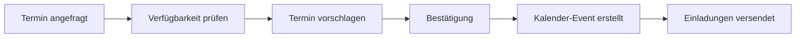

# Kalender & Terminplanungs-Integrationen

Optimieren Sie Ihre Terminplanung und verwandeln Sie jede Telefoninteraktion in perfekt orchestrierte Meetings und Termine. Famulor Automation verbindet Ihre KI-Telefonassistenten mit führenden Kalender-Systemen für nahtlose Scheduling-Automatisierung.

## Google Calendar Integration

### Überblick
Google Calendar ist die weltweit führende Kalender-Plattform mit leistungsstarken Collaboration- und Scheduling-Features.

### KI-Telefonassistent Anwendungsfälle

#### 📅 Intelligente Terminplanung
**Beschreibung**: Prüfen Sie Verfügbarkeit und buchen Sie Termine direkt während Telefongesprächen.

**Automatisierungs-Workflow**:

**Termintypen**:
- **Sales Demos**: Mit Produktpräsentation-Agenda
- **Beratungsgespräche**: Mit Vorbereitung-Checklisten
- **Support-Sessions**: Mit technischen Anforderungen
- **Follow-up Meetings**: Mit vorherigen Gesprächsnotizen

#### ⏰ Pufferzeit-Management
**Beschreibung**: Fügen Sie automatisch Vorbereitungszeit vor wichtigen Kundenterminen hinzu.

**Pufferzeit-Strategien**:
- 15 Min vor Sales Calls für Kundenrecherche
- 30 Min vor Demos für Setup und Testing
- 10 Min vor Support Calls für Case Review
- 5 Min nach Terminen für Notizen-Dokumentation

#### 🌍 Multi-Timezone-Koordination
**Beschreibung**: Handhaben Sie internationale Kundentermine mit automatischer Zeitzonenkonvertierung.

**Timezone-Features**:
- Automatische Erkennung der Kundenzone
- Optimale Terminzeit-Vorschläge
- Mehrfache Zeitzone-Anzeige in Einladungen
- Erinnerungen in lokaler Zeit

---

## Calendly Integration

### Überblick
Calendly spezialisiert sich auf automatisierte Terminplanung mit intelligenten Booking-Workflows.

### KI-Telefonassistent Anwendungsfälle

#### 🔗 Sofortige Buchungslinks
**Beschreibung**: Teilen Sie Buchungslinks per SMS sofort nach Anrufen für einfache Terminplanung.

**Booking-Link-Strategien**:
- **Demo-Slots**: 45-60 Min Slots für Produktdemos
- **Consultation-Calls**: 30 Min für Beratungsgespräche
- **Quick Check-ins**: 15 Min für Status-Updates
- **Deep Dives**: 90 Min für technische Diskussionen

#### 🎯 Service-spezifische Terminplanung
**Beschreibung**: Routen Sie verschiedene Termintypen zu entsprechenden Kalendern basierend auf Anrufinhalt.

**Routing-Logic**:
- **Sales Calls** → Sales Team Kalender
- **Technical Support** → Support Engineer Kalender
- **Billing Issues** → Finance Team Kalender
- **Product Feedback** → Product Manager Kalender

#### ⚡ Follow-up-Automatisierung
**Beschreibung**: Planen Sie automatisch Follow-up-Anrufe basierend auf Gesprächsergebnissen.

**Follow-up-Szenarien**:
- Interesse gezeigt → Demo in 2-3 Tagen
- Demo durchgeführt → Decision Call in 1 Woche
- Proposal präsentiert → Follow-up in 3 Tagen
- Objections → Objection-Handling Call nächste Woche

---

## Microsoft Outlook Calendar Integration

### Überblick
Microsoft Outlook Calendar ist der Standard für Enterprise-Kalender-Management mit tiefer Office 365-Integration.

### KI-Telefonassistent Anwendungsfälle

#### 🏢 Enterprise Meeting-Koordination
**Beschreibung**: Planen Sie komplexe Multi-Party-Meetings, die während Verkaufsgesprächen diskutiert wurden.

**Meeting-Orchestration**:
- **Stakeholder-Identifikation**: Basierend auf Gesprächsinhalten
- **Verfügbarkeitsprüfung**: Für alle relevanten Teilnehmer
- **Resource-Booking**: Konferenzräume und Equipment
- **Agenda-Erstellung**: Aus Anrufnotizen generiert

#### 📚 Resource-Allocation
**Beschreibung**: Buchen Sie Konferenzräume und Equipment, wenn Kunden On-site-Besuche planen.

**Resource-Management**:
- Raumgröße basierend auf Teilnehmerzahl
- AV-Equipment für Präsentationen
- Catering für längere Sessions
- Parking-Reservierungen für Besucher

#### 🔔 Erinnerungs-Automatisierung
**Beschreibung**: Setzen Sie automatische Erinnerungen für wichtige Kundenverpflichtungen.

**Erinnerungs-Typen**:
- Contract Deadlines aus Verhandlungen
- Follow-up Commitments
- Product Launch Dates
- Renewal Termine

---

## Cal.com Integration

### Überblick
Cal.com ist eine Open-Source-Terminplanungsplattform mit hoher Anpassbarkeit.

### KI-Telefonassistent Anwendungsfälle

#### 🔧 Custom Booking Workflows
**Beschreibung**: Erstellen Sie angepasste Buchungsabläufe für spezifische Kundentypen.

#### 🔗 API-First Scheduling
**Beschreibung**: Nutzen Sie erweiterte API-Features für komplexe Terminplanungs-Logik.

#### 🎨 White-Label Booking
**Beschreibung**: Bieten Sie Kunden Terminbuchung mit Ihrem Branding.

---

## Acuity Scheduling Integration

### KI-Telefonassistent Anwendungsfälle

#### 💳 Payment-Integration
**Beschreibung**: Sammeln Sie Zahlungen für kostenpflichtige Beratungen während der Buchung.

#### 📋 Intake Forms
**Beschreibung**: Sammeln Sie vorbereitende Informationen vor Terminen.

---

## When2meet Integration

### KI-Telefonassistent Anwendungsfälle

#### 👥 Group Meeting Coordination
**Beschreibung**: Koordinieren Sie Gruppenmeeting basierend auf Anrufdiskussionen.

---

## SimplyBook.me Integration

### KI-Telefonassistent Anwendungsfälle

#### 🏪 Service-Business Booking
**Beschreibung**: Buchen Sie spezifische Services basierend auf Kundenanfragen.

---

## Kalender-Integration Best Practices

### 🎯 Terminoptimierung
- **Pufferzeiten**: Planen Sie Vorbereitungs- und Nachbereitungszeit
- **Meeting-Hygiene**: Vermeiden Sie Back-to-Back Termine
- **Prime Time**: Reservieren Sie beste Zeiten für wichtige Kunden
- **Break Scheduling**: Berücksichtigen Sie Team-Pausen

### 📊 Verfügbarkeits-Management
- **Real-time Sync**: Synchronisieren Sie Kalender in Echtzeit
- **Multi-Calendar**: Berücksichtigen Sie persönliche und Business-Kalender
- **Conflict Resolution**: Automatische Konfliktauflösung
- **Backup Options**: Alternative Terminvorschläge

### 🔄 Automatisierungs-Workflows
- **Pre-Meeting**: Automatische Vorbereitung und Erinnerungen
- **During Meeting**: Meeting-Notizen und Action Items
- **Post-Meeting**: Follow-up und Dokumentation
- **Rescheduling**: Intelligente Umplanung bei Konflikten

### 📱 Mobile Integration
- **App Notifications**: Push-Benachrichtigungen für wichtige Termine
- **Location Services**: GPS-basierte Ankunftserinnerungen
- **Quick Actions**: Schnelle Terminaktionen vom Handy
- **Offline Access**: Funktionalität ohne Internetverbindung

## Erweiterte Scheduling-Szenarien

### Multi-Location Coordination
- **Office Locations**: Berücksichtigung verschiedener Bürostandorte
- **Remote Options**: Automatische Video-Call-Links
- **Travel Time**: Berechnung von Reisezeiten zwischen Terminen
- **Time Zone Mastery**: Komplexe internationale Terminplanung

### Industry-Specific Scheduling
- **Healthcare**: Patiententermine mit Compliance-Anforderungen
- **Legal**: Mandanten-Termine mit Confidentiality
- **Consulting**: Projektbasierte Terminblöcke
- **Sales**: Pipeline-basierte Meeting-Strategien

### AI-Enhanced Scheduling
- **Predictive Booking**: KI-Vorhersage optimaler Terminzeiten
- **Dynamic Pricing**: Zeitbasierte Terminpreisgestaltung
- **Behavior Analysis**: Kundenverhalten-basierte Optimierung
- **Smart Rescheduling**: Intelligente Umplanung bei Änderungen

## Erste Schritte

<Steps>
  <Step title="Kalender-System wählen">
    Wählen Sie Ihr primäres Kalender-System für Integration
  </Step>
  <Step title="API-Setup">
    Konfigurieren Sie API-Zugang und Berechtigungen
  </Step>
  <Step title="Booking-Rules">
    Definieren Sie Regeln für automatische Terminbuchung
  </Step>
  <Step title="Workflows erstellen">
    Bauen Sie Scheduling-Workflows im Visual Builder
  </Step>
  <Step title="Team-Synchronisation">
    Synchronisieren Sie alle relevanten Team-Kalender
  </Step>
</Steps>

## Nächste Schritte

<CardGroup cols={2}>
  <Card title="CRM-Integration" icon="users" href="/automation-platform/integrations/crm">
    Verbinden Sie Termine mit Kundendaten
  </Card>
  <Card title="E-Mail Marketing" icon="envelope" href="/automation-platform/integrations/email-marketing">
    Automatische Terminbestätigungen und Erinnerungen
  </Card>
  <Card title="Kommunikation" icon="comments" href="/automation-platform/integrations/communication">
    Team-Benachrichtigungen über neue Termine
  </Card>
  <Card title="Produktivität" icon="tasks" href="/automation-platform/integrations/productivity">
    Task-Erstellung aus Meeting-Outcomes
  </Card>
</CardGroup>

---

**Support**: Für Hilfe bei Kalender-Integrationen kontaktieren Sie uns über [support@famulor.de](mailto:support@famulor.de).