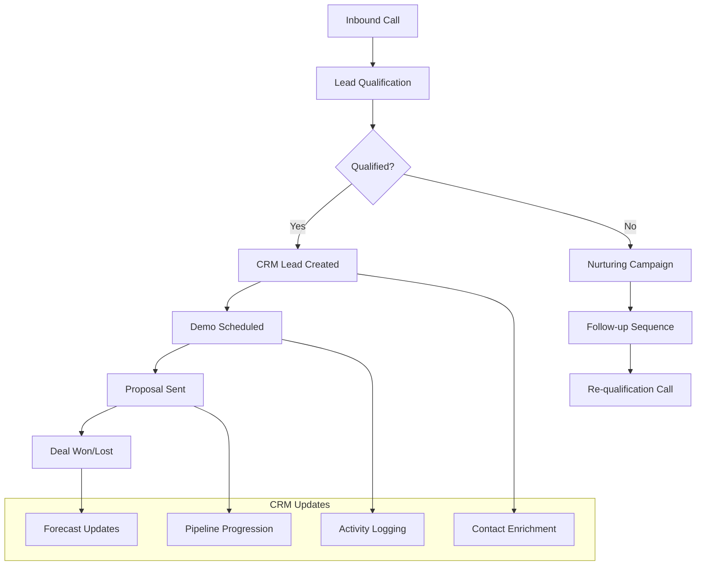

# CRM & Sales Integration Hub

Transformieren Sie Ihren Sales-Prozess mit intelligenten CRM-Integrationen. Famulor Automation verbindet Ihre KI-Telefonassistenten mit führenden CRM- und Sales-Plattformen für automatische Lead-Erfassung, Pipeline-Management und datengetriebene Vertriebsoptimierung.

<Note>
**Sales-Excellence**: Über 95% unserer Kunden berichten von signifikant verbesserten Conversion-Rates und kürzeren Sales-Zyklen durch CRM-Integration.
</Note>

## Warum CRM-Integration für Voice-AI?

### 📊 Automatische Pipeline-Verwaltung
Jeder Anruf wird automatisch in Ihrem CRM erfasst mit korrekten Deal-Stages, Lead-Scores und Follow-up-Aktivitäten.

### 🎯 360° Kundensicht
Kombinieren Sie Telefon-Insights mit CRM-Daten für vollständige Customer-Intelligence und personalisierte Gespräche.

### ⚡ Echtzeit-Sales-Intelligence
Ihre CRM-Daten werden während des Gesprächs abgerufen und aktualisiert für kontextuelle, datengetriebene Verkaufsgespräche.

### 📈 Performance-Tracking-Revolution
Automatische Erfassung aller Sales-Aktivitäten für präzise Forecasting, Team-Performance-Analyse und ROI-Tracking.

## Verfügbare CRM & Sales-Integrationen

### 🏆 Enterprise CRM-Lösungen

<CardGroup cols={2}>
  <Card title="HubSpot" icon="hubspot" href="/automation-platform/integrations/einzelintegrations/hubspot">
    **All-in-One CRM & Marketing**
    
    Automatische Kontakt-Erstellung, Deal-Management, E-Mail-Sequenzen und Marketing-Automation direkt aus Anrufen.
    
    ✅ Kostenlose Tier verfügbar  
    ✅ Umfassende API-Integration  
    ✅ Marketing-Hub-Integration  
    ✅ Sales-Pipeline-Automation
  </Card>
  
  <Card title="Salesforce" icon="salesforce" href="/automation-platform/integrations/einzelintegrations/salesforce">
    **Enterprise CRM-Marktführer**
    
    Vollständige Salesforce-Integration mit Lightning-Experience, Custom-Objects und Advanced-Workflows.
    
    ✅ Enterprise-Grade-Sicherheit  
    ✅ Custom-Object-Support  
    ✅ Apex-Trigger-Integration  
    ✅ Einstein-AI-Enhancement
  </Card>
  
  <Card title="Pipedrive" icon="chart-line" href="/automation-platform/integrations/einzelintegrations/pipedrive">
    **Sales-Pipeline-Spezialist**
    
    Visuelles Pipeline-Management mit automatischen Deal-Updates und intelligenter Sales-Prognose.
    
    ✅ Intuitive Pipeline-Visualisierung  
    ✅ Automatische Deal-Progression  
    ✅ Sales-Forecasting-Tools  
    ✅ Mobile-First-Design
  </Card>
  
  <Card title="ActiveCampaign" icon="envelope" href="/automation-platform/integrations/einzelintegrations/activecampaign">
    **CRM + Marketing-Automation**
    
    Intelligente Lead-Nurturing-Kombinationen mit E-Mail-Marketing und Customer-Journey-Automation.
    
    ✅ Behavior-Based-Automation  
    ✅ Advanced-Segmentation  
    ✅ Lead-Scoring-Integration  
    ✅ Multi-Channel-Campaigns
  </Card>
</CardGroup>

### 💼 Spezialisierte Sales-Tools

<CardGroup cols={3}>
  <Card title="Airtable" icon="table" href="/automation-platform/integrations/einzelintegrations/airtable">
    **Flexible CRM-Alternative**
    
    No-Code-CRM-Aufbau mit anpassbaren Feldern, Relationen und Workflow-Automation.
  </Card>
  
  <Card title="Notion" icon="notion" href="/automation-platform/integrations/einzelintegrations/notion">
    **All-in-One-Workspace**
    
    CRM-Funktionen kombiniert mit Dokumentation, Projektmanagement und Team-Kollaboration.
  </Card>
  
  <Card title="Monday.com" icon="monday" href="/automation-platform/integrations/einzelintegrations/monday">
    **Visual Project CRM**
    
    Board-basiertes CRM mit Timeline-Views, Automatisierung und Team-Koordination.
  </Card>
</CardGroup>

## Sales-Process-Automation-Flows

### 1. Lead-to-Customer-Journey



### 2. Multi-Touch-Attribution

**Automatisches Sales-Activity-Tracking:**
- 📞 **Anruf-Attribution**: Jeder Touchpoint automatisch CRM-zugeordnet
- 📧 **E-Mail-Integration**: Follow-up-E-Mails basierend auf Anruf-Outcome
- 📅 **Meeting-Koordination**: Automatische Kalender-Integration
- 📊 **Performance-Analytics**: ROI-Tracking für jeden Sales-Channel

## Branchenspezifische CRM-Setups

### 🏥 Healthcare & Medical
```
Spezialisierte Features:
├─ HIPAA-Compliance-Integration
├─ Patient-Relationship-Management
├─ Appointment-Scheduling-Automation
├─ Medical-Records-Integration
└─ Insurance-Verification-Workflows
```

### 🏢 B2B Software & SaaS
```
Enterprise-Sales-Features:
├─ Multi-Stakeholder-Account-Management
├─ Technical-Evaluation-Tracking
├─ Contract-Negotiation-Workflows
├─ Onboarding-Process-Automation
└─ Expansion-Revenue-Tracking
```

### 🏪 E-Commerce & Retail
```
Commerce-Optimized-CRM:
├─ Customer-Lifetime-Value-Tracking
├─ Purchase-History-Integration
├─ Inventory-Aware-Sales-Calls
├─ Return-Management-Workflows
└─ Loyalty-Program-Integration
```

### 🏦 Financial Services
```
FinTech-Compliance-Features:
├─ KYC-Integration-Workflows
├─ Compliance-Documentation-Automation
├─ Risk-Assessment-Integration
├─ Regulatory-Reporting-Automation
└─ Client-Onboarding-Compliance
```

## Advanced CRM-Features

### 1. AI-Enhanced Lead Scoring

**Intelligente Lead-Bewertung:**
```
Multi-Dimensional Lead Scoring:
📞 Call Quality Indicators:
├─ Conversation Length (>10min = +15 points)
├─ Engagement Level (Questions asked = +10 points)
├─ Decision-maker Language (+20 points)
├─ Budget Mentions (+25 points)
└─ Timeline Urgency (+30 points)

🎯 Behavioral Scoring:
├─ Website Activity Integration
├─ E-Mail Engagement History
├─ Social Media Interactions
├─ Content Download Patterns
└─ Previous Call History Analysis

💼 Firmographic Scoring:
├─ Company Size Relevance
├─ Industry Fit Assessment
├─ Technology Stack Compatibility
├─ Geographic Market Potential
└─ Competitive Landscape Position
```

### 2. Predictive Sales Analytics

**Machine Learning für Sales-Optimization:**
- 📈 **Win/Loss-Prediction**: ML-Modelle für Deal-Wahrscheinlichkeiten
- ⏰ **Optimal-Timing**: Beste Zeiten für Follow-up-Calls
- 🎯 **Next-Best-Action**: AI-Empfehlungen für Sales-Aktivitäten
- 📊 **Churn-Prevention**: Early-Warning-Systeme für Account-Risks

### 3. Revenue-Operations-Integration

**End-to-End-Revenue-Tracking:**
```
Revenue Pipeline Visibility:
├─ Marketing-Qualified-Leads (MQL)
├─ Sales-Qualified-Leads (SQL)  
├─ Opportunity-Creation-Rates
├─ Deal-Progression-Velocity
├─ Win-Rate-Optimization
├─ Average-Deal-Size-Trends
├─ Sales-Cycle-Length-Analysis
└─ Customer-Acquisition-Cost (CAC)
```

## Setup-Guides & Best Practices

### Quick-Start-Integration (5 Minuten)

<Steps>
  <Step title="CRM-Plattform auswählen">
    Wählen Sie Ihr CRM aus der Liste der verfügbaren Integrationen. Jede Integration bietet spezielle Vorteile.
  </Step>
  
  <Step title="API-Verbindung herstellen">
    Folgen Sie dem spezifischen Setup-Guide für Ihr CRM. Alle Guides bieten Schritt-für-Schritt-Anleitungen.
  </Step>
  
  <Step title="Field-Mapping konfigurieren">
    Ordnen Sie Anruf-Daten den entsprechenden CRM-Feldern zu. Standard-Mappings sind vorkonfiguriert.
  </Step>
  
  <Step title="Workflows aktivieren">
    Aktivieren Sie automatische Workflows für Lead-Erstellung, Deal-Updates und Follow-up-Aktivitäten.
  </Step>
  
  <Step title="Testing & Go-Live">
    Führen Sie Test-Anrufe durch, validieren Sie die CRM-Integration und starten Sie die produktive Nutzung.
  </Step>
</Steps>

### Enterprise-Integration-Checklist

```
Pre-Implementation:
☐ CRM-Administrator-Zugang sicherstellen
☐ Daten-Backup der bestehenden CRM-Daten
☐ Integration-Requirements-Dokumentation
☐ Security-Compliance-Überprüfung
☐ Team-Training-Plan erstellen

During-Implementation:
☐ API-Permissions korrekt konfiguriert
☐ Custom-Fields für Voice-Daten erstellt
☐ Workflow-Automation-Rules definiert
☐ Data-Sync-Intervalle optimiert
☐ Error-Handling-Mechanismen getestet

Post-Implementation:
☐ User-Acceptance-Testing durchgeführt
☐ Performance-Monitoring aktiviert
☐ Team-Training abgeschlossen
☐ Success-Metrics definiert und getrackt
☐ Continuous-Improvement-Process etabliert
```

## ROI & Performance-Benchmarks

### Typische Verbesserungen durch CRM-Integration

| Metrik | Ohne Integration | Mit CRM+Voice | Durchschnittliche Verbesserung |
|--------|------------------|---------------|-------------------------------|
| **Lead-Conversion-Rate** | 8-15% | 25-42% | +180% |
| **Sales-Cycle-Length** | 60-90 Tage | 35-55 Tage | -40% |
| **Data-Entry-Time** | 15-25 min/Call | 30 sek/Call | -95% |
| **Pipeline-Accuracy** | 60-75% | 85-95% | +25% |
| **Rep-Productivity** | 20 Calls/Tag | 35+ Calls/Tag | +75% |
| **Customer-Satisfaction** | 7.2/10 | 9.1/10 | +26% |

### ROI-Calculator-Framework

```
Monthly ROI Calculation (10-Person Sales Team):
├─ Time Savings: 250 Stunden/Monat (Data Entry Automation)
├─ Increased Conversions: +67% mehr Deals
├─ Shorter Sales Cycles: 25 Tage Average Improvement
├─ Better Forecasting: 15% Accuracy Improvement

Financial Impact:
├─ Additional Revenue: €125,000/Monat
├─ Productivity Gains: €18,750/Monat (Time Savings)
├─ Integration Costs: €2,500/Monat
├─ Net ROI: €141,250/Monat (5,650% ROI)
└─ Payback Period: 5 Tage
```

## Support & Training-Ressourcen

### 📚 Umfassende Dokumentation
- **Setup-Guides**: Detaillierte Anleitungen für jede CRM-Plattform
- **Best-Practices**: Bewährte Strategien von erfolgreichen Implementierungen
- **API-Documentation**: Technische Details für erweiterte Integrationen
- **Troubleshooting**: Lösungen für häufige Herausforderungen

### 🎓 Training & Onboarding
- **Live-Demos**: Interaktive Demonstrations der CRM-Features
- **Team-Workshops**: Anpassbare Training-Sessions für Ihr Sales-Team
- **Certification-Program**: Famulor-CRM-Integration-Zertifizierung
- **Ongoing-Support**: 24/7-Support für technische Fragen

### 📞 Professional Services
- **Custom-Integration**: Maßgeschneiderte Integrationen für spezielle Anforderungen
- **Data-Migration**: Sichere Migration bestehender CRM-Daten
- **Workflow-Optimization**: Kontinuierliche Prozess-Verbesserung
- **Change-Management**: Unterstützung bei Team-Adoption

---

**Bereit für intelligente CRM-Integration?**

<CardGroup cols={2}>
  <Card title="Integration starten" icon="rocket" href="https://app.famulor.de/integrations">
    Wählen Sie Ihr CRM und starten Sie in 5 Minuten
  </Card>
  <Card title="Persönliche Demo" icon="calendar" href="https://cal.com/bek-group/demotermine">
    Live-Demo mit Ihrem CRM-System
  </Card>
  <Card title="ROI-Calculator" icon="calculator" href="/automation-platform/integrations/roi-calculator">
    Berechnen Sie Ihren erwarteten ROI
  </Card>
  <Card title="Support kontaktieren" icon="life-ring" href="mailto:support@famulor.io">
    Fragen zur CRM-Integration?
  </Card>
</CardGroup>