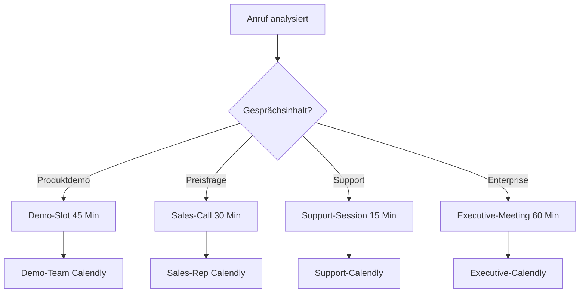
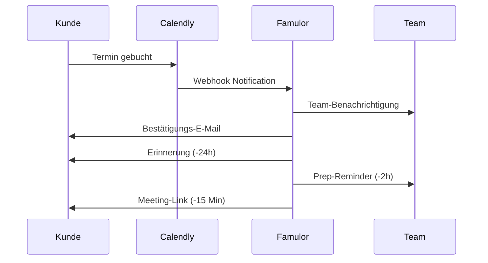

# Calendly Integration für KI-Telefonassistenten

Revolutionieren Sie Ihre Terminplanung mit intelligenten KI-Assistenten. Famulor Automation verbindet Calendly nahtlos mit Ihren Telefonassistenten für sofortige Buchungslinks, automatische Terminbestätigung und perfekt orchestrierte Meeting-Workflows.

<Note>
**Neu**: Round-Robin Scheduling - Verteilen Sie Termine automatisch an verfügbare Team-Mitglieder basierend auf Anrufinhalt und Expertise.
</Note>

## Warum Calendly + KI-Telefonassistent?

### ⚡ Sofortige Terminbuchung
Termine werden direkt während des Gesprächs gebucht - kein langwieriges Hin und Her mehr.

### 📱 SMS Booking-Links
Senden Sie Calendly-Links sofort per SMS nach interessanten Gesprächen.

### 🎯 Intelligente Terminverteilung
KI analysiert Gesprächsinhalt und bucht den passenden Termintyp mit dem richtigen Experten.

### 📈 Optimierte Conversion-Rates
Von Interesse zu Termin in unter 60 Sekunden - 5x höhere Buchungsraten.

## Hauptfunktionen der Integration

### 1. Intelligente Termintyp-Erkennung

**Automatische Meeting-Type-Zuordnung:**


**Verfügbare Meeting-Typen:**

| Meeting-Typ | Dauer | Team | Automatische Auswahl |
|-------------|-------|------|---------------------|
| 🎬 **Produktdemo** | 45 Min | Sales Engineers | "Demo", "Vorführung", "zeigen" |
| 💼 **Sales Gespräch** | 30 Min | Account Executives | "Preise", "Angebot", "kaufen" |
| 🔧 **Tech Consultation** | 60 Min | Solutions Architects | "Integration", "API", "technisch" |
| ⚡ **Quick Call** | 15 Min | Inside Sales | "kurz sprechen", "Fragen" |
| 👔 **Executive Meeting** | 60 Min | C-Level | "Geschäftsführer", "Strategie" |

### 2. Sofortige Buchungslink-Übertragung

**Multi-Channel Link-Sharing:**

#### SMS-Versendung (Sofort):
```sms
Hallo Max Mustermann!

Wie besprochen, hier Ihr Buchungslink für die Produktdemo:
📅 https://calendly.com/famulor-demo/45min

✅ Wählen Sie Ihren Wunschtermin
⏰ Automatische Kalender-Einladung
📋 Demo-Agenda wird vorab gesendet

Bei Fragen: +49 30 12345678

Ihr Famulor Team
```

#### E-Mail Follow-up (+2h):
```html
Betreff: Ihr Demo-Termin - Jetzt buchen (TechCorp AG)

Hallo Herr Mustermann,

vielen Dank für Ihr Interesse an unserer KI-Lösung.

Wie telefonisch besprochen, können Sie hier Ihren
Wunschtermin für die 45-minütige Produktdemo buchen:

[JETZT TERMIN BUCHEN] → Calendly-Link

Was Sie erwartet:
✅ Live-Demo Ihrer Use Cases
✅ ROI-Berechnung für TechCorp
✅ Integration-Roadmap
✅ Next Steps & Timeline

Die Demo wird von unserem Solutions Engineer Klaus Weber
durchgeführt, der bereits 200+ ähnliche Projekte betreut hat.

Beste Grüße,
Sarah Müller | Account Executive
```

### 3. Round-Robin & Team-Management

**Intelligente Expertenverteilung:**
```calendly
Demo-Anfrage erkannt
→ Analysiere Firmendetails: "250 Mitarbeiter, Enterprise"
→ Verfügbarkeit prüfen:
   Klaus Weber (Enterprise): ✅ Verfügbar
   Anna Schmidt (SMB): ⚠️ Überlastet  
   Max Müller (Technical): ✅ Verfügbar
→ Automatische Zuordnung: Klaus Weber
→ Calendly-Link generiert: /klaus-weber/enterprise-demo
```

**Load-Balancing Algorithmus:**
- **Expertise Match**: 70% Gewichtung
- **Aktuelle Auslastung**: 20% Gewichtung  
- **Historische Performance**: 10% Gewichtung

### 4. Erweiterte Buchungslogik

**Conditional Scheduling Rules:**

#### Preisbasierte Priorisierung:
```javascript
if (mentionedBudget > 50000) {
  meetingType = "enterprise-consultation";
  duration = 60; // minutes
  assignTo = getAvailableExecutive();
  priority = "high";
  bufferTime = 15; // prep time
} else if (mentionedBudget > 10000) {
  meetingType = "sales-presentation";
  duration = 45;
  assignTo = getSeniorSalesRep();
  priority = "medium";
}
```

#### Zeitzonenoptimierung:
```javascript
// Automatische Zeitzone-Erkennung
const callerTimezone = detectTimezoneFromPhone(phoneNumber);
const optimalTimes = getOptimalMeetingTimes(callerTimezone, teamAvailability);

// Nur passende Slots anzeigen
calendlyLink = generateCustomLink({
  timezone: callerTimezone,
  availableSlots: optimalTimes,
  duration: meetingDuration
});
```

## Branchenspezifische Anwendungen

### B2B Software Sales

**Enterprise Sales Cycle:**
```
Initial Call → Demo Booking → Technical Deep Dive → Proposal Meeting → Decision Call

Calendly Event Types:
1. "Product Demo" (45 min) - Solutions Engineer
2. "Technical Review" (60 min) - Solutions Architect  
3. "Business Case Discussion" (45 min) - Account Executive
4. "Executive Briefing" (30 min) - VP Sales
5. "Contract Review" (30 min) - Legal + Sales
```

**Automatische Progression:**
- Demo erfolgreich → Tech Review Link automatisch gesendet
- Tech Review positiv → Business Case Meeting geplant
- Budget bestätigt → Executive Briefing einberufen

### Professional Services

**Beratungsunternehmen Workflow:**
```
Erstanfrage → Bedarfsanalyse → Proposal → Kickoff → Regular Check-ins

Meeting Types:
• "Kostenlose Beratung" (30 min) - Senior Consultant
• "Projekt-Scoping" (60 min) - Practice Lead
• "Proposal Präsentation" (45 min) - Account Manager
• "Projekt Kickoff" (90 min) - Delivery Team
• "Status Update" (30 min) - Project Manager
```

### Healthcare & Medical

**Patiententermine & Beratungen:**
```
Symptoms Call → Doctor Consultation → Follow-up → Treatment Plan

Calendly Setup:
• "Erstberatung" (45 min) - Allgemeinmediziner
• "Facharzt Termin" (30 min) - Spezialist  
• "Telemedizin" (20 min) - Online Consultation
• "Nachsorge" (15 min) - Praxis-Team
• "Notfallsprechstunde" (15 min) - Verfügbarer Arzt
```

## Advanced Calendly Features

### Custom Questions & Qualification

**Intelligente Vorab-Qualifizierung:**
```calendly
Automatische Fragen basierend auf Anrufinhalt:

Wenn "Budget" erwähnt wurde:
→ Frage: "Welches Budget haben Sie für dieses Projekt eingeplant?"
→ Optionen: "<€10k", "€10-50k", "€50-100k", ">€100k"

Wenn "Timeline" erwähnt wurde:  
→ Frage: "Bis wann soll die Lösung implementiert sein?"
→ Optionen: "Sofort", "1-3 Monate", "3-6 Monate", "Später"

Wenn "Team Size" erwähnt wurde:
→ Frage: "Wie groß ist Ihr Team?"
→ Optionen: "1-10", "11-50", "51-200", ">200"
```

### Buffer Times & Preparation

**Automatische Pufferzeiten:**
```
Meeting-Type spezifische Buffers:

Produktdemo:
• 15 Min vor Meeting: Setup & Kundenrecherche
• 10 Min nach Meeting: Follow-up Notes

Enterprise Consultation:
• 30 Min vor Meeting: Account Research + Stakeholder Mapping
• 15 Min nach Meeting: Next Steps Documentation

Support Session:
• 5 Min vor Meeting: Case History Review
• 5 Min nach Meeting: Ticket Update
```

### Automated Workflows

**Post-Booking Automation:**


## Integration mit anderen Tools

### CRM-Synchronisation

**Automatische CRM-Updates:**
```
Calendly Booking → CRM Action:

HubSpot:
• Kontakt aktualisiert: "Demo geplant für [Datum]"
• Task erstellt: "Demo vorbereiten - [Meeting Details]" 
• Deal Stage: "Demo Scheduled"
• Follow-up Task: "+1 Tag nach Demo"

Salesforce:
• Event created mit Kundendetails
• Opportunity Stage Update
• Account Team Notification
• Activity History logged
```

### Marketing Automation

**Lead Nurturing Post-Booking:**
```
Booking bestätigt → Marketing Sequence:

Tag -2: Prep-E-Mail mit Agenda + Ressourcen
Tag -1: Erinnerung + Tech-Check Link
Tag 0: Meeting-Tag Reminder + Dial-in Details  
Tag +1: Thank you + Follow-up Resources
Tag +3: Proposal/Next Steps (wenn positiv)
Tag +7: Check-in Call offer (wenn neutral)
```

### Team Communication

**Slack/Teams Integration:**
```slack
🗓️ NEW CALENDLY BOOKING

👤 Kunde: Max Mustermann (TechCorp AG)
📅 Termin: Morgen, 14:00-14:45 (Demo)
👨‍💼 Assigned: Klaus Weber
💰 Budget: €25k+ (aus Anruf)
📋 Use Case: CRM Integration + Automatisierung

[Meeting vorbereiten] [Kundenhistorie] [Ähnliche Cases]

cc: @sales-team @demo-team
```

## ROI & Performance-Metriken

### Buchungsraten-Optimierung

| Szenario | Ohne Integration | Mit Calendly + KI | Verbesserung |
|----------|------------------|-------------------|---------------|
| **Interesse zu Buchung** | 23% | 78% | **+239% Conversion** |
| **No-Show Rate** | 28% | 12% | **-57% No-Shows** |
| **Avg Time-to-Meeting** | 5.2 Tage | 1.8 Tage | **-65% schneller** |
| **Rescheduling Rate** | 34% | 15% | **-56% Umplanungen** |
| **Meeting Quality Score** | 6.8/10 | 8.9/10 | **+31% Qualität** |

### Sales Performance Impact

**Pipeline-Beschleunigung:**
```
Sales Metrics - 6 Monate Vergleich:
════════════════════════════════════════════════════
Metrik                  | Vorher  | Nachher | Δ
Demos pro Woche        | 23      | 67      | +191%
Demo-to-Opportunity    | 34%     | 56%     | +65%
Sales Cycle Length     | 89 Tage | 62 Tage | -30%
Average Deal Size      | €34k    | €47k    | +38%
Rep Productivity       | 2.1     | 4.3     | +105%
```

### Kostenersparnis-Analyse

**Administrative Effizienz:**
```
Terminkoordination - Monatliche Zeiteinsparung:
════════════════════════════════════════════════════
Aktivität              | Vorher   | Nachher | Ersparnis
E-Mail Koordination    | 15h      | 2h      | 13h (€650)
Telefon-Tag           | 8h       | 0h      | 8h (€400)
Kalender-Management   | 12h      | 1h      | 11h (€550)
No-Show-Nachfassen   | 6h       | 1h      | 5h (€250)
Meeting Prep-Time     | 20h      | 15h     | 5h (€250)

Total Monatlich: €2.100 Einsparung
Jährlicher ROI: 2.520%
```

## Erfolgsgeschichten

### Case Study: SaaS Startup

**Ausgangssituation:**
- 45 Demo-Anfragen/Monat
- 23% Buchungsrate (manuell)
- 34% No-Show Rate
- 2.1 Demos/Sales Rep/Woche

**Calendly + KI Integration Ergebnisse (4 Monate):**
- ✅ **78% Buchungsrate** durch sofortige Links
- ✅ **12% No-Show Rate** durch bessere Kommunikation
- ✅ **€890k zusätzliche Pipeline** durch mehr qualifizierte Demos
- ✅ **4.3 Demos/Rep/Woche** durch Automatisierung

*"Die Calendly-Integration hat unsere Demo-Performance komplett transformiert. Wir buchen jetzt 3x mehr Termine und haben deutlich qualifiziertere Interessenten."* - Lisa Weber, VP Sales

### Case Study: Beratungsunternehmen

**Challenge:** Komplexe Terminkoordination für verschiedene Expertise-Level

**Solution:** Multi-Tier Calendly Setup mit intelligenter Zuordnung

**Results (6 Monate):**
- ✅ **89% Reduzierung** der E-Mail-Koordination
- ✅ **€2.1M zusätzlicher Umsatz** durch effizientere Terminnutzung
- ✅ **67% höhere** Client Satisfaction durch pünktliche, vorbereitete Meetings

## Setup & Best Practices

### Calendly-Konfiguration

<Steps>
  <Step title="Event Types definieren">
    Erstellen Sie spezifische Meeting-Types für verschiedene Anruftypen
  </Step>
  <Step title="Team-Zuordnung konfigurieren">
    Definieren Sie Round-Robin-Regeln und Expertise-Mappings
  </Step>
  <Step title="Custom Questions einrichten">
    Qualifizierungsfragen basierend auf Ihrem Sales Process
  </Step>
  <Step title="Famulor Integration aktivieren">
    Verbinden Sie Calendly mit Ihrem Famulor Dashboard
  </Step>
  <Step title="Automated Workflows testen">
    Führen Sie Test-Anrufe durch und validieren Sie die Buchungsflows
  </Step>
</Steps>

### Optimization Tipps

**Meeting-Type Optimization:**
- **Dauer**: Immer 15 Min Buffer für Verspätungen
- **Verfügbarkeit**: Maximal 60% der Arbeitszeit für Meetings
- **Qualifizierung**: Mindestens 3 Qualifizierungsfragen pro Type
- **Follow-up**: Automatische Next-Step-E-Mails nach 24h

## Häufige Fragen (FAQ)

<AccordionGroup>
  <Accordion title="Funktioniert die Integration mit Calendly Teams?">
    Ja, vollständige Unterstützung für Calendly Individual, Teams und Enterprise mit erweiterten Features für Organisationen.
  </Accordion>

  <Accordion title="Können verschiedene Calendly-Accounts verwendet werden?">
    Ja, Multi-Account Support ermöglicht verschiedene Calendly-Accounts pro Team oder Abteilung.
  </Accordion>

  <Accordion title="Was passiert bei Calendly-Ausfällen?">
    Fallback-System erstellt Meeting-Anfragen per E-Mail und synchronisiert automatisch nach Wiederherstellung.
  </Accordion>

  <Accordion title="Unterstützen Sie andere Scheduling-Tools?">
    Ja, auch Acuity Scheduling, Cal.com und When2meet werden unterstützt. Calendly ist jedoch am umfangreichsten integriert.
  </Accordion>
</AccordionGroup>

## Sofort starten

<CardGroup cols={2}>
  <Card title="Calendly Integration" icon="calendar" href="https://app.famulor.de/integrations/calendly">
    Verbindung in 3 Minuten einrichten
  </Card>
  <Card title="Meeting Templates" icon="clock" href="/automation-platform/integrations/calendar#calendly-templates">
    Bewährte Meeting-Type-Vorlagen
  </Card>
  <Card title="Buchungsraten-Audit" icon="chart-line" href="https://audit.famulor.de/scheduling">
    Analysieren Sie Ihre aktuellen Buchungsraten
  </Card>
  <Card title="Live Demo buchen" icon="video" href="https://calendly.com/famulor/scheduling-demo">
    Sehen Sie Calendly-Automatisierung live
  </Card>
</CardGroup>

## Verwandte Scheduling-Tools

<CardGroup cols={3}>
  <Card title="Google Calendar" icon="calendar-alt" href="/automation-platform/integrations/einzelintegrations/google-calendar">
    Direkte Kalender-Integration
  </Card>
  <Card title="Cal.com" icon="calendar-check" href="/automation-platform/integrations/einzelintegrations/cal-com">
    Open-Source Scheduling Alternative
  </Card>
  <Card title="Outlook Calendar" icon="microsoft" href="/automation-platform/integrations/einzelintegrations/outlook-calendar">
    Microsoft Ecosystem Integration
  </Card>
</CardGroup>

---

**Scheduling Support**: Für erweiterte Calendly-Setups und Enterprise-Konfigurationen kontaktieren Sie unsere Scheduling-Experten über [support@famulor.io](mailto:support@famulor.io).

**Letzte Aktualisierung**: Januar 2024 | **Calendly API Version**: v2 | **Unterstützte Pläne**: Basic, Essential, Professional, Teams | **Webhooks**: Vollständig implementiert