# Gmail Integration für KI-Telefonassistenten

Verwandeln Sie jede Telefoninteraktion in perfekt getimte E-Mail-Follow-ups. Famulor Automation verbindet Ihre KI-Telefonassistenten nahtlos mit Gmail für intelligente E-Mail-Automatisierung, personalisierte Nachrichten und effektive Lead-Nurturing-Kampagnen.

<Note>
**Neu**: Smart Compose Integration mit OpenAI - Ihre E-Mails werden basierend auf Gesprächsinhalten automatisch personalisiert und formuliert.
</Note>

## Warum Gmail + KI-Telefonassistent?

### 📧 Intelligente E-Mail-Automatisierung
Jeder Anruf triggert automatisch passende E-Mail-Workflows - nie wieder vergessene Follow-ups.

### ⚡ Sofortige Personalisierung
Nutzen Sie Gesprächsinhalte für hochpersonalisierte E-Mails mit Namen, Bedürfnissen und nächsten Schritten.

### 🎯 Perfektes Timing
E-Mails werden zum optimalen Zeitpunkt versendet - basierend auf Gesprächsausgang und Kundenverhalten.

### 📈 Messbare E-Mail-Performance
Verfolgen Sie, wie Telefonanrufe E-Mail-Engagement und Conversions beeinflussen.

## Hauptfunktionen der Integration

### 1. Intelligente Follow-up E-Mails

**Automatische E-Mail-Generierung nach Anruf:**

```mermaid
graph TD
    A[Anruf beendet] --> B[Gesprächsanalyse]
    B --> C[E-Mail-Typ bestimmen]
    C --> D[Template auswählen]
    D --> E[Personalisierung]
    E --> F[Zeitpunkt optimieren]
    F --> G[E-Mail versenden]
    G --> H[Performance tracking]
```


**Automatisierte E-Mail-Szenarien:**

| Gesprächsergebnis | E-Mail-Typ | Zeitpunkt | Öffnungsrate |
|-------------------|------------|-----------|--------------|
| 🔥 **Hot Lead** | Sofortiges Follow-up mit Angebot | 5 Min | 87% |
| 📅 **Demo gewünscht** | Terminbestätigung + Agenda | Sofort | 94% |
| 📋 **Info angefordert** | Dankeschön + Ressourcen | 2h | 78% |
| 🤔 **Bedenkzeit** | Nutzen-orientiertes Nurturing | 24h | 65% |
| 😊 **Zufriedener Kunde** | Testimonial-Request | 48h | 82% |

### 2. Personalisierte E-Mail-Templates

**KI-generierte Personalisierung:**

#### Sales Follow-up Template:
```html
Betreff: {{ company_name }} - Wie besprochen: {{ main_topic }}

Hallo {{ contact_name }},

vielen Dank für unser {{ call_duration }}-minütiges Gespräch heute zu {{ main_pain_point }}.

Wie versprochen, sende ich Ihnen:
{{ #discussed_resources }}
• {{ resource_name }} - {{ resource_description }}
{{ /discussed_resources }}

Basierend auf Ihren Anforderungen ({{ key_requirements }}) 
empfehle ich Ihnen besonders {{ recommended_solution }}.

{{ #next_steps }}
Nächste Schritte:
{{ step_description }} - bis {{ deadline }}
{{ /next_steps }}

Beste Grüße,
{{ sender_name }}

P.S.: {{ personal_note_from_call }}
```

#### Support Follow-up Template:
```html
Betreff: Lösung für {{ issue_category }} - Alles geklärt?

Hallo {{ customer_name }},

danke für Ihren Anruf bezüglich {{ issue_description }}.

✅ Problem gelöst: {{ resolution_summary }}
📋 Schritte durchgeführt: {{ solution_steps }}
⏰ Bearbeitungszeit: {{ resolution_time }}

{{ #preventive_tips }}
Zur Vermeidung ähnlicher Probleme:
{{ tip_description }}
{{ /preventive_tips }}

Falls noch Fragen aufkommen, erreichen Sie uns unter {{ support_phone }}.

Ihr {{ agent_name }}
Customer Success Team
```

### 3. Advanced E-Mail Workflows

**Multi-Touch E-Mail-Sequenzen:**

#### B2B Sales Nurturing (7 E-Mails über 21 Tage):
```
Tag 0: Sofortige Dankeschön-E-Mail mit Gesprächszusammenfassung
Tag 1: Detaillierte Produktinformationen basierend auf Interesse
Tag 3: Case Study ähnlicher Kunde aus derselben Branche
Tag 7: ROI-Calculator + persönliches Beratungsangebot
Tag 10: Webinar-Einladung zu relevanten Themen
Tag 14: Konkurrenz-Vergleich + Alleinstellungsmerkmale
Tag 21: Zeitlich begrenztes Angebot + persönlicher Call
```

#### E-Commerce Abandoned Cart Recovery:
```
Anruf: Kunde interessiert, aber noch unentschlossen
→ Tag 0: Produktbilder + Kundenrezensionen
→ Tag 1: 10% Rabatt-Code (exklusiv für Anrufer)
→ Tag 3: Social Proof - "Andere kauften auch"
→ Tag 7: Limited Time Offer - 15% Rabatt
→ Tag 14: Persönliche Beratung anbieten
```

### 4. Smart Send Time Optimization

**KI-optimierte Versendzeiten:**
```javascript
// Optimaler Versendezeitpunkt-Algorithmus
function calculateOptimalSendTime(contact, emailType) {
  const factors = {
    timezone: contact.timezone,
    industry: contact.industry, // B2B vs B2C patterns
    previousEngagement: contact.emailHistory,
    callTime: call.timestamp,
    emailType: emailType, // Urgent vs Nurturing
    dayOfWeek: getCurrentDay()
  };
  
  // B2B optimal times: Di-Do, 10:00-11:00 & 14:00-15:00
  // B2C optimal times: So-Di, 19:00-21:00
  // Follow-up: Within 2-4h after call
  
  return calculateBestTime(factors);
}
```

**Versendzeit-Performance:**
- **Sofort nach Anruf**: 94% Öffnungsrate (Hot Leads)
- **2h nach Anruf**: 78% Öffnungsrate (Info-Anfragen)
- **Nächster Arbeitstag 10:00**: 85% Öffnungsrate (B2B)
- **Sonntag 19:00**: 72% Öffnungsrate (B2C)

## Erweiterte Gmail Features

### Google Workspace Integration

**Enterprise-Features für Teams:**
- **Shared Mailboxes**: Team-E-Mails aus Anrufen
- **Gmail API**: Programmatische E-Mail-Erstellung
- **Google Groups**: Automatische Verteilerlisten
- **Admin Console**: Zentrale Verwaltung für Unternehmen

### Smart Compose & Auto-Reply

**KI-unterstützte E-Mail-Erstellung:**
```
Gmail Smart Compose + Famulor AI:
→ Anrufkontext wird an Gmail weitergegeben
→ Smart Compose schlägt relevante Inhalte vor
→ KI ergänzt gesprächsspezifische Details
→ Automatische Grammatik- und Ton-Optimierung
```

### Label & Filter Automation

**Automatische E-Mail-Organisation:**
```gmail
Automatische Gmail-Labels basierend auf Anrufen:

• "Famulor/Hot-Leads" → Anrufe mit Score >80
• "Famulor/Demo-Requests" → Demo-Interesse geäußert
• "Famulor/Support-Follow-up" → Support-Anrufe
• "Famulor/Pricing-Interest" → Preisanfragen
• "Famulor/Competitor-Mentions" → Wettbewerb erwähnt
• "Famulor/Decision-Maker" → C-Level Kontakte
```

## Praxis-Anwendungen

### Sales Excellence

**Lead-Nurturing Automation:**
```
Szenario: Warmer B2B-Lead nach Demo-Call

Gmail Workflow:
15:30 Demo-Call beendet
15:35 Auto-E-Mail: "Danke für Ihr Interesse - Demo-Aufzeichnung"
       → 96% Öffnungsrate innerhalb 2h

16:00 Kalender-Integration: Demo-Follow-up für +3 Tage geplant
19:00 ROI-Calculator per E-Mail: "Berechnen Sie Ihre Einsparungen"
       → 67% Click-Through-Rate

Tag +1: Case Study: "Wie Kunde X 40% Kosten sparte"
        → 45% Engagement-Rate

Tag +3: Persönlicher Follow-up Call + E-Mail-Bestätigung
        → 78% Conversion zu nächster Sales-Phase
```

### Customer Success

**Proaktiver Support per E-Mail:**
```
Support-Call: Kunde hatte technisches Problem

Automated Gmail Actions:
1. Sofort: "Problem gelöst - Zusammenfassung"
2. +24h: "Funktioniert alles wie gewünscht?"
3. +7 Tage: "Tipps zur Optimierung Ihrer Setup"
4. +30 Tage: "Neue Features, die Sie interessieren könnten"

Ergebnis: 89% Customer Satisfaction (vs. 67% ohne E-Mail-Follow-up)
```

### E-Commerce Integration

**Post-Purchase E-Mail-Automation:**
```
Telefonische Bestellung abgeschlossen

Gmail E-Mail-Kette:
Sofort: Bestellbestätigung + Tracking-Info
+1 Tag: Versand-Benachrichtigung + Lieferdetails  
+3 Tage: "Ihre Bestellung ist angekommen - Alles OK?"
+7 Tage: Produktbewertung-Request + Foto-Anleitung
+14 Tage: Cross-Sell: "Kunden kauften auch..."
+30 Tage: Repurchase-Reminder für Verbrauchsartikel

ROI: 34% höhere Customer Lifetime Value
```

## Technische Integration

### Gmail API Setup

```bash
# Gmail API Konfiguration
1. Google Cloud Console → APIs aktivieren
   - Gmail API
   - Google Workspace Admin SDK
   
2. OAuth 2.0 Credentials erstellen:
   - Client-ID für Famulor App
   - Authorized Redirect URIs
   - Scopes: gmail.send, gmail.modify, gmail.labels

3. Famulor Dashboard → Gmail Integration:
   - OAuth-Flow durchlaufen
   - Berechtigungen gewähren
   - Test-E-Mail senden
```

### Sicherheit & Permissions

**Granulare Berechtigungssteuerung:**
```json
{
  "gmail_permissions": {
    "send_emails": true,
    "read_sent_items": true,
    "create_labels": true,
    "access_contacts": false,
    "read_inbox": false
  },
  "security_features": {
    "oauth2_refresh": "automatic",
    "token_encryption": "AES-256",
    "api_rate_limiting": "intelligent",
    "audit_logging": "complete"
  }
}
```

### Google Workspace Admin

**Enterprise-Verwaltung:**
- **Domain-weite Delegation**: Admin kann Integration für alle User aktivieren
- **Organizational Units**: Verschiedene Settings pro Abteilung
- **Security Policies**: DLP und Advanced Protection
- **Audit Logs**: Vollständige Nachverfolgung aller E-Mail-Aktivitäten

## ROI & Performance-Metriken

### E-Mail-Marketing ROI

| Metrik | Ohne Integration | Mit Gmail-Integration | Verbesserung |
|--------|------------------|----------------------|--------------|
| **Follow-up Rate** | 23% | 97% | **+322% mehr Follow-ups** |
| **E-Mail Öffnungsrate** | 24% | 78% | **+225% höhere Öffnungen** |
| **Response Rate** | 3.2% | 12.7% | **+297% mehr Antworten** |
| **Lead-to-Sale Conversion** | 8% | 23% | **+188% Conversion** |
| **Time-to-Response** | 4.2h | 8 Min | **-97% schneller** |

### Produktivitätssteigerung

**Zeit- und Kostenersparnis pro Monat:**
```
100 Anrufe/Monat ohne Gmail-Integration:
• Manuelle Follow-up E-Mails: 25h (€1.250 Arbeitszeit)
• Vergessene Follow-ups: 23% (€8.900 Opportunitätsverlust)
• Template-Suche & Anpassung: 12h (€600)
Total Kosten: €10.750/Monat

Mit Gmail-Integration:
• Automatische E-Mails: 2h Admin (€100)
• Vergessene Follow-ups: <1% (€400 Verlust)
• Template-Management: 0h (€0)
Total Kosten: €500/Monat

Monatliche Einsparung: €10.250
Jährlicher ROI: 12.300%
```

## Erfolgsgeschichten

### Case Study: B2B Software-Unternehmen

**Ausgangssituation:**
- 180 Sales-Calls/Monat
- 34% Follow-up Rate (manuell)
- 2.1% E-Mail Response Rate
- €450k Pipeline aus E-Mail-Marketing

**Gmail-Integration Ergebnisse (6 Monate):**
- ✅ **97% Follow-up Rate** durch Automatisierung
- ✅ **€1.2M zusätzliche Pipeline** durch bessere E-Mail-Performance
- ✅ **89% Zeitersparnis** bei E-Mail-Management
- ✅ **356% ROI** im ersten Jahr

*"Die Gmail-Integration hat unsere E-Mail-Performance revolutioniert. Wir verpassen keine Follow-ups mehr und unsere Conversion-Rate hat sich mehr als verdreifacht."* - Sabine Weber, Sales Director

### Case Study: E-Commerce Fashion Store

**Challenge:** Abandoned Cart Recovery + Customer Service

**Solution:** Gmail + Shopify Integration für E-Commerce

**Results:**
- ✅ **67% Reduktion** der manuellen E-Mail-Arbeit
- ✅ **€340k zusätzlicher Umsatz** durch automatisierte Follow-ups
- ✅ **45% höhere** Customer Satisfaction durch schnelle Reaktion

## Advanced Features & Integrations

### Multi-Account Management

**Mehrere Gmail-Accounts verwalten:**
- **Team-Accounts**: sales@, support@, info@
- **Personal Accounts**: Individuelle Mitarbeiter-E-Mails
- **Alias-Management**: Verschiedene Absender-Identitäten
- **Round-Robin**: Gleichmäßige Verteilung der E-Mails

### Integration mit anderen Tools

**Gmail + CRM Kombination:**


### A/B Testing für E-Mails

**Automatische E-Mail-Optimierung:**
- **Subject Line Testing**: Automatische A/B-Tests verschiedener Betreffzeilen
- **Send Time Optimization**: Finde die beste Versendzeit pro Kontakt
- **Template Performance**: Messe welche Templates am besten konvertieren
- **Content Personalization**: Teste verschiedene Personalisierungs-Level

## Häufige Fragen (FAQ)

<AccordionGroup>
  <Accordion title="Werden meine Gmail-Daten sicher behandelt?">
    Ja, höchste Sicherheitsstandards: OAuth 2.0, AES-256 Verschlüsselung, keine E-Mail-Inhalte gespeichert. GDPR-konform.
  </Accordion>

  <Accordion title="Funktioniert es mit G Suite/Google Workspace?">
    Ja, vollständige Unterstützung für private Gmail-Accounts und Google Workspace Business-Accounts.
  </Accordion>

  <Accordion title="Können E-Mails in anderen Sprachen versendet werden?">
    Ja, Unterstützung für 25+ Sprachen mit automatischer Spracherkennung basierend auf Anruflanguage.
  </Accordion>

  <Accordion title="Was passiert bei Gmail-Ausfällen?">
    Fallback-Mechanismus speichert E-Mails zwischen und versendet sie automatisch nach Wiederherstellung.
  </Accordion>

  <Accordion title="Wie viele E-Mails kann ich pro Tag senden?">
    Gmail Limits: 500/Tag (privat), 2000/Tag (Workspace). Intelligente Rate-Limiting verhindert Überschreitungen.
  </Accordion>
</AccordionGroup>

## Sofort starten

<CardGroup cols={2}>
  <Card title="Gmail Integration aktivieren" icon="envelope" href="https://app.famulor.de/integrations/gmail">
    Verbindung in 3 Minuten einrichten
  </Card>
  <Card title="E-Mail Templates" icon="file-text" href="/automation-platform/integrations/email-marketing#gmail-templates">
    Bewährte E-Mail-Vorlagen kopieren
  </Card>
  <Card title="ROI Calculator" icon="calculator" href="https://roi.famulor.de/gmail">
    E-Mail-ROI für Ihr Unternehmen berechnen
  </Card>
  <Card title="Live Demo buchen" icon="video" href="https://calendly.com/famulor/gmail-demo">
    Sehen Sie Gmail-Automatisierung in Aktion
  </Card>
</CardGroup>

## Verwandte E-Mail-Integrationen

<CardGroup cols={3}>
  <Card title="Outlook" icon="microsoft" href="/automation-platform/integrations/einzelintegrations/outlook">
    Microsoft E-Mail Alternative
  </Card>
  <Card title="Mailchimp" icon="envelope-open" href="/automation-platform/integrations/einzelintegrations/mailchimp">
    Erweiterte E-Mail-Marketing-Automation
  </Card>
  <Card title="HubSpot Marketing" icon="users" href="/automation-platform/integrations/einzelintegrations/hubspot">
    CRM + E-Mail Marketing Kombination
  </Card>
</CardGroup>

---

**E-Mail-Automation Support**: Für erweiterte Gmail-Setups und Enterprise-Konfigurationen kontaktieren Sie unsere E-Mail-Experten über [email-automation@famulor.de](mailto:email-automation@famulor.de).

**Letzte Aktualisierung**: Januar 2024 | **Gmail API Version**: v1 | **Google Workspace**: Vollständig unterstützt | **OAuth 2.0**: Implementiert