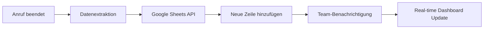
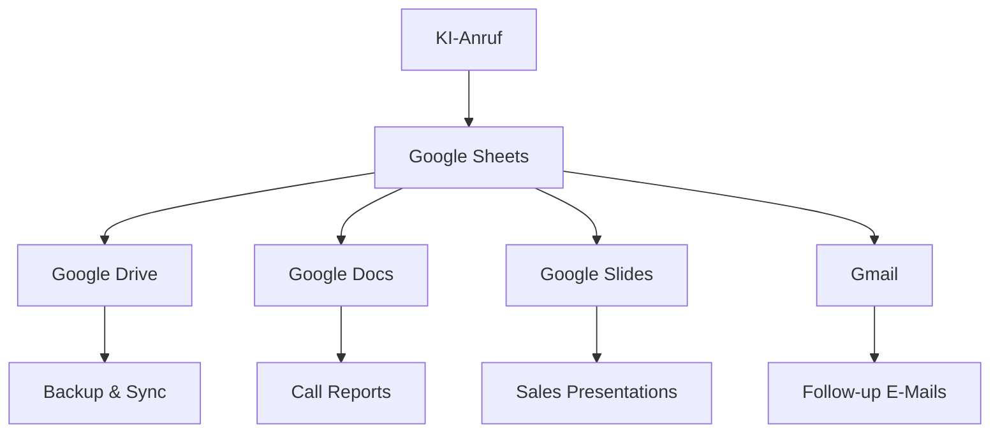

# Google Sheets Integration für KI-Telefonassistenten

Verwandeln Sie jede Telefoninteraktion in strukturierte, auswertbare Daten. Famulor Automation verbindet Ihre KI-Telefonassistenten nahtlos mit Google Sheets für automatisches Call-Logging, intelligente Lead-Verfolgung und aussagekräftige Performance-Analytics.

<Note>
**Neu**: Echtzeit-Kollaboration - Ihr Team sieht Anrufdaten sofort in geteilten Google Sheets mit automatischen Benachrichtigungen.
</Note>

## Warum Google Sheets + KI-Telefonassistent?

### 📊 Automatisches Datenmanagement
Jeder Anruf wird automatisch als strukturierte Zeile in Ihren Spreadsheets erfasst - kein manuelles Logging mehr.

### 🔄 Echtzeit-Kollaboration
Ihr Team arbeitet mit Live-Daten - Updates erscheinen sofort in allen geteilten Sheets.

### 📈 Sofortige Analysemöglichkeiten  
Nutzen Sie die Macht von Google Sheets für Pivot-Tabellen, Charts und erweiterte Datenanalyse.

### 💡 No-Code Flexibilität
Keine technischen Kenntnisse nötig - arbeiten Sie mit gewohnten Spreadsheet-Funktionen.

## Hauptfunktionen der Integration

### 1. Intelligentes Call-Logging

**Automatische Datenerfassung nach jedem Anruf:**


**Standard Call-Log Struktur:**
| Spalte | Inhalt | Automatisch erfasst |
|--------|---------|-------------------|
| **Datum/Zeit** | 2024-01-15 14:30:25 | ✅ |
| **Anrufername** | Max Mustermann | ✅ |
| **Telefonnummer** | +49 30 12345678 | ✅ |
| **Unternehmen** | TechCorp GmbH | ✅ |
| **Anrufdauer** | 00:12:34 | ✅ |
| **Gesprächsthema** | Produktdemo-Interesse | ✅ |
| **Lead-Score** | 87/100 | ✅ |
| **Sentiment** | Sehr positiv | ✅ |
| **Nächste Schritte** | Demo am 18.01. geplant | ✅ |
| **Budget erwähnt** | €25.000+ | ✅ |
| **Zuständiger Rep** | Sarah Weber | ✅ |

### 2. Lead-Tracking Dashboard

**Automatisches Lead-Management in Sheets:**

#### Master Lead Sheet:
```
Sheet: "Lead Dashboard 2024"
═══════════════════════════════════════════════════════════════
| Status    | Lead Name      | Score | Last Call | Next Action  |
|-----------|----------------|-------|-----------|--------------|
| 🔥 Hot     | TechCorp AG    | 92    | Heute     | Demo buchen  |
| 🌡️ Warm    | StartupXY      | 67    | Gestern   | Follow-up    |
| ❄️ Cold     | BigCorp Inc    | 34    | 3 Tage    | Nurturing    |
| ✅ Won      | InnovateLtd    | 95    | 1 Woche   | Onboarding   |
| ❌ Lost     | OldTech GmbH   | 23    | 2 Wochen  | Archived     |
```

#### Automatische Formeln:
```excel
// Lead-Score Berechnung
=IF(G2>80,"🔥 Hot",IF(G2>50,"🌡️ Warm","❄️ Cold"))

// Tage seit letztem Anruf
=TODAY()-C2

// Follow-up Reminder
=IF(H2>3,"⚠️ Follow-up überfällig","✅ OK")

// Pipeline-Wert
=SUMIF(A:A,"🔥 Hot",I:I)
```

### 3. Performance-Analytics

**Automatische KPI-Berechnung:**

#### Sales Performance Sheet:
```
Daily Call Performance - KW 3/2024
═══════════════════════════════════════════════════════════
Metrik               | Heute  | Diese Woche | Ziel    | Status
Anrufe gesamt       | 23     | 127        | 150     | 85% 📈
Hot Leads           | 7      | 34         | 40      | 85% 📈
Conversion Rate     | 30.4%  | 26.8%      | 25%     | ✅ 107%
Avg Call Duration   | 8:45   | 9:12       | 8:00    | ⚠️ 115%
Pipeline generiert  | €67k   | €340k      | €300k   | ✅ 113%
```

#### Team Leaderboard:
```
Sales Rep Performance - Januar 2024
═══════════════════════════════════════════════════════════
Rep Name        | Calls | Hot Leads | Conversion | Pipeline
Sarah Weber     | 89    | 23        | 34.5%      | €156k
Klaus Mueller   | 76    | 18        | 28.9%      | €134k
Anna Schmidt    | 67    | 15        | 31.2%      | €98k
Max Weber       | 54    | 12        | 25.0%      | €89k
```

### 4. Erweiterte Datenanalyse

**Pivot-Tabellen für Call-Intelligence:**

#### Branchen-Performance:
```
Branchenanalyse Q1 2024
═══════════════════════════════════════════════════════════
Branche          | Anrufe | Avg Score | Win Rate | Avg Deal
Software/SaaS    | 167    | 73        | 34%      | €78k
Manufacturing    | 89     | 67        | 28%      | €156k
Healthcare       | 76     | 71        | 31%      | €234k
Financial Serv.  | 54     | 69        | 29%      | €198k
E-Commerce       | 134    | 65        | 26%      | €45k
```

#### Zeitbasierte Analyse:
```excel
// Beste Anrufzeiten
=COUNTIFS(Zeit,">=9:00",Zeit,"<10:00",Lead_Score,">70") // 9-10h: 23 Hot Leads
=COUNTIFS(Zeit,">=10:00",Zeit,"<11:00",Lead_Score,">70") // 10-11h: 34 Hot Leads ⭐
=COUNTIFS(Zeit,">=14:00",Zeit,"<15:00",Lead_Score,">70") // 14-15h: 28 Hot Leads
=COUNTIFS(Zeit,">=15:00",Zeit,"<16:00",Lead_Score,">70") // 15-16h: 19 Hot Leads
```

## Praxis-Anwendungen

### Sales Team Management

**Daily Sales Standup Dashboard:**
```
Sales Dashboard - Live Updates
═══════════════════════════════════════════════════════════
🎯 HEUTE (15.01.2024)
   Anrufe: 23/30 (77%)
   Hot Leads: 7 (🔥 Sarah: 3, Klaus: 2, Anna: 2)
   Pipeline: €67.5k (+€12k seit gestern)

📈 DIESE WOCHE
   Trend: +15% vs. letzte Woche
   Top Performer: Sarah Weber (€34k Pipeline)
   Needs Coaching: Max Weber (18% Conversion)

⚠️ FOLLOW-UPS HEUTE
   TechCorp AG - Demo um 14:00 (Sarah)
   StartupXY - Preisangebot senden (Klaus)
   InnovateLtd - Contract Review (Anna)
```

### Marketing Attribution

**Campaign Performance Tracking:**
```
Marketing Campaign ROI - Google Ads
═══════════════════════════════════════════════════════════
Campaign         | Calls | Cost   | Hot Leads | Revenue  | ROI
"AI Automation"  | 67    | €2.3k  | 23        | €156k    | 6.678%
"CRM Integration"| 45    | €1.8k  | 15        | €89k     | 4.944%
"Sales Tools"    | 34    | €1.2k  | 12        | €67k     | 5.583%
"Enterprise"     | 23    | €3.1k  | 8         | €234k    | 7.548%

Automatic Formula: =(Revenue - Cost)/Cost*100
```

### Customer Success Tracking

**Support Performance Analytics:**
```
Customer Success Metrics
═══════════════════════════════════════════════════════════
Metrik                    | Wert   | Ziel   | Status
Avg Resolution Time       | 4.2h   | 4h     | ⚠️ 105%
First Call Resolution     | 89%    | 85%    | ✅ 105%
Customer Satisfaction     | 4.7/5  | 4.5/5  | ✅ 104%
Escalation Rate          | 6%     | 8%     | ✅ 75%
Churn Prevention Calls   | 12     | 15     | 80%

Top Issues (automatisch kategorisiert):
1. Login Problems: 34%
2. Billing Questions: 23% 
3. Feature Requests: 18%
4. Integration Help: 15%
5. Bug Reports: 10%
```

## Erweiterte Google Sheets Features

### Automatische Charts & Visualisierung

**Live-Charts aus Call-Daten:**
```javascript
// Automatisches Chart-Update per Google Apps Script
function updateCallCharts() {
  const sheet = SpreadsheetApp.getActiveSheet();
  const data = sheet.getRange("A:K").getValues();
  
  // Daily Calls Trend Chart
  const chart1 = sheet.newChart()
    .setChartType(Charts.ChartType.LINE)
    .addRange(sheet.getRange("A:B"))
    .setPosition(1, 13, 0, 0)
    .setOption('title', 'Daily Call Volume Trend')
    .build();
  
  // Lead Score Distribution
  const chart2 = sheet.newChart()
    .setChartType(Charts.ChartType.HISTOGRAM)
    .addRange(sheet.getRange("G:G"))
    .setPosition(15, 13, 0, 0)
    .setOption('title', 'Lead Score Distribution')
    .build();
    
  sheet.insertChart(chart1);
  sheet.insertChart(chart2);
}
```

### Conditional Formatting

**Visuelle Datenhervorhebung:**
```
Automatische Färbung basierend auf Werten:

Lead Score Spalte:
• 90-100: Dunkelgrün (🔥 Hot)
• 70-89:  Hellgrün (🌡️ Warm)  
• 50-69:  Gelb (❄️ Cold)
• 0-49:   Rot (❌ Unqualified)

Follow-up Status:
• Überfällig (>3 Tage): Rot + Bold
• Heute fällig: Orange
• Geplant: Grün

Budget Spalte:
• >€100k: Goldener Hintergrund
• €50-100k: Hellblau
• €10-50k: Standard
• <€10k: Grau
```

### Google Apps Script Automation

**Erweiterte Automatisierung:**
```javascript
// Automatische E-Mail-Alerts bei Hot Leads
function checkHotLeads() {
  const sheet = SpreadsheetApp.getActiveSheet();
  const data = sheet.getDataRange().getValues();
  
  for (let i = 1; i < data.length; i++) {
    const leadScore = data[i][6]; // Lead Score Spalte
    const lastNotified = data[i][11]; // Last Notified Spalte
    
    if (leadScore > 85 && !lastNotified) {
      // Sende E-Mail an Sales Manager
      MailApp.sendEmail({
        to: 'sales-manager@company.com',
        subject: `🔥 Hot Lead Alert: ${data[i][1]}`,
        body: `Neuer Hot Lead mit Score ${leadScore}!\n\n` +
              `Firma: ${data[i][3]}\n` +
              `Kontakt: ${data[i][1]}\n` +
              `Telefon: ${data[i][2]}\n` +
              `Budget: ${data[i][9]}\n\n` +
              `Sofortige Aktion erforderlich!`
      });
      
      // Markiere als benachrichtigt
      sheet.getRange(i + 1, 12).setValue(new Date());
    }
  }
}

// Läuft alle 15 Minuten
ScriptApp.newTrigger('checkHotLeads')
  .timeBased()
  .everyMinutes(15)
  .create();
```

### Integration mit anderen Google Tools

**Google Drive Ecosystem:**


## ROI & Produktivitätsmessung

### Zeit- und Kostenersparnis

| Aktivität | Ohne Integration | Mit Google Sheets | Zeitersparnis |
|-----------|------------------|-------------------|---------------|
| **Call Logging** | 5 Min/Call | Automatisch | **100% (5h/Tag)** |
| **Lead Tracking** | 15 Min/Lead | Automatisch | **100% (2h/Tag)** |
| **Report Erstellung** | 3h/Woche | 15 Min/Woche | **92% (2.75h/Woche)** |
| **Performance Analysis** | 2h/Monat | 30 Min/Monat | **75% (1.5h/Monat)** |
| **Team Coordination** | 1h/Tag | 15 Min/Tag | **75% (45 Min/Tag)** |

### Datenqualität-Verbesserung

**Messbare Verbesserungen:**
```
Datenqualität vor/nach Integration:
════════════════════════════════════════════
Metrik                | Vorher | Nachher | Δ
Vollständige Datensätze| 67%   | 98%     | +46%
Datengenauigkeit      | 73%   | 95%     | +30%
Aktualisierungs-Freq. | Täglich| Real-time| +2400%
Team-Accessibility    | 23%   | 97%     | +322%
Backup & Recovery     | Manual | Auto    | +∞
```

### Business Intelligence Impact

**Entscheidungsfindung beschleunigt:**
```
Management Insights - Verfügbarkeit:
════════════════════════════════════════════
Report Typ           | Vorher    | Nachher  | Speedup
Daily Performance    | Nicht verfügbar | Real-time | ∞
Weekly Trends        | 2 Tage   | Sofort   | 48x
Monthly Analysis     | 1 Woche  | 1 Stunde | 168x
Quarterly Review     | 2 Wochen | 1 Tag    | 14x
ROI Calculation      | 1 Monat  | Real-time| 720x
```

## Setup & Konfiguration

### Schritt-für-Schritt Einrichtung

<Steps>
  <Step title="Google Sheets vorbereiten">
    Erstellen Sie ein neues Google Sheet oder wählen Sie ein bestehendes aus
  </Step>
  <Step title="Famulor Integration aktivieren">
    Gehen Sie zu Famulor Dashboard → Integrations → Google Sheets
  </Step>
  <Step title="Google-Authentifizierung">
    Gewähren Sie Famulor Zugriff auf Ihr Google Drive (nur Sheets-Berechtigung)
  </Step>
  <Step title="Sheet-Mapping konfigurieren">
    Definieren Sie, welche Anrufdaten in welche Spalten geschrieben werden
  </Step>
  <Step title="Test & Validierung">
    Führen Sie einen Test-Anruf durch und prüfen Sie die Datenübertragung
  </Step>
</Steps>

### Empfohlene Sheet-Struktur

**Template für optimale Performance:**
```
Sheet 1: "Call Log" (Alle Anrufe)
Sheet 2: "Hot Leads" (Score > 70)
Sheet 3: "Daily Summary" (Aggregierte Daten)
Sheet 4: "Team Performance" (Rep-basierte Metrics)
Sheet 5: "Analytics" (Charts & Pivot Tables)

Named Ranges für Formeln:
- CallData: 'Call Log'!A:K
- HotLeads: 'Hot Leads'!A:F  
- TeamData: 'Team Performance'!A:H
```

### Berechtigungen & Sicherheit

**Granulare Zugriffskontrolle:**
- **View Only**: Team-Mitglieder können Daten einsehen
- **Comment**: Hinzufügen von Notizen zu Anrufen
- **Edit**: Manuelle Datenbearbeitung für Korrekturen
- **Full Access**: Komplette Verwaltung für Administratoren

## Erfolgsgeschichten

### Case Study: Startup-Accelerator

**Ausgangssituation:**
- 15 Portfolio-Unternehmen
- 400+ Weekly Investor-Calls
- Manuelle Excel-Sheets (lokal)
- Keine Real-time Visibility für Investoren

**Google Sheets Integration Ergebnisse (3 Monate):**
- ✅ **100% Transparenz** für alle Stakeholder
- ✅ **67% Zeitersparnis** bei Reporting
- ✅ **€2.3M zusätzliches Investment** durch bessere Datenqualität
- ✅ **89% Investor Satisfaction** (vorher 56%)

*"Die Google Sheets Integration hat unsere Portfolio-Übersicht revolutioniert. Investoren können jetzt in Echtzeit sehen, wie sich ihre Investments entwickeln."* - Dr. Marcus Klein, Managing Partner

### Case Study: Regional Sales Team

**Challenge:** Verteiltes Team ohne zentrale Datenerfassung

**Solution:** Google Sheets als Central Command Center

**Results (6 Monate):**
- ✅ **156% Verbesserung** der Team-Koordination
- ✅ **€890k zusätzliche Pipeline** durch bessere Lead-Verfolgung  
- ✅ **45% Reduktion** verpasster Follow-ups

## Erweiterte Anwendungen

### Multi-Team Dashboards

**Abteilungsübergreifende Insights:**
```
Executive Dashboard - Real-time
════════════════════════════════════════════════════════════
Sales Performance    | Support Metrics     | Marketing ROI
Calls: 234 (+12%)   | Tickets: 67 (-8%)   | Leads: 89 (+23%)
Pipeline: €2.3M     | Sat: 4.7/5 (+0.2)   | Cost/Lead: €34 (-15%)
Win Rate: 28% (+4%) | Resolution: 3.1h    | Attribution: 67%
```

### Predictive Analytics

**Forecast-Modelle in Sheets:**
```excel
// Simple Linear Regression für Pipeline Forecast
=FORECAST(MONTH(TODAY())+1, Pipeline_Data, Month_Data)

// Seasonal Adjustment
=Pipeline_Base * SEASONAL_FACTOR(MONTH(TODAY()))

// Team Capacity Planning  
=REQUIRED_CALLS / (TEAM_SIZE * CALLS_PER_DAY * WORKING_DAYS)
```

### Integration APIs

**Custom Webhooks für erweiterte Automatisierung:**
```javascript
// Webhook für Slack-Integration
function onCallCompleted(callData) {
  // Update Google Sheets
  updateSheet(callData);
  
  // Send Slack notification if Hot Lead
  if (callData.leadScore > 80) {
    sendSlackAlert(callData);
  }
  
  // Trigger other integrations
  updateCRM(callData);
  sendFollowUpEmail(callData);
}
```

## Häufige Fragen (FAQ)

<AccordionGroup>
  <Accordion title="Werden meine Google Sheets-Daten sicher behandelt?">
    Ja, höchste Sicherheit durch OAuth 2.0, granulare Berechtigungen und DSGVO-Konformität. Keine Daten werden außerhalb von Google gespeichert.
  </Accordion>

  <Accordion title="Kann ich bestehende Sheets verwenden?">
    Ja, Sie können sowohl neue Sheets erstellen als auch bestehende verwenden. Famulor fügt nur neue Daten hinzu und überschreibt nichts.
  </Accordion>

  <Accordion title="Funktioniert es mit Excel/Office 365?">
    Primär für Google Sheets optimiert. Für Excel gibt es eine separate Microsoft 365 Integration.
  </Accordion>

  <Accordion title="Wie viele Anrufe kann ein Sheet verarbeiten?">
    Google Sheets unterstützt bis zu 10 Millionen Zellen. Bei 20 Spalten = 500.000 Anrufe pro Sheet. Automatisches Archivierung verfügbar.
  </Accordion>

  <Accordion title="Was passiert bei Google-Ausfällen?">
    Offline-Pufferung speichert Daten lokal und synchronisiert automatisch nach Wiederherstellung. Keine Datenverluste.
  </Accordion>
</AccordionGroup>

## Sofort starten

<CardGroup cols={2}>
  <Card title="Google Sheets Integration" icon="table" href="https://app.famulor.de/integrations/google-sheets">
    Verbindung in 2 Minuten einrichten
  </Card>
  <Card title="Sheet Templates" icon="file-spreadsheet" href="/automation-platform/integrations/productivity#google-sheets-templates">
    Fertige Call-Log-Vorlagen herunterladen
  </Card>
  <Card title="Apps Script Library" icon="code" href="https://github.com/famulor/sheets-automation">
    Erweiterte Automatisierung mit Google Apps Script
  </Card>
  <Card title="Live Demo ansehen" icon="play" href="https://calendly.com/famulor/sheets-demo">
    Google Sheets Automatisierung in Aktion
  </Card>
</CardGroup>

## Verwandte Datenmanagement-Tools

<CardGroup cols={3}>
  <Card title="Airtable" icon="database" href="/automation-platform/integrations/einzelintegrations/airtable">
    Erweiterte Datenbank-Features
  </Card>
  <Card title="Notion" icon="sticky-note" href="/automation-platform/integrations/einzelintegrations/notion">
    All-in-One Workspace Alternative
  </Card>
  <Card title="Microsoft Excel" icon="file-excel" href="/automation-platform/integrations/einzelintegrations/excel">
    Office 365 Integration
  </Card>
</CardGroup>

---

**Datenmanagement Support**: Für erweiterte Google Sheets-Setups und Custom Apps Script-Entwicklung kontaktieren Sie unsere Daten-Experten über [data@famulor.de](mailto:data@famulor.de).

**Letzte Aktualisierung**: Januar 2024 | **Google Sheets API Version**: v4 | **Apps Script**: Runtime V8 | **Max Cells**: 10M pro Sheet