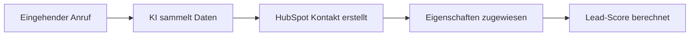

# HubSpot Integration mit KI-Telefonassistenten

Transformieren Sie Ihre HubSpot CRM-Strategie mit intelligenten Telefonassistenten. Famulor Automation verbindet Ihre Anrufe nahtlos mit HubSpot für automatisierte Lead-Erstellung, Deal-Management und personalisierte Kundenerlebnisse.

<Note>
**Sofortiger Start**: Die HubSpot-Integration ist in wenigen Minuten eingerichtet. Keine technischen Kenntnisse erforderlich.
</Note>

## Warum HubSpot + KI-Telefonassistent?

### 📈 Automatisierte Lead-Generierung
Jeder Anruf wird automatisch zu einem qualifizierten Lead in HubSpot mit vollständigen Kontaktdaten und Gesprächsnotizen.

### ⚡ Echtzeit CRM-Updates  
Ihre HubSpot-Daten werden während des Gesprächs aktualisiert - keine manuellen Dateneingaben mehr.

### 🎯 Personalisierte Kundenansprache
Nutzen Sie HubSpot-Daten für personalisierte Begrüßungen und kontextuelle Gespräche.

### 🔄 Vollautomatische Workflows
Triggern Sie HubSpot-Workflows automatisch basierend auf Anrufergebnissen.

## Hauptfunktionen der Integration

### 1. Automatische Kontakterstellung

**Wie es funktioniert:**


**Automatisch erfasste Informationen:**
- ✅ Name und Telefonnummer
- ✅ E-Mail-Adresse (falls angegeben)
- ✅ Firmenname und Position
- ✅ Produktinteresse
- ✅ Budget-Informationen
- ✅ Zeitrahmen für Entscheidung
- ✅ Gesprächsnotizen und Sentiment

### 2. Intelligente Deal-Erstellung und -Verfolgung

**Deal-Pipeline-Automatisierung:**

| Gesprächsergebnis | HubSpot-Aktion | Deal-Phase |
|-------------------|----------------|------------|
| 🔥 Hohes Interesse | Deal erstellt + Hot Lead Tag | Qualifikation |
| 💼 Budget bestätigt | Deal auf "Qualifiziert" | Präsentation |
| 📅 Demo gewünscht | Meeting geplant + Demo-Phase | Demo |
| 💰 Preis diskutiert | Angebot-Phase aktiviert | Verhandlung |
| ✅ Kaufentscheidung | Deal als gewonnen markiert | Abgeschlossen |

### 3. Marketing-Automatisierung

**E-Mail-Sequenzen automatisch starten:**

#### Nach Interessensbekundung:
```
Tag 0: Sofortige Dankeschön-E-Mail mit Ressourcen
Tag 1: Produktinformationen basierend auf Gesprächsthemen  
Tag 3: Case Study ähnlicher Kunden
Tag 7: Persönlicher Follow-up Anruf anbieten
Tag 14: Limited-Time Angebot (bei Qualifikation)
```

#### Nach Demo-Anfrage:
- **Sofort**: Demo-Bestätigung mit Kalenderlink
- **1h vor Demo**: Erinnerung mit Agenda
- **Nach Demo**: Follow-up mit Aufzeichnung und nächsten Schritten

### 4. Lead-Scoring und Qualifizierung

**Automatisches Lead-Scoring basierend auf Anruf:**

| Kriterium | Punkte | HubSpot-Eigenschaft |
|-----------|--------|-------------------|
| Budget > €10k | +50 | `phone_budget_qualified` |
| Entscheidungsbefugnis | +30 | `phone_decision_maker` |
| Zeitrahmen < 3 Monate | +25 | `phone_timeline_urgent` |
| Konkrete Anfrage | +20 | `phone_qualified_interest` |
| Lange Gesprächsdauer | +15 | `phone_engagement_high` |

## Praxisbeispiele: HubSpot + KI-Assistent

### Beispiel 1: Inbound-Lead-Qualifizierung

**Szenario:** Kunde ruft nach Website-Besuch an

**Automatischer Workflow:**
1. **Vor dem Anruf**: KI lädt HubSpot-Daten (Website-Aktivität, Downloads)
2. **Während des Anrufs**: Personalisierte Begrüßung "Ich sehe, Sie haben sich unseren ROI-Calculator angeschaut"
3. **Nach dem Anruf**: 
   - Kontakt-Score um +45 Punkte erhöht
   - "Demo-interessiert" Workflow getriggert
   - Sales-Rep automatisch benachrichtigt
   - Follow-up E-Mail in 2h geplant

### Beispiel 2: Kunden-Onboarding

**Szenario:** Neukunde ruft für Setup-Hilfe an

**Automatische Aktionen:**
- Kundentyp auf "Neukunde" gesetzt
- Onboarding-Workflow gestartet
- Account Manager zugewiesen
- Success Manager informiert
- Willkommens-E-Mail-Serie aktiviert

### Beispiel 3: Support zu Sales

**Szenario:** Support-Anruf entdeckt Upselling-Möglichkeit

**Intelligente Weiterleitung:**
- Opportunity automatisch erstellt
- Sales-Rep über warmen Lead informiert
- Cross-sell Produkt vorgemerkt
- Follow-up Call in 48h geplant

## Einrichtung in 5 Minuten

### Schritt 1: HubSpot App Store
1. Öffnen Sie HubSpot App Marketplace
2. Suchen Sie nach "Famulor Automation"
3. Klicken Sie "Installieren"

### Schritt 2: Authentifizierung
```
Berechtigungen gewähren für:
✅ Kontakte lesen/schreiben
✅ Deals lesen/schreiben  
✅ Unternehmen lesen/schreiben
✅ Eigenschaften verwalten
✅ Workflows triggern
```

### Schritt 3: Feldmapping konfigurieren
- Standard-Mappings sind vorkonfiguriert
- Custom Properties können individuell zugeordnet werden
- Workflow-Trigger definieren

### Schritt 4: Test & Go-Live
- Testanruf durchführen
- HubSpot-Integration validieren
- Produktive Nutzung starten

## Erweiterte Konfiguration

### Custom Properties für Telefon-Daten

**Empfohlene HubSpot Properties:**
```
Anruf-spezifische Felder:
- call_sentiment (Dropdown: Positiv, Neutral, Negativ)
- call_duration (Number: Gesprächsdauer in Minuten)
- call_interest_level (Number: 1-10 Interessensskala)
- call_budget_range (Dropdown: <1k, 1-10k, 10-50k, 50k+)
- call_decision_timeframe (Dropdown: Sofort, 1 Monat, 3 Monate, 6+ Monate)
- call_pain_points (Multi-select: Kosten, Zeit, Effizienz, Skalierung)
- call_next_steps (Text: Vereinbarte nächste Schritte)
```

### Workflow-Automatisierung

#### High-Value Lead Workflow:
```
Trigger: Kontakt erstellt UND Lead-Score > 75
Aktionen:
1. Sales-Rep sofort benachrichtigen (Slack/E-Mail)
2. "Hot Lead" Tag hinzufügen
3. Priorität auf "Hoch" setzen
4. Follow-up Task für Sales-Rep erstellen
5. Geschäftsführung über Qualified Lead informieren
```

#### Nurturing Workflow für kalte Leads:
```
Trigger: Kontakt erstellt UND Lead-Score < 25
Aktionen:
1. Nurturing E-Mail-Sequenz starten
2. Lead-Nurturing List hinzufügen
3. Monatlicher Check-up geplant
4. Content-Empfehlungen basierend auf Interesse
```

## ROI und Metriken

### Typische Verbesserungen mit HubSpot + KI-Assistent:

| Metrik | Ohne Integration | Mit Integration | Verbesserung |
|--------|------------------|-----------------|--------------|
| Lead Response Zeit | 4-24 Stunden | < 5 Minuten | **95% schneller** |
| Datenqualität | 60% (manuell) | 95% (automatisch) | **+58% Genauigkeit** |
| Sales Conversion | 12% | 28% | **+133% mehr Sales** |
| Admin Zeit/Anruf | 8 Minuten | 0 Minuten | **100% Zeitersparnis** |
| Lead-Verlust | 35% | 8% | **77% weniger Verlust** |

### Messbare KPIs in HubSpot:

**Anruf-Attribution Dashboard:**
- Anrufe zu Leads Conversion Rate
- Telefonisch generierte Pipeline
- Durchschnittliche Deal-Größe aus Anrufen  
- Zeit von Anruf zu Abschluss
- Customer Lifetime Value von Telefonkunden

## Häufige Fragen (FAQ)

<AccordionGroup>
  <Accordion title="Wie schnell werden HubSpot-Daten aktualisiert?">
    Alle Daten werden in Echtzeit synchronisiert. Kontakte sind typischerweise innerhalb von 2-5 Sekunden nach Anrufende in HubSpot verfügbar.
  </Accordion>

  <Accordion title="Können bestehende HubSpot-Workflows verwendet werden?">
    Ja, alle bestehenden HubSpot-Workflows können durch Anrufdaten getriggert werden. Sie können auch neue Workflows speziell für Telefoninteraktionen erstellen.
  </Accordion>

  <Accordion title="Was passiert bei Duplikaten?">
    Das System erkennt automatisch existierende Kontakte anhand von Telefonnummer oder E-Mail und aktualisiert diese, anstatt Duplikate zu erstellen.
  </Accordion>

  <Accordion title="Ist die Integration DSGVO-konform?">
    Ja, alle Datenübertragungen sind verschlüsselt und DSGVO-konform. Kunden können jederzeit der Speicherung widersprechen.
  </Accordion>

  <Accordion title="Welche HubSpot-Abos werden unterstützt?">
    Die Integration funktioniert mit allen HubSpot-Abos (Free, Starter, Professional, Enterprise). Erweiterte Features erfordern entsprechende HubSpot-Berechtigungen.
  </Accordion>
</AccordionGroup>

## Erfolgsgeschichten

### Case Study: TechCorp GmbH

**Herausforderung:** 300+ Anrufe/Monat, manuelle CRM-Eingabe kostet 40h/Woche

**Lösung:** HubSpot + KI-Assistent Integration

**Ergebnisse nach 3 Monaten:**
- ✅ **90% Zeitersparnis** bei CRM-Verwaltung
- ✅ **156% Steigerung** der Lead-Conversion  
- ✅ **€180.000 zusätzliche Pipeline** durch besseres Lead-Management
- ✅ **47% kürzere Sales-Zyklen** durch automatisierte Follow-ups

*"Die Integration hat unseren Vertriebsprozess revolutioniert. Wir verpassen keine Leads mehr und unsere Sales-Performance hat sich mehr als verdoppelt."* - Marcus Weber, Sales Director

### Case Study: ServicePlus AG

**Herausforderung:** Komplexe B2B-Sales mit langen Entscheidungszyklen

**Lösung:** Automatisierte HubSpot-Workflows für Nurturing

**Ergebnisse:**
- ✅ **34% mehr qualifizierte Leads** aus Telefonaten
- ✅ **€95.000 ARR Steigerung** durch besseres Lead-Nurturing
- ✅ **68% Reduzierung** der Lead-Response-Zeit

## Preise und Verfügbarkeit

### Kostenstruktur

| Feature | HubSpot Free | HubSpot Starter+ | Limitierungen |
|---------|--------------|------------------|---------------|
| **Basic Integration** | ✅ Kostenlos | ✅ Kostenlos | 100 Anrufe/Monat |
| **Advanced Workflows** | ❌ | ✅ Kostenlos | Unbegrenzt |
| **Custom Properties** | ❌ | ✅ Kostenlos | Unbegrenzt |
| **Premium Support** | ❌ | ✅ +€29/Monat | 24/7 Support |

<Note>
**Keine Setup-Gebühren**: Die Integration ist komplett kostenfrei einrichtbar. Sie zahlen nur für Ihre tatsächliche Anrufnutzung.
</Note>

## Sofort loslegen

<CardGroup cols={2}>
  <Card title="Integration starten" icon="play" href="https://app.famulor.de/integrations/hubspot">
    HubSpot-Integration in 5 Minuten einrichten
  </Card>
  <Card title="Demo buchen" icon="calendar" href="https://calendly.com/famulor/hubspot-demo">
    Live-Demo der HubSpot-Integration ansehen
  </Card>
  <Card title="Best Practices" icon="lightbulb" href="/automation-platform/integrations/crm#hubspot-best-practices">
    HubSpot-Optimierungstipps für maximalen ROI
  </Card>
  <Card title="Support kontaktieren" icon="headphones" href="mailto:support@famulor.io">
    Hilfe bei der Einrichtung erhalten
  </Card>
</CardGroup>

## Verwandte Integrationen

<CardGroup cols={3}>
  <Card title="Salesforce" icon="cloud" href="/automation-platform/integrations/einzelintegrations/salesforce">
    Enterprise CRM für große Organisationen
  </Card>
  <Card title="Gmail" icon="envelope" href="/automation-platform/integrations/einzelintegrations/gmail">
    E-Mail-Automatisierung nach Anrufen
  </Card>
  <Card title="Slack" icon="comments" href="/automation-platform/integrations/einzelintegrations/slack">
    Team-Benachrichtigungen über neue Leads
  </Card>
</CardGroup>

---

**Technischer Support**: Für detaillierte Hilfe bei der HubSpot-Integration kontaktieren Sie unser Expertenteam über [support@famulor.de](mailto:support@famulor.de) oder buchen Sie einen kostenlosen Setup-Call.

**Letzte Aktualisierung**: Januar 2024 | **HubSpot API Version**: v3 | **Famulor Integration Version**: 2.4.1