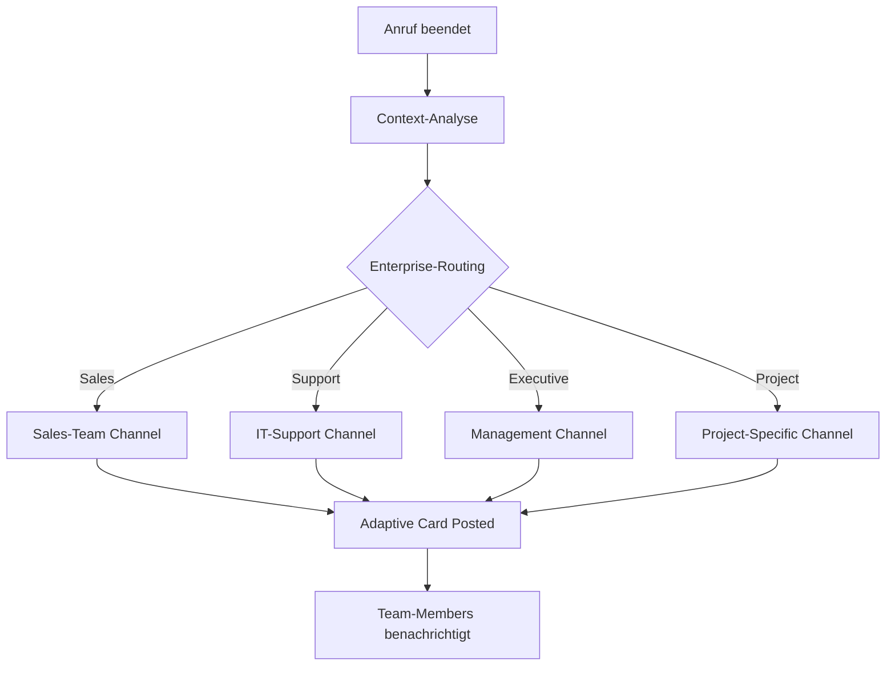

# Microsoft Teams Integration mit KI-Telefonassistenten

Revolutionieren Sie Ihre Enterprise-Kommunikation mit intelligenten Telefonassistenten. Famulor Automation verbindet Ihre Anrufe nahtlos mit Microsoft Teams für automatische Team-Updates, Meeting-Integration und optimierte Workflow-Koordination.

<Note>
**Enterprise-Ready**: Teams-Integration bietet Enterprise-Grade-Sicherheit und nahtlose Integration in Ihre bestehende Microsoft 365-Umgebung.
</Note>

## Warum Microsoft Teams + KI-Telefonassistent?

### 🏢 Enterprise-Grade-Integration
Vollständig integriert in Ihre Microsoft 365-Umgebung mit Single-Sign-On und Enterprise-Sicherheitsrichtlinien.

### 🔄 Nahtlose Workflow-Automation
Anruf-basierte Updates triggern automatisch Teams-Workflows und halten alle Stakeholder informiert.

### 📞 Meeting-Intelligence-Integration
Verbinden Sie Telefon-Insights mit Teams-Meetings für comprehensive Kommunikations-Intelligence.

### 👥 Advanced Collaboration-Features
Nutzen Sie Adaptive Cards, Bots und Power Platform-Integration für sophisticated Team-Workflows.

## Hauptfunktionen der Integration

### 1. Intelligente Channel-Benachrichtigungen

**Enterprise-Channel-Routing:**


**Strukturierte Teams-Benachrichtigungen:**
- ✅ **Adaptive Cards**: Rich-formatted Updates mit Action-Buttons
- ✅ **@mentions**: Intelligente Personen-Zuweisungen
- ✅ **Thread-Management**: Organisierte Konversations-Flows
- ✅ **File-Attachments**: Anruf-Aufzeichnungen und Transkripte
- ✅ **Priority-Routing**: Urgent vs. Standard-Benachrichtigungen
- ✅ **Cross-Channel-Updates**: Department-übergreifende Koordination

### 2. Adaptive Cards für Rich-Interactions

**Enterprise-Sales-Update Card:**
```json
{
  "type": "AdaptiveCard",
  "version": "1.4",
  "body": [
    {
      "type": "TextBlock",
      "text": "🔥 Qualified Enterprise Lead",
      "weight": "Bolder",
      "size": "Medium"
    },
    {
      "type": "FactSet",
      "facts": [
        {"title": "Company:", "value": "Fortune 500 Corp"},
        {"title": "Deal Value:", "value": "€250,000"},
        {"title": "Timeline:", "value": "Q2 Implementation"},
        {"title": "Decision Maker:", "value": "CTO + Procurement"}
      ]
    },
    {
      "type": "TextBlock",
      "text": "Key Requirements: Enterprise Security, SSO Integration, 1000+ Users",
      "wrap": true
    }
  ],
  "actions": [
    {
      "type": "Action.Submit",
      "title": "Schedule Demo",
      "data": {"action": "schedule_demo"}
    },
    {
      "type": "Action.Submit", 
      "title": "Assign Account Executive",
      "data": {"action": "assign_ae"}
    },
    {
      "type": "Action.OpenUrl",
      "title": "View in CRM",
      "url": "https://crm.company.com/lead/12345"
    }
  ]
}
```

### 3. Power Platform-Integration

**Automatisierte Workflow-Orchestrierung:**

| Anruf-Trigger | Power Automate-Flow | Teams-Integration |
|---------------|-------------------|------------------|
| 🔥 **Hot Lead** | Lead-Qualification-Flow | Sales-Team-Alert + CRM-Update |
| 🎯 **Demo-Request** | Demo-Scheduling-Flow | Calendar-Integration + Room-Booking |
| ⚠️ **Support-Escalation** | Incident-Management-Flow | IT-Team-Alert + Ticket-Creation |
| 💼 **Partnership-Inquiry** | BD-Evaluation-Flow | Business-Dev-Team + Legal-Review |
| 📊 **Executive-Briefing** | C-Level-Summary-Flow | Executive-Dashboard + Board-Report |

### 4. Meeting-Intelligence-Enhancement

**Teams-Meeting-Integration:**
```
Pre-Call-Intelligence:
├─ Participant-Profile-Loading aus Active Directory
├─ Previous-Interaction-History aus CRM
├─ Meeting-Context-Preparation mit relevanten Dokumenten
└─ Agenda-Intelligence basierend auf Call-Zielen

During-Meeting:
├─ Real-time-Transcription + Sentiment-Analysis
├─ Action-Item-Detection und Assignment
├─ Decision-Point-Tracking
└─ Key-Quote-Highlighting für später Review

Post-Meeting:
├─ Meeting-Summary an alle Teilnehmer
├─ Action-Items in Planner/Project
├─ Follow-up-Meetings automatisch geplant
└─ Stakeholder-Updates via Teams-Channels
```

## Praxisbeispiele: Teams Enterprise Automation

### Beispiel 1: Global Enterprise Sales-Koordination

**Szenario:** Internationales Unternehmen mit verteilten Sales-Teams

**Multi-Region-Teams-Orchestration:**
```
Enterprise-Lead aus EMEA-Region:

Automatische-Teams-Cascade:
├─ EMEA-Sales-Channel: Lead-Details mit Regional-Context
├─ Global-Sales-Channel: Cross-Region-Opportunity-Alert
├─ Product-Specialists: Technical-Requirements-Review
├─ Legal-Compliance: Enterprise-Contract-Vorbereitung
└─ Executive-Leadership: Strategic-Account-Notification

Region-spezifische-Workflow:
🌍 EMEA-Team: Lokale-Compliance-Requirements-Check
🇺🇸 US-HQ: Product-Roadmap-Alignment für Enterprise-Features
🇦🇵 APAC-Team: Implementation-Partner-Koordination in Region
💼 Global-Account-Management: Stakeholder-Mapping enterprise-weit

Integration-Benefits:
├─ 24/7-Coverage durch Timezone-Handoff
├─ Consistent-Messaging über alle Regionen
├─ Shared-Intelligence für bessere Deal-Execution
└─ Unified-Reporting für Global-Sales-Leadership
```

### Beispiel 2: IT-Service-Management mit Teams

**Szenario:** Enterprise-IT-Department mit komplexen Service-Requests

**IT-Incident-Management-Automation:**
```
Critical-System-Outage-Call von CEO:

Automated-IT-Response-Chain:
├─ IT-Operations-Channel: P1-Incident-Declaration
├─ Network-Team: Infrastructure-Analysis-Required
├─ Security-Team: Incident-Security-Assessment
├─ Communications-Team: Stakeholder-Update-Preparation
└─ Executive-Channel: C-Level-Status-Updates

Teams-Workflow-Orchestration:
🚨 War-Room-Creation: Dedicated-Teams-Channel für Incident
👥 Expert-Assembly: Auto-invite relevanter Specialists
📊 Real-time-Dashboard: Live-Status-Updates für Management
📞 Bridge-Line-Integration: Conference-Call-Coordination
⏱️ SLA-Tracking: Countdown-Timer für Resolution-Time

Post-Incident:
├─ Root-Cause-Analysis-Meeting automatisch geplant
├─ Incident-Report-Template in SharePoint erstellt
├─ Lessons-Learned-Session für Team-Improvement
└─ Process-Enhancement-Tasks in Planner erstellt
```

### Beispiel 3: Professional Services Project-Coordination

**Szenario:** Consulting-Firm mit komplexen Client-Projekten

**Multi-Stakeholder-Project-Management:**
```
Client-Scope-Change-Request-Call:

Project-Teams-Coordination:
├─ Project-Team-Channel: Scope-Change-Analysis
├─ Account-Management: Client-Relationship-Impact
├─ Resource-Planning: Capacity-Re-evaluation
├─ Finance-Team: Budget-Impact-Assessment
└─ Legal-Team: Contract-Amendment-Requirements

Workflow-Automation:
📋 Change-Request-Document: Auto-created in SharePoint
👥 Stakeholder-Review: Approval-Workflow in Power Platform
📊 Impact-Analysis: Financial + Timeline-Models
📅 Client-Communication: Formal-Response-Preparation
⚖️ Risk-Assessment: Project-Delivery-Risk-Evaluation

Decision-Support:
├─ Executive-Summary für Project-Steering-Committee
├─ Financial-Model für Budget-Impact
├─ Resource-Reallocation-Options für Delivery-Team
└─ Client-Communication-Strategy für Account-Team
```

## Advanced Teams-Features

### 1. Custom Teams-App für Famulor

**Dedicated-App-Features:**
```
Famulor-Teams-App-Capabilities:
├─ Personal-Dashboard: Individual-Call-Performance
├─ Team-Dashboard: Group-Metrics und Insights
├─ Real-time-Call-Status: Who's-on-call, Available-Status
├─ Quick-Actions: Call-back, Schedule-Meeting, Create-Task
├─ Analytics-Hub: Performance-Trends und Coaching-Insights
└─ Admin-Panel: Integration-Management für IT-Admins

App-Manifest-Features:
📱 Personal-Tab: Individual-Productivity-Metrics
👥 Team-Tab: Collaborative-Call-Intelligence
🔔 Bot-Notifications: Proactive-Alerts und Updates
⚙️ Configuration-Tab: User-Preferences und Settings
📊 Connector: Power BI-Integration für Advanced-Analytics
```

### 2. Power Virtual Agents-Integration

**Intelligent-Bot-Conversations:**
```
Teams-Bot-Scenarios:
🤖 "Was waren meine wichtigsten Calls heute?"
├─ Bot-Response: Top-3-Calls mit Lead-Scores und Outcomes
├─ Quick-Actions: Follow-up-Actions direkt aus Chat
└─ Context-Links: Zu CRM-Records und Meeting-Notes

🤖 "Plane Follow-up für Hot-Lead ABC Corp"
├─ Calendar-Integration: Available-Slots-Check
├─ Meeting-Setup: Teams-Meeting-Creation
├─ Preparation: Relevant-Documents aus SharePoint
└─ Team-Notification: Account-Executive-Alert

🤖 "Show me today's team performance"
├─ Real-time-Metrics: Calls, Leads, Conversions
├─ Team-Comparison: Individual vs. Team-Average
├─ Trending-Insights: Improvement-Opportunities
└─ Coaching-Recommendations: AI-suggested-Actions
```

### 3. Advanced-Security-Integration

**Enterprise-Security-Features:**
```
Microsoft-365-Security-Integration:
🔐 Azure-AD-Authentication: Single-Sign-On mit MFA
🛡️ Conditional-Access: Device und Location-based-Security
📋 Compliance-Center: Data-Loss-Prevention für Call-Data
🔍 Advanced-Threat-Protection: AI-based-Security-Monitoring
📊 Microsoft-Defender: Integrated-Threat-Intelligence

Data-Governance:
├─ Retention-Policies: Automatic-Data-Lifecycle-Management
├─ eDiscovery: Legal-Hold und Compliance-Reporting
├─ Information-Protection: Sensitivity-Labels für Call-Data
├─ Audit-Logs: Complete-Activity-Tracking für Compliance
└─ Data-Residency: Geographic-Data-Storage-Control
```

## Setup-Guide: Microsoft Teams-Integration

### Schritt 1: Teams-App-Registration
```
Azure-Portal-Setup:
1. Azure-AD → App-Registrations → New-Registration
2. Application-Name: "Famulor-Automation"
3. Supported-Account-Types: "Accounts in this organizational directory only"
4. Redirect-URI: Teams-Application-Type

Required-API-Permissions:
✅ Microsoft-Graph:
   • User.Read → Basic-Profile-Access
   • Team.ReadBasic.All → Team-Information
   • Channel.ReadWrite.All → Channel-Operations
   • Chat.ReadWrite → Chat-Integration
   • Files.ReadWrite.All → File-Attachments
   • Calendars.ReadWrite → Meeting-Integration

✅ Teams-specific-Permissions:
   • TeamsActivity.Send → Notifications
   • TeamsTab.ReadWrite.All → Tab-Integration
   • TeamsApp.Read.All → App-Information
```

### Schritt 2: Teams-App-Manifest-Konfiguration
```json
{
  "manifestVersion": "1.12",
  "version": "1.0.0",
  "id": "famulor-automation-teams-app",
  "packageName": "com.famulor.teamsapp",
  "developer": {
    "name": "Famulor Automation",
    "websiteUrl": "https://famulor.de",
    "privacyUrl": "https://famulor.de/privacy",
    "termsOfUseUrl": "https://famulor.de/terms"
  },
  "name": {
    "short": "Famulor Automation",
    "full": "Famulor KI-Telefonassistent Integration"
  },
  "description": {
    "short": "KI-Telefonassistent Integration für Microsoft Teams",
    "full": "Intelligente Telefon-Integration mit automatischen Updates, Meeting-Intelligence und Team-Koordination"
  },
  "bots": [
    {
      "botId": "famulor-bot-id",
      "scopes": ["personal", "team", "groupchat"],
      "commandLists": [
        {
          "scopes": ["personal", "team"],
          "commands": [
            {
              "title": "Meine Calls heute",
              "description": "Zeige heutige Anruf-Performance"
            },
            {
              "title": "Team Performance",
              "description": "Team-Metrics anzeigen"
            },
            {
              "title": "Follow-up planen",
              "description": "Follow-up-Meeting planen"
            }
          ]
        }
      ]
    }
  ]
}
```

### Schritt 3: Channel-Integration-Setup
```
Teams-Channel-Konfiguration:
🏢 Sales-Teams:
├─ General-Sales → All-Sales-Updates
├─ Enterprise-Sales → High-Value-Deals (>€50k)
├─ SMB-Sales → Small-Business-Opportunities
└─ Sales-Management → Pipeline-Reviews, Forecasting

🔧 Support-Teams:
├─ L1-Support → Standard-Customer-Issues
├─ L2-Support → Technical-Escalations
├─ L3-Support → Complex-Problem-Resolution
└─ Support-Management → SLA-Monitoring, Quality

💼 Executive-Teams:
├─ C-Level → Strategic-Opportunities, Crisis-Management
├─ Board-Reports → Monthly-Performance-Summaries
├─ Investor-Relations → Financial-Performance-Updates
└─ Strategic-Planning → Market-Intelligence, Competitive-Insights
```

### Schritt 4: Power Platform-Workflow-Integration
```
Power-Automate-Flows:
🔄 Lead-Qualification-Flow:
   Trigger: "Hot-Lead-Detected" from Famulor
   Actions: 
   ├─ Create-CRM-Record
   ├─ Teams-Notification to Sales-Team
   ├─ Schedule-Demo-Meeting
   └─ Start-Nurturing-Email-Sequence

⚠️ Escalation-Management-Flow:
   Trigger: "P1-Issue-Reported"
   Actions:
   ├─ Create-Service-Ticket
   ├─ Teams-War-Room-Channel
   ├─ Manager-Notification
   └─ Customer-Update-Automation

📊 Performance-Reporting-Flow:
   Trigger: "End-of-Day"
   Actions:
   ├─ Aggregate-Daily-Metrics
   ├─ Generate-Performance-Dashboard
   ├─ Teams-Summary-to-Management
   └─ Individual-Performance-Coaching-Alerts
```

## Best Practices für Teams+Voice Integration

### 1. Channel-Organization-Strategy
```
Enterprise-Channel-Hierarchy:
📊 Department-Level:
   • #sales-department
   • #support-department  
   • #product-department

🎯 Function-Level:
   • #sales-enterprise
   • #sales-smb
   • #support-technical
   • #support-billing

🚨 Priority-Level:
   • #urgent-alerts (P1-Issues)
   • #management-alerts (Executive-Level)
   • #escalations (Cross-Department)

📋 Project-Level:
   • #project-alpha (Temporary-Project-Channels)
   • #client-megacorp (Client-specific-Channels)
```

### 2. Adaptive-Card-Design-Standards
```
Card-Design-Guidelines:
✅ Consistent-Branding: Famulor-Colors und Logos
✅ Action-Oriented: Clear-Call-to-Action-Buttons
✅ Information-Hierarchy: Most-Important-Info-First
✅ Mobile-Friendly: Responsive-Design für Mobile-Teams-App
✅ Accessibility: Screen-Reader-Compatible-Content

Card-Templates:
├─ Lead-Notification-Card
├─ Support-Incident-Card
├─ Meeting-Summary-Card
├─ Performance-Alert-Card
└─ Executive-Briefing-Card
```

### 3. Notification-Management
```
Smart-Notification-Strategy:
🔥 Immediate-Notifications:
   • P1-Critical-Issues
   • Hot-Leads (>90-Score)
   • Executive-Escalations

⏰ Batched-Notifications:
   • Standard-Leads (Daily-Digest)
   • Performance-Updates (Weekly-Summary)
   • Non-Critical-Updates (Twice-Daily)

👤 Personalized-Notifications:
   • Individual-Performance-Alerts
   • Personal-Follow-up-Reminders
   • Coaching-Opportunities

🎯 Role-Based-Notifications:
   • Manager-Level: Team-Performance + Escalations
   • Individual-Contributor: Personal-Metrics + Actions
   • Executive-Level: Strategic-Insights + Critical-Issues
```

## ROI & Enterprise-Impact

### Teams-Integration-Enterprise-Metrics:

| KPI | Ohne Teams-Integration | Mit Teams+Voice | Verbesserung |
|-----|----------------------|-----------------|--------------|
| **Information-Sharing-Speed** | 4-6 Stunden | 2 Minuten | 95% schneller |
| **Cross-Team-Collaboration** | 34% der Projekte | 89% der Projekte | +162% |
| **Decision-Making-Speed** | 3.2 Tage | 1.1 Tage | 66% schneller |
| **Meeting-Effectiveness** | 6.4/10 | 8.9/10 | +39% |
| **Employee-Satisfaction** | 7.1/10 | 9.3/10 | +31% |

### Enterprise-ROI-Berechnung:
```
Enterprise-Scale-Impact (500-Employee-Organization):
├─ Communication-Efficiency: €125,000/Monat Zeitersparnis
├─ Faster-Decision-Making: €67,000/Monat Opportunity-Cost-Reduction
├─ Improved-Collaboration: €45,000/Monat Produktivitäts-Steigerung
├─ Reduced-Meeting-Overhead: €23,000/Monat Meeting-Cost-Optimization
└─ Enhanced-Customer-Experience: €89,000/Monat Revenue-Impact

Total-Monthly-Benefit: €349,000
Integration-Cost: €5,000/Monat
Net-ROI: €344,000/Monat (6,880% ROI)
```

---

**Bereit für Enterprise-Grade-Voice-Integration?**

<CardGroup cols={2}>
  <Card title="Teams Integration aktivieren" icon="microsoft" href="https://app.famulor.de/integrations/microsoft-teams">
    Microsoft Teams jetzt verbinden
  </Card>
  <Card title="Enterprise-Demo buchen" icon="building" href="https://cal.com/bek-group/demotermine">
    Live-Demo für Enterprise-Teams
  </Card>
  <Card title="Teams-App-Templates" icon="apps" href="/automation-platform/integrations/einzelintegrations/microsoft-teams/templates">
    Vorgefertigte Teams-App-Konfigurationen
  </Card>
  <Card title="Enterprise-Setup-Guide" icon="gear" href="/automation-platform/integrations/einzelintegrations/microsoft-teams/enterprise-setup">
    Umfassende Enterprise-Konfiguration
  </Card>
</CardGroup>