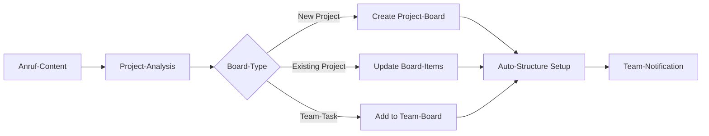

# Monday.com Integration mit KI-Telefonassistenten

Revolutionieren Sie Ihr Projektmanagement mit der visuellen Power von Monday.com. Famulor Automation verbindet Ihre KI-Telefonassistenten mit Monday.com für automatische Item-Erstellung, intelligente Board-Updates und nahtlose Team-Koordination in farbcodierten Workflows.

<Note>
**Visual Work OS**: Monday.com bietet eine intuitive, farbkodierte Oberfläche, die komplexe Projekte übersichtlich und für alle Teammitglieder verständlich macht.
</Note>

## Warum Monday.com + KI-Telefonassistent?

### 🎨 Visuelle Projekt-Klarheit
Jeder Anruf wird automatisch in übersichtliche Monday.com-Items mit farbcodierten Status und klaren Verantwortlichkeiten umgewandelt.

### 📊 Real-time Team-Synchronisation
Ihre Monday.com-Boards werden während des Gesprächs aktualisiert - alle Teammitglieder sehen Änderungen sofort im visuellen Dashboard.

### 🔄 Flexible Workflow-Anpassung
Anpassbare Board-Strukturen, Custom-Columns und Automatisierungen für jede Team-Dynamik und Arbeitsweise.

### ⚡ Intelligente Ressourcen-Planung
Automatische Team-Kapazitäts-Analyse und intelligente Task-Verteilung basierend auf Verfügbarkeit und Skills.

## Hauptfunktionen der Integration

### 1. Intelligente Item & Board-Erstellung

**Smart Board-Management:**


**Verfügbare Monday.com-Aktionen:**
- ✅ **Create Board**: Neue Projekt-Boards aus komplexen Anrufen
- ✅ **Create Item**: Automatische Item-Erstellung mit Rich-Properties
- ✅ **Update Item**: Status-Updates basierend auf Anruf-Outcome
- ✅ **Create Group**: Projekt-Phasen und Team-Bereiche organisieren
- ✅ **Add Update**: Anruf-Notizen als Item-Updates
- ✅ **Set Status**: Intelligente Status-Progression
- ✅ **Assign Person**: Smart Team-Member-Assignment

### 2. Visual Workflow-Orchestration

**Farbkodierte Projekt-Flows:**
```
Anruf-Input: "Neues Marketing-Projekt - Produktlaunch Q2"

Automatisches Monday.com-Setup:
🎨 Board: "Q2 Produktlaunch - Marketing Campaign"

📊 Board-Structure:
├─ 🎯 Group: "Strategy & Planning"
│   ├─ 📝 Item: "Market Research" [Status: Working on it 🟡]
│   ├─ 📝 Item: "Competitor Analysis" [Status: Stuck 🔴]
│   └─ 📝 Item: "Target Audience Definition" [Status: Done ✅]
├─ 🎨 Group: "Creative Development"
│   ├─ 📝 Item: "Brand Guidelines" [Status: Not started ⚪]
│   ├─ 📝 Item: "Visual Assets Creation" [Status: Working on it 🟡]
│   └─ 📝 Item: "Video Production" [Status: Not started ⚪]
└─ 🚀 Group: "Launch Execution"
    ├─ 📝 Item: "Campaign Setup" [Status: Not started ⚪]
    ├─ 📝 Item: "Performance Monitoring" [Status: Not started ⚪]
    └─ 📝 Item: "Results Analysis" [Status: Not started ⚪]

Custom-Columns automatisch erstellt:
├─ 👤 Person: [Team-Assignment basierend auf Skills]
├─ 📅 Timeline: [Deadline-Calculation from Launch-Date]
├─ 💰 Budget: [Budget-Allocation per Phase]
├─ 🎯 Priority: [AI-assessed Priority-Level]
├─ 🏷️ Tags: [Auto-Tags: Marketing, Q2, Produktlaunch]
└─ 📊 Progress: [Percentage-Tracker]
```

### 3. Advanced Team-Coordination

**Smart Resource-Management:**
```
Team-Capacity-Intelligence:
👥 Available Team-Members:
├─ Sarah (Marketing): 70% Capacity, Skill: Strategy ⭐⭐⭐
├─ Mike (Design): 40% Capacity, Skill: Creative ⭐⭐⭐⭐
├─ Lisa (Development): 90% Capacity, Skill: Technical ⭐⭐⭐
└─ Tom (Project Manager): 60% Capacity, Skill: Coordination ⭐⭐⭐⭐

Automatische Assignment-Logic:
🎯 "Strategy Tasks" → Sarah (Marketing Lead)
🎨 "Creative Tasks" → Mike (Design Expert)
⚙️ "Technical Tasks" → Lisa (Development)
📋 "Coordination Tasks" → Tom (PM)

Workload-Balancing:
⚖️ Overloaded Members → Task-Redistribution-Suggestions
📊 Capacity-Reports → Weekly Team-Utilization-Analysis
🔄 Skill-Gap-Identification → Training-Recommendations
```

### 4. Timeline & Milestone-Management

**Intelligent Project-Scheduling:**
```
Anruf: "Projekt muss bis Ende März fertig sein"

Monday.com Timeline-Creation:
📅 Project Timeline: 12 Wochen (Jan 1 - Mar 31)

Automatische Milestone-Berechnung:
🎯 Week 2: Strategy Phase Complete
🎯 Week 4: Creative Concepts Approved  
🎯 Week 8: Development Phase Done
🎯 Week 10: Testing & QA Complete
🎯 Week 12: Launch & Go-Live

Dependencies automatisch gesetzt:
├─ Creative Phase → Strategy Approval Required
├─ Development → Creative Assets Ready
├─ Testing → Development Complete
└─ Launch → All Previous Phases Done

Buffer-Time-Management:
⏰ 20% Buffer für unvorhergesehene Delays
🚨 Risk-Factors: Holidays, Team-Availability
📊 Timeline-Optimization-Suggestions
```

## Praxisbeispiele: Monday.com Voice Automation

### Beispiel 1: Event-Management-Agentur

**Szenario:** Event-Agentur organisiert Corporate-Events

**Voice-to-Monday.com Event-Orchestration:**
```
Client-Call: "Firmen-Event für 200 Personen, Budget 50k€, Termin in 8 Wochen"

Monday.com Event-Board:
📋 Board: "Corporate Event ABC Corp - 200 Pax"

🎪 Event-Overview-Group:
├─ 📝 Client Info: ABC Corp [Status: Confirmed ✅]
├─ 📝 Event Details: 200 Guests, €50k Budget [Status: Working on it 🟡]
├─ 📝 Venue Search: [Status: Working on it 🟡]
└─ 📝 Date Confirmation: [Status: Done ✅]

🍽️ Catering-Group:
├─ 📝 Menu Planning: [Assigned: Chef Sarah]
├─ 📝 Dietary Requirements: [Status: Gathering info 🟡]
├─ 📝 Service Staff: [Status: Not started ⚪]
└─ 📝 Equipment Rental: [Status: Not started ⚪]

🎵 Entertainment-Group:
├─ 📝 Band/DJ Booking: [Assigned: Entertainment Manager]
├─ 📝 Sound System: [Status: Working on it 🟡]
├─ 📝 Lighting Setup: [Status: Not started ⚪]
└─ 📝 Stage Design: [Status: Not started ⚪]

📊 Custom-Columns:
├─ 💰 Cost: [Budget-Tracking per Item]
├─ 🔗 Vendor: [Supplier-Information]
├─ 📞 Contact: [Responsible Person]
├─ ⚠️ Risk Level: [Low/Medium/High]
└─ ✅ Client Approval: [Approval-Status]
```

### Beispiel 2: Software-Development mit Agile-Workflows

**Szenario:** Development-Team mit Sprint-Management

**Agile-Sprint-Board:**
```
Product-Owner-Call: "User-Story: Dashboard mit Real-time Analytics"

Monday.com Sprint-Board:
🏃‍♂️ Board: "Sprint 15 - Analytics Dashboard"

📋 Sprint-Backlog-Group:
├─ 📝 Epic: Analytics Dashboard [Story Points: 21]
├─ 📝 User-Story: Dashboard-Layout [Points: 8, Assigned: Frontend-Dev]
├─ 📝 User-Story: API-Integration [Points: 5, Assigned: Backend-Dev]
├─ 📝 User-Story: Real-time Updates [Points: 8, Assigned: Full-Stack-Dev]
└─ 📝 Task: Testing & QA [Points: 3, Assigned: QA-Engineer]

🔄 Sprint-Status-Groups:
├─ 📋 To Do: [Backlog Items]
├─ 🟡 In Progress: [Active Development]
├─ 🔍 In Review: [Code Review Phase]
├─ 🧪 Testing: [QA Phase]
└─ ✅ Done: [Completed Items]

📊 Sprint-Metrics-Columns:
├─ 📈 Story Points: [Estimation]
├─ ⏱️ Time Spent: [Actual Hours]
├─ 🔥 Priority: [High/Medium/Low]
├─ 🏷️ Component: [Frontend/Backend/API]
└─ 🐛 Bug Count: [Quality-Metrics]

Automation-Rules aktiviert:
🔄 Status "Done" → Move to Next Group
📧 Blocker-Status → Notify Scrum Master
⏰ Sprint-End → Generate Retrospective-Board
📊 Daily-Standup → Progress-Update-Summary
```

### Beispiel 3: Marketing-Agentur Campaign-Management

**Szenario:** Multi-Client Campaign-Koordination

**Campaign-Portfolio-Management:**
```
Strategy-Call: "Q2 Kampagnen für 5 Clients parallel"

Monday.com Campaign-Overview:
📊 Master-Board: "Q2 Campaign Portfolio"

👥 Client-Groups (farbkodiert):
├─ 🔵 Client A: Tech-Startup (Budget: €20k)
├─ 🟢 Client B: E-Commerce (Budget: €35k)  
├─ 🟡 Client C: Healthcare (Budget: €15k)
├─ 🟠 Client D: Finance (Budget: €50k)
└─ 🔴 Client E: Education (Budget: €10k)

📈 Campaign-Phase-Tracking:
├─ 🎯 Strategy: [Research, Planning, Approval]
├─ 🎨 Creative: [Concept, Design, Production]
├─ 📊 Media: [Planning, Buying, Optimization]
├─ 🚀 Launch: [Setup, Go-Live, Monitoring]
└─ 📈 Analysis: [Reporting, Optimization, Insights]

Cross-Client-Resource-Management:
👥 Team-Utilization-Dashboard:
├─ Strategist: 85% (leicht überlastet)
├─ Creative-Director: 70% (optimal)
├─ Media-Buyer: 60% (verfügbar)
├─ Account-Manager: 90% (überlastet)
└─ Analyst: 50% (unterausgelastet)

Workload-Balancing-Automation:
⚖️ Automatic Task-Redistribution
📊 Weekly Capacity-Reports
🔄 Client-Priority-Balancing
🎯 Skill-based Assignment-Optimization
```

## Setup-Guide: Monday.com-Integration

### Schritt 1: Monday.com-Workspace vorbereiten
```
Monday.com-Account-Setup:
1. Workspace für Voice-Integration erstellen
2. Board-Templates definieren:
   ├─ 📋 Project-Management-Template
   ├─ 🎯 Sales-Pipeline-Template
   ├─ 🚀 Product-Development-Template
   ├─ 📊 Marketing-Campaign-Template
   └─ 🛠️ Support-Ticketing-Template

3. Custom-Column-Types konfigurieren:
   ├─ 📞 Call-Reference (Text)
   ├─ ⭐ Call-Priority (Status)
   ├─ 💰 Revenue-Impact (Numbers)
   ├─ 📅 Follow-up-Date (Date)
   └─ 🏷️ Call-Tags (Tags)
```

### Schritt 2: API-Integration aktivieren
```
Monday.com-API-Setup:
1. Admin → Developer → API
2. Generate API Token:
   ✅ Full Board Access
   ✅ Create/Update Items
   ✅ Manage Columns
   ✅ Team Management
   ✅ Automation Access

3. Board-IDs sammeln:
   - Main-Project-Board: 12345678
   - CRM-Pipeline-Board: 87654321
   - Support-Board: 11223344

4. Permission-Testing durchführen
```

### Schritt 3: Famulor-Monday.com-Mapping
```
In Famulor Dashboard:
1. Integrations → Monday.com
2. API-Token einfügen
3. Default-Board konfigurieren
4. Item-Mapping einrichten:

Voice-Intent-Mapping:
├─ "New Project" → Create Project-Board + Structure
├─ "Client Update" → Update existing Client-Item
├─ "Bug Report" → Create Item in Support-Board
├─ "Team Meeting" → Create Meeting-Item with Updates
└─ "Sales Call" → Update CRM-Pipeline-Item

Status-Mapping:
├─ "Call completed" → Status: "Working on it"
├─ "Issue resolved" → Status: "Done"
├─ "Problem identified" → Status: "Stuck"
├─ "Waiting for feedback" → Status: "Waiting for someone"
└─ "Project started" → Status: "Working on it"
```

### Schritt 4: Automation & Workflow-Setup
```
Monday.com-Automations aktivieren:
📥 When Item-Status Changes:
├─ "Done" → Notify Team + Move to Archive
├─ "Stuck" → Alert Project Manager
├─ "Waiting" → Set Reminder for Follow-up
└─ "Working" → Start Time-Tracking

📧 Notification-Rules:
├─ High-Priority Items → Immediate Slack-Alert
├─ Deadline-Approaching → Daily E-mail-Reminder
├─ Budget-Threshold → Finance-Team-Notification
└─ Client-Items → Account-Manager-Update

🔄 Cross-Board-Automation:
├─ Project-Complete → Update Client-Board
├─ Support-Ticket-Closed → Update Client-Satisfaction
├─ Sales-Won → Create Project-Board
└─ Team-Member-Overloaded → Workload-Redistribution
```

## Performance & Visual-ROI

### Monday.com-Integration-Benefits:

| Visualisierungs-Metrik | Ohne Integration | Mit Monday.com+Voice | Verbesserung |
|------------------------|------------------|---------------------|--------------|
| **Project-Visibility** | 35% Team-Overview | 95% Full-Transparency | +171% |
| **Task-Creation-Zeit** | 10-15 min | 1-2 min | 90% Reduktion |
| **Status-Update-Frequenz** | Wöchentlich | Real-time | Kontinuierlich |
| **Team-Alignment** | 60% auf gleicher Seite | 92% synchronized | +53% |
| **Deadline-Adherence** | 68% | 87% | +28% |

### Visual-Productivity-ROI:
```
Visual-Management-Gains (15-Person-Team):
├─ Project-Setup-Zeit: 8h/Woche gespart
├─ Status-Update-Meetings: 12h/Woche reduziert
├─ Task-Coordination-Efficiency: 15h/Woche
├─ Deadline-Miss-Prevention: 6h/Woche (weniger Fire-Fighting)

Financial-Impact:
├─ Time-Savings: €2,850/Woche (41h × €70/h)
├─ Improved-Delivery: €1,200/Woche (weniger Delays)
├─ Better-Client-Satisfaction: €800/Woche
├─ Monday.com+Integration-Costs: €400/Woche
├─ Net-Benefit: €4,450/Woche
└─ Annual-ROI: €231,400 (1,213% ROI)
```

## Visual-Excellence & Team-Adoption

### 1. Color-Coding & Visual-Hierarchy

**Smart Visual-Organization:**
```
Color-Psychology in Monday.com:
🔴 High-Priority: Urgent, Blockers, Critical-Issues
🟠 Medium-Priority: Important, Deadlines-Approaching
🟡 In-Progress: Active-Work, Under-Review
🟢 Completed: Done, Approved, Delivered
🔵 Planning: Future-Work, Ideas, Backlog
🟣 Waiting: Dependencies, External-Factors

Visual-Cues für Voice-Integration:
📞 Call-Generated-Items: Special Phone-Icon
🤖 AI-Created: Robot-Icon für Auto-generated
⚡ High-Impact: Lightning-Icon für Revenue-Critical
👥 Team-Decision: Group-Icon für Collaborative-Items
```

### 2. Dashboard & Reporting-Excellence

**Executive-Dashboards:**
```
C-Level-Dashboard-Views:
📊 Portfolio-Overview:
├─ Active-Projects-Heat-Map
├─ Team-Utilization-Metrics
├─ Revenue-Pipeline-Visualization
├─ Client-Satisfaction-Scores
└─ Deadline-Risk-Assessment

📈 Performance-Widgets:
├─ Project-Completion-Rates
├─ Budget-vs-Actual-Tracking
├─ Team-Productivity-Trends
├─ Client-Retention-Metrics
└─ Innovation-Pipeline-Status
```

---

**Bereit für visuelles Projektmanagement?**

<CardGroup cols={2}>
  <Card title="Monday.com Integration starten" icon="monday" href="https://app.famulor.de/integrations/monday">
    Monday.com jetzt mit KI-Assistenten verbinden
  </Card>
  <Card title="Visual-Workflow Demo" icon="presentation-screen" href="https://cal.com/bek-group/demotermine">
    Live-Demo der visuellen Projektmanagement-Power
  </Card>
  <Card title="Board-Templates" icon="grid-2" href="/automation-platform/integrations/einzelintegrations/monday/templates">
    Vorgefertigte Monday.com-Board-Strukturen
  </Card>
  <Card title="Visual-ROI-Calculator" icon="chart-line" href="/automation-platform/integrations/einzelintegrations/monday/visual-roi">
    Berechnen Sie Ihren Visual-Management-ROI
  </Card>
</CardGroup>