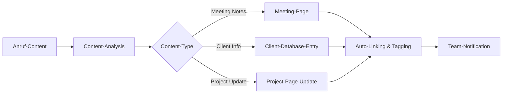

# Notion Integration mit KI-Telefonassistenten

Revolutionieren Sie Ihr Workspace-Management mit der All-in-One-Power von Notion. Famulor Automation verbindet Ihre KI-Telefonassistenten mit Notion für automatische Seiten-Erstellung, intelligente Datenbank-Updates und nahtlose Wissens-Organisation.

<Note>
**All-in-One-Workspace**: Notion vereint Notizen, Dokumente, Datenbanken, Wikis und Projektmanagement in einer einzigen, flexiblen Plattform.
</Note>

## Warum Notion + KI-Telefonassistent?

### 📚 Intelligente Wissensdatenbank
Jeder Anruf wird automatisch als strukturierte Notion-Page mit korrekten Tags, Kategorien und Verknüpfungen gespeichert.

### 🔗 Vernetzte Information-Architecture
Automatische Verknüpfung von Anruf-Inhalten mit bestehenden Kunden-Pages, Projekten und Team-Dokumentation.

### ⚡ Flexible Content-Strukturierung
Anpassbare Seiten-Templates, Datenbank-Properties und Relations für jede Geschäftsanforderung.

### 👥 Collaborative Knowledge-Building
Teams können Anruf-Insights sofort kommentieren, erweitern und in größere Wissens-Strukturen einbetten.

## Hauptfunktionen der Integration

### 1. Automatische Page & Database-Erstellung

**Intelligent Content-Generation:**


**Verfügbare Notion-Aktionen:**
- ✅ **Create Page**: Automatische Seiten-Erstellung mit Rich-Content
- ✅ **Update Page**: Bestehende Seiten um Anruf-Insights erweitern
- ✅ **Create Database Item**: Neue Datensätze mit strukturierten Properties
- ✅ **Update Database Item**: Datenbank-Entries mit Anruf-Updates
- ✅ **Query Database**: Intelligente Datenbank-Suche für Context
- ✅ **Add Comment**: Anruf-Notizen als Comments zu Pages

### 2. Smart Template-System

**Anruf-basierte Template-Auswahl:**
```
Gespräch-Type: "Kundenmeeting mit ABC Corp"

Automatisch aktiviertes Template:
📄 Template: "Client Meeting Notes"
├─ 🏢 Client: ABC Corp (Auto-linked)
├─ 📅 Date: [Today's Date]
├─ 👥 Attendees: [From Call Context]
├─ 🎯 Meeting Type: Sales/Support/Onboarding
├─ 📋 Agenda: [Extracted from Call]
├─ ✅ Action Items: [AI-generated Checklist]
├─ 🔄 Follow-up: [Next Steps identified]
└─ 📎 Call Recording: [Auto-attached]

Properties automatisch gesetzt:
├─ Status: "Active"
├─ Priority: [Based on Content]
├─ Tags: ["Client", "Sales", "Q4-2024"]
├─ Relations: [Project], [Team Member], [Deal]
└─ Created by: [Voice Assistant]
```

### 3. Advanced Database-Orchestration

**Multi-Database-Workflow:**

| Anruf-Typ | Primary Database | Secondary Updates | Auto-Relations |
|-----------|------------------|-------------------|----------------|
| **New Lead** | "Leads Database" | CRM-Properties, Contact-Info | → Sales Pipeline |
| **Client Update** | "Client Database" | Project-Status, Health-Score | → Active Projects |
| **Support Call** | "Support Tickets" | Issue-Tracking, Resolution | → Knowledge Base |
| **Team Meeting** | "Meetings Database" | Action-Items, Decisions | → Project Tasks |

### 4. Knowledge-Graph-Building

**Automatische Content-Verknüpfung:**
```
Anruf-Content: "Problem mit der Integration bei Kunde XY, ähnlich wie bei Projekt Z"

Notion-Knowledge-Graph:
🔗 Automatische Links:
├─ [[Kunde XY]] → Client-Database-Entry
├─ [[Projekt Z]] → Project-Page mit ähnlichen Issues
├─ [[Integration-Problems]] → Knowledge-Base-Category
├─ [[Technical-Team]] → Team-Page für Assignment
└─ [[Q4-Roadmap]] → Strategic-Planning-Page

Smart-Relations erstellt:
🏷️ Tags: #Integration, #TechnicalIssue, #ClientSupport
📊 Properties: 
├─ Severity: Medium (content-analyzed)
├─ Client-Tier: Enterprise
├─ Technical-Area: API-Integration
└─ Estimated-Effort: 4-6 hours
```

## Praxisbeispiele: Notion Voice Automation

### Beispiel 1: Knowledge-Company mit Client-Workspaces

**Szenario:** Beratungsunternehmen verwaltet Client-spezifische Workspaces

**Voice-to-Notion Client-Management:**
```
Client-Call von "TechCorp": "Strategieberatung für digitale Transformation"

Automatischer Notion-Workflow:
📁 Workspace: "TechCorp - Digital Transformation"

🏢 Client-Hub-Page:
├─ 📊 Client-Dashboard (KPIs, Health-Score)
├─ 📋 All Meetings (Database mit Timeline)
├─ 🎯 Current Projects (Status-Overview)
├─ 👥 Key Contacts (Stakeholder-Mapping)
├─ 💰 Financial-Overview (Contracts, Billing)
└─ 📚 Knowledge-Base (Industry-specific Insights)

📝 Meeting-Specific-Page:
Title: "Strategy Session - Digital Transformation Roadmap"
├─ 🎯 Objectives: [Extracted from Call]
├─ 🔍 Current-State-Analysis
├─ 💡 Recommendations: [AI-assisted Bullet Points]
├─ 🛣️ Transformation-Roadmap (Timeline-Database)
├─ 📊 Success-Metrics (Measurable Outcomes)
└─ 🔄 Next-Steps (Action-Items mit Deadlines)

Database-Updates:
✅ Project-Status: "Strategy Phase"
✅ Health-Score: 8/10 (High Engagement)
✅ Next-Milestone: "Roadmap Approval"
✅ Revenue-Potential: €250k (Multi-phase Project)
```

### Beispiel 2: Product-Team mit Feature-Request-Management

**Szenario:** Software-Unternehmen sammelt Feature-Requests aus Kundengesprächen

**Feature-Request-Workflow:**
```
Customer-Call: "Wir brauchen eine API für mobile Integration"

Notion-Product-Management:
📋 Feature-Requests-Database:
├─ 📱 Feature: "Mobile API Integration"
├─ 🏢 Requested-by: [Customer-Link]
├─ 💼 Business-Value: High (Enterprise Client)
├─ 🔥 Urgency: Medium
├─ 👥 Stakeholders: [Customer Contact], [Account Manager]
├─ 📊 Impact-Score: 85/100 (AI-calculated)
└─ 🛣️ Product-Roadmap-Position: Q2 2024

Automatische Cross-References:
🔗 Related-Features: [[API-Gateway]], [[Mobile-SDK]]
📚 Technical-Docs: [[API-Architecture]], [[Mobile-Guidelines]]
🎯 OKRs: [[Customer-Satisfaction]], [[API-Adoption]]
💡 Ideas-Database: Similar requests from other clients

Development-Workflow triggered:
✅ Epic created in [[Product-Roadmap]]
✅ Technical-Research-Task assigned
✅ Customer-Interview scheduled for requirements
✅ Competitive-Analysis initiated
```

### Beispiel 3: Remote-Team mit Meeting-Intelligence

**Szenario:** Distributed Team nutzt Notion für Meeting-Dokumentation

**Intelligent Meeting-Management:**
```
Team-Call: "Sprint Planning - Q4 Features"

Notion-Meeting-Hub:
📅 Meeting-Calendar-Database:
├─ 🏷️ Type: "Sprint Planning"
├─ 👥 Attendees: [Auto-populated from Call]
├─ ⏰ Duration: 90 minutes
├─ 🎯 Agenda-Items: [AI-extracted]
├─ ✅ Decisions-Made: [Key decisions highlighted]
├─ 📋 Action-Items: [Assignee + Deadline]
└─ 🔄 Follow-up-Required: [Next meeting needed?]

Sprint-Backlog-Updates:
🎯 Stories-Database updated:
├─ New-User-Stories: [From discussion]
├─ Revised-Estimates: [Updated story points]
├─ Sprint-Commitment: [Final scope]
├─ Risk-Factors: [Identified blockers]
└─ Success-Criteria: [Definition of Done]

Team-Knowledge-Capture:
💡 Ideas-for-Future-Sprints
🧠 Lessons-Learned from previous Sprint
🛠️ Technical-Decisions and Architecture-Notes
📊 Team-Velocity and Capacity-Planning
```

## Setup-Guide: Notion-Integration

### Schritt 1: Notion-Workspace vorbereiten
```
Notion-Workspace-Setup:
1. Workspace für Voice-Integration erstellen
2. Database-Templates definieren:
   ├─ 📞 Call-Notes (Meeting documentation)
   ├─ 👥 Contacts (CRM-style contact management)
   ├─ 📋 Projects (Project tracking)
   ├─ 💡 Ideas (Innovation capture)
   └─ 📚 Knowledge-Base (Information repository)

3. Page-Templates erstellen:
   ├─ Client-Meeting-Template
   ├─ Support-Call-Template
   ├─ Internal-Meeting-Template
   └─ Project-Update-Template
```

### Schritt 2: Integration-Token konfigurieren
```
Notion-API-Setup:
1. Notion Settings → Integrations
2. Create New Integration:
   ✅ Integration Name: "Famulor Voice Assistant"
   ✅ Associated Workspace: [Your Workspace]
   ✅ Capabilities:
     - Read content
     - Update content
     - Insert content
     - Create comments

3. Integration-Token kopieren
4. Pages/Databases für Integration freigeben
```

### Schritt 3: Famulor-Notion-Mapping
```
In Famulor Dashboard:
1. Integrations → Notion
2. Integration-Token einfügen
3. Database-Mapping konfigurieren:

Voice-Intent-Mapping:
├─ "Client-Call" → Client-Database + Meeting-Page
├─ "Support-Request" → Support-Database + Ticket-Page
├─ "Team-Meeting" → Meeting-Database + Notes-Page
├─ "Project-Update" → Project-Database + Update-Page
└─ "Idea-Discussion" → Ideas-Database + Concept-Page
```

### Schritt 4: Advanced-Template-Configuration
```
Template-Automation:
📄 Dynamic Template Selection:
├─ Call-Duration > 30min → Detailed-Meeting-Template
├─ Multiple-Participants → Collaborative-Meeting-Template
├─ Client-Mention → Client-Focused-Template
├─ Problem-Keywords → Support-Issue-Template
└─ Innovation-Keywords → Innovation-Capture-Template

Content-Enrichment:
├─ Auto-Tags based on Content-Analysis
├─ Property-Values from Voice-Recognition
├─ Related-Page-Suggestions
└─ Follow-up-Task-Generation
```

## Advanced Notion Features

### 1. AI-Enhanced Content-Organization

**Smart Content-Classification:**
```javascript
// Beispiel: Content-Intelligence für Auto-Organization
const contentAnalysis = {
  keywords: extractKeywords(callTranscript),
  sentiment: analyzeSentiment(callContent),
  actionItems: identifyActionItems(transcript),
  stakeholders: extractPersons(callParticipants),
  topics: categorizeTopics(content)
};

// Auto-Organization-Rules
if (contentAnalysis.keywords.includes('urgent', 'critical')) {
  pageProperties.priority = 'High';
  pageProperties.tags.push('Urgent');
}

if (contentAnalysis.stakeholders.length > 3) {
  templateType = 'stakeholder-heavy-meeting';
  pageProperties.complexity = 'High';
}
```

### 2. Cross-Database-Relations-Management

**Intelligent Relationship-Building:**
```
Relation-Automation-Examples:
🔗 Client-Call → 
   ├─ Links to: Client-Database-Entry
   ├─ Updates: Project-Status in Projects-DB
   ├─ Creates: Follow-up-Tasks in Tasks-DB
   └─ Triggers: Next-Meeting in Calendar-DB

📊 Database-Sync-Rules:
├─ Contact-Info updates propagate to CRM-Database
├─ Project-Status changes trigger Timeline-Updates
├─ Meeting-Decisions become Action-Items
└─ Client-Feedback updates Satisfaction-Scores
```

### 3. Workflow-Automation & Triggers

**Notion-Native-Automation:**
```
Automated-Workflows:
📥 When-New-Call-Page-Created:
├─ Auto-assign to responsible Team-Member
├─ Add to weekly Team-Review-Database
├─ Generate Follow-up-Reminder
└─ Update Client-Interaction-Counter

📊 When-Database-Property-Updated:
├─ Client-Health-Score changes → Alert Account-Manager
├─ Project-Status changes → Update Stakeholders
├─ Support-Ticket closed → Send Satisfaction-Survey
└─ Action-Item completed → Update Project-Progress
```

## Performance & Knowledge-ROI

### Notion-Integration-Benefits:

| Knowledge-Metrik | Ohne Integration | Mit Notion+Voice | Verbesserung |
|------------------|------------------|------------------|--------------|
| **Documentation-Zeit** | 20-30 min/Call | 2-3 min/Call | 90% Reduktion |
| **Knowledge-Retrieval** | 5-15 min | 30 sek | 95% schneller |
| **Team-Knowledge-Sharing** | 23% der Insights | 89% der Insights | +287% |
| **Meeting-Follow-up-Rate** | 45% | 78% | +73% |
| **Knowledge-Base-Growth** | 2 Pages/Woche | 15 Pages/Woche | +650% |

### Knowledge-Management-ROI:
```
Wissens-Effizienz-Gains (20-Person-Team):
├─ Documentation-Time-Savings: 18h/Woche gespart
├─ Information-Retrieval-Efficiency: 12h/Woche
├─ Reduced-Knowledge-Loss: 8h/Woche (weniger Re-work)
├─ Improved-Decision-Making: 15h/Woche (bessere Info-Basis)

Financial-Impact:
├─ Time-Savings: €2,650/Woche (53h × €50/h)
├─ Knowledge-Productivity: €1,200/Woche
├─ Reduced-Errors: €800/Woche (bessere Dokumentation)
├─ Notion+Integration-Costs: €200/Woche
├─ Net-Benefit: €4,450/Woche
└─ Annual-ROI: €231,400 (2,127% ROI)
```

## Team-Adoption & Knowledge-Culture

### 1. Knowledge-Sharing-Excellence

**Culture-Transformation:**
```
Phase 1: Foundation (Week 1-2)
├─ Notion-Workspace-Setup
├─ Template-Library-Creation
├─ Basic-Training für alle Team-Members
└─ Quick-Win-Demonstrations

Phase 2: Adoption (Week 3-6)
├─ Daily-Use-Integration
├─ Voice-Assistant-Training
├─ Feedback-Collection & Iteration
└─ Success-Stories-Sharing

Phase 3: Optimization (Week 7-12)
├─ Advanced-Features-Training
├─ Custom-Workflow-Development
├─ Knowledge-Analytics-Implementation
└─ Continuous-Improvement-Process
```

### 2. Knowledge-Quality-Assurance

**Content-Excellence-Framework:**
```
Quality-Metrics:
📊 Page-Completion-Rate: >85%
🔗 Cross-Reference-Density: >3 Links/Page
💬 Comment-Engagement: >60% Pages
📈 Knowledge-Utilization: >70% Pages accessed

Automation-Quality-Checks:
✅ Mandatory-Fields populated
✅ Consistent-Tagging-Applied
✅ Relevant-Relations-Established
✅ Action-Items-Clearly-Defined
```

## Industry-Specific-Knowledge-Setups

### 🏥 Healthcare-Knowledge-Management
```
Medical-Practice-Notion-Setup:
├─ Patient-Interaction-Logs (HIPAA-compliant)
├─ Medical-Knowledge-Base (Treatment-Protocols)
├─ Research-Documentation (Clinical-Studies)
├─ Team-Training-Materials (Certification-Tracking)
└─ Compliance-Documentation (Audit-Trails)
```

### 🎓 Educational-Institution-Knowledge
```
Academic-Notion-Workspace:
├─ Student-Support-Documentation
├─ Faculty-Meeting-Minutes
├─ Research-Project-Coordination
├─ Curriculum-Development-Notes
└─ Administrative-Process-Documentation
```

### 💼 Professional-Services-Knowledge
```
Consulting-Knowledge-Hub:
├─ Client-Engagement-Documentation
├─ Methodology-Knowledge-Base
├─ Industry-Insights-Repository
├─ Team-Expertise-Mapping
└─ Proposal-Template-Library
```

---

**Bereit für intelligentes Knowledge-Management?**

<CardGroup cols={2}>
  <Card title="Notion Integration starten" icon="notion" href="https://app.famulor.de/integrations/notion">
    Notion jetzt mit KI-Assistenten verbinden
  </Card>
  <Card title="Workspace-Demo" icon="presentation-screen" href="https://cal.com/bek-group/demotermine">
    Live-Demo eines intelligenten Notion-Workspace
  </Card>
  <Card title="Template-Library" icon="folder-plus" href="/automation-platform/integrations/einzelintegrations/notion/templates">
    Vorgefertigte Notion-Templates für Voice-Integration
  </Card>
  <Card title="Knowledge-ROI-Calculator" icon="calculator" href="/automation-platform/integrations/einzelintegrations/notion/knowledge-roi">
    Berechnen Sie Ihren Knowledge-Management-ROI
  </Card>
</CardGroup>