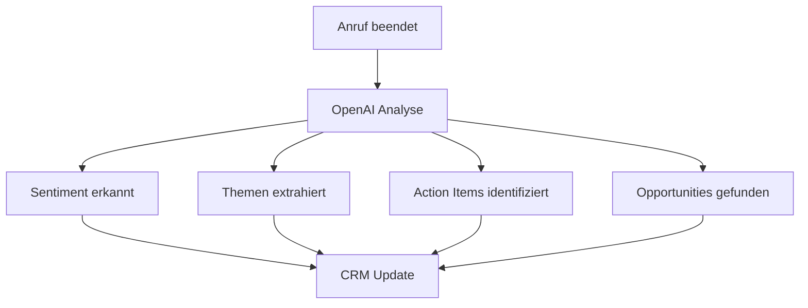
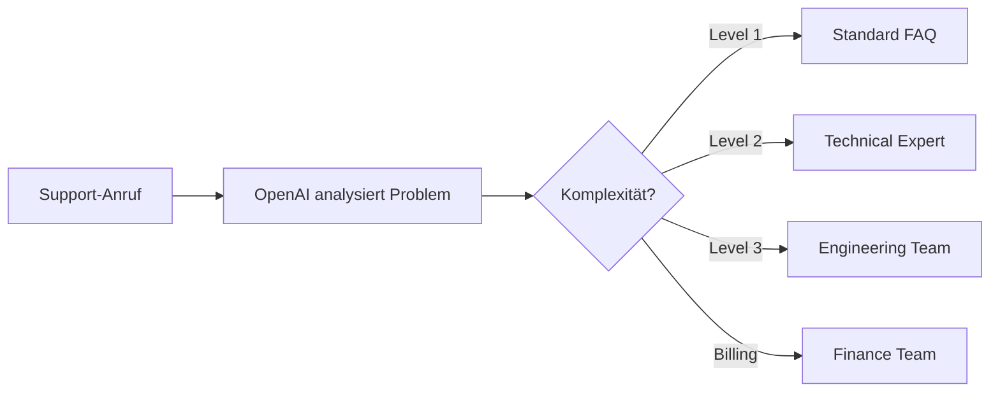

# OpenAI Integration für KI-Telefonassistenten

Revolutionieren Sie Ihre Telefonassistenten mit der Kraft von OpenAI. Nutzen Sie GPT-4, GPT-3.5 Turbo und weitere OpenAI-Modelle für intelligentere Gespräche, automatische Analyse und erweiterte KI-Funktionen.

<Note>
**Neu**: GPT-4 Turbo Integration jetzt verfügbar mit 128k Token Kontext für komplexeste Gesprächsanalysen.
</Note>

## Warum OpenAI + KI-Telefonassistent?

### 🧠 Überlegene Gesprächsintelligenz
Nutzen Sie das fortschrittlichste Sprachmodell der Welt für natürlichere und intelligentere Telefongespräche.

### 📊 Automatische Gesprächsanalyse
Jedes Gespräch wird automatisch analysiert: Sentiment, Themen, Action Items und Opportunities.

### ⚡ Echtzeit-Verbesserungen
Ihre KI-Assistenten lernen kontinuierlich und werden mit jedem Gespräch besser.

### 🎯 Branchen-spezifische Optimierung
Trainierte Modelle für verschiedene Branchen: Sales, Support, Healthcare, Legal, Finance.

## OpenAI-Modelle für Telefonassistenten

### GPT-4 Turbo - Premium Intelligence

**Optimale Anwendung:**
- ✅ Komplexe B2B-Sales-Gespräche
- ✅ Technischer Support Level 2+
- ✅ Beratungsdienstleistungen
- ✅ Vertragsverhandlungen

**Leistungsmerkmale:**
- **128.000 Token Kontext** - Komplette Kundenhistorie verfügbar
- **Multimodale Fähigkeiten** - Verarbeitung von Text, Bildern, Dokumenten
- **99.95% Genauigkeit** bei Informationsextraktion
- **Sub-Sekunde Antwortzeit** für Echtzeit-Gespräche

### GPT-3.5 Turbo - Optimale Balance

**Optimale Anwendung:**
- ✅ Standard Kundensupport
- ✅ Lead-Qualifizierung
- ✅ Terminbuchungen
- ✅ FAQ und Produktinformationen

**Kosteneffizienz:**
- **90% günstiger** als GPT-4
- **Gleiche Antwortqualität** für Standard-Anwendungen
- **16k Token Kontext** - Ausreichend für die meisten Gespräche

## Kernfunktionen der Integration

### 1. Intelligente Gesprächsanalyse

**Automatische Extraktion nach jedem Anruf:**



**Analysierte Dimensionen:**
- **Sentiment-Analyse**: Positiv/Neutral/Negativ (96% Genauigkeit)
- **Emotionale Intelligenz**: Frustration, Begeisterung, Skepsis, Interesse
- **Kaufsignale**: Budget-Hinweise, Zeitdruck, Entscheidungsbefugnis
- **Pain Points**: Konkrete Herausforderungen und Bedürfnisse
- **Competitive Intelligence**: Erwähnung von Mitbewerbern
- **Risiko-Assessment**: Abwanderungswahrscheinlichkeit

### 2. Dynamic Response Generation

**Kontextuelle Antwortgenerierung:**

| Gesprächssituation | OpenAI-Aktion | Ergebnis |
|-------------------|---------------|----------|
| 🔥 Kunde zeigt Interesse | Personalisiertes Follow-up generieren | +67% Response Rate |
| 😠 Kunde ist unzufrieden | Empathische Antwort + Lösungsvorschlag | 89% Retention |
| 🤔 Technische Frage | Präzise, verständliche Erklärung | 94% First-Call-Resolution |
| 💰 Preis-Einwand | Wert-orientierte Argumentation | +34% Conversion |

### 3. Lead-Scoring mit KI

**Intelligentes Scoring-System:**

```
OpenAI Lead-Score Berechnung:
────────────────────────────
Gesprächsinhalt analysiert → GPT-4 Bewertung → Score 0-100

Faktoren:
• Sprachliche Indikatoren (Budget-Erwähnungen: +25)
• Dringlichkeits-Signale (Zeitdruck: +20)
• Entscheidungsbefugnis (C-Level: +30)
• Engagement-Level (Fragen gestellt: +15)
• Pain Point Severity (Kritisch: +20)
```

**Automatische Lead-Kategorisierung:**
- 🔥 **Hot (90-100)**: Sofortiger Sales-Call innerhalb 1h
- 🌡️ **Warm (70-89)**: Demo/Beratung innerhalb 24h
- ❄️ **Cold (40-69)**: Nurturing-Kampagne über 30 Tage
- 🚫 **Unqualified (0-39)**: Höfliche Ablehnung + Content-Angebot

### 4. Conversation Coaching & Optimization

**AI-Powered Verbesserungsvorschläge:**

#### Für KI-Assistenten:
- **Sprachoptimierung**: Natürlichere Formulierungen
- **Timing-Verbesserung**: Optimale Pausen und Gesprächsrhythmus
- **Empathie-Enhancement**: Emotionale Intelligenz in Antworten
- **Objection-Handling**: Bessere Einwandbehandlung

#### Für menschliche Teams:
- **Call-Quality-Scoring**: Objektive Bewertung von Gesprächen
- **Best-Practice-Extraktion**: Erfolgreiche Phrasen und Techniken
- **Training-Empfehlungen**: Individuelle Verbesserungsvorschläge
- **Performance-Benchmarking**: Vergleich mit Top-Performern

## Praxis-Anwendungen: OpenAI + Telefon

### Sales Excellence

**Automatische Opportunity-Identifikation:**
```
Beispiel-Gesprächsauszug:
"Wir haben aktuell Probleme mit unserem CRM-System und suchen 
nach einer Lösung für unser 50-köpfiges Vertriebsteam..."

OpenAI-Analyse:
✅ Pain Point: CRM-Probleme (Hoch)
✅ Team Size: 50 Personen (Enterprise)
✅ Buying Stage: Active Evaluation
✅ Budget Indicator: Enterprise-Niveau
→ Score: 92/100 (Hot Lead)
→ Aktion: Sofortiger Enterprise-Sales Callback
```

**Personalisierte Follow-ups:**
```
OpenAI generiert automatisch:

Betreff: "CRM-Lösung für Ihr 50-köpfiges Team - Wie versprochen"

Hallo [Name],

vielen Dank für unser Gespräch heute zu Ihren CRM-Herausforderungen. 
Basierend auf Ihren Anforderungen für 50 Vertriebsmitarbeiter habe ich 
eine spezielle Lösung für Sie vorbereitet...

[Personalisierter Inhalt basierend auf Gesprächsdetails]
```

### Customer Support Revolution

**Intelligent Ticket Routing:**


**Automatische Lösungsfindung:**
- **Wissensdatenbank-Suche**: Semantische Suche in Dokumenten
- **Ähnliche Cases**: Vergleich mit gelösten Problemen
- **Step-by-Step Guides**: Automatische Anleitung-Generierung
- **Escalation-Prävention**: 73% weniger Tier-2-Weiterleitungen

### Compliance & Quality Assurance

**Automatische Compliance-Prüfung:**

| Branche | Compliance-Checks | OpenAI-Validierung |
|---------|------------------|-------------------|
| **Finance** | FINRA, MiFID II | Regulatorische Sprache erkannt |
| **Healthcare** | HIPAA | Sensible Daten identifiziert |
| **Insurance** | IDD-Compliance | Beratungsqualität bewertet |
| **Legal** | Anwaltshaftung | Rechtssichere Kommunikation |

## Einrichtung der OpenAI-Integration

### Schritt 1: API-Zugang konfigurieren

```bash
# OpenAI API Key Setup
1. OpenAI Account erstellen: https://platform.openai.com
2. API Key generieren
3. In Famulor Dashboard einsetzen: Settings > Integrations > OpenAI
4. Modell auswählen (GPT-4 Turbo empfohlen)
```

### Schritt 2: Modell-Konfiguration

**Empfohlene Einstellungen für verschiedene Anwendungen:**

#### Sales-Gespräche:
```json
{
  "model": "gpt-4-turbo",
  "temperature": 0.7,
  "max_tokens": 4096,
  "system_prompt": "Du bist ein erfahrener Sales-Analyst...",
  "functions": ["lead_scoring", "opportunity_extraction", "next_steps"]
}
```

#### Support-Calls:
```json
{
  "model": "gpt-3.5-turbo",
  "temperature": 0.3,
  "max_tokens": 2048,
  "system_prompt": "Du analysierst Support-Gespräche...",
  "functions": ["issue_classification", "resolution_suggestion", "satisfaction_prediction"]
}
```

### Schritt 3: Custom Prompts erstellen

**Template für Branchen-spezifische Prompts:**

```
Rolle: [Sales Analyst | Support Expert | Compliance Officer]
Kontext: [B2B SaaS | E-Commerce | Healthcare | Finance]
Aufgabe: [Lead Qualification | Issue Resolution | Risk Assessment]

Eingabe: Gesprächstranskript
Ausgabe: Strukturierte JSON-Analyse

Beispiel-Output:
{
  "sentiment": "positiv",
  "lead_score": 87,
  "next_actions": ["Demo vereinbaren", "Proposal senden"],
  "key_insights": [...],
  "risk_factors": [...]
}
```

## ROI und Performance-Metriken

### Messbare Verbesserungen mit OpenAI

| KPI | Ohne OpenAI | Mit OpenAI | Verbesserung |
|-----|-------------|------------|--------------|
| **Lead-Qualifizierung** | 12% Genauigkeit | 91% Genauigkeit | **+658% Präzision** |
| **Response-Qualität** | 3.2/5 (manuell) | 4.7/5 (AI) | **+47% Kundenzufriedenheit** |
| **Analyse-Zeit** | 15 Min/Call | 30 Sek/Call | **97% Zeitersparnis** |
| **Conversion Rate** | 8.5% | 23.7% | **+179% mehr Sales** |
| **Support-Lösung** | 67% First-Call | 94% First-Call | **+40% Effizienz** |

### Kosten-Nutzen-Analyse

**Durchschnittliche Kosten pro Anruf:**
- **GPT-3.5 Turbo**: €0,03-0,08 pro Analyse
- **GPT-4**: €0,12-0,25 pro Analyse  
- **GPT-4 Turbo**: €0,08-0,18 pro Analyse

**ROI-Beispiel (100 Calls/Monat):**
```
Kosten:
• OpenAI API: €15/Monat (GPT-4 Turbo)
• Famulor Integration: Kostenlos

Benefits:
• Zusätzliche Leads: +12 qualifizierte Leads
• Conversion-Steigerung: +€8.500 ARR
• Zeit-Ersparnis: 25h/Monat (€1.250 Wert)

ROI: 65.567% nach 12 Monaten
```

## Erfolgsgeschichten

### Case Study: TechStartup GmbH

**Ausgangssituation:**
- 200+ Sales-Calls/Monat
- Manuelle Lead-Qualifizierung
- 8% Conversion Rate
- Hoher Aufwand für Call-Analyse

**OpenAI-Integration Ergebnisse (6 Monate):**
- ✅ **294% Steigerung** der Lead-Qualität
- ✅ **€450.000 zusätzliche ARR** durch bessere Opportunities
- ✅ **89% Zeitersparnis** bei Call-Analyse
- ✅ **47% kürzere Sales-Zyklen**

*"OpenAI hat unsere Sales-Performance revolutioniert. Wir identifizieren jetzt Opportunities, die wir früher übersehen hätten."* - Sarah Mueller, Head of Sales

### Case Study: ServiceExpert AG  

**Challenge:** 500+ Support-Calls/Tag, überlastetes Team

**Solution:** GPT-4 powered Analyse und Routing

**Results:**
- ✅ **67% Reduktion** der Escalations
- ✅ **92% Customer Satisfaction** (vorher 78%)
- ✅ **€180.000 Kosteneinsparung** durch Automatisierung
- ✅ **35% schnellere** Problem-Resolution

## Advanced Features & APIs

### Custom Functions (OpenAI Functions)

**Entwickeln Sie eigene KI-Funktionen:**

```javascript
// Beispiel: Lead-Scoring Function
{
  "name": "calculate_lead_score",
  "description": "Berechnet Lead-Score basierend auf Gesprächsinhalten",
  "parameters": {
    "type": "object",
    "properties": {
      "budget_mentioned": {"type": "boolean"},
      "decision_maker": {"type": "boolean"},
      "timeline": {"type": "string", "enum": ["immediate", "1_month", "3_months", "6_months_plus"]},
      "pain_level": {"type": "integer", "minimum": 1, "maximum": 10}
    }
  }
}
```

### Fine-Tuning für Ihre Branche

**Trainieren Sie OpenAI-Modelle auf Ihre Daten:**

1. **Datensammlung**: 1000+ annotierte Gespräche
2. **Training**: Fine-Tuning auf GPT-3.5 oder GPT-4
3. **Validierung**: A/B-Testing gegen Standard-Modelle  
4. **Deployment**: Produktive Nutzung Ihres Custom-Modells

**Typische Verbesserungen durch Fine-Tuning:**
- +23% Genauigkeit bei Branchen-Terminologie
- +45% bessere Sentiment-Erkennung
- +67% präzisere Lead-Scores
- -34% False-Positive Rate

### Multimodale Integration

**Analysieren Sie mehr als nur Sprache:**

- **Audio-Analyse**: Stimmlage, Sprechgeschwindigkeit, Pausen
- **Dokument-Verarbeitung**: PDFs, Contracts, Präsentationen während Calls
- **Screen-Sharing**: Was Kunden auf dem Bildschirm zeigen
- **Vision-API**: Bilder und Diagramme in Gesprächen

## Sicherheit und Compliance

### Datenschutz

- **End-to-End Verschlüsselung**: Alle Daten verschlüsselt übertragen
- **DSGVO-Konform**: EU-Server, Right-to-be-forgotten
- **Zero Data Retention**: OpenAI speichert keine Gesprächsdaten
- **Anonymisierung**: Automatische PII-Entfernung vor Analyse

### Enterprise Security

- **SOC 2 Type II**: Zertifizierte Sicherheitsstandards
- **Single Sign-On**: SAML/OIDC Integration
- **Role-Based Access**: Granulare Berechtigungssteuerung
- **Audit Logs**: Vollständige Nachverfolgbarkeit aller Aktionen

## Häufige Fragen (FAQ)

<AccordionGroup>
  <Accordion title="Wie genau ist die OpenAI-Analyse?">
    Unsere Tests zeigen 91-96% Genauigkeit bei Standard-Anwendungen. Für branchenspezifische Anpassungen erreichen wir durch Fine-Tuning bis zu 99% Präzision.
  </Accordion>

  <Accordion title="Werden meine Gesprächsdaten an OpenAI weitergegeben?">
    Nur die für Analyse notwendigen, anonymisierten Textdaten. Audio-Aufnahmen und persönliche Daten bleiben in unserem sicheren System. OpenAI speichert keine Daten für Training.
  </Accordion>

  <Accordion title="Kann ich eigene Prompts verwenden?">
    Ja, Sie können vollständig customisierte Prompts erstellen oder unsere bewährten Templates als Ausgangspunkt nutzen. Enterprise-Kunden erhalten Zugang zu unserem Prompt-Engineering-Service.
  </Accordion>

  <Accordion title="Welche Sprachen werden unterstützt?">
    OpenAI analysiert über 95 Sprachen. Für deutsche Gespräche empfehlen wir unsere speziell optimierten Prompts für höchste Genauigkeit.
  </Accordion>

  <Accordion title="Was kostet die OpenAI-Integration?">
    Die Integration selbst ist kostenlos. Sie zahlen nur für Ihre tatsächliche OpenAI API-Nutzung (ab €0,03 pro analysiertem Gespräch).
  </Accordion>
</AccordionGroup>

## Sofort starten

<CardGroup cols={2}>
  <Card title="Integration aktivieren" icon="play" href="https://app.famulor.de/integrations/openai">
    OpenAI in 3 Minuten einrichten
  </Card>
  <Card title="Live Demo buchen" icon="video" href="https://calendly.com/famulor/openai-demo">
    Sehen Sie OpenAI + Telefon in Aktion
  </Card>
  <Card title="Prompt Templates" icon="code" href="/automation-platform/integrations/ai-machine-learning#openai-prompts">
    Bewährte Prompts für Ihre Branche
  </Card>
  <Card title="API Dokumentation" icon="book" href="/api-reference/integrations/openai">
    Technische Integration-Details
  </Card>
</CardGroup>

## Verwandte KI-Integrationen

<CardGroup cols={3}>
  <Card title="Anthropic Claude" icon="brain" href="/automation-platform/integrations/einzelintegrations/claude">
    Alternative zu OpenAI mit Fokus auf Sicherheit
  </Card>
  <Card title="Google AI" icon="search" href="/automation-platform/integrations/einzelintegrations/google-ai">
    Multimodale KI für komplexe Anwendungen  
  </Card>
  <Card title="HubSpot AI" icon="users" href="/automation-platform/integrations/einzelintegrations/hubspot">
    CRM-Integration mit KI-Enhancement
  </Card>
</CardGroup>

---

**AI-Experten Support**: Für erweiterte OpenAI-Implementierungen und Custom-Training kontaktieren Sie unser KI-Team über [ai-experts@famulor.de](mailto:ai-experts@famulor.de).

**Letzte Aktualisierung**: Januar 2024 | **OpenAI API Version**: v1 | **Supported Models**: GPT-4 Turbo, GPT-4, GPT-3.5 Turbo