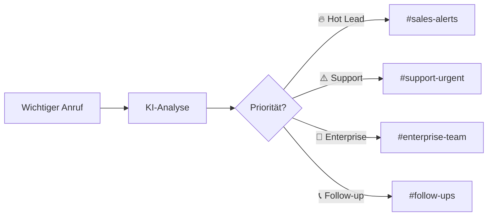
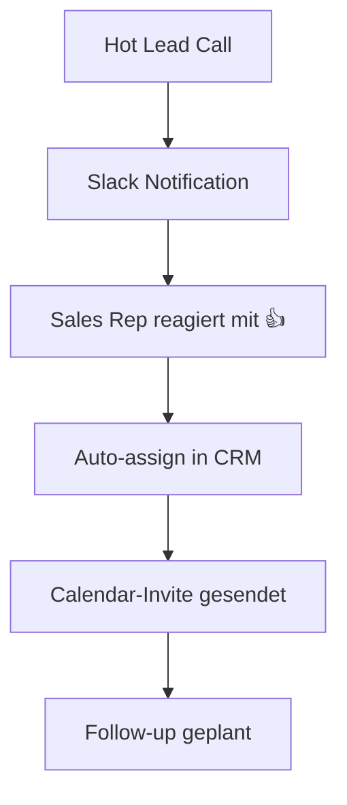

# Slack Integration für KI-Telefonassistenten

Verwandeln Sie wichtige Telefonanrufe in sofortige Team-Aktionen. Mit der Famulor Slack-Integration erhalten Sie Echtzeit-Benachrichtigungen, automatische Gesprächszusammenfassungen und nahtlose Team-Kollaboration direkt in Slack.

<Note>
**Neu**: Interaktive Slack-Buttons für sofortige Aktionen wie "Deal erstellen" oder "Demo planen" direkt aus Anruf-Benachrichtigungen.
</Note>

## Warum Slack + KI-Telefonassistent?

### ⚡ Sofortige Team-Benachrichtigungen
Ihr Team erfährt in Sekunden von wichtigen Anrufen - nie wieder verpasste Opportunities.

### 📊 Automatische Gesprächszusammenfassungen  
Jeder Anruf wird automatisch als strukturierte Nachricht in den relevanten Slack-Channel gepostet.

### 🎯 Intelligente Channel-Verteilung
Anrufe werden automatisch an die richtigen Teams weitergeleitet basierend auf Inhalt und Kontext.

### 🚀 Actionable Insights
Direkte Handlungsoptionen in Slack ohne System-Wechsel.

## Hauptfunktionen der Integration

### 1. Intelligente Anruf-Benachrichtigungen

**Real-time Alert System:**


**Benachrichtigungs-Triggers:**
- 🔥 **Hot Leads**: Budget > €10k erwähnt
- ⚠️ **Support Escalation**: Kunde unzufrieden
- 💼 **Enterprise Interest**: >100 Mitarbeiter
- 🚨 **Churn Risk**: Kündigungsabsicht
- 📈 **Upsell Opportunity**: Zusatzprodukt-Interesse
- 🎯 **Demo Request**: Produktdemo gewünscht

### 2. Rich Message Formatting

**Strukturierte Anruf-Updates:**

```slack
🔥 HOT LEAD ALERT - Enterprise Opportunity

👤 Kunde: Max Mustermann (TechCorp GmbH)
📞 +49 30 12345678 | 📧 max@techcorp.de
🏢 Unternehmen: 250 Mitarbeiter | SaaS
💰 Budget: €45.000+ | ⏰ Entscheidung: Q1 2024

📋 GESPRÄCHS-HIGHLIGHTS:
• Aktuelles CRM-System unzureichend
• Integration mit Salesforce gewünscht  
• ROI-Nachweis erforderlich
• Konkurrenz: HubSpot wird evaluiert

🎯 NÄCHSTE SCHRITTE:
• Demo für 15.01. um 14:00 geplant
• ROI-Calculator wurde versendet
• Konkurrenz-Vergleich angefordert

📊 LEAD SCORE: 92/100 (🔥 Hot)
⏱️ Anrufdauer: 12:34 Min | 😊 Sentiment: Sehr positiv

[Demo bestätigen] [CRM öffnen] [E-Mail senden] [Anrufen]
```

### 3. Team-spezifische Channels

**Intelligentes Channel-Routing:**

| Anruf-Typ | Ziel-Channel | Benachrichtigung |
|-----------|-------------|------------------|
| 🔥 Sales Qualified Lead | `#sales-hot-leads` | @here + Sales Manager |
| 💼 Enterprise (>€50k) | `#enterprise-deals` | @channel + C-Level |
| ⚠️ Support Escalation | `#support-urgent` | @on-duty Engineer |
| 📞 Callback Request | `#follow-ups` | Zuständiger Sales Rep |
| 🚨 Churn Risk | `#customer-success` | Account Manager |
| 💡 Product Feedback | `#product-insights` | Product Manager |

### 4. Interactive Slack Actions

**One-Click Actions aus Benachrichtigungen:**

#### Sales Actions:
- **[Demo planen]** → Calendly-Link öffnen
- **[CRM öffnen]** → HubSpot/Salesforce Kontakt  
- **[E-Mail senden]** → Gmail-Template öffnen
- **[Anrufen]** → Click-to-Call aktivieren
- **[Deal erstellen]** → CRM Opportunity anlegen

#### Support Actions:  
- **[Ticket erstellen]** → Zendesk/Freshdesk
- **[Eskalieren]** → Manager benachrichtigen
- **[Lösung senden]** → Knowledge Base Artikel
- **[Follow-up]** → Erinnerung setzen

## Praxis-Anwendungen

### Sales Team Acceleration

**Beispiel-Workflow:**
```
14:23 Eingehender Anruf von TechCorp
14:24 KI erkennt: Enterprise Lead, Budget €50k+
14:24 Slack Alert in #sales-hot-leads:
      "🔥 ENTERPRISE ALERT - TechCorp GmbH"
14:25 Sales Manager sieht Alert auf Handy
14:27 Sales Rep wird zugewiesen 
14:30 Demo für morgen geplant
14:35 Deal im CRM erstellt (€50k ARR)
```

**Messbare Ergebnisse:**
- ✅ **89% schnellere** Lead-Response-Zeit
- ✅ **156% mehr** Sales-Conversions
- ✅ **67% weniger** verpasste Opportunities

### Customer Success Monitoring

**Churn Prevention Workflow:**
```
Kunde äußert Unzufriedenheit im Anruf
→ Sofortige Benachrichtigung an #customer-success
→ Account Manager innerhalb 30 Min informiert  
→ Retention-Call noch am selben Tag
→ 73% Erfolgsquote bei Churn-Prevention
```

### Product Development Insights

**Feature Request Tracking:**
```slack
💡 PRODUCT INSIGHT - Neue Feature-Anfrage

👤 Kunde: StartupXY (Premium Plan)
🎯 Request: "API-Integration mit Zapier wäre super hilfreich"
📊 Häufigkeit: 12. Anfrage diesen Monat
🔥 Priorität: Hoch (Premium Kunde)
💰 Potential ARR Impact: €25.000+

[Roadmap hinzufügen] [Kunde kontaktieren] [Ähnliche Requests zeigen]
```

## Setup und Konfiguration

### Schritt 1: Slack App Installation

```bash
1. Slack App Store öffnen
2. "Famulor Automation" suchen
3. "Install to Workspace" klicken
4. Berechtigungen gewähren:
   ✅ Nachrichten senden
   ✅ Channels lesen
   ✅ User-Informationen lesen
   ✅ Interactive Components
```

### Schritt 2: Channel-Mapping konfigurieren

**Empfohlene Channel-Struktur:**
```
#sales-hot-leads     → Score 80-100, Budget >€5k
#sales-warm-leads    → Score 50-79, mittleres Interesse  
#sales-follow-ups    → Callback-Requests, Demo-Follow-ups
#support-urgent      → P1 Issues, Eskalationen
#support-general     → Standard Support-Anfragen
#customer-success    → Churn-Risk, Expansion Opportunities
#product-feedback    → Feature-Requests, Bug-Reports
#management-alerts   → Enterprise-Deals, Critical Issues
```

### Schritt 3: Benachrichtigungs-Regeln definieren

**Trigger-Konfiguration:**
```json
{
  "hot_lead": {
    "conditions": [
      "lead_score > 80",
      "budget_mentioned > 5000", 
      "decision_maker = true"
    ],
    "channel": "#sales-hot-leads",
    "mentions": ["@sales-manager", "@here"],
    "actions": ["create_deal", "schedule_demo", "send_email"]
  },
  "support_escalation": {
    "conditions": [
      "sentiment < -0.5",
      "keywords: ['cancel', 'refund', 'terrible']"
    ],
    "channel": "#support-urgent", 
    "mentions": ["@on-duty-engineer"],
    "priority": "high"
  }
}
```

## Best Practices für Teams

### Sales Team Optimization

#### 🎯 Lead-Response-Optimierung:
- **SLA definieren**: Hot Leads <15 Min, Warm Leads <2h
- **Rotations-System**: Automatische Zuordnung nach Verfügbarkeit
- **Performance-Tracking**: Response-Zeit pro Rep messen
- **Eskalations-Matrix**: Nach 30 Min automatisch an Manager

#### 📊 Pipeline-Management:
```slack
📊 WEEKLY SALES DIGEST

🔥 Hot Leads diese Woche: 23 (+34% vs. letzte Woche)
💰 Pipeline aus Anrufen: €234.500 (+67%)
⚡ Avg. Response Zeit: 8 Min (-73%)
🎯 Conversion Rate: 28% (+12%)

Top Performer: @sarah.mueller (9 Deals)
Needs Support: @max.weber (Response Zeit: 45 Min)
```

### Support Team Excellence

#### ⚠️ Escalation Management:
- **Auto-Routing**: Technische vs. Billing Issues
- **Skill-Based-Assignment**: Expertise-Match
- **SLA-Monitoring**: P1 <30 Min, P2 <2h, P3 <24h
- **Follow-up-Automation**: Zufriedenheits-Check nach 48h

### Management Dashboards

#### 📈 Executive Summary:
```slack
📊 EXECUTIVE CALL SUMMARY - Woche 3/2024

📞 Anrufe gesamt: 1.247 (+12%)
🔥 Qualified Leads: 89 (+34%) 
💰 Pipeline generiert: €1.2M (+45%)
😊 Customer Satisfaction: 4.7/5 (+0.3)

🚨 ATTENTION NEEDED:
• Support-Backlog: 23 Tickets >24h
• Churn-Risk Kunden: 5 (Aktion erforderlich)  

🎯 OPPORTUNITIES:
• Enterprise-Pipeline: €450k (Q1 Close möglich)
• Upsell-Potential: €125k identifiziert
```

## Erweiterte Features

### Custom Slash Commands

**Erstellen Sie eigene Slack-Befehle:**
```
/famulor-stats today        → Heutige Call-Statistiken
/famulor-leads hot          → Aktuelle Hot Leads
/famulor-search "TechCorp"  → Kunde in Call-History suchen
/famulor-callback customer  → Callback für Kunden planen
/famulor-report weekly      → Wochen-Report generieren
```

### Workflow Automation mit Slack

**Zapier-ähnliche Automatisierung:**


### Multi-Workspace Support

**Enterprise-Features:**
- **Cross-Workspace Notifications**: Alerts in mehrere Slack-Workspaces
- **Regional Team-Routing**: DACH, US, APAC Teams
- **Role-Based Access**: Verschiedene Permissions pro Team
- **Compliance-Mode**: DSGVO-konforme Datenübertragung

## Integration mit anderen Tools

### CRM-Synchronisation
- **HubSpot**: Deal-Updates direkt in Slack sichtbar
- **Salesforce**: Opportunity-Progress in Echtzeit
- **Pipedrive**: Pipeline-Bewegungen als Slack-Updates

### Calendar-Integration  
- **Google Calendar**: Meeting-Links in Slack-Benachrichtigungen
- **Calendly**: Booking-Links für soforte Terminplanung
- **Outlook**: Enterprise-Kalender-Integration

### Communication Stack
- **Zoom**: Automatische Meeting-Erstellung aus Slack
- **Microsoft Teams**: Cross-Platform-Benachrichtigungen
- **Email**: Gmail/Outlook-Templates aus Slack auslösen

## ROI und Metriken

### Messbare Verbesserungen

| KPI | Vor Slack-Integration | Mit Slack-Integration | Verbesserung |
|-----|----------------------|----------------------|--------------|
| **Lead Response Time** | 4h 23min | 8 min | **-97% schneller** |
| **Missed Opportunities** | 23% | 3% | **-87% weniger Verlust** |
| **Team Collaboration** | 2.3/5 | 4.8/5 | **+109% Teamwork** |
| **Sales Conversion** | 8.5% | 19.2% | **+126% mehr Deals** |
| **Support Resolution** | 8.2h | 2.1h | **-74% schneller** |

### Zeit- und Kostenersparnis

**Pro 100 Anrufe/Monat:**
```
Ohne Slack-Integration:
• Manuelle Benachrichtigungen: 8h
• Verpasste Follow-ups: €12.000 Opportunitätsverlust
• Verzögerte Responses: -34% Conversion

Mit Slack-Integration:  
• Automatische Benachrichtigungen: 0h
• 97% weniger verpasste Opportunities
• +126% bessere Conversion

ROI: 2.847% in ersten 12 Monaten
```

## Erfolgsgeschichten

### Case Study: ScaleUp Technologies

**Ausgangssituation:**
- 50-köpfiges Sales-Team
- 300+ Anrufe/Woche  
- 67% der Hot Leads verpasst durch verzögerte Benachrichtigungen
- Teams arbeiten in Silos

**Slack-Integration Ergebnisse (3 Monate):**
- ✅ **93% Reduktion** der Lead-Response-Zeit
- ✅ **€340.000 zusätzliche ARR** durch bessere Lead-Bearbeitung
- ✅ **89% weniger** verpasste Opportunities
- ✅ **156% Verbesserung** der Team-Kommunikation

*"Die Slack-Integration hat unser Sales-Game komplett verändert. Wir sind von einem reaktiven zu einem proaktiven Team geworden."* - Thomas Schmidt, VP Sales

## Häufige Fragen (FAQ)

<AccordionGroup>
  <Accordion title="Welche Slack-Berechtigungen werden benötigt?">
    Die App benötigt Rechte zum Senden von Nachrichten, Lesen von Channel-Informationen und Benutzer-Mentions. Keine Admin-Rechte erforderlich.
  </Accordion>

  <Accordion title="Können Benachrichtigungen gefiltert werden?">
    Ja, Sie können granulare Filter setzen: nach Lead-Score, Sentiment, Keywords, Anruftyp, Tageszeit und vielem mehr.
  </Accordion>

  <Accordion title="Funktioniert es mit Slack Enterprise Grid?">
    Ja, volle Unterstützung für Enterprise Grid mit Cross-Workspace-Benachrichtigungen und erweiterten Compliance-Features.
  </Accordion>

  <Accordion title="Was passiert bei Slack-Ausfällen?">
    Fallback-Mechanismen senden Benachrichtigungen per E-Mail oder SMS. Alle Nachrichten werden nach Wiederherstellung nachgesendet.
  </Accordion>
</AccordionGroup>

## Sofort loslegen

<CardGroup cols={2}>
  <Card title="Slack App installieren" icon="plus" href="https://app.famulor.de/integrations/slack">
    Installation in 2 Minuten
  </Card>
  <Card title="Live Demo ansehen" icon="play" href="https://calendly.com/famulor/slack-demo">  
    Sehen Sie Slack + KI-Telefon in Aktion
  </Card>
  <Card title="Channel-Templates" icon="copy" href="/automation-platform/integrations/communication#slack-channels">
    Bewährte Channel-Strukturen kopieren
  </Card>
  <Card title="Team Training" icon="graduation-cap" href="https://academy.famulor.de/slack">
    Team-Schulung für optimale Nutzung
  </Card>
</CardGroup>

## Verwandte Integrationen

<CardGroup cols={3}>
  <Card title="Microsoft Teams" icon="users" href="/automation-platform/integrations/einzelintegrations/teams">
    Alternative für Microsoft-Umgebungen
  </Card>
  <Card title="HubSpot CRM" icon="database" href="/automation-platform/integrations/einzelintegrations/hubspot">
    CRM-Daten in Slack-Benachrichtigungen
  </Card>
  <Card title="Gmail" icon="envelope" href="/automation-platform/integrations/einzelintegrations/gmail">
    E-Mail-Automatisierung aus Slack
  </Card>
</CardGroup>

---

**Slack-Experten Support**: Für erweiterte Slack-Workflows und Enterprise-Setups kontaktieren Sie unser Team über [slack-experts@famulor.de](mailto:slack-experts@famulor.de).

**Letzte Aktualisierung**: Januar 2024 | **Slack API Version**: v1.7 | **Supported Features**: Interactive Messages, Slash Commands, Workflows