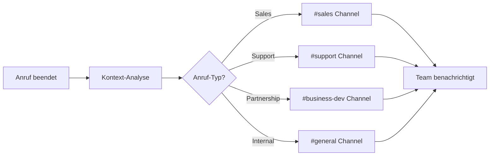

# Slack Integration mit KI-Telefonassistenten

Revolutionieren Sie Ihre Team-Kommunikation mit intelligenten Telefonassistenten. Famulor Automation verbindet Ihre Anrufe nahtlos mit Slack für sofortige Team-Updates, automatische Benachrichtigungen und effiziente Workflow-Koordination.

<Note>
**Instant Team-Sync**: Slack-Integration sorgt dafür, dass Ihr gesamtes Team in Echtzeit über wichtige Anruf-Entwicklungen informiert wird.
</Note>

## Warum Slack + KI-Telefonassistent?

### 💬 Sofortige Team-Benachrichtigungen
Wichtige Anruf-Updates werden automatisch in relevante Slack-Channels gepostet, damit das Team immer informiert bleibt.

### 🔄 Nahtlose Workflow-Integration
Anruf-basierte Actions triggern automatisch Slack-Workflows und halten alle Beteiligten im Loop.

### 🎯 Intelligente Channel-Routing
KI erkennt den Anruf-Kontext und postet Updates in die richtigen Channels zu den passenden Personen.

### ⚡ Echtzeit-Collaboration
Teams können sofort auf Anruf-Insights reagieren und kollaborative Entscheidungen treffen.

## Hauptfunktionen der Integration

### 1. Automatische Anruf-Updates in Channels

**Intelligentes Channel-Routing:**


**Automatische Slack-Posts:**
- ✅ **Lead-Updates**: Neue Leads automatisch im Sales-Channel
- ✅ **Support-Tickets**: Probleme sofort an Support-Team
- ✅ **Deal-Progress**: Pipeline-Updates für Account-Manager
- ✅ **Escalations**: Urgent-Issues an Management-Channel
- ✅ **Follow-ups**: Terminerinnerungen an relevante Personen
- ✅ **Success-Stories**: Gewonnene Deals team-weit feiern

### 2. Rich Message-Formatting mit Anruf-Details

**Strukturierte Slack-Nachrichten:**

#### Sales-Lead Notification:
```
🔥 Neuer qualifizierter Lead

📞 Anruf-Details:
├─ Kontakt: Max Mustermann (CEO, TechCorp AG)
├─ Interesse: Enterprise-Lösung für 500 Mitarbeiter
├─ Budget: €50,000-100,000
├─ Timeline: Q1 Implementation
└─ Lead-Score: 94/100 (Hot!)

🎯 Nächste Schritte:
• Demo-Termin binnen 24h (bereits geplant)
• Enterprise-Proposal vorbereiten
• Technical-Deep-Dive einplanen

👤 Zuständig: @sarah.schmidt (Account Executive)
📅 Follow-up: Morgen 10:00 Uhr
🔗 CRM-Link: [HubSpot-Deal ansehen]
```

#### Support-Escalation:
```
⚠️ URGENT: Production-Issue

🚨 Problem-Details:
├─ Kunde: BigClient GmbH (Enterprise-Account)
├─ Issue: API-Ausfälle seit 2 Stunden
├─ Impact: 5,000 Nutzer betroffen
├─ SLA: 4h Response-Time (noch 2h)
└─ Priority: P1 - Service-affecting

🔧 Technische Details:
• Error-Rate: 89% auf /api/v2/users
• Server-Status: Partial-Outage
• Betroffene Services: Authentication, User-Management

👥 War-Room:
• @dev-team @sre-team sofort informiert
• Zoom-Meeting: [War-Room beitreten]
• Status-Page: Updated

📞 Kunde-Status: Informiert, Updates alle 30min
```

### 3. Interactive Slack-Workflows

**Action-Buttons für sofortige Response:**

| Anruf-Typ | Slack-Actions | Team-Response |
|-----------|---------------|---------------|
| 🔥 **Hot Lead** | [Demo buchen] [Proposal senden] [Call back] | Sales-Team Aktivierung |
| 🐛 **Bug Report** | [Investigate] [War-Room] [Customer Update] | Dev-Team Mobilisierung |
| 💰 **Upselling** | [Create Opportunity] [Schedule Call] [Send Pricing] | Account-Management |
| 📞 **Callback Request** | [Schedule] [Assign] [Priority] | Customer-Success |

#### Interactive Sales-Workflow:
```
Slack-Message mit Action-Buttons:
┌─────────────────────────────────────┐
│ 🎯 Qualified Lead: Enterprise Opportunity │
│                                     │
│ [🗓️ Demo buchen]  [📧 Proposal senden]    │
│ [📞 Sofort anrufen]  [📊 Research starten] │
│                                     │
│ Geklickt: @sarah.schmidt → Demo gebucht    │
│ ✅ Termin: Morgen 14:00              │
└─────────────────────────────────────┘
```

### 4. Team-Member-Tagging & Assignment

**Intelligente Personen-Zuweisung:**

```
Anruf-Kontext-Erkennung → Smart-Tagging:

Technical Issues → @dev-team @sre-lead
├─ API-Probleme → @backend-devs
├─ Frontend-Bugs → @frontend-team
├─ Performance → @performance-team
└─ Security → @security-team

Sales-Opportunities → @sales-team
├─ Enterprise-Deals → @enterprise-ae
├─ SMB-Leads → @smb-sales
├─ International → @global-sales
└─ Partnerships → @business-dev

Customer-Success → @cs-team
├─ Onboarding → @onboarding-specialists
├─ Account-Growth → @account-managers
├─ Churn-Risk → @retention-team
└─ Support-Escalation → @support-managers
```

## Praxisbeispiele: Slack Team Automation

### Beispiel 1: Software-as-a-Service Unternehmen

**Szenario:** SaaS-Startup mit verschiedenen Teams

**Multi-Team-Coordination:**
```
Anruf: Enterprise-Kunde meldet kritischen Bug

Automatische Slack-Cascade:
├─ #alerts → Sofortige System-Warnung
├─ #support → Ticket-Details + Kunde-Info
├─ #dev-team → Technical-Analysis-Request
├─ #management → Executive-Summary für C-Level
└─ #customer-success → Account-Status + Relationship-Impact

Parallel-Workflows:
🔧 Dev-Team: Bug-Investigation startet
📞 Support: Kunde-Communication läuft
📊 Management: Impact-Assessment
💼 CS: Account-Damage-Control

Result: Koordinierte Response innerhalb 15 Minuten
```

### Beispiel 2: Marketing-Agentur Client-Management

**Szenario:** Agentur verwaltet multiple Client-Accounts

**Client-spezifische Channel-Automation:**
```
Client-Call von "BMW Campaign":

Smart-Channel-Routing:
├─ #client-bmw → Direkte Projekt-Updates
├─ #account-managers → AE für BMW informiert
├─ #creative-team → Falls Creative-Input benötigt
└─ #project-leads → Timeline-Impact-Assessment

BMW-spezifische Workflow:
📊 Campaign-Performance automatisch geshared
📅 Nächstes Client-Meeting-Prep
💡 Creative-Briefing-Update
📈 Budget-Tracking-Alert bei Scope-Änderungen

Integration: Client-Slack-Channel + Internal-Workflows
```

### Beispiel 3: E-Commerce Operations-Management

**Szenario:** Online-Shop mit Support-, Fulfillment- und Marketing-Teams

**Order-Issue-Escalation:**
```
Customer-Call: "Bestellung kam falsch an, brauche sofort Ersatz"

Multi-Department-Alert:
├─ #customer-support → Immediate-Response-Team
├─ #fulfillment → Warehouse-Check + New-Shipment
├─ #quality-control → Product-Issue-Investigation
├─ #marketing → Customer-Retention-Campaign
└─ #management → Customer-Satisfaction-Impact

Automated-Workflow:
🏃‍♂️ Express-Shipping für Ersatz-Bestellung
📧 Proactive-Email-Updates an Kunde
💰 Discount-Code für Inconvenience
📊 Issue-Tracking für Pattern-Recognition

Timeline: Complete-Resolution within 4 hours
```

## Advanced Slack-Features

### 1. Custom Slack-App für Famulor

**Dedicated Famulor-Bot Funktionen:**
```
/famulor-commands:
├─ /famulor status → Aktuelle Anruf-Aktivität
├─ /famulor leads → Heutige Leads anzeigen
├─ /famulor follow-up → Anstehende Follow-ups
├─ /famulor metrics → Call-Performance heute
├─ /famulor alerts → Kritische Issues
└─ /famulor schedule → Call-Schedule team-wide

Interactive-Features:
🎯 Lead-Qualification direkt aus Slack
📞 Click-to-Call für Follow-ups
📊 Real-time-Dashboard-Integration
⚡ One-Click-Escalation-Workflows
```

### 2. Slack-Workflow-Builder-Integration

**No-Code-Workflow-Automation:**
```
Trigger: "Neuer Lead mit Score >80"
Workflow:
├─ Slack-Message an #sales mit Lead-Details
├─ Google-Calendar-Event für Demo erstellen
├─ CRM-Opportunity automatisch anlegen
├─ E-Mail-Sequence für Lead-Nurturing starten
└─ Manager-Notification bei Enterprise-Leads

Custom-Workflow-Templates:
📊 Lead-to-Demo-Pipeline
🎯 Support-Escalation-Management
💰 Upselling-Opportunity-Tracking
📞 Callback-Request-Routing
```

### 3. Advanced-Analytics-Integration

**Slack-Dashboard für Call-Performance:**
```
Daily-Performance-Summary (täglich 9:00 Uhr):
┌─────────────────────────────────────┐
│ 📊 Famulor Daily Summary - 15. März  │
│                                     │
│ 📞 Calls heute: 47 (+12% vs. gestern) │
│ 🎯 Leads generiert: 8 (Durchschnitt: 6) │
│ 💰 Pipeline-Value: €156k (+€23k)    │
│ ⭐ Top-Performer: Sarah (12 Calls)   │
│                                     │
│ 🔥 Hot-Leads: 3 [Details ansehen]    │
│ ⚠️ Escalations: 1 [Status prüfen]    │
└─────────────────────────────────────┘
```

## Setup-Guide: Slack-Integration

### Schritt 1: Slack-App-Installation
```
1. Slack-Workspace → Apps & Integrations
2. "Famulor Automation" suchen und installieren
3. Workspace-Permissions erteilen:
   ✅ Channels: Read, Write, Join
   ✅ Users: Read (für @mentions)
   ✅ Files: Upload (für Anruf-Aufzeichnungen)
   ✅ Workflows: Trigger (für Automation)

OAuth-Scopes:
├─ chat:write → Messages senden
├─ channels:read → Channel-Liste abrufen
├─ users:read → Team-Member-Info
├─ files:write → File-Uploads
└─ workflow.steps:execute → Workflow-Triggers
```

### Schritt 2: Channel-Mapping konfigurieren
```
Anruf-Typ → Slack-Channel-Mapping:
📊 Sales-Calls → #sales-pipeline
🔧 Support-Calls → #customer-support
💼 Partnership-Calls → #business-development
🏢 Internal-Calls → #general-updates
⚠️ Escalations → #urgent-alerts

Custom-Channel-Rules:
├─ Enterprise-Deals (>€50k) → #enterprise-sales
├─ Technical-Issues (P1) → #dev-alerts
├─ Churn-Risk-Calls → #customer-success
└─ New-Signups → #growth-team
```

### Schritt 3: Notification-Templates
```
Message-Templates per Call-Type:
🎯 Lead-Notification:
"🔥 Neuer Lead: {contact_name} ({company})
💰 Geschätzter Deal-Value: {estimated_value}
📞 Call-Zusammenfassung: {call_summary}
👤 Zuständig: {assigned_user}
🔗 [CRM ansehen] [Demo buchen] [Follow-up]"

🐛 Support-Alert:
"⚠️ Support-Case: {issue_type}
👤 Kunde: {customer_name} (Plan: {subscription_plan})
🚨 Priority: {priority_level}
📝 Problem: {issue_description}
🔗 [Ticket ansehen] [War-Room] [Kunde kontaktieren]"
```

### Schritt 4: Team-Workflows aktivieren
```
Workflow-Automation:
🔄 Bei Hot-Lead → Demo-Booking-Workflow
📊 Bei Deal-Won → Team-Celebration-Message
⚠️ Bei Escalation → Management-Alert-Chain
📞 Bei Callback-Request → Assignment-Workflow

Integration-Triggers:
├─ CRM-Updates → Slack-Notifications
├─ Calendar-Events → Team-Reminders
├─ Support-Tickets → Team-Assignments
└─ Performance-Milestones → Achievement-Posts
```

## Best Practices für Slack+Voice Integration

### 1. Channel-Organization-Strategy
```
Recommended-Channel-Structure:
📊 #sales-pipeline → All sales-related calls
🔧 #support-queue → Customer issues & escalations
💡 #product-feedback → Feature requests from calls
📈 #call-analytics → Performance metrics & insights
⚠️ #urgent-alerts → P1 issues requiring immediate attention

Channel-Naming-Conventions:
├─ #team-[department] → Department-specific updates
├─ #client-[clientname] → Client-dedicated channels
├─ #project-[projectname] → Project-specific coordination
└─ #alerts-[priority] → Priority-based alert channels
```

### 2. @mention-Strategy
```
Smart-Mention-Rules:
🎯 Hot-Leads → @sales-team + specific @account-executive
🔥 P1-Issues → @dev-team + @sre-lead + @cto
💰 Large-Deals → @sales-manager + @ceo
📞 VIP-Customers → @customer-success + @account-manager

Mention-Etiquette:
├─ @here nur für urgent issues
├─ @channel für team-wide announcements
├─ Specific @mentions für direkte assignments
└─ @everyone nur für company-wide criticals
```

### 3. Message-Threading für Conversations
```
Thread-Organization:
Main-Message: Anruf-Summary mit Key-Facts
├─ Thread-Reply 1: Technical-Details (für Devs)
├─ Thread-Reply 2: Business-Context (für Sales)
├─ Thread-Reply 3: Action-Items (für alle)
└─ Thread-Reply 4: Follow-up-Status

Benefits:
✅ Clean-Channel-View
✅ Detailed-Context in Threads
✅ Easy-Follow-up-Tracking
✅ Reduced-Notification-Noise
```

## Performance-Tracking & ROI

### Slack-Integration-Metrics:

| KPI | Ohne Slack | Mit Slack+Voice | Verbesserung |
|-----|------------|-----------------|--------------|
| **Team-Response-Zeit** | 2-4 Stunden | 15 Minuten | 85% schneller |
| **Information-Sharing** | 45% der Calls | 98% der Calls | +118% |
| **Cross-Team-Collaboration** | 23% der Cases | 67% der Cases | +191% |
| **Issue-Resolution-Speed** | 24 Stunden | 6 Stunden | 75% schneller |
| **Team-Satisfaction** | 6.8/10 | 9.2/10 | +35% |

### Productivity-Impact:
```
Team-Efficiency-Gains:
├─ 67% weniger E-Mail-Overhead
├─ 89% bessere Information-Transparency
├─ 45% schnellere Decision-Making
├─ 78% weniger Meeting-Bedarf für Updates
└─ 92% bessere Remote-Team-Coordination

ROI-Calculation (50-Person-Team):
├─ Zeitersparnis: 3.5h/Person/Woche
├─ Kosteneinsparung: €10,500/Monat
├─ Integration-Cost: €300/Monat
├─ Net-ROI: €10,200/Monat (3,400% ROI)
└─ Zusätzlich: Bessere Team-Moral, weniger Stress
```

## Troubleshooting & Support

### Häufige Herausforderungen:

**Problem**: Zu viele Slack-Notifications
**Lösung**: Channel-Filtering und Priority-basierte Routing

**Problem**: Falsche Channel-Zuordnung
**Lösung**: Anruf-Kontext-Keywords verfeinern

**Problem**: Team-Overload mit Messages
**Lösung**: Threading aktivieren und Digest-Modus

### Support-Ressourcen:
- 📚 **Slack-Setup-Guide**: Detaillierte Konfigurations-Anleitung
- 🎥 **Team-Workflow-Videos**: Best-Practice-Tutorials
- 💬 **Live-Support**: Chat-Integration-Help
- 📞 **Team-Onboarding**: Persönliche Slack-Workspace-Optimierung

---

**Bereit für Team-weite Call-Intelligence?**

<CardGroup cols={2}>
  <Card title="Slack Integration starten" icon="slack" href="https://app.famulor.de/integrations/slack">
    Slack jetzt mit KI-Assistenten verbinden
  </Card>
  <Card title="Team-Demo buchen" icon="users" href="https://cal.com/bek-group/demotermine">
    Live-Demo für Ihr gesamtes Team
  </Card>
  <Card title="Workflow-Templates" icon="workflow" href="/automation-platform/integrations/einzelintegrations/slack/workflows">
    Vorgefertigte Slack-Automation-Workflows
  </Card>
  <Card title="Best-Practices-Guide" icon="lightbulb" href="/automation-platform/integrations/einzelintegrations/slack/best-practices">
    Optimale Team-Communication-Strategien
  </Card>
</CardGroup>