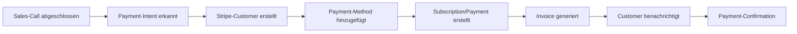

# Stripe Integration mit KI-Telefonassistenten

Revolutionieren Sie Ihre Zahlungsabwicklung mit intelligenten Telefonassistenten. Famulor Automation verbindet Ihre Anrufe nahtlos mit Stripe für automatische Payment-Processing, intelligentes Subscription-Management und datengetriebene Revenue-Optimierung.

<Note>
**Revenue-Excellence**: Stripe-Integration ermöglicht es, Zahlungen und Abonnements direkt aus Verkaufsgesprächen zu verwalten und den gesamten Revenue-Lifecycle zu automatisieren.
</Note>

## Warum Stripe + KI-Telefonassistent?

### 💳 Nahtlose Payment-Integration
Automatische Zahlungsverarbeitung direkt aus Verkaufsgesprächen mit sicherer PCI-DSS-konformer Abwicklung.

### 🔄 Intelligent Subscription-Management
KI-gesteuerte Abonnement-Verwaltung mit automatischen Upgrades, Downgrades und Churn-Prevention.

### 📊 Revenue-Intelligence-Analytics
Echtzeit-Revenue-Tracking und Forecasting basierend auf Anruf-Outcomes und Payment-Daten.

### ⚡ Automated Billing-Workflows
Vollautomatische Rechnungsstellung, Dunning-Management und Revenue-Recognition aus Gesprächen.

## Hauptfunktionen der Integration

### 1. Automatische Payment-Processing aus Anrufen

**Voice-to-Payment-Workflow:**


**Automatische Payment-Szenarien:**
- ✅ **"Ich möchte das kaufen"** → Sofortige Payment-Link-Generierung
- ✅ **"Können wir das Abonnement upgraden?"** → Subscription-Upgrade-Workflow
- ✅ **"Buchen Sie das für nächsten Monat"** → Scheduled-Payment-Setup
- ✅ **"Wir brauchen mehr Lizenzen"** → Automatic-Quantity-Adjustment
- ✅ **"Jährliche Zahlung für Rabatt"** → Billing-Cycle-Änderung
- ✅ **"Pausieren Sie das Abo"** → Subscription-Pause-Management

### 2. Intelligent Subscription-Lifecycle-Management

**Automated Subscription-Workflows:**

| Anruf-Trigger | Stripe-Aktion | Business-Outcome |
|---------------|---------------|------------------|
| 🚀 **Upgrade-Request** | Plan-Change + Proration | Revenue-Increase |
| ⬇️ **Downgrade-Request** | Plan-Reduction + Credit | Churn-Prevention |
| ⏸️ **Pause-Request** | Subscription-Pause | Retention-Strategy |
| 🚫 **Cancel-Request** | Cancellation + Win-back-Campaign | Save-Opportunity |
| 💳 **Payment-Failed** | Dunning-Sequence + Recovery-Call | Payment-Recovery |
| 🔄 **Renewal-Discussion** | Auto-Renewal-Settings | Retention-Automation |

### 3. Revenue-Intelligence und Forecasting

**Real-time Revenue-Analytics:**
```
Revenue-Tracking-Dashboard:
📊 MRR (Monthly Recurring Revenue):
├─ New-MRR from Sales-Calls
├─ Expansion-MRR from Upgrades
├─ Contraction-MRR from Downgrades
├─ Churned-MRR from Cancellations
└─ Net-MRR-Growth-Trends

💰 Revenue-Predictions:
├─ Pipeline-to-Revenue-Conversion
├─ Churn-Risk-Assessment
├─ Expansion-Opportunity-Scoring
├─ Seasonal-Revenue-Patterns
└─ Customer-Lifetime-Value-Projections
```

### 4. Advanced Billing-Automation

**Intelligent Invoicing-Workflows:**
```
Custom-Billing-Scenarios:
🏢 Enterprise-Billing:
├─ Custom-Payment-Terms (Net-30, Net-60)
├─ Purchase-Order-Integration
├─ Multi-Entity-Billing
├─ Currency-Conversion-Management
└─ Tax-Compliance-Automation

📱 Usage-Based-Billing:
├─ Metered-Billing für API-Calls
├─ Overage-Charges-Automation
├─ Usage-Alerts und Notifications
├─ Tiered-Pricing-Implementation
└─ Real-time-Usage-Tracking

💼 Professional-Services:
├─ Time-Based-Billing-Integration
├─ Project-Milestone-Payments
├─ Retainer-Management
├─ Expense-Reimbursement
└─ Multi-Project-Billing-Consolidation
```

## Praxisbeispiele: Stripe Voice Commerce

### Beispiel 1: SaaS-Subscription-Management

**Szenario:** Software-Unternehmen mit Tiered-Pricing-Model

**Voice-Subscription-Automation:**
```
Customer-Call: "Unser Team wächst, wir brauchen mehr Lizenzen"

Automatische Stripe-Integration:
💳 Current-Subscription-Analysis:
├─ Plan: Professional (50 Users, €2,500/Monat)
├─ Usage: 47/50 Users (94% Utilization)
├─ Add-ons: Advanced-Analytics, API-Access
└─ Payment-History: On-time, Good-Standing

🚀 Upgrade-Workflow:
├─ New-Plan: Professional (100 Users, €4,500/Monat)
├─ Proration: €1,250 für remainder of billing-period
├─ Effective-Date: Sofort
├─ New-Invoice: Automatically generated und sent
└─ Customer-Notification: Upgrade-Confirmation-Email

📊 Revenue-Impact:
├─ MRR-Increase: +€2,000/Monat
├─ Expansion-Revenue: €24,000/Jahr
├─ Customer-LTV: +€48,000 (projected)
└─ Churn-Risk: Reduced (higher-engagement)
```

### Beispiel 2: E-Commerce-Payment-Processing

**Szenario:** Online-Shop mit High-Value-B2B-Verkäufen

**Enterprise-Payment-Workflow:**
```
B2B-Sales-Call: "Wir kaufen 1000 Einheiten, brauchen aber 30 Tage Zahlungsziel"

Stripe-Enterprise-Processing:
🏢 Customer-Setup:
├─ Stripe-Customer: Enterprise-Account erstellt
├─ Payment-Terms: Net-30 konfiguriert
├─ Credit-Limit: €50,000 approved
├─ Purchase-Order: PO-12345 referenced
└─ Tax-Calculation: EU-B2B-VAT-Reverse-Charge

💰 Order-Processing:
├─ Order-Value: €35,000 (1000 × €35)
├─ Payment-Method: Invoice (30 days)
├─ Invoice-Generation: Automatic PDF-Creation
├─ Delivery-Trigger: Warehouse-Notification
└─ Payment-Tracking: 30-day reminder-sequence

📋 Compliance-Integration:
├─ VAT-Reporting: Automated für EU-Compliance
├─ Financial-Records: Automatic-Bookkeeping-Export
├─ Tax-Documentation: Complete-Audit-Trail
└─ Revenue-Recognition: GAAP-compliant-Timing
```

### Beispiel 3: Professional-Services-Billing

**Szenario:** Consulting-Firm mit projektbasierter Abrechnung

**Project-Billing-Automation:**
```
Client-Call: "Projekt ist genehmigt, wir starten mit 50% Anzahlung"

Professional-Services-Billing:
📋 Project-Setup:
├─ Project: Digital-Transformation-Beratung
├─ Total-Value: €150,000 (6 Monate)
├─ Payment-Schedule: 50% Start, 25% Mid, 25% End
├─ Milestone-Tracking: 3 Major-Deliverables
└─ Team-Allocation: 3 Senior-Consultants

💳 Payment-Milestone-Automation:
├─ Invoice-1: €75,000 (Project-Start) - Sofort
├─ Invoice-2: €37,500 (Month 3) - Milestone-triggered
├─ Invoice-3: €37,500 (Project-End) - Completion-triggered
├─ Expense-Tracking: Travel und Materials separate
└─ Time-Tracking-Integration: Consultant-Hours-Billing

📊 Project-Revenue-Management:
├─ Revenue-Recognition: Percentage-of-Completion-Method
├─ Profitability-Tracking: Real-time-Margin-Analysis
├─ Scope-Change-Management: Additional-Work-Orders
├─ Client-Portal-Access: Invoice-Status und Project-Progress
└─ Retention-Management: 10% held until final-acceptance
```

## Advanced Stripe-Features

### 1. Multi-Market-Payment-Support

**Global-Payment-Processing:**
```
International-Business-Support:
🌍 Geographic-Payment-Methods:
├─ EU: SEPA-Direct-Debit, iDEAL, Bancontact
├─ US: ACH, Credit-Cards, Apple-Pay, Google-Pay
├─ UK: Bacs-Direct-Debit, Open-Banking
├─ APAC: Alipay, WeChat-Pay, Local-Bank-Transfers
└─ LATAM: OXXO, Boleto, Local-Payment-Methods

💱 Currency-Management:
├─ Multi-Currency-Pricing: Local-Currency-Display
├─ FX-Rate-Management: Real-time-Conversion
├─ Hedging-Strategies: Currency-Risk-Mitigation
├─ Local-Tax-Calculation: VAT, GST, Sales-Tax
└─ Compliance-Management: Local-Regulations
```

### 2. Advanced-Fraud-Prevention

**AI-Powered-Risk-Management:**
```
Stripe-Radar-Integration:
🛡️ Fraud-Detection:
├─ Machine-Learning-Models für Transaction-Scoring
├─ Behavioral-Analysis für Suspicious-Activity
├─ Device-Fingerprinting für Account-Security
├─ Velocity-Checks für Unusual-Patterns
└─ 3D-Secure-Authentication für High-Risk-Transactions

⚠️ Risk-Management-Workflows:
├─ High-Risk-Calls: Additional-Verification-Required
├─ Chargeback-Prevention: Pre-Transaction-Screening
├─ Account-Monitoring: Suspicious-Activity-Alerts
├─ Manual-Review-Workflows: Human-Oversight-Integration
└─ Compliance-Reporting: Regulatory-Documentation
```

### 3. Revenue-Recovery-Automation

**Intelligent-Dunning-Management:**
```
Failed-Payment-Recovery:
📧 Smart-Dunning-Sequences:
├─ Day 1: Friendly-Payment-Reminder (Email)
├─ Day 3: Personal-Follow-up-Call (Famulor-triggered)
├─ Day 7: Account-Manager-Outreach (CRM-integration)
├─ Day 14: Final-Notice-before-Suspension
└─ Day 21: Service-Suspension mit Win-back-Offer

💡 Recovery-Optimization:
├─ Payment-Method-Updates: Automatic-Card-Updater
├─ Payment-Timing-Optimization: Best-Success-Times
├─ Personalized-Recovery-Messages: Customer-Specific-Content
├─ Alternative-Payment-Methods: Fallback-Options
└─ Retention-Campaigns: Discount-Offers für At-Risk-Customers
```

## Setup-Guide: Stripe-Integration

### Schritt 1: Stripe-Account-Setup
```
Stripe-Dashboard-Konfiguration:
1. Stripe-Account → API-Keys
2. Publishable und Secret-Keys kopieren
3. Webhook-Endpoints konfigurieren
4. Product-Catalog Setup für Subscriptions

Required-Permissions:
✅ Payments: Create, Read, Update
✅ Customers: Create, Read, Update  
✅ Subscriptions: Create, Read, Update, Cancel
✅ Invoices: Create, Read, Update, Send
✅ Payment-Methods: Create, Read, Update
✅ Webhooks: Receive-Events
```

### Schritt 2: Product-Catalog-Integration
```
Stripe-Products-Setup:
📦 Subscription-Products:
├─ Basic-Plan: €29/Monat, Feature-Set-A
├─ Professional-Plan: €99/Monat, Feature-Set-B
├─ Enterprise-Plan: €299/Monat, Feature-Set-C
└─ Add-ons: À-la-carte-Features

💰 Pricing-Models:
├─ Recurring-Subscriptions: Monthly/Annual-Billing
├─ Usage-Based-Pricing: Metered-Billing-Components
├─ Tiered-Pricing: Volume-Discounts
├─ One-Time-Payments: Setup-Fees, Professional-Services
└─ Freemium-Model: Free-Tier mit Upgrade-Path
```

### Schritt 3: Webhook-Integration
```
Stripe-Webhook-Events:
Event-Subscriptions:
✅ invoice.payment_succeeded → Success-Notifications
✅ invoice.payment_failed → Dunning-Workflows
✅ customer.subscription.created → Welcome-Sequences
✅ customer.subscription.updated → Plan-Change-Confirmations
✅ customer.subscription.deleted → Churn-Analysis
✅ charge.dispute.created → Chargeback-Management

Webhook-URL: https://api.famulor.de/webhooks/stripe
Signing-Secret: [Secure-Secret-from-Stripe]
```

### Schritt 4: Advanced-Configuration
```
Enterprise-Features:
🏢 Multi-Account-Setup:
├─ Stripe-Connect für Multi-Vendor-Scenarios
├─ Marketplace-Payments für Platform-Business
├─ Split-Payments für Partner-Revenue-Sharing
└─ Subsidiary-Account-Management

📊 Analytics-Integration:
├─ Stripe-Sigma für Custom-Reports
├─ Data-Pipeline zu Data-Warehouse
├─ Real-time-Dashboards für Revenue-Metrics
└─ Predictive-Analytics für Churn-Prevention

🔐 Security-Enhancements:
├─ PCI-DSS-Compliance-Validation
├─ Tokenization für Secure-Card-Storage
├─ Encryption-at-Rest für Sensitive-Data
└─ Audit-Logs für Compliance-Requirements
```

## Best Practices für Stripe+Voice Integration

### 1. Payment-Security-Optimization
```
Security-Best-Practices:
🔒 PCI-Compliance:
├─ Never-Store-Card-Details in Voice-Systems
├─ Use-Stripe-Tokens für Card-References
├─ Secure-API-Communication-Only
├─ Regular-Security-Audits
└─ Staff-Training für Payment-Security

💳 Fraud-Prevention:
├─ Address-Verification-Service (AVS)
├─ CVV-Verification für Card-Transactions
├─ 3D-Secure für High-Value-Transactions
├─ Velocity-Limits für Rapid-Transactions
└─ Geographic-Restrictions basierend auf Business-Model
```

### 2. Customer-Experience-Optimization
```
Payment-UX-Best-Practices:
⚡ Seamless-Payment-Flow:
├─ One-Click-Payment-Links aus Calls
├─ Mobile-Optimized-Checkout-Pages
├─ Multiple-Payment-Method-Options
├─ Transparent-Pricing-Display
└─ Clear-Cancellation-Policies

📧 Communication-Automation:
├─ Payment-Confirmation-Emails
├─ Invoice-Delivery-Automation
├─ Payment-Failure-Notifications
├─ Subscription-Renewal-Reminders
└─ Receipt-Management für Tax-Purposes
```

### 3. Revenue-Optimization-Strategies
```
Growth-Optimization:
📈 Revenue-Expansion:
├─ Usage-Based-Upselling-Triggers
├─ Feature-Adoption-Monitoring
├─ Expansion-Opportunity-Identification
├─ Cross-Sell-Recommendation-Engine
└─ Customer-Success-Integration

🔄 Churn-Reduction:
├─ Payment-Failure-Recovery-Optimization
├─ Subscription-Pause-Options
├─ Downgrade-Retention-Offers
├─ Win-back-Campaigns für Cancelled-Customers
└─ Satisfaction-Survey-Integration
```

## ROI & Revenue-Impact

### Stripe-Integration-Performance-Metrics:

| KPI | Ohne Integration | Mit Stripe+Voice | Verbesserung |
|-----|------------------|------------------|--------------|
| **Payment-Processing-Zeit** | 15-30 Minuten | 2 Minuten | 93% schneller |
| **Subscription-Conversion** | 12% | 34% | +183% |
| **Payment-Failure-Recovery** | 23% | 67% | +191% |
| **Customer-LTV** | €3,200 | €5,800 | +81% |
| **Revenue-per-Call** | €145 | €340 | +134% |

### Financial-Impact-Analysis:
```
Monthly-Revenue-Impact (€1M ARR-Business):
├─ Faster-Payment-Processing: €8,500/Monat (Time-Savings)
├─ Higher-Conversion-Rates: €45,000/Monat (Additional-Revenue)
├─ Better-Payment-Recovery: €12,000/Monat (Dunning-Optimization)
├─ Reduced-Churn: €23,000/Monat (Retention-Improvement)
├─ Upselling-Automation: €18,000/Monat (Expansion-Revenue)

Total-Monthly-Benefit: €106,500
Integration-Cost: €2,000/Monat
Net-ROI: €104,500/Monat (5,225% ROI)
Break-Even: 1 Tag
```

---

**Bereit für intelligente Payment-Automation?**

<CardGroup cols={2}>
  <Card title="Stripe Integration aktivieren" icon="credit-card" href="https://app.famulor.de/integrations/stripe">
    Stripe jetzt mit KI-Assistenten verbinden
  </Card>
  <Card title="Payment-Demo buchen" icon="calendar" href="https://cal.com/bek-group/demotermine">
    Live-Demo der Payment-Integration
  </Card>
  <Card title="Revenue-Calculator" icon="calculator" href="/automation-platform/integrations/einzelintegrations/stripe/revenue-calculator">
    Berechnen Sie Ihren Revenue-Impact
  </Card>
  <Card title="Enterprise-Setup" icon="building" href="/automation-platform/integrations/einzelintegrations/stripe/enterprise">
    Enterprise-Payment-Konfiguration
  </Card>
</CardGroup>