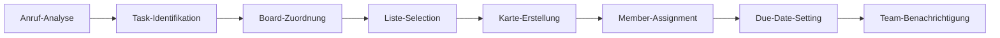

# Trello Integration mit KI-Telefonassistenten

Optimieren Sie Ihr visuelles Projektmanagement mit intelligenten Telefonassistenten. Famulor Automation verbindet Ihre Anrufe nahtlos mit Trello für automatische Karten-Erstellung, Board-Updates und intuitive Kanban-Workflow-Automation.

<Note>
**Visual-Productivity-Boost**: Trello-Integration macht aus jedem Anruf automatisch strukturierte Kanban-Karten mit korrekten Listen-Zuordnungen und Team-Assignments.
</Note>

## Warum Trello + KI-Telefonassistent?

### 📋 Automatische Kanban-Karten-Erstellung
Jeder Anruf wird automatisch in visuell organisierte Trello-Karten umgewandelt mit korrekten Board- und Listen-Zuordnungen.

### 🎯 Intuitive Workflow-Visualisierung
KI erkennt Projekt-Kontext und ordnet Tasks automatisch den richtigen Kanban-Spalten zu für optimalen Workflow-Überblick.

### 👥 Seamless Team-Collaboration
Automatische Team-Member-Zuweisung und Benachrichtigungen für effiziente Aufgaben-Koordination.

### 📈 Visual Progress-Tracking
Echtzeit-Projekt-Fortschritt durch automatische Karten-Bewegungen zwischen Listen basierend auf Anruf-Updates.

## Hauptfunktionen der Integration

### 1. Intelligente Karten-Erstellung aus Gesprächen

**Voice-to-Kanban-Workflow:**


**Automatisch erkannte Karten-Elemente:**
- ✅ **Karten-Titel**: Aus Gesprächs-Kontext extrahiert
- ✅ **Beschreibung**: Detaillierte Anruf-Notizen
- ✅ **Liste**: Intelligente Workflow-Stage-Zuordnung
- ✅ **Labels**: Automatische Kategorisierung
- ✅ **Members**: Team-Mitglieder-Zuweisung
- ✅ **Due-Date**: Deadline-Erkennung aus Gespräch
- ✅ **Checklists**: Sub-Tasks aus Anruf-Details

### 2. Smart Board-Management

**Automatische Board-Organisation:**

| Anruf-Kontext | Trello-Board | Listen-Zuordnung |
|---------------|--------------|------------------|
| 🎯 **Neues Projekt** | Project-Board erstellt | Backlog → To Do → In Progress → Done |
| 🔧 **Bug-Report** | Bug-Tracking-Board | Reported → Investigating → Fixed → Verified |
| 💼 **Sales-Lead** | Sales-Pipeline-Board | Lead → Qualified → Demo → Proposal → Won |
| 📞 **Support-Ticket** | Support-Board | New → In Progress → Waiting → Resolved |
| 🎨 **Feature-Request** | Product-Board | Ideas → Backlog → Development → Testing → Released |

### 3. Dynamic Workflow-Automation

**Kanban-Flow-Intelligence:**
```
Workflow-State-Management:
📋 List-Progression-Logic:
├─ Anruf: "Task ist angefangen" → Move zu "In Progress"
├─ Anruf: "Brauche Review" → Move zu "Review"
├─ Anruf: "Problem blockiert uns" → Add "Blocked" Label
├─ Anruf: "Fertig, kann deployed werden" → Move zu "Ready for Deploy"
└─ Anruf: "Projekt abgeschlossen" → Move zu "Done" + Archive

Dependency-Management:
├─ Blocked-Tasks: Dependency-Tracking in Beschreibung
├─ Prerequisite-Tasks: Checklists für Sequential-Work
├─ Team-Coordination: Cross-Board-References
└─ Resource-Conflicts: Capacity-Management-Alerts
```

### 4. Advanced Team-Coordination

**Collaborative Kanban-Features:**
```
Team-Assignment-Intelligence:
👥 Smart-Member-Assignment:
├─ Skills-Based-Matching: Task-Type zu Expert-Assignment
├─ Workload-Balancing: Capacity-aware-Distribution
├─ Timezone-Coordination: Global-Team-Handoffs
├─ Expertise-Routing: Complex-Tasks zu Senior-Members
└─ Availability-Checking: Vacation/Out-of-Office-Awareness

📧 Notification-Strategies:
├─ @mentions für Direct-Assignments
├─ Board-Activity-Digests für Team-Updates
├─ Due-Date-Reminders für Approaching-Deadlines
├─ Comment-Notifications für Collaboration
└─ Workflow-Alerts für Blocked/Urgent-Tasks
```

## Praxisbeispiele: Trello Voice Productivity

### Beispiel 1: Agile Software-Development

**Szenario:** Development-Team mit Scrum-Methodology

**Sprint-Management-Automation:**
```
Product-Owner-Call: "Neue User-Story: Login mit Social-Media"

Automatische Trello-Integration:
📋 Board: "Product-Backlog"
🏷️ Karte: "User-Story: Social-Media-Login"
📝 Beschreibung: 
   "Als Nutzer möchte ich mich mit Google/Facebook anmelden
    können, damit der Registrierungsprozess einfacher wird.
    
    Acceptance-Criteria:
    - Google OAuth-Integration
    - Facebook Login-Option
    - Bestehende Account-Verknüpfung
    - Security-Testing erforderlich"

📊 Task-Breakdown (Automatic-Checklist):
├─ ☐ OAuth-Provider-Research (2 Story-Points)
├─ ☐ Backend-API-Implementation (5 Story-Points)
├─ ☐ Frontend-Integration (3 Story-Points)
├─ ☐ Security-Review (2 Story-Points)
├─ ☐ Testing & QA (3 Story-Points)
└─ ☐ Documentation-Update (1 Story-Point)

👥 Assignment: @backend-dev, @frontend-dev, @security-expert
📅 Sprint-Planning: Nächster Sprint (2 Wochen)
🏷️ Labels: "Feature", "High-Priority", "Security-Review-Required"
```

### Beispiel 2: Marketing-Campaign-Management

**Szenario:** Marketing-Team koordiniert Multi-Channel-Kampagne

**Campaign-Workflow-Automation:**
```
Marketing-Director-Call: "Q2-Kampagne startet, alle Channels koordinieren"

Campaign-Board-Setup:
📋 Board: "Q2-Product-Launch-Campaign"
📊 Listen: Strategy → Creative → Production → Review → Launch → Analysis

🎯 Campaign-Tasks (Auto-generated):
├─ Karte: "Target-Audience-Research"
│   ├─ Liste: Strategy
│   ├─ Member: @market-researcher
│   ├─ Due: 1 Woche
│   └─ Checklist: Demographics, Psychographics, Competitor-Analysis

├─ Karte: "Creative-Concept-Development"
│   ├─ Liste: Creative
│   ├─ Member: @creative-director
│   ├─ Due: 2 Wochen
│   └─ Checklist: Visual-Identity, Copy-Strategy, Brand-Guidelines

├─ Karte: "Social-Media-Content-Creation"
│   ├─ Liste: Production
│   ├─ Member: @social-media-manager
│   ├─ Due: 3 Wochen
│   └─ Checklist: Instagram-Posts, Facebook-Ads, LinkedIn-Content

└─ Karte: "Performance-Tracking-Setup"
    ├─ Liste: Launch
    ├─ Member: @analytics-specialist
    ├─ Due: 4 Wochen
    └─ Checklist: KPI-Definition, Dashboard-Setup, Reporting-Schedule

Cross-Board-Dependencies:
🔗 Sales-Board: Lead-Capture-Process-Update
🔗 Product-Board: Feature-Highlight-Coordination
🔗 Support-Board: FAQ-Update für Campaign-Questions
```

### Beispiel 3: Event-Management-Coordination

**Szenario:** Event-Agentur organisiert Corporate-Conference

**Event-Planning-Workflow:**
```
Client-Call: "Corporate-Conference für 500 Teilnehmer, 3 Monate Zeit"

Event-Management-Board:
📋 Board: "Corporate-Conference-2024"
📊 Listen: Planning → Vendor-Coordination → Marketing → Execution → Post-Event

🎪 Event-Task-Breakdown:
├─ Venue-Selection (Planning)
│   ├─ Capacity: 500+ Personen
│   ├─ Location: Zentral, Parking
│   ├─ Technical: A/V-Equipment, WiFi
│   ├─ Catering: Space für Lunch/Coffee-Breaks
│   └─ Budget: €15,000 Maximum

├─ Speaker-Coordination (Vendor-Coordination)
│   ├─ Keynote-Speaker: Industry-Expert
│   ├─ Panel-Discussions: 3 Sessions
│   ├─ Workshop-Leaders: 6 Parallel-Sessions
│   ├─ Travel/Accommodation: Arrangements
│   └─ Technical-Requirements: Presentation-Setup

├─ Marketing-Campaign (Marketing)
│   ├─ Registration-Website: Custom-Landing-Page
│   ├─ Social-Media: LinkedIn, Twitter-Promotion
│   ├─ Email-Campaign: Target-Audience-Outreach
│   ├─ Print-Materials: Brochures, Banners
│   └─ Press-Release: Industry-Publications

└─ Day-of-Execution (Execution)
    ├─ Setup-Crew: 6:00 AM Start
    ├─ Registration-Desk: Check-in-Process
    ├─ Technical-Support: A/V-Monitoring
    ├─ Catering-Coordination: Meal-Service-Management
    └─ Cleanup-Crew: Post-Event-Teardown

Timeline-Management:
⏰ 12 Wochen vor Event: Venue + Speaker-Bookings
⏰ 8 Wochen vor Event: Marketing-Launch
⏰ 4 Wochen vor Event: Final-Confirmations
⏰ 1 Woche vor Event: Final-Preparations
⏰ Event-Day: Execution-Coordination
⏰ 1 Woche nach Event: Post-Event-Analysis
```

## Advanced Trello-Features

### 1. Power-Ups-Integration

**Enhanced-Functionality durch Trello-Power-Ups:**
```
Productivity-Power-Ups:
📅 Calendar-Power-Up:
├─ Deadline-Visualization in Calendar-View
├─ Milestone-Tracking für Project-Phases
├─ Team-Schedule-Coordination
└─ Sprint-Planning-Calendar-Integration

📊 Dashboard-Power-Up:
├─ Burndown-Charts für Agile-Teams
├─ Team-Velocity-Tracking
├─ Project-Progress-Visualization
└─ KPI-Monitoring-Dashboards

🔗 Integration-Power-Ups:
├─ GitHub-Integration für Code-Commits
├─ Slack-Notifications für Team-Updates
├─ Google-Drive für Document-Attachments
└─ Time-Tracking für Productivity-Analysis
```

### 2. Automation-Rules (Butler)

**Trello-Butler-Integration:**
```
Custom-Automation-Rules:
🤖 Workflow-Automation:
├─ Rule: "Wenn Karte nach 'Done' verschoben → Due-Date-Complete + Archive nach 7 Tagen"
├─ Rule: "Wenn Due-Date in 2 Tagen → Add 'Urgent' Label + Notify Assignee"
├─ Rule: "Wenn Comment mit '@review' → Move zu 'Review' Liste"
└─ Rule: "Wenn alle Checklist-Items ✓ → Move zu nächste Liste"

📧 Notification-Automation:
├─ Daily-Stand-up-Summaries für Team
├─ Weekly-Progress-Reports für Management
├─ Overdue-Task-Alerts für Assignees
└─ Milestone-Achievement-Celebrations
```

### 3. Multi-Board-Coordination

**Enterprise-Board-Management:**
```
Board-Hierarchy-Management:
🏢 Organization-Level:
├─ Master-Board: High-Level-Project-Overview
├─ Department-Boards: Team-specific-Workflows
├─ Project-Boards: Individual-Project-Management
└─ Archive-Boards: Completed-Project-Storage

🔄 Cross-Board-Dependencies:
├─ Reference-Cards: Links zwischen Related-Tasks
├─ Template-Boards: Standardized-Workflow-Starting-Points
├─ Reporting-Boards: Aggregated-Progress-Tracking
└─ Resource-Planning-Boards: Team-Capacity-Management
```

## Setup-Guide: Trello-Integration

### Schritt 1: Trello-API-Zugang
```
Trello-Developer-Setup:
1. Trello → Settings → Developer API Keys
2. API-Key und Token generieren
3. Famulor → Integrations → Trello
4. Credentials eingeben und Verbindung testen

Required-Permissions:
✅ Boards: Read, Write, Create
✅ Lists: Read, Write, Create
✅ Cards: Read, Write, Create, Delete
✅ Members: Read, Assign
✅ Labels: Read, Write, Create
✅ Comments: Read, Write
✅ Attachments: Read, Write
```

### Schritt 2: Board-Structure-Setup
```
Board-Organization-Strategy:
📋 Project-Management-Boards:
├─ Development-Projects
├─ Marketing-Campaigns  
├─ Sales-Pipeline
├─ Customer-Support
└─ Internal-Operations

📊 Standard-List-Templates:
├─ Kanban-Flow: Backlog → To Do → In Progress → Review → Done
├─ Bug-Tracking: Reported → Investigating → In Progress → Testing → Resolved
├─ Sales-Process: Lead → Qualified → Proposal → Negotiation → Won/Lost
└─ Support-Flow: New → Assigned → In Progress → Waiting → Resolved
```

### Schritt 3: Automation-Rules-Configuration
```
Voice-Triggered-Automations:
🎯 Anruf-to-Card-Mappings:
├─ "Bug-Report" → Bug-Tracking-Board + "Reported"-Liste
├─ "Feature-Request" → Product-Board + "Backlog"-Liste
├─ "Sales-Lead" → Sales-Board + "New-Lead"-Liste
├─ "Support-Issue" → Support-Board + "New"-Liste
└─ "Project-Task" → Relevant-Project-Board + "To-Do"-Liste

⚡ Workflow-Triggers:
├─ "Task begonnen" → Move zu "In Progress"
├─ "Brauche Hilfe" → Add "Help-Needed"-Label + Notify-Team
├─ "Blockiert" → Add "Blocked"-Label + Escalate-to-Manager
├─ "Bereit für Review" → Move zu "Review" + Assign-Reviewer
└─ "Abgeschlossen" → Move zu "Done" + Update-Due-Date
```

### Schritt 4: Team-Integration-Setup
```
Team-Collaboration-Configuration:
👥 Member-Assignment-Rules:
├─ Development-Tasks → @dev-team
├─ Design-Tasks → @design-team
├─ Marketing-Tasks → @marketing-team
├─ Support-Tasks → @support-team
└─ Management-Tasks → @management-team

🔔 Notification-Preferences:
├─ Immediate: @mentions, Due-Date-Approaching
├─ Daily-Digest: Board-Activity, New-Assignments
├─ Weekly-Summary: Completed-Tasks, Overdue-Items
└─ Monthly-Report: Team-Productivity, Project-Progress
```

## Best Practices für Trello+Voice Integration

### 1. Kanban-Workflow-Optimization
```
Efficient-Kanban-Design:
📋 List-Structure-Best-Practices:
✅ Limit-Work-in-Progress: Max-Tasks per Liste
✅ Clear-Definition-of-Done: Criteria für List-Movement
✅ Regular-Board-Grooming: Archive-Completed-Cards
✅ Consistent-Labeling: Standardized-Color-Coding
✅ Due-Date-Management: Realistic-Timeline-Setting

🎯 Workflow-Efficiency:
├─ Single-Responsibility: One-Task-per-Card
├─ Granular-Tasks: Break-down-Large-Items
├─ Clear-Descriptions: Detailed-Task-Requirements
├─ Regular-Updates: Progress-Communication
└─ Dependency-Tracking: Link-Related-Cards
```

### 2. Team-Productivity-Optimization
```
Collaboration-Excellence:
👥 Team-Coordination:
├─ Daily-Stand-ups: Board-Review-Meetings
├─ Sprint-Planning: Backlog-Grooming-Sessions
├─ Retrospectives: Workflow-Improvement-Discussions
├─ Capacity-Planning: Workload-Distribution-Reviews
└─ Knowledge-Sharing: Best-Practice-Documentation

📊 Performance-Tracking:
├─ Velocity-Metrics: Cards-Completed-per-Sprint
├─ Cycle-Time: Average-Time-in-Progress
├─ Lead-Time: Backlog-to-Done-Duration
├─ Throughput: Daily/Weekly-Completion-Rates
└─ Quality-Metrics: Defect-Rates, Rework-Frequency
```

### 3. Scaling-Strategies
```
Enterprise-Trello-Management:
🏢 Organization-Scaling:
├─ Team-Workspaces: Department-Isolation
├─ Cross-Team-Boards: Collaboration-Spaces
├─ Template-Libraries: Standardized-Workflows
├─ Governance-Policies: Consistent-Usage-Guidelines
└─ Training-Programs: Team-Onboarding-Processes

📈 Growth-Management:
├─ Board-Archival-Strategies: Historical-Data-Management
├─ Performance-Monitoring: Usage-Analytics-Tracking
├─ Integration-Health: System-Reliability-Monitoring
└─ Continuous-Improvement: Workflow-Optimization-Cycles
```

## ROI & Productivity-Metrics

### Trello-Integration-Performance-Indicators:

| KPI | Ohne Integration | Mit Trello+Voice | Verbesserung |
|-----|------------------|------------------|--------------|
| **Task-Erstellung-Zeit** | 5-8 Minuten | 30 Sekunden | 90% Reduktion |
| **Projekt-Transparenz** | 45% Team-Visibility | 95% Team-Visibility | +111% |
| **Task-Completion-Rate** | 67% | 89% | +33% |
| **Team-Coordination-Efficiency** | 6.2/10 | 9.1/10 | +47% |
| **Project-Delivery-Time** | 87% On-Time | 96% On-Time | +10% |

### Productivity-ROI-Calculation:
```
Monthly-Productivity-Impact (25-Person-Team):
├─ Task-Management-Efficiency: 75 Stunden/Monat gespart
├─ Improved-Coordination: 45 Stunden/Monat weniger Meetings
├─ Better-Visibility: 32 Stunden/Monat weniger Status-Updates
├─ Reduced-Rework: 28 Stunden/Monat durch bessere Clarity

Financial-Impact:
├─ Productivity-Savings: €13,500/Monat (bei €75/h Average)
├─ Faster-Project-Delivery: €8,200/Monat (Time-to-Market)
├─ Improved-Quality: €5,100/Monat (Less-Rework)
├─ Integration-Cost: €400/Monat
├─ Net-ROI: €26,400/Monat (6,600% ROI)
└─ Payback-Period: 1 Tag
```

---

**Bereit für visuelles Projekt-Management?**

<CardGroup cols={2}>
  <Card title="Trello Integration aktivieren" icon="kanban" href="https://app.famulor.de/integrations/trello">
    Trello jetzt mit KI-Assistenten verbinden
  </Card>
  <Card title="Kanban-Demo buchen" icon="calendar" href="https://cal.com/bek-group/demotermine">
    Live-Demo der Trello-Integration
  </Card>
  <Card title="Board-Templates" icon="template" href="/automation-platform/integrations/einzelintegrations/trello/templates">
    Vorgefertigte Kanban-Board-Konfigurationen
  </Card>
  <Card title="Workflow-Guide" icon="workflow" href="/automation-platform/integrations/einzelintegrations/trello/workflows">
    Optimale Kanban-Workflow-Strategien
  </Card>
</CardGroup>