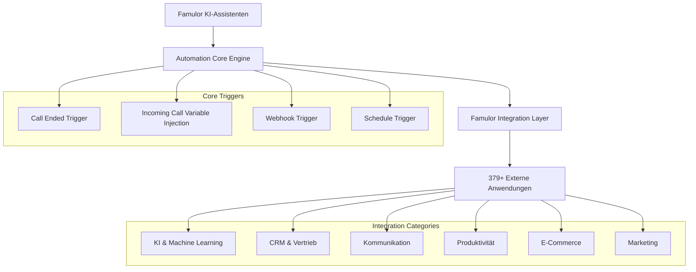

# Famulor Automation Platform - Umfassende Integrations-Datenbank

Diese Datenbank dient als zentrale Referenz für alle verfügbaren Integrationen der Famulor Automation Platform. Jede Integration umfasst detaillierte Informationen zu verfügbaren Aktionen und Auslösern, die nahtlos mit Ihren KI-Telefonassistenten zusammenarbeiten.

## Architektur der Integrations-Engine

## Vollständige Integrations-Datenbank

### **A**

---
**Acumbamail**
* **Beschreibung:** E-Mail-Marketing-Plattform für Newsletter und Kampagnen-Management
* **Aktionen:**
    * **Remove Subscriber:** Einen Abonnenten aus einer Acumbamail-Liste entfernen
    * **Search Subscriber:** Einen Abonnenten in einer Acumbamail-Liste per E-Mail suchen
    * **Duplicate Template:** Eine bestehende E-Mail-Vorlage duplizieren
    * **Add/Update Subscriber:** Einen neuen Abonnenten hinzufügen oder einen bestehenden aktualisieren
    * **Create Subscriber List:** Eine neue Abonnentenliste erstellen
    * **Delete Subscriber List:** Eine Abonnentenliste löschen
    * **Unsubscribe Subscriber:** Einen Abonnenten von einer Liste abmelden

---
**Actual Budget**
* **Beschreibung:** Open-Source-Budgetierungs- und Finanzmanagement-Tool
* **Aktionen:**
    * **Get Budget:** Die Budgetübersicht für einen bestimmten Monat und ein bestimmtes Jahr abrufen
    * **Get Accounts:** Alle in Actual Budget konfigurierten Konten auflisten
    * **Get Categories:** Die in Actual Budget definierten Kategorien abrufen
    * **Import Transaction:** Eine einzelne Transaktion importieren
    * **Import Transactions:** Mehrere Transaktionen per Massenimport importieren

---
**ActiveCampaign**
* **Beschreibung:** All-in-One-Marketing-Automatisierungs- und CRM-Plattform
* **Aktionen:**
    * **Create Account:** Ein neues Konto in ActiveCampaign erstellen
    * **Create Contact:** Einen neuen Kontakt in ActiveCampaign erstellen
    * **Update Account:** Ein bestehendes ActiveCampaign-Konto aktualisieren
    * **Update Contact:** Einen bestehenden Kontakt in ActiveCampaign aktualisieren
    * **Add Tag to Contact:** Einem ActiveCampaign-Kontakt ein Tag hinzufügen
    * **Add Contact to Account:** Einen Kontakt zu einem ActiveCampaign-Konto hinzufügen
    * **Subscribe or Unsubscribe Contact From List:** Einen Kontakt zu einer Liste an- oder abmelden

---
**Afforai**
* **Beschreibung:** KI-gestützter Chatbot für dokumentenbasierte Antworten
* **Aktionen:**
    * **Ask Chatbot:** Eine Antwort von einem Afforai-Chatbot generieren, indem eine Frage gesendet wird

---
**Airtable**
* **Beschreibung:** KI-native App-Building-Plattform für benutzerdefinierte Business-Apps ohne Code
* **Aktionen:**
    * **Custom API Call:** Eine benutzerdefinierte API-Anfrage an Airtable stellen
    * **Find Airtable Record:** Einen Datensatz in einer Airtable-Basis finden
    * **Create Airtable Record:** Einen neuen Datensatz in einer Airtable-Tabelle erstellen
    * **Delete Airtable Record:** Einen Datensatz aus einer Airtable-Tabelle löschen
    * **Update Airtable Record:** Einen bestehenden Datensatz in Airtable aktualisieren
    * **Upload File to Column:** Eine Datei in eine Anhang-Spalte eines Airtable-Datensatzes hochladen

---
**AITable**
* **Beschreibung:** KI-gestützte Tabellenkalkulations- und Datenbank-Plattform
* **Aktionen:**
    * **Custom API Call:** Eine benutzerdefinierte API-Anfrage an einen bestimmten AITable-Endpunkt senden
    * **Find Records:** Datensätze in einem Datenblatt finden
    * **Create Record:** Einen neuen Datensatz in einem AITable-Datenblatt erstellen
    * **Update Record:** Einen bestehenden Datensatz in einem AITable-Datenblatt aktualisieren

---
**Airparser**
* **Beschreibung:** Dokumentenanalyse-Tool für automatische Datenextraktion
* **Aktionen:**
    * **Upload Document:** Ein Dokument zur Analyse in einen Airparser-Posteingang hochladen
    * **Get Data from Document:** Geparsed JSON-Daten aus einem bestimmten Dokument in Airparser abrufen

---
**Amazon S3**
* **Beschreibung:** Cloud-Speicherdienst von Amazon Web Services
* **Aktionen:**
    * **Read File:** Eine Datei aus einem Amazon S3-Bucket lesen
    * **Upload File:** Eine Datei in einen Amazon S3-Bucket hochladen

---
**Amazon SQS**
* **Beschreibung:** Message-Queue-Service von Amazon für asynchrone Kommunikation
* **Aktionen:**
    * **Send Message:** Eine Nachricht an eine Amazon SQS-Warteschlange senden

---
**Aminos**
* **Beschreibung:** Benutzer- und Identitätsverwaltungs-Platform
* **Aktionen:**
    * **Create User on Aminos One:** Einen neuen Benutzer in Aminos One erstellen

---
**AnyHook GraphQL**
* **Beschreibung:** GraphQL-Webhook-Service für Echtzeit-Datenübertragung
* **Aktionen:**
    * **Execute GraphQL Query:** Eine GraphQL-Abfrage an einen beliebigen Endpunkt ausführen
    * **Subscribe to GraphQL Subscription:** Echtzeit-Datenabonnements über GraphQL verwalten

---
**AnyHook Websocket**
* **Beschreibung:** WebSocket-Service für bidirektionale Echtzeit-Kommunikation
* **Aktionen:**
    * **Send WebSocket Message:** Eine Nachricht über WebSocket-Verbindung senden
    * **Listen to WebSocket Events:** Eingehende WebSocket-Nachrichten verarbeiten

---
**Anthropic Claude**
* **Beschreibung:** Fortgeschrittenes KI-Sprachmodell für natürliche Sprachverarbeitung
* **Aktionen:**
    * **Generate Text:** Text mit Claude AI generieren
    * **Chat Completion:** Konversations-basierte KI-Antworten erstellen
    * **Text Analysis:** Textinhalte analysieren und verstehen
    * **Content Moderation:** Inhalte auf Sicherheit und Angemessenheit prüfen

---
**Apify**
* **Beschreibung:** Web-Scraping- und Datenextraktions-Plattform
* **Aktionen:**
    * **Get user's Actors:** Die Liste der für den Benutzer verfügbaren Apify Actors abrufen
    * **Get last run details:** Details des letzten Laufs eines bestimmten Apify Actors abrufen
    * **Start an Apify Actor:** Einen Apify Actor Web Scraper starten
    * **Get Dataset Items:** Die Datensatzelemente aus einem abgeschlossenen Apify Actor-Lauf abrufen

---
**Apollo**
* **Beschreibung:** Sales Intelligence- und Lead-Generierungs-Plattform
* **Aktionen:**
    * **Search People:** Personen basierend auf spezifischen Kriterien suchen
    * **Search Companies:** Unternehmen in der Apollo-Datenbank finden
    * **Add Contact to Sequence:** Einen Kontakt zu einer E-Mail-Sequenz hinzufügen
    * **Create Contact:** Einen neuen Kontakt in Apollo erstellen
    * **Update Contact:** Bestehende Kontaktinformationen aktualisieren
    * **Export Search Results:** Suchergebnisse als CSV exportieren

---
**Approval**
* **Beschreibung:** Workflow-Genehmigungssystem für Geschäftsprozesse
* **Aktionen:**
    * **Send for Approval:** Ein Element zur Genehmigung senden
    * **Approve Item:** Ein genehmigungspflichtiges Element genehmigen
    * **Reject Item:** Ein genehmigungspflichtiges Element ablehnen
    * **Get Approval Status:** Den Status einer Genehmigungsanfrage abrufen
* **Auslöser:**
    * **Approval Requested:** Wird ausgelöst, wenn eine neue Genehmigung angefragt wird
    * **Approval Granted:** Wird ausgelöst, wenn eine Genehmigung erteilt wird
    * **Approval Rejected:** Wird ausgelöst, wenn eine Genehmigung abgelehnt wird

---
**Asana**
* **Beschreibung:** Projektmanagement- und Team-Kollaborations-Plattform
* **Aktionen:**
    * **Create Task:** Eine neue Aufgabe in einem Projekt erstellen
    * **Update Task:** Eine bestehende Aufgabe aktualisieren
    * **Delete Task:** Eine Aufgabe aus einem Projekt löschen
    * **Add Comment to Task:** Einen Kommentar zu einer Aufgabe hinzufügen
    * **Create Project:** Ein neues Projekt erstellen
    * **Add User to Project:** Einen Benutzer zu einem Projekt hinzufügen
    * **Set Task Due Date:** Ein Fälligkeitsdatum für eine Aufgabe festlegen
    * **Assign Task:** Eine Aufgabe einem Teammitglied zuweisen
    * **Custom API Call:** Benutzerdefinierte API-Aufrufe an Asana ausführen
* **Auslöser:**
    * **New Task Created:** Wird ausgelöst, wenn eine neue Aufgabe erstellt wird
    * **Task Updated:** Wird ausgelöst, wenn eine Aufgabe aktualisiert wird
    * **Task Completed:** Wird ausgelöst, wenn eine Aufgabe als abgeschlossen markiert wird

---
**AssemblyAI**
* **Beschreibung:** KI-gestützte Audio-Transkriptions- und Analyse-Plattform
* **Aktionen:**
    * **Transcribe Audio:** Audio-Dateien in Text transkribieren
    * **Analyze Audio Content:** Audio-Inhalte auf Sentiment und Themen analysieren
    * **Real-time Transcription:** Live-Audio-Streams transkribieren
    * **Extract Audio Insights:** Wichtige Informationen aus Audio-Dateien extrahieren
    * **Language Detection:** Die gesprochene Sprache in Audio-Dateien erkennen

---
**Azure Communication Services**
* **Beschreibung:** Cloud-Kommunikationsplattform von Microsoft Azure
* **Aktionen:**
    * **Send SMS:** SMS-Nachrichten über Azure senden
    * **Make Voice Call:** Sprachanrufe über Azure initiieren
    * **Send Email:** E-Mails über Azure Communication Services senden
    * **Create Chat Thread:** Einen neuen Chat-Thread erstellen
    * **Add Participant to Chat:** Einen Teilnehmer zu einem Chat hinzufügen

---
**Azure OpenAI**
* **Beschreibung:** OpenAI-Services integriert in Microsoft Azure Cloud
* **Aktionen:**
    * **Generate Text Completion:** Textvervollständigung mit Azure OpenAI
    * **Create Chat Completion:** Chat-basierte KI-Antworten generieren
    * **Generate Embeddings:** Text-Embeddings für semantische Suche erstellen
    * **Analyze Text:** Textinhalte mit OpenAI-Modellen analysieren
    * **Custom Model Inference:** Benutzerdefinierte Modell-Inferenz ausführen

### **B**

---
**Bannerbear**
* **Beschreibung:** Automatische Bild- und Video-Generierungs-API
* **Aktionen:**
    * **Create Image:** Dynamische Bilder basierend auf Vorlagen erstellen
    * **Create Video:** Automatisierte Videos generieren
    * **Generate Screenshot:** Screenshots von Webseiten erstellen
    * **Bulk Image Generation:** Mehrere Bilder gleichzeitig generieren
    * **Get Template List:** Verfügbare Vorlagen abrufen

---
**Baserow**
* **Beschreibung:** Open-Source-Alternative zu Airtable für Datenbank-Management
* **Aktionen:**
    * **Create Row:** Eine neue Zeile in einer Baserow-Tabelle erstellen
    * **Update Row:** Eine bestehende Zeile aktualisieren
    * **Delete Row:** Eine Zeile aus einer Tabelle löschen
    * **Get Rows:** Zeilen basierend auf Filterkriterien abrufen
    * **List Tables:** Alle Tabellen in einer Datenbank auflisten

---
**Beamer**
* **Beschreibung:** Changelog- und Update-Kommunikations-Tool
* **Aktionen:**
    * **Create Post:** Einen neuen Changelog-Eintrag erstellen
    * **Update Post:** Einen bestehenden Post aktualisieren
    * **Publish Post:** Einen Entwurf veröffentlichen
    * **Get Post Statistics:** Statistiken für einen Post abrufen
    * **Notify Subscribers:** Abonnenten über Updates benachrichtigen

---
**Bettermode**
* **Beschreibung:** Community-Management- und Engagement-Plattform
* **Aktionen:**
    * **Assign Badge to Member:** Einem Mitglied in Bettermode ein Abzeichen zuweisen
    * **Revoke Badge from Member:** Ein Abzeichen von einem Mitglied entfernen
    * **Create Question Post:** Einen Frage-Beitrag in Bettermode erstellen
    * **Custom API Call:** Einen benutzerdefinierten GraphQL-API-Aufruf an Bettermode ausführen
    * **Create Discussion Post:** Einen Diskussionsbeitrag in Bettermode veröffentlichen

---
**Binance**
* **Beschreibung:** Führende Kryptowährungs-Börsen-Plattform
* **Aktionen:**
    * **Fetch Pair Price:** Den aktuellen Preis für ein Kryptowährungspaar auf Binance abrufen
    * **Get Account Balance:** Kontosaldo in verschiedenen Kryptowährungen abrufen
    * **Place Order:** Kauf- oder Verkaufsorders erstellen
    * **Get Order History:** Handelshistorie abrufen
    * **Get Market Data:** Marktdaten und Preistrends abrufen

---
**Blackbaud**
* **Beschreibung:** Nonprofit-Management- und Fundraising-Software
* **Aktionen:**
    * **Create Gift:** Einen Geschenkdatensatz in Blackbaud erstellen
    * **Get Gift Subtypes:** Die verfügbaren Geschenk-Untertypen abrufen
    * **Get Fundraising List:** Details einer Spendenliste abrufen
    * **Search Contacts After Date:** Nach Kontakten suchen, die nach einem bestimmten Datum hinzugefügt wurden
    * **Upsert Contact on Email:** Einen Kontakt basierend auf der E-Mail-Adresse erstellen oder aktualisieren

---
**Blockscout**
* **Beschreibung:** Blockchain-Explorer für Ethereum-basierte Netzwerke
* **Aktionen:**
    * **Get Transaction Details:** Details einer Blockchain-Transaktion abrufen
    * **Get Address Balance:** Saldo einer Blockchain-Adresse abfragen
    * **Get Block Information:** Informationen über einen spezifischen Block abrufen
    * **Verify Smart Contract:** Smart Contracts verifizieren und validieren
    * **Search Tokens:** Token-Informationen in der Blockchain suchen

---
**Bloomerang**
* **Beschreibung:** Donor-Management- und Fundraising-CRM für Nonprofits
* **Aktionen:**
    * **Create Constituent:** Einen neuen Spender oder Kontakt erstellen
    * **Update Constituent:** Spenderinformationen aktualisieren
    * **Record Donation:** Eine Spende erfassen und verarbeiten
    * **Create Interaction:** Eine Interaktion mit einem Spender dokumentieren
    * **Generate Report:** Fundraising-Berichte erstellen

---
**Bonjoro**
* **Beschreibung:** Personalisierte Video-Messaging-Plattform für Kundenbindung
* **Aktionen:**
    * **Send Video Message:** Eine personalisierte Videonachricht senden
    * **Create Task:** Eine neue Aufgabe für Video-Outreach erstellen
    * **Update Contact:** Kontaktinformationen aktualisieren
    * **Track Video Views:** Video-Aufrufe und Engagement verfolgen
    * **Schedule Video:** Ein Video für späteren Versand planen

---
**Box**
* **Beschreibung:** Enterprise-Cloud-Content-Management und Collaboration
* **Aktionen:**
    * **Upload File:** Eine Datei in Box hochladen
    * **Download File:** Eine Datei von Box herunterladen
    * **Create Folder:** Einen neuen Ordner erstellen
    * **Share File:** Eine Datei mit anderen Benutzern teilen
    * **Move File:** Eine Datei in einen anderen Ordner verschieben
    * **Delete File:** Eine Datei dauerhaft löschen

---
**Brevo**
* **Beschreibung:** All-in-One-Digital-Marketing-Plattform (ehemals Sendinblue)
* **Aktionen:**
    * **Send Email:** E-Mails über Brevo versenden
    * **Create Contact:** Einen neuen Kontakt zur Liste hinzufügen
    * **Update Contact:** Kontaktinformationen aktualisieren
    * **Send SMS:** SMS-Nachrichten versenden
    * **Create Email Campaign:** E-Mail-Kampagnen erstellen und planen
    * **Get Campaign Statistics:** Kampagnen-Performance-Daten abrufen

---
**Brilliant Directories**
* **Beschreibung:** Software für die Erstellung und Verwaltung von Online-Verzeichnissen
* **Aktionen:**
    * **Create Listing:** Ein neues Verzeichnis-Listing erstellen
    * **Update Listing:** Ein bestehendes Listing aktualisieren
    * **Delete Listing:** Ein Listing aus dem Verzeichnis entfernen
    * **Search Listings:** Listings basierend auf Kriterien suchen
    * **Moderate Listing:** Listings für Veröffentlichung prüfen und genehmigen

---
**Bubble**
* **Beschreibung:** No-Code-Plattform für Web-App-Entwicklung
* **Aktionen:**
    * **Create Database Entry:** Einen neuen Datenbankeintrag in Bubble erstellen
    * **Update Database Entry:** Einen bestehenden Eintrag aktualisieren
    * **Delete Database Entry:** Einen Eintrag aus der Datenbank löschen
    * **Search Database:** Datenbankeinträge basierend auf Kriterien suchen
    * **Trigger Workflow:** Einen Bubble-Workflow aus externen Quellen auslösen

## Nächste Schritte

<CardGroup cols={2}>
  <Card title="CRM-Integrationen" icon="users" href="/automation-platform/integrations/crm">
    Verbinden Sie Ihre Kundendaten mit Anruf-Automatisierung
  </Card>
  <Card title="KI & Machine Learning" icon="brain" href="/automation-platform/integrations/ai-machine-learning">
    Erweiterte KI-Funktionen für Ihre Telefonassistenten
  </Card>
  <Card title="Kommunikationsplattformen" icon="comments" href="/automation-platform/integrations/communication">
    Nahtlose Team-Kommunikation und Benachrichtigungen
  </Card>
  <Card title="E-Mail Marketing" icon="envelope" href="/automation-platform/integrations/email-marketing">
    Automatisierte E-Mail-Workflows nach Anrufen
  </Card>
</CardGroup>

<Note>
**Vollständige Integrations-Datenbank**: Diese Seite zeigt die ersten beiden Abschnitte (A-B) der umfassenden Integrations-Datenbank. Die vollständige Liste mit über 379 Integrationen umfasst alle Kategorien von C bis Z und wird kontinuierlich erweitert.

Für eine vollständige Liste aller verfügbaren Integrationen oder spezielle Implementierungsanfragen kontaktieren Sie unser Support-Team.
</Note>

---

**Hinweis**: Alle Integrationen sind sofort verfügbar und können ohne technische Kenntnisse eingerichtet werden. Für spezielle Anforderungen steht unser Support-Team zur Verfügung.