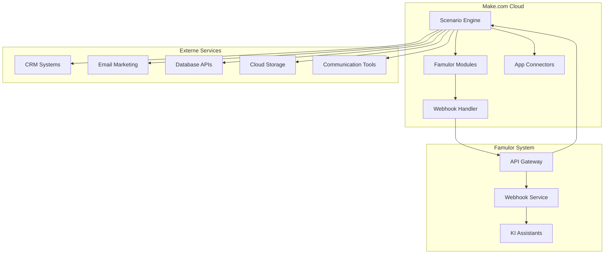
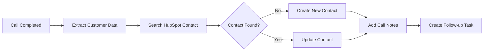

# Make.com Integration

**Cloud-basierte Alternative zu Famulor Automation**: Falls Sie die native Famulor Automation Platform nicht nutzen möchten, bietet Make.com eine leistungsstarke, benutzerfreundliche Alternative für die Automatisierung Ihrer Workflows.

Verbinden Sie Famulor nahtlos mit **Make.com** durch unsere offizielle Make.com App. Automatisieren Sie Workflows zwischen Ihrer KI-Telefonie-Plattform und über **1000 verfügbaren Apps** - von CRM-Systemen bis hin zu Cloud-Services.

<Card title="Offizielle Famulor Make.com App" icon="puzzle-piece" href="https://www.make.com/en/hq/app-invitation/5dc7ab8bf7bbe546f4ad7eb1483a820f">
  Installieren Sie unsere offizielle Make.com App direkt über diesen Link
</Card>

## Wann sollten Sie Make.com wählen?

<CardGroup cols={2}>
  <Card title="✅ Make.com verwenden wenn" icon="check-circle" color="green">
    - Sie eine benutzerfreundliche, visuelle Oberfläche wünschen
    - Sie cloud-gehostete Workflows bevorzugen
    - Sie keine technische Infrastruktur verwalten möchten
    - Sie schnell und ohne Setup beginnen wollen
    - Sie über 1000 fertige App-Integrationen nutzen möchten
    - Sie ein bewährtes, professionelles Tool benötigen
  </Card>
  <Card title="⚡ Famulor Automation verwenden wenn" icon="wand-magic-sparkles" color="blue">
    - Sie eine native Famulor-Integration wünschen
    - Sie sofort ohne externe Accounts beginnen möchten
    - Sie tiefere Famulor-Feature-Integration benötigen
    - Sie alles aus einer Hand bevorzugen
    - Sie direkten Support von Famulor benötigen
  </Card>
</CardGroup>

## Make.com vs. Famulor Automation Platform

Beide Lösungen haben ihre spezifischen Stärken. Hier ist ein detaillierter Vergleich:

| Feature | Make.com | Famulor Automation |
|---------|----------|-------------------|
| **Setup-Komplexität** | ✅ Sofort verfügbar, kein Setup | ✅ Sofort verfügbar, kein Setup |
| **Verfügbare Integrationen** | ✅ 1000+ Apps + Webhooks | ⚠️ Begrenzte Auswahl |
| **Workflow-Komplexität** | ✅ Sehr komplex, erweiterte Logik | ✅ Verzweigt, komplexe Logik |
| **Kosten** | ⚠️ Ab $9/Monat (nach Free-Tier) | ✅ Kostenlos enthalten |
| **Hosting** | ✅ Vollständig gemanagt | ✅ Vollständig gemanagt |
| **Benutzerfreundlichkeit** | ✅ Drag & Drop, visueller Editor | ✅ Einfacher Flow-Builder |
| **Enterprise Features** | ✅ Teams, Rollen, Advanced Features | ⚠️ Basis-Features |
| **Community** | ✅ Große Make.com Community | ✅ Direkte Famulor-Unterstützung |

### Praktische Anwendungsfälle für Make.com

**✅ Ideal für Make.com:**
- **Multi-App-Integration**: Verbindung zu CRMs, Marketing-Tools, Datenbanken
- **E-Commerce**: Shopify, WooCommerce, Stripe-Integrationen
- **Marketing Automation**: MailChimp, HubSpot, ActiveCampaign
- **Datenverarbeitung**: Google Sheets, Airtable, Notion
- **Team-Kollaboration**: Slack, Microsoft Teams, Trello

**⚡ Besser mit Famulor Automation:**
- **Einfache Workflows**: Schnelle, unkomplizierte Automatisierungen
- **Native Features**: Tiefe Integration in Famulor-Ökosystem
- **Kostenlose Nutzung**: Keine zusätzlichen monatlichen Kosten
- **Support**: Direkter Support vom Famulor-Team

## Installation der Famulor Make.com App

<Steps>
  <Step title="Make.com Account erstellen">
    Falls noch nicht vorhanden, erstellen Sie einen kostenlosen Account bei [Make.com](https://www.make.com)
  </Step>
  <Step title="Famulor App installieren">
    Klicken Sie auf unseren Installations-Link:
    
    <Card title="Famulor App installieren" icon="external-link" href="https://www.make.com/en/hq/app-invitation/5dc7ab8bf7bbe546f4ad7eb1483a820f">
      Direkt zur Make.com App-Installation
    </Card>
  </Step>
  <Step title="API-Schlüssel hinterlegen">
    Verbinden Sie Ihren Famulor Account mit Ihrem API-Schlüssel aus dem [Famulor Dashboard](https://app.famulor.de)
  </Step>
  <Step title="Ersten Workflow erstellen">
    Erstellen Sie Ihr erstes Szenario mit Famulor-Modulen
  </Step>
</Steps>

<Note>
**Tipp**: Ihren Famulor API-Schlüssel finden Sie in Ihrem Dashboard unter Einstellungen → API-Schlüssel.
</Note>

## Architektur-Übersicht

Die Make.com-Integration ermöglicht bidirektionale Kommunikation zwischen Famulor und beliebigen Cloud-Services über die Make.com-Plattform.



## Verfügbare Module

### Triggers (Auslöser)

| Trigger | Beschreibung | Verfügbare Daten |
|---------|-------------|------------------|
| **Call Completed** | Wird ausgelöst wenn ein KI-Anruf beendet ist | `call_id`, `duration`, `transcript`, `extracted_variables`, `customer_phone`, `status` |
| **Watch Ended Phone Call** | Alternative Bezeichnung für Call Completed | Identische Daten wie Call Completed |

### Actions (Aktionen)

| Action | Beschreibung | Erforderliche Parameter |
|--------|-------------|------------------------|
| **Make Call** | Startet einen ausgehenden KI-Anruf | `phone_number`, `assistant_id`, `variables` (optional) |
| **Make API Call** | Universeller API-Aufruf für alle Famulor-Endpoints | `url`, `method`, `headers`, `body` |

### Search (Suche)

| Search | Beschreibung | Parameter |
|--------|-------------|-----------|
| **Get Assistants** | Listet alle verfügbaren KI-Assistenten auf | `limit` (optional) |

## Beliebte Workflow-Beispiele

### CRM-Integration mit HubSpot


### Lead-Benachrichtigung per Slack


### E-Mail Follow-up Automation


## Erweiterte Funktionen

### Webhook-Integration
Make.com unterstützt sowohl ausgehende als auch eingehende Webhooks für maximale Flexibilität:

```json
{
  "webhook_url": "https://hook.eu1.make.com/xyz123...",
  "triggers": [
    "call_completed",
    "call_started"
  ],
  "authentication": "Bearer YOUR_API_KEY"
}
```

### Datenverarbeitung
Nutzen Sie Make.coms mächtige Datenverarbeitungs-Tools:

- **Filter**: Verarbeiten Sie nur relevante Anrufe
- **Router**: Verzweigen Sie Workflows basierend auf Anrufergebnissen  
- **Aggregator**: Fassen Sie mehrere Anrufe zusammen
- **Iterator**: Verarbeiten Sie Listen von Daten
- **Text/JSON Parser**: Analysieren Sie Transkripte und Metadaten

### Fehlerbehandlung
Make.com bietet robuste Fehlerbehandlung:

- **Retry-Mechanismus**: Automatische Wiederholung bei temporären Fehlern
- **Error Handling**: Spezielle Pfade für Fehlerfälle
- **Fallback Actions**: Alternative Aktionen bei Problemen
- **Monitoring**: Detaillierte Logs und Benachrichtigungen

## Authentifizierung & Sicherheit

Die Make.com Integration implementiert bewährte Sicherheitsstandards:

- **OAuth 2.0 & API-Key**: Flexible Authentifizierungsoptionen
- **HTTPS-Verschlüsselung**: Alle Datenübertragungen sind verschlüsselt
- **Webhook-Verifizierung**: Signatur-basierte Webhook-Validierung
- **Rate Limiting**: Automatischer Schutz vor Überlastung

## Preisgestaltung

### Make.com Preise
- **Free**: 1.000 Operationen/Monat
- **Core**: $9/Monat (10.000 Operationen)  
- **Pro**: $16/Monat (40.000 Operationen)
- **Teams**: $29/Monat (100.000 Operationen)
- **Enterprise**: Custom Pricing

### Was zählt als Operation?
- Jeder Trigger-Aufruf = 1 Operation
- Jede Action-Ausführung = 1 Operation
- Jeder API-Call = 1 Operation

<Note>
**Tipp**: Bei hohem Volumen kann es kostengünstiger sein, die native Famulor Automation zu nutzen.
</Note>

## Best Practices

### Workflow-Optimierung
- **Batch Processing**: Sammeln Sie mehrere Anrufe bevor Sie Aktionen ausführen
- **Conditional Logic**: Nutzen Sie Filter um unnötige Operationen zu vermeiden
- **Caching**: Vermeiden Sie wiederholte API-Calls für dieselben Daten

### Fehlerbehandlung
- **Retry Logic**: Implementieren Sie Wiederholungen für temporäre Fehler
- **Error Paths**: Erstellen Sie alternative Pfade für Fehlerfälle
- **Notifications**: Richten Sie Benachrichtigungen für kritische Fehler ein

### Sicherheit
- **API-Key Management**: Rotieren Sie regelmäßig Ihre API-Schlüssel
- **Webhook Security**: Verwenden Sie HTTPS für alle Webhook-Endpoints
- **Data Privacy**: Loggen Sie keine sensiblen Kundendaten

### Performance
- **Scenario Scheduling**: Nutzen Sie geplante Szenarien für nicht-kritische Tasks
- **Data Minimization**: Übertragen Sie nur benötigte Datenfelder
- **Connection Reuse**: Verwenden Sie eine Verbindung für mehrere Module

## Warum Make.com eine ausgezeichnete Alternative ist

### 🎨 Benutzerfreundlichkeit
Visueller Drag & Drop Editor macht komplexe Automatisierungen für jeden zugänglich.

### ☁️ Cloud-nativ
Keine Infrastruktur-Verwaltung - alles läuft zuverlässig in der Make.com Cloud.

### 🔗 Riesiges Ökosystem
Über 1000 vorgefertigte App-Integrationen decken fast jeden Anwendungsfall ab.

### 📊 Erweiterte Features
Teams, Rollen-Management, detaillierte Analytics und Enterprise-Features.

### 🚀 Skalierbar
Von kleinen Workflows bis hin zu Enterprise-Automatisierungen.

### 💪 Robust & Zuverlässig
Bewährte Plattform mit 99.9% Uptime und professionellem Support.

## Häufige Anwendungsfälle

### Sales & Marketing
- **Lead-Routing**: Qualifizierte Leads automatisch an Vertriebsteams weiterleiten
- **Follow-up Sequences**: Multi-Touch E-Mail-Kampagnen basierend auf Anrufergebnissen
- **CRM-Synchronisation**: Automatische Datenaktualisierung in Salesforce, HubSpot, Pipedrive

### Customer Support
- **Ticket-Erstellung**: Automatische Support-Tickets für ungelöste Kundenanrufe
- **Eskalation**: Weiterleitung komplexer Fälle an menschliche Agents
- **Satisfaction Tracking**: Follow-up Umfragen nach Support-Anrufen

### E-Commerce
- **Order Processing**: Anruf-basierte Bestellabwicklung
- **Inventory Updates**: Lagerbestandsanpassungen basierend auf Anrufen
- **Customer Journey**: Personalisierte Kommunikation entlang der Customer Journey

### Healthcare
- **Appointment Scheduling**: Automatisierte Terminbuchung und -erinnerungen
- **Patient Follow-up**: Nachsorge-Anrufe und Gesundheits-Check-ins
- **HIPAA-Compliant**: Sichere Verarbeitung sensibler Gesundheitsdaten

### Real Estate
- **Lead Qualification**: Automatische Bewertung von Immobilien-Interessenten
- **Property Matching**: Passende Objekte basierend auf Kundenanfragen
- **Viewing Coordination**: Automatisierte Besichtigungstermine

## Support und Ressourcen

<CardGroup cols={2}>
  <Card title="Famulor Make.com App" icon="puzzle-piece" href="https://www.make.com/en/hq/app-invitation/5dc7ab8bf7bbe546f4ad7eb1483a820f">
    Installieren Sie unsere offizielle Make.com App
  </Card>
  <Card title="Make.com Academy" icon="graduation-cap" href="https://www.make.com/en/academy">
    Lernen Sie Make.com mit kostenlosen Kursen und Tutorials
  </Card>
  <Card title="Famulor API Dokumentation" icon="book" href="/api-reference/introduction">
    Vollständige API-Referenz für erweiterte Integrationen
  </Card>
  <Card title="Make.com Community" icon="users" href="https://community.make.com/">
    Tauschen Sie sich mit anderen Make.com Benutzern aus
  </Card>
  <Card title="Famulor Support" icon="life-ring" href="mailto:support@famulor.de">
    Benötigen Sie Hilfe mit der Integration? Kontaktieren Sie uns
  </Card>
  <Card title="Template Gallery" icon="template" href="#workflow-templates">
    Vorgefertigte Workflow-Templates für schnellen Start
  </Card>
</CardGroup>

## Workflow-Templates

Nutzen Sie unsere vorgefertigten Templates für häufige Anwendungsfälle:

### CRM-Integration Templates
- **HubSpot Lead Sync**: Synchronisierung von Anrufdaten mit HubSpot CRM
- **Salesforce Opportunity**: Automatische Opportunity-Erstellung aus qualifizierten Leads
- **Pipedrive Deal Flow**: Deal-Pipeline-Management basierend auf Anrufergebnissen

### Marketing Automation Templates  
- **MailChimp Follow-up**: E-Mail-Sequences basierend auf Anruf-Outcomes
- **ActiveCampaign Tagging**: Automatisches Contact-Tagging für Segmentierung
- **Google Ads Conversion**: Conversion-Tracking für Anruf-basierte Leads

### Produktivitäts-Templates
- **Slack Notifications**: Team-Benachrichtigungen für wichtige Anrufe
- **Google Sheets Logging**: Automatische Protokollierung aller Anrufe
- **Calendar Scheduling**: Follow-up Termine basierend auf Anrufergebnissen

<Warning>
**Wichtiger Hinweis**: Make.com ist ein externes SaaS-Tool mit eigenen Kosten und Datenschutzrichtlinien. Prüfen Sie die [Make.com Datenschutzerklärung](https://www.make.com/en/privacy-notice) für Details zur Datenverarbeitung.
</Warning>

## Migration von anderen Plattformen

### Von Zapier zu Make.com
Make.com bietet erweiterte Features wie visuelle Workflows, bessere Fehlerbehandlung und kosteneffizientere Preisgestaltung.

### Von Integromat zu Make.com  
Make.com ist die neue Version von Integromat mit verbesserter Benutzeroberfläche und erweiterten Funktionen.

### Von Microsoft Power Automate
Make.com bietet mehr App-Integrationen und benutzerfreundlichere Workflow-Erstellung.

---

**Fazit**: Make.com ist eine ausgezeichnete Alternative zur Famulor Automation Platform, besonders wenn Sie umfangreiche App-Integrationen, eine benutzerfreundliche Oberfläche und professionelle Enterprise-Features benötigen. Die Kombination aus Famulor's KI-Telefonie und Make.coms Automatisierungs-Power eröffnet unendliche Möglichkeiten für Ihr Business.
