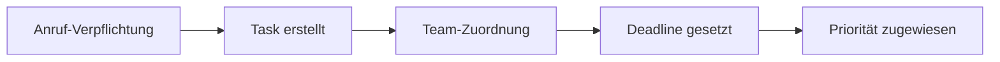

# Produktivität & Projektmanagement-Integrationen

Verwandeln Sie jede Telefoninteraktion in umsetzbare Aufgaben und organisierte Arbeitsabläufe. Famulor Automation verbindet Ihre KI-Telefonassistenten mit führenden Produktivitäts-Tools für nahtlose Workflow-Automatisierung.

## Google Sheets Integration

### Überblick
Google Sheets bietet leistungsstarke Tabellenkalkulations- und Datenmanagement-Funktionen mit Echtzeit-Kollaboration.

### KI-Telefonassistent Anwendungsfälle

#### 📊 Automatisches Anruf-Logging
**Beschreibung**: Füllen Sie automatisch Spreadsheets mit Anrufdetails, Ergebnissen und nächsten Schritten.

**Logging-Daten**:
- Datum und Uhrzeit des Anrufs
- Kundenkontaktinformationen
- Gesprächsdauer und -themen
- Ergebnisse und Sentiment-Analyse
- Follow-up-Aktionen und Deadlines

#### 📈 Lead-Tracking Dashboard
**Beschreibung**: Verwalten Sie Echtzeit-Lead-Status-Updates basierend auf Telefongesprächen.

**Dashboard-Elemente**:
- Lead-Pipeline-Visualisierung
- Conversion-Tracking nach Anrufquelle
- Team-Performance-Metriken
- Prognose-Berechnungen

#### 📋 Performance-Analytics
**Beschreibung**: Verfolgen Sie Anruf-Metriken und Conversion-Raten für Team-Performance-Analyse.

---

## Notion Integration

### Überblick
Notion kombiniert Notizen, Datenbanken, Wikis und Projektmanagement in einer einheitlichen Arbeitsumgebung.

### KI-Telefonassistent Anwendungsfälle

#### 📚 Kunden-Wissensdatenbank
**Beschreibung**: Erstellen Sie umfassende Kundenprofile mit Anrufhistorie und Präferenzen.

**Wissensdatenbank-Struktur**:
- Kundenprofil-Seiten mit Anrufhistorie
- Produkt-Interesse-Tracking
- Kommunikationspräferenzen
- Projektstatus und Meilensteine

#### 🚀 Projekt-Initiierung
**Beschreibung**: Erstellen Sie automatisch neue Projektseiten, wenn Kunden Services während Anrufen anfragen.

**Automatische Projekterstellung**:
- Projekt-Template basierend auf Service-Typ
- Stakeholder-Assignment aus Anrufdaten
- Timeline und Meilenstein-Planung
- Resource-Allocation

#### 🤝 Team-Zusammenarbeit
**Beschreibung**: Teilen Sie Anruf-Erkenntnisse und Action Items mit Projektteams über Notion-Seiten.

---

## ClickUp Integration

### Überblick
ClickUp ist eine All-in-One-Produktivitätsplattform für Aufgaben-, Projekt- und Team-Management.

### KI-Telefonassistent Anwendungsfälle

#### ✅ Automatische Task-Erstellung
**Beschreibung**: Generieren Sie Tasks für Teammitglieder basierend auf Verpflichtungen während Anrufen.

**Task-Generierung**:

#### 📊 Projekt-Status-Updates
**Beschreibung**: Aktualisieren Sie Projektfortschritt, wenn Kunden Feedback während Check-in-Anrufen geben.

#### 📋 Kundenrequest-Tracking
**Beschreibung**: Konvertieren Sie Kundenanfragen in verfolgbare Tasks mit automatischer Zuordnung.

---

## Airtable Integration

### Überblick
Airtable kombiniert die Benutzerfreundlichkeit von Tabellenkalkulationen mit der Leistung von Datenbanken.

### KI-Telefonassistent Anwendungsfälle

#### 🔗 Customer Journey Mapping
**Beschreibung**: Verknüpfen Sie komplette Customer Journeys mit verbundenen Records über Touchpoints.

#### 📦 Inventory-Management
**Beschreibung**: Aktualisieren Sie Produktverfügbarkeit, wenn Kunden nach spezifischen Items fragen.

#### 🎫 Service-Request-Management
**Beschreibung**: Erstellen und verfolgen Sie Service-Requests mit detailliertem Anrufkontext.

---

## Asana Integration

### Überblick
Asana ist ein leistungsstarkes Projektmanagement-Tool für Team-Koordination und Workflow-Automatisierung.

### KI-Telefonassistent Anwendungsfälle

#### 🎯 Milestone-Tracking
**Beschreibung**: Verfolgen Sie Projekt-Meilensteine basierend auf Kundenfeedback während Anrufen.

#### 👥 Team-Workload-Management
**Beschreibung**: Balancieren Sie Team-Workloads durch intelligente Task-Verteilung aus Anrufen.

#### 📈 Goal-Tracking
**Beschreibung**: Verknüpfen Sie Anrufergebnisse mit Unternehmenszielen und OKRs.

---

## Monday.com Integration

### KI-Telefonassistent Anwendungsfälle

#### 📊 Visual Project Boards
**Beschreibung**: Visualisieren Sie Anruf-basierte Projekte in farbcodierten Boards.

#### ⏰ Time-Tracking
**Beschreibung**: Verfolgen Sie Zeit, die für anruf-generierte Tasks aufgewendet wird.

---

## Trello Integration

### KI-Telefonassistent Anwendungsfälle

#### 📋 Kanban-Workflow
**Beschreibung**: Bewegen Sie Anruf-Tasks durch Kanban-Boards für visuelles Management.

#### 🏷️ Label-System
**Beschreibung**: Kategorisieren Sie Tasks basierend auf Anruftyp und -priorität.

---

## Best Practices für Produktivitäts-Integrationen

### 🎯 Task-Management
- **Klare Task-Beschreibungen**: Nutzen Sie Anrufkontext für detaillierte Task-Beschreibungen
- **Prioritäts-System**: Implementieren Sie Prioritäten basierend auf Kundenwichtigkeit
- **Deadline-Management**: Setzen Sie realistische Deadlines basierend auf Kundenbedürfnissen
- **Progress-Tracking**: Verfolgen Sie Task-Fortschritt und Completion-Raten

### 📊 Daten-Organisation
- **Standardisierte Felder**: Verwenden Sie konsistente Datenfelder über alle Tools
- **Kategorisierung**: Implementieren Sie klare Kategorisierungs-Systeme
- **Search-Optimierung**: Strukturieren Sie Daten für einfache Suchbarkeit
- **Archivierung**: Entwickeln Sie Strategien für alte Daten-Archivierung

### 🔄 Workflow-Automatisierung
- **Trigger-Events**: Definieren Sie klare Trigger für Automatisierungen
- **Conditional Logic**: Implementieren Sie intelligente Conditional-Workflows
- **Error-Handling**: Entwickeln Sie robuste Fehlerbehandlung
- **Performance-Optimization**: Optimieren Sie Workflows für Geschwindigkeit

## Erste Schritte

<Steps>
  <Step title="Tool auswählen">
    Wählen Sie Ihre primären Produktivitäts-Tools
  </Step>
  <Step title="Integration konfigurieren">
    Richten Sie API-Zugang und Berechtigungen ein
  </Step>
  <Step title="Workflows erstellen">
    Bauen Sie Automatisierungs-Workflows im Visual Builder
  </Step>
  <Step title="Team-Training">
    Schulen Sie Ihr Team in neuen Workflows
  </Step>
</Steps>

## Nächste Schritte

<CardGroup cols={2}>
  <Card title="CRM-Integration" icon="users" href="/automation-platform/integrations/crm">
    Verbinden Sie Produktivitäts-Tools mit Kundendaten
  </Card>
  <Card title="Kalender" icon="calendar" href="/automation-platform/integrations/calendar">
    Automatische Terminplanung aus Tasks
  </Card>
  <Card title="E-Mail Marketing" icon="envelope" href="/automation-platform/integrations/email-marketing">
    E-Mail-Updates über Task-Fortschritt
  </Card>
  <Card title="Analytics" icon="chart-line" href="/automation-platform/integrations/analytics">
    Performance-Analyse Ihrer Workflows
  </Card>
</CardGroup>