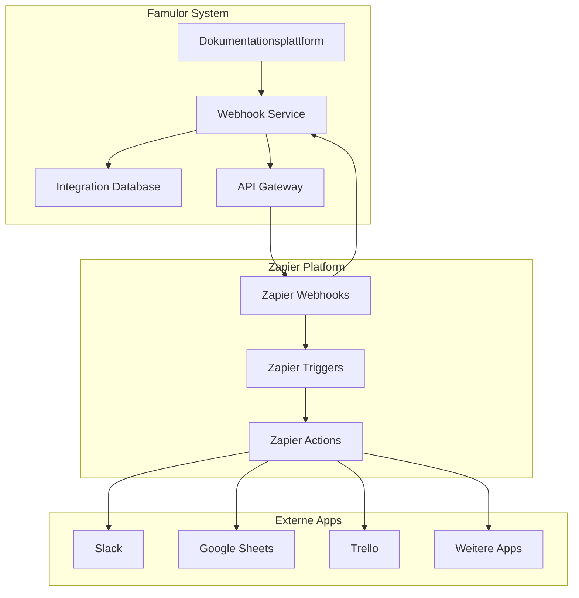
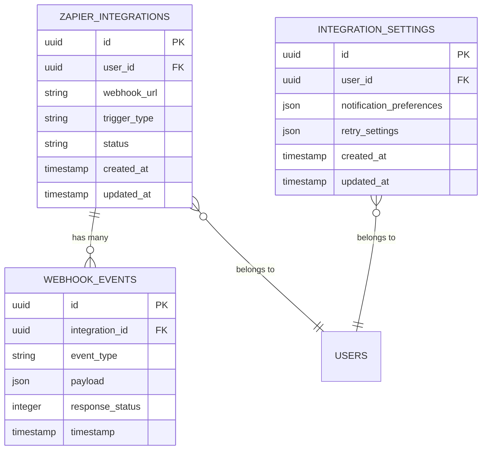
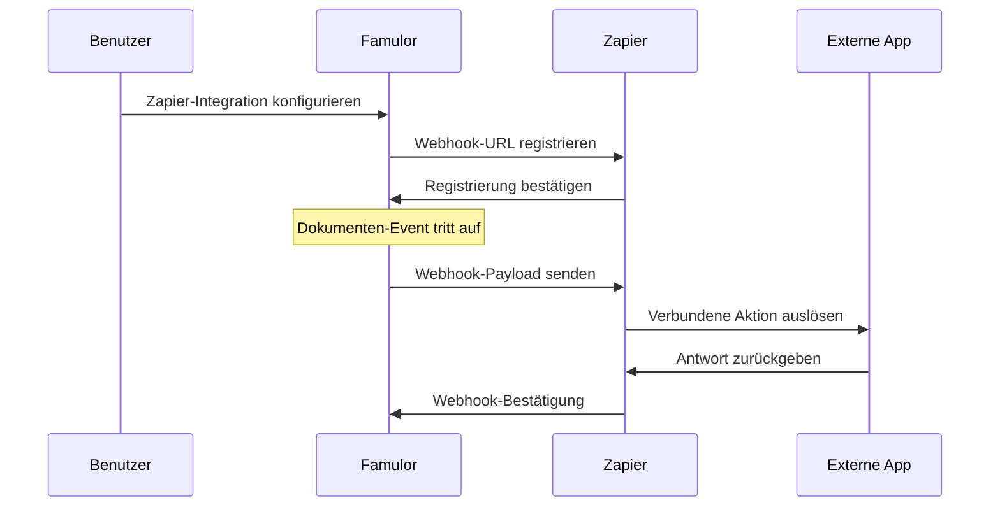
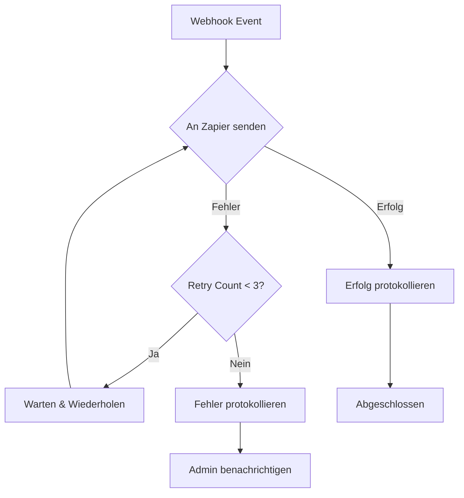

# Zapier Integration

**Alternative zu Famulor Automation**: Falls Sie die native Famulor Automation Platform nicht nutzen möchten, bietet Zapier eine benutzerfreundliche Alternative für die Automatisierung Ihrer Workflows.

Verbinden Sie Famulor nahtlos mit über **5.000 externen Anwendungen** durch unsere umfassende Zapier-Integration. Automatisieren Sie Workflows zwischen Ihrer KI-Telefonie-Plattform und den Tools, die Sie täglich verwenden - von CRM-Systemen bis hin zu Projektmanagement-Tools.

## Wann sollten Sie Zapier wählen?

<CardGroup cols={2}>
  <Card title="✅ Zapier verwenden wenn" icon="check-circle" color="green">
    - Sie bereits Zapier für andere Integrationen nutzen
    - Sie einfache, lineare Workflows benötigen
    - Sie Zugang zu 5.000+ Apps wünschen
    - Sie eine bewährte, stabile Lösung bevorzugen
    - Sie externe Community-Unterstützung schätzen
  </Card>
  <Card title="⚡ Famulor Automation verwenden wenn" icon="wand-magic-sparkles" color="blue">
    - Sie komplexe, verzweigte Workflows erstellen möchten
    - Sie erweiterte Datenverarbeitung benötigen
    - Sie custom logic und Bedingungen implementieren wollen
    - Sie die volle Kontrolle über Ihre Automatisierungen wünschen
    - Sie von kostenlosen, unlimitierten Workflows profitieren möchten
  </Card>
</CardGroup>

<Card title="Zapier Integration einrichten" icon="link" href="https://zapier.com/developer/public-invite/230037/92504c8a528059feedf28b7998c7a212/">
  Verbinden Sie Famulor mit Zapier und beginnen Sie mit der Automatisierung
</Card>

## Zapier vs. Famulor Automation Platform

Beiden Lösungen haben ihre spezifischen Stärken. Hier ist ein detaillierter Vergleich:

| Feature | Zapier | Famulor Automation |
|---------|--------|--------------------|
| **Setup-Komplexität** | ✅ Sehr einfach, Drag & Drop | ✅ Sehr einfach, Drag & Drop |
| **Verfügbare Apps** | ✅ 5.000+ Apps | ⚠️ Begrenzte Auswahl |
| **Workflow-Komplexität** | ⚠️ Linear, einfache Logik | ✅ Verzweigt, komplexe Logik |
| **Kosten** | ⚠️ Kostenpflichtig ab 20€/Monat | ✅ Kostenlos enthalten |
| **Datenverarbeitung** | ⚠️ Begrenzte Transformationen | ✅ Erweiterte Datenmanipulation |
| **Custom Code** | ⚠️ Nur mit Code-Steps | ✅ JavaScript/Python Support |
| **Error Handling** | ✅ Automatische Retries | ✅ Custom Error-Handling |
| **Support** | ✅ Community + Premium | ✅ Direkte Famulor-Unterstützung |

### Praktische Anwendungsfälle für Zapier

**✅ Ideal für Zapier:**
- **Lead-Weiterleitung**: Anrufdaten direkt an Ihr bestehendes CRM senden
- **Team-Benachrichtigungen**: Slack/Teams-Nachrichten bei wichtigen Anrufen
- **Dokumentation**: Anruf-Transkripte automatisch in Google Docs speichern
- **Kalender-Integration**: Termine basierend auf Anrufergebnissen erstellen
- **E-Mail-Marketing**: Kontakte zu Mailchimp/ConvertKit hinzufügen

**⚡ Besser mit Famulor Automation:**
- **Komplexe Entscheidungslogik**: Verschiedene Aktionen basierend auf Anrufinhalt
- **Datenbereinigung**: Telefonnummern normalisieren, Duplikate entfernen
- **Multi-Step-Prozesse**: Sequenzielle Aktionen mit Verzögerungen
- **Conditional Workflows**: Wenn-dann-Logik mit mehreren Bedingungen
- **Custom Integrations**: APIs ohne native Zapier-Unterstützung

## Quick Start: In 5 Minuten mit Zapier

Falls Sie sich gegen die Famulor Automation Platform entschieden haben, können Sie in wenigen Minuten mit Zapier starten:

<Steps>
  <Step title="Zapier-Account verbinden">
    Klicken Sie [hier](https://zapier.com/developer/public-invite/230037/92504c8a528059feedf28b7998c7a212/) und verbinden Sie Ihr Famulor-Konto
  </Step>
  <Step title="Erstes Zap erstellen">
    Wählen Sie "Call Completed" als Trigger und Ihre bevorzugte App als Action
  </Step>
  <Step title="Testen und aktivieren">
    Führen Sie einen Test-Anruf durch und aktivieren Sie Ihr Zap
  </Step>
</Steps>

<Note>
**Tipp**: Beginnen Sie mit einem einfachen Workflow wie "Slack-Benachrichtigung bei abgeschlossenem Anruf" um die Integration kennenzulernen.
</Note>

## Architektur-Übersicht

Die Zapier-Integration folgt einer webhook-basierten Architektur, die Echtzeit-Kommunikation zwischen Famulor und externen Anwendungen über die Zapier-Plattform ermöglicht.



## Integration Database

Die Integration Database dient als zentrales Speichersystem für die Verwaltung von Integrationskonfigurationen, Webhook-Endpoints und Event-Tracking für die Zapier-Integration.

### Datenbankschema

| Tabelle | Zweck | Hauptfelder |
|---------|-------|-------------|
| `zapier_integrations` | Aktive Zapier-Verbindungen speichern | `id`, `user_id`, `webhook_url`, `trigger_type`, `status`, `created_at` |
| `webhook_events` | Alle Webhook-Events protokollieren | `id`, `integration_id`, `event_type`, `payload`, `response_status`, `timestamp` |
| `integration_settings` | Benutzereinstellungen speichern | `id`, `user_id`, `notification_preferences`, `retry_settings` |

### Datenmodelle



## Verfügbare Trigger

Die Integration unterstützt folgende Trigger-Events, die Zapier-Workflows initiieren können:

### Dokumentations-Events

| Trigger | Beschreibung | Payload-Felder |
|---------|-------------|----------------|
| `document_created` | Neue Dokumentationsseite erstellt | `title`, `content`, `author`, `url`, `timestamp` |
| `document_updated` | Dokumentationsseite geändert | `title`, `content`, `author`, `url`, `changes`, `timestamp` |
| `document_published` | Dokumentationsseite veröffentlicht | `title`, `url`, `author`, `publish_date` |
| `comment_added` | Neuer Kommentar zur Dokumentation | `comment_text`, `author`, `document_url`, `timestamp` |
| `translation_completed` | Übersetzung abgeschlossen | `language`, `document_title`, `translator`, `completion_date` |

### Anruf-basierte Trigger

| Trigger | Beschreibung | Payload-Felder |
|---------|-------------|----------------|
| `call_completed` | KI-Anruf beendet | `duration`, `transcript`, `caller_id`, `assistant_id`, `timestamp` |
| `call_started` | KI-Anruf begonnen | `caller_id`, `assistant_id`, `phone_number`, `timestamp` |
| `voicemail_received` | Voicemail empfangen | `caller_id`, `duration`, `audio_url`, `timestamp` |

## Verfügbare Actions

Die Integration unterstützt auch Actions, die von externen Anwendungen ausgelöst werden können:

### Content-Management Actions

| Action | Beschreibung | Erforderliche Felder |
|--------|-------------|---------------------|
| `create_document` | Neue Dokumentationsseite erstellen | `title`, `content`, `author` |
| `update_document` | Bestehende Dokumentation ändern | `document_id`, `content`, `author` |
| `add_comment` | Kommentar zur Dokumentation hinzufügen | `document_id`, `comment_text`, `author` |
| `trigger_translation` | Übersetzungs-Workflow starten | `document_id`, `target_language` |

### KI-Assistant Actions

| Action | Beschreibung | Erforderliche Felder |
|--------|-------------|---------------------|
| `create_assistant` | Neuen KI-Assistenten erstellen | `name`, `prompt`, `voice_id` |
| `update_assistant` | Assistenten-Konfiguration ändern | `assistant_id`, `prompt`, `settings` |
| `make_call` | Ausgehenden Anruf starten | `phone_number`, `assistant_id`, `context` |

## Webhook-Konfiguration



## Authentifizierung & Sicherheit

Die Zapier-Integration implementiert folgende Sicherheitsmaßnahmen:

- **API-Key-Authentifizierung**: Jede Integration verwendet einen eindeutigen API-Schlüssel
- **Webhook-Signatur-Verifizierung**: Alle Webhook-Payloads werden signiert und verifiziert
- **Rate Limiting**: Verhindert Missbrauch mit konfigurierbaren Rate Limits
- **Payload-Verschlüsselung**: Sensible Daten werden bei der Übertragung verschlüsselt

## Fehlerbehandlung & Retry-Logik



## Beliebte Anwendungsfälle

### CRM-Integration
Automatisch Kontakte in Ihr CRM-System eintragen, wenn ein Anruf beendet wird:
- **Trigger**: `call_completed`
- **Action**: Neuen Kontakt in Salesforce/HubSpot erstellen
- **Daten**: Telefonnummer, Gesprächsnotizen, Call-Duration

### Team-Benachrichtigungen
Ihr Team über wichtige Dokumentationsänderungen informieren:
- **Trigger**: `document_published`
- **Action**: Slack-Nachricht senden
- **Daten**: Dokumententitel, Autor, Link zur Seite

### Lead-Qualifizierung
Qualifizierte Leads automatisch an Ihr Vertriebsteam weiterleiten:
- **Trigger**: `call_completed` mit positivem Sentiment
- **Action**: Task in Asana/Trello erstellen
- **Daten**: Kontaktinformationen, Gesprächszusammenfassung, Priorität

### Content-Synchronisation
Dokumentationsänderungen automatisch in andere Systeme übernehmen:
- **Trigger**: `document_updated`
- **Action**: Google Sheets-Zeile aktualisieren
- **Daten**: Änderungsdatum, Editor, Änderungstyp

## Überwachung & Analytics

Wichtige Metriken für die Zapier-Integration:

- **Webhook-Erfolgsrate**: Prozentsatz erfolgreich zugestellter Webhooks
- **Durchschnittliche Antwortzeit**: Zeit zwischen Event und Webhook-Zustellung
- **Fehlgeschlagene Webhook-Versuche**: Anzahl nicht zustellbarer Events
- **Beliebteste Trigger/Action-Kombinationen**: Meist genutzte Workflows
- **Benutzer-Adoption**: Anzahl aktiver Integrationen

## Einrichtung und Konfiguration

### Schritt 1: Zapier-Verbindung herstellen
1. Besuchen Sie die [Zapier-Integrationsseite](https://zapier.com/developer/public-invite/230037/92504c8a528059feedf28b7998c7a212/)
2. Klicken Sie auf "Try It" um die Integration zu testen
3. Authentifizieren Sie sich mit Ihrem Famulor-Account

### Schritt 2: Erstes Zap erstellen
1. Wählen Sie Famulor als Trigger-App
2. Wählen Sie das gewünschte Event (z.B. "Call Completed")
3. Verbinden Sie Ihr Famulor-Konto
4. Testen Sie den Trigger mit Beispieldaten

### Schritt 3: Action konfigurieren
1. Wählen Sie die Ziel-App (z.B. Slack, Google Sheets)
2. Konfigurieren Sie die gewünschte Aktion
3. Mappen Sie die Datenfelder zwischen Apps
4. Testen Sie das komplette Zap

### Schritt 4: Zap aktivieren
1. Überprüfen Sie alle Einstellungen
2. Aktivieren Sie das Zap
3. Überwachen Sie die ersten Ausführungen

## Fehlerbehebung

### Häufige Probleme

#### Webhook wird nicht empfangen
- **Ursache**: Falsche Webhook-URL oder deaktivierte Integration
- **Lösung**: Webhook-URL in Famulor-Dashboard überprüfen und neu konfigurieren

#### Authentication-Fehler
- **Ursache**: Abgelaufener API-Schlüssel oder falsche Berechtigungen
- **Lösung**: API-Schlüssel in Zapier erneuern und Berechtigungen überprüfen

#### Rate Limit erreicht
- **Ursache**: Zu viele Webhook-Events in kurzer Zeit
- **Lösung**: Rate Limits überprüfen und ggf. Event-Frequenz reduzieren

#### Payload-Validierungsfehler
- **Ursache**: Unerwartete Datenstruktur im Webhook-Payload
- **Lösung**: Payload-Format in Dokumentation überprüfen und Mapping anpassen

## Erweiterte Konfiguration

### Custom Headers
Fügen Sie benutzerdefinierte HTTP-Headers zu Webhook-Requests hinzu:
```json
{
  "headers": {
    "X-Custom-Source": "famulor",
    "X-Event-Version": "v1.0"
  }
}
```

### Retry-Einstellungen
Konfigurieren Sie Retry-Verhalten für fehlgeschlagene Webhooks:
```json
{
  "retry_settings": {
    "max_attempts": 3,
    "backoff_strategy": "exponential",
    "initial_delay": 1000
  }
}
```

### Event-Filter
Filtern Sie Events basierend auf bestimmten Kriterien:
```json
{
  "filters": {
    "call_duration": "> 60",
    "assistant_type": "sales",
    "caller_location": "DE"
  }
}
```

## Best Practices

### Performance-Optimierung
- Verwenden Sie spezifische Event-Filter um unnötige Webhook-Calls zu vermeiden
- Implementieren Sie Batch-Verarbeitung für hochfrequente Events
- Nutzen Sie asynchrone Verarbeitung in der Ziel-Anwendung

### Sicherheit
- Verifizieren Sie immer Webhook-Signaturen
- Verwenden Sie HTTPS für alle Webhook-Endpoints
- Implementieren Sie Rate Limiting in Ihren Webhook-Handleren

### Monitoring
- Loggen Sie alle Webhook-Events für Debugging-Zwecke
- Überwachen Sie Erfolgsraten und Antwortzeiten
- Richten Sie Alerts für kritische Fehler ein

### Datenqualität
- Validieren Sie Payload-Daten vor der Verarbeitung
- Implementieren Sie Fallback-Strategien für fehlende Daten
- Führen Sie regelmäßige Datenqualitätsprüfungen durch

## Warum Zapier eine ausgezeichnete Alternative ist

### 🚀 Sofortige Produktivität
Mit Zapier sind Sie in wenigen Minuten produktiv, genau wie mit der Famulor Automation Platform. Beide nutzen intuitive Drag & Drop-Interfaces. Der Vorteil von Zapier liegt darin, dass Sie es möglicherweise bereits für andere Tools verwenden.

### 🌐 Riesiges Ökosystem
Zapier unterstützt über 5.000 Apps - deutlich mehr als jede spezialisierte Automatisierungsplattform. Von Nischen-Tools bis zu Enterprise-Software ist alles dabei.

### 💼 Bewährte Stabilität
Zapier läuft seit über 10 Jahren und verarbeitet Millionen von Workflows täglich. Diese Stabilität ist besonders wichtig für geschäftskritische Automatisierungen.

### 📚 Umfangreiche Dokumentation
Die Zapier-Community ist riesig. Für nahezu jeden Anwendungsfall finden Sie Tutorials, Vorlagen und Lösungsansätze.

### 🛠️ Einfache Wartung
Zapier-Workflows sind visuell und selbsterklärend. Auch Kollegen ohne technischen Hintergrund können Workflows verstehen und anpassen.

<Warning>
**Wichtiger Hinweis**: Obwohl Zapier eine ausgezeichnete Alternative ist, prüfen Sie immer Ihre Kosten. Bei vielen Workflows kann Zapier teurer werden als die kostenlose Famulor Automation Platform.
</Warning>

## Support und Ressourcen

<CardGroup cols={2}>
  <Card title="Zapier-Integration testen" icon="flask" href="https://zapier.com/developer/public-invite/230037/92504c8a528059feedf28b7998c7a212/">
    Probieren Sie unsere Zapier-Integration direkt aus
  </Card>
  <Card title="Famulor Automation Platform" icon="wand-magic-sparkles" href="/automation-platform/introduction">
    Vergleichen Sie mit unserer nativen Automatisierungsplattform
  </Card>
  <Card title="API-Dokumentation" icon="code" href="/api-reference/webhooks/post-call">
    Detaillierte Webhook-API-Referenz
  </Card>
  <Card title="Support kontaktieren" icon="life-ring" href="mailto:support@famulor.io">
    Benötigen Sie Hilfe? Unser Support-Team hilft gerne
  </Card>
</CardGroup>

---

**Fazit**: Zapier ist eine ausgezeichnete Alternative zur Famulor Automation Platform, besonders wenn Sie bereits mit Zapier vertraut sind oder einfache, zuverlässige Workflows benötigen. Für komplexere Automatisierungen und kostenoptimierte Lösungen empfehlen wir einen Blick auf unsere native Automation Platform.