# Asana Integration Template

Integrieren Sie Asana-Task-Management in Ihre Mid-call Actions und ermöglichen Sie es Ihrem KI-Assistenten, während Kundengesprächem automatisch Aufgaben zu erstellen, zu zuweisen und Projekte zu koordinieren - perfekt für agile Teams und Projektmanagement.

## Überblick & Funktionen

<CardGroup cols={2}>
  <Card title="Automatisiertes Task-Management" icon="tasks">
    - Sofortige Task-Erstellung aus Gesprächsinhalten
    - Intelligente Projekt-Zuordnung basierend auf Kontext
    - Automatische Assignee-Bestimmung und Due-Date-Setting
    - Integration mit Asana-Workflows und Custom Fields
  </Card>
  <Card title="Team-Koordination & Follow-up" icon="users">
    - Cross-funktionale Task-Assignments
    - Automatische Abhängigkeiten und Subtasks
    - Integration mit Asana-Timeline und Portfolio-Management
    - Real-time Team-Benachrichtigungen über neue Tasks
  </Card>
</CardGroup>

## Asana API & Workspace Setup

### 1. Asana API-Zugang einrichten

<Steps>
  <Step title="Asana Account & Workspace">
    - Stellen Sie sicher, dass Sie Admin-Rechte in Ihrem Asana-Workspace haben
    - Navigieren Sie zu "Admin Console" → "Apps" → "Service accounts"
    - Oder verwenden Sie Personal Access Tokens für einfacheres Setup
  </Step>
  
  <Step title="Personal Access Token erstellen">
    ```yaml
    Token-Generation:
      1. Klicken Sie auf Ihr Profilbild → "My Settings"
      2. "Apps" → "Manage Developer Apps"
      3. "Create New Personal Access Token"
      4. Name: "Famulor Mid-Call Integration"
      5. Token kopieren (beginnt mit "1/...")
    ```
  </Step>
  
  <Step title="Service Account erstellen (Enterprise)">
    ```yaml
    Service-Account (für Teams/Business):
      1. "Admin Console" → "Service accounts" 
      2. "Add service account"
      3. Name: "Famulor Mid-Call Service"
      4. Permissions: "Editor" oder "Member"
      5. Token generieren und sicher speichern
    ```
  </Step>
  
  <Step title="Projekte und Teams identifizieren">
    ```yaml
    Projekt-Setup:
      - Projekt-IDs für verschiedene Bereiche sammeln
      - Sales-Projekt: "1234567890123456"
      - Support-Projekt: "2345678901234567"
      - Business-Development: "3456789012345678"
      
    Team-GIDs für Assignments:
      - Sales-Team: "987654321098765"
      - Support-Team: "876543210987654" 
      - DevOps-Team: "765432109876543"
    ```
  </Step>
</Steps>

## Mid-call Action konfigurieren

### Konfiguration im Famulor Interface

<Tabs>
  <Tab title="Werkzeugdetails">
    | Feld | Wert |
    |------|------|
    | **Name*** | `Asana Task erstellen` |
    | **Beschreibung** | "Erstellt automatisch neue Aufgaben in Asana basierend auf Gesprächsinhalten und Action Items" |
    | **Funktionsname*** | `create_asana_task` |
    | **Funktionsbeschreibung*** | "Erstellt eine neue Task in einem Asana-Projekt. Verwenden Sie dies, wenn während des Gesprächs Action Items, Follow-ups oder Projektaufgaben identifiziert werden." |
    | **HTTP-Methode** | `POST` |
    | **Timeout (ms)** | `5000` |
    | **Endpoint*** | `https://app.asana.com/api/1.0/tasks` |
  </Tab>
  
  <Tab title="Header-Konfiguration">
    ```json
    {
      "Authorization": "Bearer {{ASANA_TOKEN}}",
      "Content-Type": "application/json",
      "User-Agent": "Famulor-MidCall-Asana/1.0"
    }
    ```
  </Tab>
  
  <Tab title="Request Body Template">
    ```json
    {
      "data": {
        "name": "{task_name}",
        "notes": "{task_description}",
        "projects": ["{project_id}"],
        "assignee": "{assignee_email}",
        "due_on": "{due_date}",
        "start_on": "{start_date}",
        "tags": ["{tag_1}", "{tag_2}"],
        "custom_fields": {
          "{priority_field_id}": "{priority}",
          "{client_field_id}": "{client_name}",
          "{source_field_id}": "mid-call-action"
        }
      }
    }
    ```
  </Tab>
</Tabs>

### Parameter-Schema

```json
{
  "type": "object",
  "properties": {
    "task_name": {
      "type": "string",
      "description": "Name der Aufgabe (präzise und actionable)",
      "examples": ["Follow-up Call mit Beispiel AG", "Demo vorbereiten für Max Mustermann", "Support-Ticket #12345 bearbeiten"]
    },
    "task_description": {
      "type": "string",
      "description": "Detaillierte Beschreibung der Aufgabe inkl. Kontext aus dem Gespräch"
    },
    "project_id": {
      "type": "string",
      "description": "Asana Projekt-ID (GID) für die Task-Zuordnung"
    },
    "assignee_email": {
      "type": "string",
      "format": "email",
      "description": "E-Mail-Adresse des Asana-Users, der die Task übernehmen soll"
    },
    "due_date": {
      "type": "string",
      "format": "date",
      "description": "Fälligkeitsdatum im Format YYYY-MM-DD"
    },
    "start_date": {
      "type": "string",
      "format": "date", 
      "description": "Startdatum der Aufgabe (optional)"
    },
    "priority": {
      "type": "string",
      "enum": ["Low", "Normal", "High", "Critical"],
      "description": "Prioritätsstufe basierend auf Gesprächskontext",
      "default": "Normal"
    },
    "client_name": {
      "type": "string",
      "description": "Kundenname für Task-Kategorisierung (optional)"
    },
    "tags": {
      "type": "array",
      "items": {"type": "string"},
      "description": "Asana-Tags für Kategorisierung",
      "examples": [["mid-call", "follow-up"], ["sales", "hot-lead"], ["support", "urgent"]]
    },
    "estimated_hours": {
      "type": "number",
      "description": "Geschätzte Arbeitszeit in Stunden (optional)",
      "minimum": 0.5,
      "maximum": 40
    }
  },
  "required": ["task_name", "project_id"]
}
```

## Praktische Anwendungsszenarien

### Szenario 1: Sales Follow-up Task

<Steps>
  <Step title="Lead-Gespräch mit Action Items">
    ```yaml
    Während des Sales-Calls:
      Kunde: "Schicken Sie mir bis Freitag ein detailliertes Angebot"
      
    KI-Assistant: "Selbstverständlich! Ich erstelle eine Aufgabe für unser Sales-Team..."
    
    → create_asana_task wird ausgelöst
    ```
  </Step>
  
  <Step title="Intelligente Task-Generierung">
    ```yaml
    Task-Details:
      task_name: "Angebot erstellen: Beispiel AG - CRM-Integration"
      task_description: "Kunde Max Mustermann von Beispiel AG benötigt detailliertes Angebot für CRM-Integration.
                        
                        Gesprächskontext:
                        - Budget: ~50k€
                        - Timeline: Q1 2024
                        - Pain Points: Aktuelle Lösung zu langsam
                        - Entscheidungsträger: Max (Geschäftsführer)
                        
                        Action Items:
                        - Technische Spezifikationen zusammenstellen
                        - Pricing für 50-User-Setup kalkulieren  
                        - Case Study ähnlicher Kunden beifügen
                        - Termin für Angebotsvostellung vorschlagen"
      
      project_id: "sales-pipeline-project-id"
      assignee_email: "sales@company.com"
      due_date: "2024-01-19"
      priority: "High"
      tags: ["mid-call", "hot-lead", "proposal-needed"]
    ```
  </Step>
</Steps>

### Szenario 2: Support-Ticket-Task-Management

<AccordionGroup>
  <Accordion title="Kritisches Problem-Reporting">
    **Support-Eskalation via Asana**:
    ```yaml
    Problem-Context:
      Kunde: "Unser System ist seit 2 Stunden down!"
      
    Automatische-Task-Creation:
      task_name: "KRITISCH: System-Ausfall bei Beispiel AG"
      project_id: "support-critical-project-id"
      assignee_email: "devops@company.com" 
      due_date: "2024-01-15" (heute)
      priority: "Critical"
      
    Task-Description:
      "🚨 KRITISCHER SYSTEM-AUSFALL
      
      Kunde: Beispiel AG (Max Mustermann)
      Problem: Kompletter System-Ausfall seit 14:00 Uhr
      Business Impact: Produktions-Stopp, Revenue-Loss
      
      Sofort-Maßnahmen erforderlich:
      1. System-Status prüfen
      2. Kunde innerhalb 30 Min kontaktieren
      3. Workaround bereitstellen
      4. Root-Cause-Analysis starten
      
      SLA: 1-Stunden-Resolution-Target"
    ```
  </Accordion>
  
  <Accordion title="Feature-Request-Tracking">
    **Produkt-Entwicklung koordinieren**:
    ```yaml
    Feature-Request-Flow:
      Kunde: "Könnten Sie eine Integration zu XY-System hinzufügen?"
      
    Task-Creation:
      task_name: "Feature Request: XY-System Integration"
      project_id: "product-development-backlog"
      assignee_email: "product-manager@company.com"
      
    Custom-Fields:
      customer_impact: "High" (mehrere Kunden betroffen)
      estimated_effort: "Medium"
      revenue_potential: "€25k+ ARR"
      competitive_advantage: "Ja"
    ```
  </Accordion>
</AccordionGroup>

### Szenario 3: Partnership & Business Development

```mermaid
flowchart TD
    A[Partnership-Gespräch] --> B{Opportunity-Typ?}
    B -->|Integration| C[Tech-Partnership Task]
    B -->|Reseller| D[Channel-Partnership Task]
    B -->|Strategic| E[Strategic-Alliance Task]
    
    C --> F[create_asana_task]
    D --> F
    E --> F
    
    F --> G[Task in Asana erstellt]
    G --> H[Team-Assignment]
    H --> I{Priorität?}
    
    I -->|High| J[Sofortige Benachrichtigung]
    I -->|Medium| K[Daily-Standup-Aufnahme]
    I -->|Low| L[Weekly-Review-Aufnahme]
    
    J --> M[Follow-up innerhalb 24h]
    K --> N[Follow-up diese Woche]
    L --> O[Follow-up nächste Woche]
```



## Response-Verarbeitung

### Erfolgreiche Task-Erstellung

```json
{
  "data": {
    "gid": "1234567890123456",
    "name": "Follow-up Call mit Beispiel AG",
    "notes": "Kunde Max Mustermann benötigt detailliertes Angebot...",
    "assignee": {
      "gid": "9876543210987654",
      "name": "Sales Manager"
    },
    "projects": [
      {
        "gid": "1111222233334444",
        "name": "Sales Pipeline Q1"
      }
    ],
    "due_on": "2024-01-19",
    "created_at": "2024-01-15T10:30:00.000Z",
    "permalink_url": "https://app.asana.com/0/1111222233334444/1234567890123456"
  }
}
```

### Natürliche Sprachintegration

<AccordionGroup>
  <Accordion title="Agent-Nachrichten vor API-Aufruf">
    **Template**: `"Ich erstelle die Aufgabe '{{task_name}}' in Asana..."`
    
    **Kontextuelle Beispiele**:
    ```yaml
    Follow-up-Task:
      "Ich erstelle eine Follow-up-Aufgabe für unser Sales-Team..."
    
    Support-Task:
      "Ich lege ein Support-Ticket in Asana für das Tech-Team an..."
    
    Project-Task:
      "Ich erstelle eine Projektaufgabe für die weitere Bearbeitung..."
    ```
  </Accordion>
  
  <Accordion title="Erfolgsbestätigungen">
    **Standard-Template**: `"Aufgabe wurde erfolgreich in Asana erstellt."`
    
    **Erweiterte Bestätigungen**:
    ```yaml
    Mit Assignee:
      "Aufgabe wurde erstellt und an {assignee_name} zugewiesen."
    
    Mit Deadline:
      "Die Aufgabe wurde erstellt und hat ein Fälligkeitsdatum von {due_date}."
    
    Mit Team-Kontext:
      "Das {team_name}-Team wurde über die neue Aufgabe benachrichtigt."
    
    Mit Link:
      "Aufgabe erstellt. Sie können den Fortschritt hier verfolgen: [Link zur Task]"
    ```
  </Accordion>
</AccordionGroup>

## Erweiterte Asana-Features

### Custom Fields & Automation

<AccordionGroup>
  <Accordion title="Custom Field Integration">
    ```yaml
    Branchen-spezifische Custom Fields:
      
    Sales-Tasks:
      - Lead Score: Dropdown (Cold/Warm/Hot)
      - Deal Size: Number field
      - Competition: Multi-select
      - Close Probability: Percentage
      
    Support-Tasks:
      - Severity: Dropdown (Low/Medium/High/Critical)
      - Customer Tier: Dropdown (Basic/Pro/Enterprise)
      - Resolution Time: Number (hours)
      - Escalation Level: Dropdown
      
    Project-Tasks:
      - Client Name: Text field
      - Project Phase: Dropdown
      - Budget Allocated: Number
      - Stakeholders: People field
    ```
  </Accordion>
  
  <Accordion title="Asana-Automation-Rules">
    ```yaml
    Trigger-basierte Automatisierung:
      
    Wenn Priority = "Critical":
      → Assignee sofort benachrichtigen
      → Due Date auf "heute" setzen
      → Manager als Follower hinzufügen
      
    Wenn Tag = "mid-call":
      → Spezielle "Live Call" Statusfarbe
      → Automatisches Follow-up nach 24h
      → Team-Dashboard-Aufnahme
      
    Wenn Client = "Enterprise":
      → Account Manager als Follower
      → Höhere Prioritätsstufe
      → Executive-Dashboard-Visibility
    ```
  </Accordion>
</AccordionGroup>

### Multi-Project-Workflows

<Tabs>
  <Tab title="Cross-funktionale Tasks">
    ```yaml
    Komplexe-Kundenanfrage-Workflow:
      
    Lead aus Enterprise-Gespräch:
      1. Sales-Task: "Proposal erstellen"
         Project: Sales Pipeline
         Assignee: Account Manager
         
      2. Tech-Task: "Technical Deep Dive"
         Project: Solution Engineering  
         Assignee: Solutions Architect
         
      3. Legal-Task: "Contract Review"
         Project: Legal & Compliance
         Assignee: Legal Team
         
    Dependencies:
      Tech-Task → Sales-Task (blocking)
      Sales-Task → Legal-Task (predecessor)
    ```
  </Tab>
  
  <Tab title="Portfolio-Management">
    ```yaml
    Portfolio-Level-Tracking:
      
    Customer-Success-Portfolio:
      - Onboarding-Tasks
      - Health-Check-Tasks
      - Renewal-Preparation-Tasks
      
    Product-Development-Portfolio:
      - Feature-Request-Tasks
      - Bug-Report-Tasks
      - Enhancement-Tasks
      
    Go-to-Market-Portfolio:
      - Campaign-Launch-Tasks
      - Content-Creation-Tasks  
      - Partnership-Activation-Tasks
    ```
  </Tab>
</Tabs>

## Fehlerbehandlung & Troubleshooting

### Häufige API-Fehler

<AccordionGroup>
  <Accordion title="Invalid Project (400)">
    ```yaml
    Ursache: Projekt-ID existiert nicht oder kein Zugriff
    
    Asana-Response:
      "errors": [{
        "message": "project: Not a recognized ID",
        "phrase": "project"
      }]
    
    Fallback:
      "Die Aufgabe konnte nicht dem spezifischen Projekt zugeordnet werden. 
       Ich erstelle sie in Ihrem Standard-Inbox."
    
    Resolution:
      - Projekt-ID validieren
      - Fallback auf User-Inbox
      - Admin-Benachrichtigung über Konfigurationsfehler
    ```
  </Accordion>
  
  <Accordion title="User nicht gefunden (404)">
    ```yaml
    Ursache: Assignee-E-Mail nicht in Asana-Workspace
    
    Graceful-Handling:
      "Aufgabe wurde erstellt, aber der Verantwortliche konnte nicht automatisch zugewiesen werden. 
       Bitte weisen Sie die Aufgabe manuell zu."
    
    Automatische-Correction:
      - Task ohne Assignee erstellen
      - Default-Team-Lead als Assignee setzen
      - Notification an Workspace-Admin
    ```
  </Accordion>
  
  <Accordion title="Rate Limiting (429)">
    ```yaml
    Asana-Rate-Limits:
      - Standard: 1500 Requests/Minute
      - Premium: 1500 Requests/Minute (gleich)
      - Enterprise: Custom Limits möglich
    
    Retry-Strategy:
      - Exponential Backoff: 1s, 2s, 4s
      - Max 3 Wiederholungsversuche
      - Queue-System für Burst-Loads
    
    User-Communication:
      "Die Aufgabe wird erstellt. Bei hoher Systemlast kann das 
       einen Moment dauern..."
    ```
  </Accordion>
</AccordionGroup>

## Integration mit anderen Tools

### CRM-Synchronisation


## Performance & Analytics

### Projektmanagement-KPIs

| Metrik | Beschreibung | Zielwert |
|--------|-------------|----------|
| **Task Creation Success Rate** | % erfolgreich erstellter Tasks | &gt;99% |
| **Assignment Accuracy** | % korrekt zugewiesener Tasks | &gt;95% |
| **Task Completion Rate** | % fristgerecht erledigter Mid-Call-Tasks | &gt;80% |
| **Follow-up Conversion** | % der Tasks die zu Business-Results führen | &gt;60% |

### Productivity Impact Tracking

<Steps>
  <Step title="Team-Effizienz messen">
    ```yaml
    Vorher/Nachher-Vergleich:
      Ohne Mid-Call-Tasks:
        - Follow-up-Rate: 45%
        - Durchschnittliche Response-Zeit: 48h
        - Vergessene Action Items: 25%
      
      Mit Mid-Call-Tasks:
        - Follow-up-Rate: 85%
        - Durchschnittliche Response-Zeit: 6h
        - Vergessene Action Items: 5%
    ```
  </Step>
  
  <Step title="Business-Impact-Attribution">
    ```yaml
    Revenue-Tracking:
      Mid-Call-Task → Follow-up-Action → Meeting → Deal
      
    Conversion-Funnel:
      - Tasks Created: 100%
      - Tasks Completed on Time: 80%
      - Follow-up Meetings Scheduled: 60%
      - Deals Closed: 15%
    ```
  </Step>
</Steps>

## Best Practices

### Task-Design-Patterns

<CardGroup cols={2}>
  <Card title="Actionable Task Names" icon="target">
    **Gute Beispiele**:
    - "Demo vorbereiten: CRM-Features für Beispiel AG"
    - "Follow-up Call: Budget-Bestätigung bis Freitag"
    - "Proposal senden: 50k€ Enterprise-Deal"
    
    **Vermeiden**:
    - "Kunde anrufen"
    - "Follow-up machen"
    - "Angebot"
  </Card>
  <Card title="Context-Rich Descriptions" icon="info">
    **Template-Struktur**:
    ```
    Kontext: [Was ist passiert?]
    Ziel: [Was soll erreicht werden?]
    Details: [Spezifische Informationen]
    Deadline: [Warum diese Frist?]
    Success-Criteria: [Wann ist es erfolgreich?]
    ```
  </Card>
</CardGroup>

---

<Warning>
**Workspace-Zugriff**: Stellen Sie sicher, dass alle automatisch erstellten Tasks von den zugewiesenen Team-Mitgliedern gesehen und bearbeitet werden können. Überprüfen Sie regelmäßig die Projekt-Berechtigungen.
</Warning>

<Info>
**Produktivitäts-Tipp**: Verwenden Sie Asana-Templates für wiederkehrende Task-Typen (Sales Follow-up, Support-Eskalation, etc.) um Konsistenz und Effizienz zu maximieren.
</Info>
