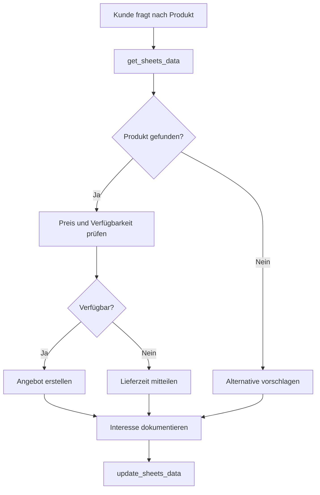

# Google Sheets Integration Template

Nutzen Sie Google Sheets als einfache, aber mächtige Datenquelle für Ihre Mid-Call-Tools. Ideal für kleinere Teams oder spezielle Use Cases, wo komplexe CRM-Systeme überdimensioniert wären.

## Überblick & Anwendungsfälle

<CardGroup cols={2}>
  <Card title="Einfache Datenhaltung" icon="spreadsheet">
    - Kundenlisten ohne komplexes CRM
    - Produktkataloge und Preislisten
    - Terminkalender und Verfügbarkeiten
    - Inventory-Tracking für kleine Unternehmen
  </Card>
  <Card title="Kollaborative Workflows" icon="users">
    - Mehrere Teams arbeiten am gleichen Datenbestand
    - Echtzeit-Updates für alle Beteiligten
    - Einfache Berechtigungsverwaltung
    - No-Code-Ansatz für nicht-technische Mitarbeiter
  </Card>
</CardGroup>

## Vorbereitende Schritte

### 1. Google Cloud Console Setup

<Steps>
  <Step title="Projekt erstellen">
    - Gehen Sie zur [Google Cloud Console](https://console.cloud.google.com/)
    - Erstellen Sie ein neues Projekt oder wählen Sie ein bestehendes
    - Notieren Sie sich die Projekt-ID
  </Step>
  
  <Step title="Google Sheets API aktivieren">
    - Navigieren Sie zu "APIs & Services" → "Bibliothek"
    - Suchen Sie nach "Google Sheets API"
    - Klicken Sie auf "Aktivieren"
  </Step>
  
  <Step title="Service Account erstellen">
```yaml
Schritte:
  1. "APIs & Services" → "Anmeldedaten"
  2. "+ ANMELDEDATEN ERSTELLEN" → "Dienstkonto"
  3. Name: "Famulor-Mid-Call-Tools"
  4. Rolle: "Editor" oder "Viewer" (je nach Bedarf)
  5. JSON-Key herunterladen und sicher speichern
```
  </Step>
  
  <Step title="Sheet-Berechtigungen setzen">
    - Öffnen Sie Ihr Google Sheet
    - Klicken Sie auf "Teilen"
    - Fügen Sie die Service Account E-Mail hinzu
    - Setzen Sie Berechtigungen auf "Bearbeiter" oder "Betrachter"
  </Step>
</Steps>

### 2. Sheet-Struktur vorbereiten

<Tabs>
  <Tab title="Kundendaten-Sheet">
    ```
    | A: E-Mail         | B: Name        | C: Telefon    | D: Firma      | E: Status    | F: Letzte Aktualisierung |
    |------------------|----------------|---------------|---------------|--------------|---------------------------|
    | max@beispiel.de  | Max Mustermann | +49123456789  | Beispiel GmbH | Aktiv        | 2024-01-15 10:30         |
    | anna@test.de     | Anna Schmidt   | +49987654321  | Test AG       | Lead         | 2024-01-14 15:22         |
    ```
  </Tab>
  
  <Tab title="Produkt-Katalog">
    ```
    | A: Produkt-ID | B: Name              | C: Preis | D: Verfügbar | E: Kategorie | F: Beschreibung          |
    |---------------|---------------------|----------|--------------|--------------|--------------------------|
    | PROD001       | Basic Package       | 99.00    | Ja           | Software     | Standard-Features        |
    | PROD002       | Professional Package| 199.00   | Ja           | Software     | Erweiterte Funktionen    |
    ```
  </Tab>
  
  <Tab title="Terminkalender">
    ```
    | A: Datum     | B: Uhrzeit | C: Verfügbar | D: Gebucht von    | E: Typ      | F: Notizen |
    |--------------|------------|--------------|-------------------|-------------|------------|
    | 2024-01-16   | 10:00      | Nein         | max@beispiel.de   | Demo        | Website    |
    | 2024-01-16   | 14:00      | Ja           |                   |             |            |
    ```
  </Tab>
</Tabs>

## Daten-Abruf-Tool konfigurieren

### 1. Tool-Basis-Konfiguration

<Tabs>
  <Tab title="Tool-Setup">
    | Parameter | Wert |
    |-----------|------|
    | **Funktionsname** | `get_sheets_data` |
    | **Beschreibung** | "Ruft Daten aus Google Sheets ab. Verwenden Sie dies für Kundendaten, Produktinfos oder andere strukturierte Informationen." |
    | **HTTP-Methode** | `GET` |
    | **URL** | `https://sheets.googleapis.com/v4/spreadsheets/{sheet_id}/values/{range}` |
    | **Timeout** | `8000ms` |
  </Tab>
  
  <Tab title="Authentication">
```yaml
Authentication Type: "OAuth 2.0" oder "Service Account"

Service Account (empfohlen):
  Headers:
    Authorization: "Bearer {access_token}"
    Content-Type: "application/json"

OAuth 2.0 (für User-Context):
  Headers:
    Authorization: "Bearer {user_access_token}"
    Content-Type: "application/json"
```
  </Tab>
</Tabs>

### 2. Parameter-Schema für Datenabfrage

```json
{
  "type": "object",
  "properties": {
    "sheet_id": {
      "type": "string",
      "description": "Google Sheets ID (aus der URL extrahiert)"
    },
    "range": {
      "type": "string",
      "description": "Zellbereich im A1-Notation (z.B. 'Sheet1!A:F' oder 'Kunden!A2:F100')",
      "examples": ["Sheet1!A:F", "Kunden!A2:F100", "Produkte!A1:D"]
    },
    "search_column": {
      "type": "string", 
      "description": "Spalte für Suchkriterium (z.B. 'A' für E-Mail)"
    },
    "search_value": {
      "type": "string",
      "description": "Suchwert (z.B. E-Mail-Adresse des Kunden)"
    },
    "major_dimension": {
      "type": "string",
      "enum": ["ROWS", "COLUMNS"],
      "default": "ROWS",
      "description": "Datenausrichtung in der Antwort"
    },
    "value_render_option": {
      "type": "string",
      "enum": ["FORMATTED_VALUE", "UNFORMATTED_VALUE", "FORMULA"],
      "default": "FORMATTED_VALUE",
      "description": "Wie Werte zurückgegeben werden sollen"
    }
  },
  "required": ["sheet_id", "range"]
}
```

### 3. Erweiterte Suchfunktion

<AccordionGroup>
  <Accordion title="Zeilen-spezifische Suche">
    **URL für gefilterte Suche**:
    ```
    https://sheets.googleapis.com/v4/spreadsheets/{sheet_id}/values/{range}
    ```
    
    **Post-Processing in der KI**:
    ```yaml
    Logik:
      1. Alle Daten aus Bereich abrufen
      2. Erste Zeile als Headers verwenden
      3. Nach E-Mail oder anderem Kriterium filtern
      4. Gefundene Zeile als strukturierte Daten zurückgeben
    ```
  </Accordion>
  
  <Accordion title="Batch-Abfragen">
    **URL für mehrere Bereiche**:
    ```
    https://sheets.googleapis.com/v4/spreadsheets/{sheet_id}/values:batchGet?ranges={range1}&ranges={range2}
    ```
    
    **Verwendung**:
    ```yaml
    Beispiel:
      ranges: ["Kunden!A:F", "Produkte!A:D", "Termine!A:F"]
      Zweck: Alle relevanten Daten in einem API-Call
      Performance: Reduziert Latenz bei Multi-Table-Lookup
    ```
  </Accordion>
</AccordionGroup>

## Daten-Update-Tool

### 1. Tool-Konfiguration für Updates

<Tabs>
  <Tab title="Update-Tool-Setup">
    | Parameter | Wert |
    |-----------|------|
    | **Funktionsname** | `update_sheets_data` |
    | **Beschreibung** | "Aktualisiert Daten in Google Sheets basierend auf Gesprächsinformationen." |
    | **HTTP-Methode** | `PUT` |
    | **URL** | `https://sheets.googleapis.com/v4/spreadsheets/{sheet_id}/values/{range}` |
  </Tab>
  
  <Tab title="Request Body">
    ```json
    {
      "range": "{range}",
      "majorDimension": "ROWS",
      "values": [
        ["{value1}", "{value2}", "{value3}", "{timestamp}"]
      ],
      "valueInputOption": "USER_ENTERED"
    }
    ```
  </Tab>
</Tabs>

### 2. Parameter-Schema für Updates

```json
{
  "type": "object",
  "properties": {
    "sheet_id": {
      "type": "string",
      "description": "Google Sheets ID"
    },
    "range": {
      "type": "string",
      "description": "Spezifischer Zellbereich für Update (z.B. 'Sheet1!A2:F2')"
    },
    "values": {
      "type": "array",
      "items": {
        "type": "array",
        "items": {"type": "string"}
      },
      "description": "2D-Array mit den neuen Werten"
    },
    "value_input_option": {
      "type": "string",
      "enum": ["RAW", "USER_ENTERED"],
      "default": "USER_ENTERED",
      "description": "Wie Eingabewerte interpretiert werden"
    }
  },
  "required": ["sheet_id", "range", "values"]
}
```

## Praktische Implementierung

### Szenario 1: Kundenservice mit Sheets-Datenbank

<Steps>
  <Step title="Kundenerkennung">
    ```yaml
    Kunde: "Meine E-Mail ist max@beispiel.de"
    
    Tool-Call:
      get_sheets_data(
        sheet_id: "1BxiMVs0XRA5nFMdKvBdBZjgmUUqptlbs74OgvE2upms",
        range: "Kunden!A:F",
        search_column: "A",
        search_value: "max@beispiel.de"
      )
    ```
  </Step>
  
  <Step title="Datenverarbeitung">
    ```yaml
    Response-Verarbeitung:
      - Zeile mit E-Mail gefunden
      - Name: "Max Mustermann"
      - Status: "Aktiv"
      - Letzte Aktualisierung: "2024-01-15"
      
    KI-Integration:
      "Hallo Herr Mustermann! Ich sehe, Sie sind seit dem 15. Januar bei uns registriert."
    ```
  </Step>
  
  <Step title="Status-Update">
    ```yaml
    Nach Gespräch:
      update_sheets_data(
        range: "Kunden!E2:F2",
        values: [["Kontaktiert", "2024-01-16 14:30"]]
      )
    ```
  </Step>
</Steps>

### Szenario 2: Produktberatung mit Sheets-Katalog



### Response-Verarbeitung

#### Typische API-Antwort

```json
{
  "range": "Kunden!A1:F3",
  "majorDimension": "ROWS",
  "values": [
    ["E-Mail", "Name", "Telefon", "Firma", "Status", "Letzte Aktualisierung"],
    ["max@beispiel.de", "Max Mustermann", "+49123456789", "Beispiel GmbH", "Aktiv", "2024-01-15 10:30"],
    ["anna@test.de", "Anna Schmidt", "+49987654321", "Test AG", "Lead", "2024-01-14 15:22"]
  ]
}
```

#### KI-Integration

<AccordionGroup>
  <Accordion title="Strukturierte Datenverarbeitung">
    ```yaml
    Data-Processing-Logik:
      1. Erste Zeile als Header-Mapping verwenden
      2. Relevante Zeile(n) basierend auf Suchkriterium finden
      3. Key-Value-Pairs für natürliche Sprachverwendung erstellen
      
    Beispiel:
      Input: ["max@beispiel.de", "Max Mustermann", "+49123456789", "Beispiel GmbH", "Aktiv", "2024-01-15 10:30"]
      Output: {
        "email": "max@beispiel.de",
        "name": "Max Mustermann", 
        "phone": "+49123456789",
        "company": "Beispiel GmbH",
        "status": "Aktiv",
        "last_updated": "2024-01-15 10:30"
      }
    ```
  </Accordion>
  
  <Accordion title="Natürliche Sprachverwendung">
    ```yaml
    Kontextualisierte_Antworten:
      Status "Aktiv":
        "Ich sehe, Sie sind bereits bei uns registriert und Ihr Account ist aktiv."
      
      Status "Lead":
        "Ich sehe, Sie haben bereits Interesse gezeigt. Wie kann ich Ihnen weiterhelfen?"
      
      Keine_Daten:
        "Ich kann Sie noch nicht in unserem System finden. Gerne lege ich einen neuen Eintrag an."
      
      Veraltete_Daten:
        "Ihre letzten Informationen sind vom {date}. Lassen Sie mich das aktualisieren."
    ```
  </Accordion>
</AccordionGroup>

## Erweiterte Features

### Formeln und Berechnungen

<Tabs>
  <Tab title="Automatische Berechnungen">
    ```yaml
    Sheet-Formeln für Mid-Call-Tools:
      
      Lead-Score-Berechnung:
        Spalte G: =IF(E2="Hot",100,IF(E2="Warm",60,IF(E2="Cold",20,0)))
      
      Tage-seit-letztem-Kontakt:
        Spalte H: =TODAY()-F2
      
      Nächste-Follow-up-Erinnerung:
        Spalte I: =F2+7
      
    Verwendung im Tool:
      - Berechnete Werte automatisch verfügbar
      - Keine separate Logik in Mid-Call-Tool nötig
      - Sheets übernimmt Business-Logic
    ```
  </Tab>
  
  <Tab title="Bedingte Formatierung">
    ```yaml
    Visuelle_Indikatoren:
      High-Value-Kunden: Grüner Hintergrund bei Deal-Wert >10k
      Überfällige_Follow-ups: Roter Hintergrund bei Datum < Heute
      Neue_Leads: Blauer Hintergrund bei Status = "Neu"
    
    Tool-Integration:
      - Formatierung nicht direkt verfügbar in API
      - Aber: Bedingte Werte über Formeln abfragbar
      - Beispiel: Status-Spalte mit berechneten Prioritäts-Indikatoren
    ```
  </Tab>
</Tabs>

### Multi-Sheet-Workflows

<AccordionGroup>
  <Accordion title="Referenzielle Integrität">
    ```yaml
    Sheet-Struktur:
      1. Kunden-Sheet (Master-Data):
         - Kunde-ID, Name, E-Mail, Firma
      
      2. Interaktionen-Sheet (Transaction-Log):
         - Datum, Kunde-ID, Typ, Details, Agent
      
      3. Produkte-Sheet (Catalog):
         - Produkt-ID, Name, Preis, Kategorie
      
      4. Angebote-Sheet (Opportunities):
         - Angebots-ID, Kunde-ID, Produkt-ID, Status, Wert
    
    Cross-Sheet-Lookups:
      =VLOOKUP(A2,Kunden!A:C,2,FALSE) // Name basierend auf Kunde-ID
      =SUMIF(Angebote!B:B,A2,Angebote!F:F) // Total-Value per Kunde
    ```
  </Accordion>
  
  <Accordion title="Workflow-Orchestration">
    ```yaml
    Komplexer_Mid-Call-Workflow:
      1. Kundendaten aus Kunden-Sheet abrufen
      2. Interaktionshistorie aus Interaktionen-Sheet laden
      3. Verfügbare Produkte aus Produkte-Sheet anzeigen
      4. Bei Interesse: Neues Angebot in Angebote-Sheet erstellen
      5. Interaktion in Interaktionen-Sheet protokollieren
    
    Tool-Chain:
      get_customer_data → get_interaction_history → get_available_products
      → create_opportunity → log_interaction
    ```
  </Accordion>
</AccordionGroup>

## Performance & Optimierung

### Caching-Strategien

<CardGroup cols={2}>
  <Card title="Read-Heavy-Optimization" icon="download">
    **Für häufig abgefragte Daten**:
    - Cache für 5-10 Minuten
    - Besonders für Produktkataloge
    - Reduziert API-Quota-Verbrauch
  </Card>
  <Card title="Write-Through-Cache" icon="upload">
    **Für Updates**:
    - Sofortiges Update im Cache
    - Asynchrone Sheet-Aktualisierung
    - Konsistenz-Checks implementieren
  </Card>
</CardGroup>

### Google Sheets API Limits

| Limit-Typ | Wert | Best Practice |
|-----------|------|---------------|
| **Requests per 100 seconds** | 300 | Batch-Operationen verwenden |
| **Requests per day** | 50,000 | Caching implementieren |
| **Concurrent requests** | 10 | Request-Pooling verwenden |
| **Cells updated per request** | 10,000,000 | Effiziente Range-Spezifikation |

## Fehlerbehandlung

### Häufige Fehlerszenarien

<Tabs>
  <Tab title="Authentifizierung (401/403)">
    ```yaml
    Ursachen:
      - Service Account Key abgelaufen
      - Insufficient permissions auf Sheet
      - Sheets API nicht aktiviert
    
    Fallback:
      "Entschuldigung, ich kann momentan nicht auf unsere Datenbank zugreifen. 
       Können Sie mir Ihre Informationen noch einmal nennen?"
    
    Resolution:
      - Service Account Permissions prüfen
      - Sheet-Sharing-Einstellungen überprüfen  
      - API-Quota-Status checken
    ```
  </Tab>
  
  <Tab title="Sheet nicht gefunden (404)">
    ```yaml
    Ursachen:
      - Falsche Sheet-ID in Konfiguration
      - Sheet wurde gelöscht oder verschoben
      - Range existiert nicht (invalider Bereich)
    
    Graceful-Fallback:
      "Es scheint ein Problem mit unserer Datenbank zu geben. 
       Lassen Sie mich Ihnen trotzdem weiterhelfen."
      
    Prevention:
      - Sheet-ID-Validation vor Deployment
      - Health-Checks für kritische Sheets
      - Backup-Sheets für Notfälle
    ```
  </Tab>
  
  <Tab title="Rate Limiting (429)">
    ```yaml
    Handling:
      - Exponential Backoff: 1s, 2s, 4s
      - Request-Queuing implementieren
      - Batch-Updates wo möglich
    
    User-Communication:
      "Einen Moment bitte, ich lade Ihre Daten..."
      
    Prevention:
      - Intelligentes Caching
      - Request-Deduplication
      - Off-Peak-Batch-Processing
    ```
  </Tab>
</Tabs>

## Sicherheit & Compliance

### Datenschutz-Überlegungen

<AccordionGroup>
  <Accordion title="DSGVO-Konformität">
    ```yaml
    Privacy-by-Design:
      - Minimale Datenerfassung (nur notwendige Spalten)
      - Pseudonymisierung wo möglich
      - Automatische Löschung nach Retention-Period
      
    User-Rights:
      - Right to Access: Export-Funktionen
      - Right to Rectification: Update-Workflows
      - Right to Erasure: Delete-Workflows
      - Right to Portability: Standard-Export-Formate
    
    Audit-Trail:
      - Separate "Audit"-Spalte mit Change-Timestamps
      - Change-Log-Sheet für kritische Änderungen
      - Access-Logging über Google Workspace
    ```
  </Accordion>
  
  <Accordion title="Access Control">
    ```yaml
    Sheet-Level-Security:
      - Service Account mit minimalen Rechten
      - Sheet-spezifische Permissions
      - Regular Access Reviews
    
    Data-Level-Security:
      - Sensitive Daten in separate Sheets
      - Range-Protection für kritische Bereiche
      - Cell-Level-Permissions wo nötig
    
    Network-Security:
      - HTTPS-only für alle API-Calls
      - IP-Restrictions für Service Accounts
      - VPN-Requirements für Admin-Access
    ```
  </Accordion>
</AccordionGroup>

## Migration & Skalierung

### Von Sheets zu CRM migrieren

<Steps>
  <Step title="Hybrid-Ansatz">
    - Sheets parallel zu CRM betreiben
    - Schrittweise Daten-Migration
    - Tool-Configuration für beide Systeme
  </Step>
  
  <Step title="Data-Sync implementieren">
    - Bidirectional Sync zwischen Sheets und CRM
    - Conflict-Resolution-Strategies
    - Data-Quality-Checks
  </Step>
  
  <Step title="Graduelle Tool-Migration">
    - Read-Operationen zuerst auf CRM umstellen
    - Write-Operationen weiter über Sheets
    - Final Switch nach Validierungsphase
  </Step>
</Steps>

---

<Card title="Erweiterte Integrationen" icon="link">
Kombinieren Sie Google Sheets mit anderen Tools:

- [Webhook-Automation](/automation-platform/mid-call-tools/integration-templates/webhook-automation) für komplexere Workflows
- [Zapier-Integration](/automation-platform/integrations/zapier) für No-Code-Automatisierung
- [Google Apps Script](/automation-platform/mid-call-tools/integration-templates/google-apps-script) für Custom-Logic
</Card>

<Info>
**Performance-Tipp**: Für Teams mit >50 täglichen Mid-Call-Tool-Nutzern sollten Sie ein dediziertes CRM-System in Betracht ziehen. Google Sheets ist ideal für kleinere Teams oder spezielle Use Cases.
</Info>

<Warning>
**Backup-Strategie**: Google Sheets bietet automatische Versionierung, aber implementieren Sie zusätzliche Backup-Mechanismen für geschäftskritische Daten.
</Warning>
