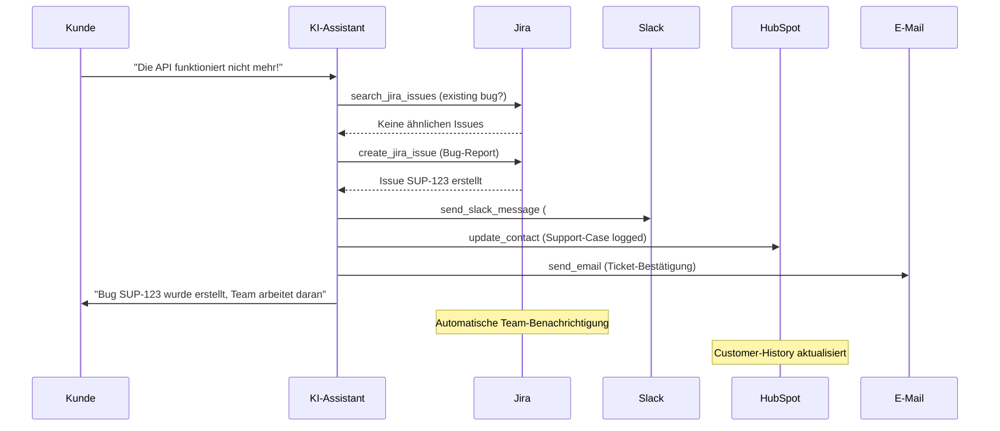

# Jira Integration Template

Integrieren Sie Jira Issue-Tracking in Ihre Mid-Call-Tools mit drei leistungsstarken Funktionen: Issues suchen, aktualisieren und erstellen. Perfekt für DevOps-Teams, Support-Organisationen und agile Entwicklungsprozesse.

## Überblick & Funktionen

<CardGroup cols={3}>
  <Card title="Issues suchen" icon="magnifying-glass">
    - JQL-basierte Issue-Suche
    - Echtzeit-Status-Abfragen
    - Assignee und Priority-Filtering
    - Custom Field-Queries
  </Card>
  <Card title="Issues aktualisieren" icon="edit">
    - Status-Transitions verwalten
    - Comments und Zeiterfassung
    - Resolution-Updates
    - Field-Modifications
  </Card>
  <Card title="Issues erstellen" icon="plus">
    - Bug-Reports aus Kundenmeldungen
    - Feature-Requests dokumentieren
    - Support-Tickets erstellen
    - Incident-Management
  </Card>
</CardGroup>

## Jira Cloud API Setup

### 1. Jira API-Zugang einrichten

<Steps>
  <Step title="Jira Cloud Instance vorbereiten">
    - Stellen Sie sicher, dass Sie Admin-Rechte haben
    - Notieren Sie Ihre Jira-Instance-URL: `https://ihrefirma.atlassian.net`
    - Instance-Name für API-Calls: `ihrefirma` (ohne .atlassian.net)
  </Step>
  
  <Step title="API Token erstellen">
    ```yaml
    Token-Generation:
      1. Account-Settings → "Security" → "API tokens"
      2. "Create API token" klicken
      3. Label: "Famulor Mid-Call Integration"
      4. Token kopieren (wird nur einmal angezeigt!)
      5. Sicher speichern für Konfiguration
    ```
  </Step>
  
  <Step title="Basic Auth String erstellen">
    ```yaml
    Authentication-Setup:
      Format: "email:api_token"
      Beispiel: "admin@firma.de:ATATT3xFfGF0T5..."
      
    Base64-Encoding:
      echo -n "admin@firma.de:ATATT3xFfGF0T5..." | base64
      
    Resultat: "YWRtaW5AZmlybWEuZGU6QVRBVFQzeEZmR0YwVDUuLi4="
    ```
  </Step>
  
  <Step title="Projekt-Keys identifizieren">
    - Navigieren Sie zu Ihren Jira-Projekten
    - Projekt-Keys notieren (z.B. "PROJ", "SUP", "DEV")
    - Issue-Types pro Projekt dokumentieren
    - Custom Fields und Workflows analysieren
  </Step>
</Steps>

## Tool 1: Issues suchen

### Konfiguration im Famulor Interface

<Tabs>
  <Tab title="Werkzeugdetails">
    | Feld | Wert |
    |------|------|
    | **Name*** | `Jira Issues suchen` |
    | **Beschreibung** | "Sucht Issues mit JQL (Jira Query Language) für Status-Updates und Tracking" |
    | **Funktionsname*** | `search_jira_issues` |
    | **Funktionsbeschreibung*** | "Durchsucht Jira mit JQL. Verwenden Sie dies, um den Status von Bug-Reports, Feature-Requests oder Support-Tickets zu prüfen." |
    | **HTTP-Methode** | `GET` |
    | **Timeout (ms)** | `5000` |
    | **Endpoint*** | `https://{{JIRA_INSTANCE}}.atlassian.net/rest/api/3/search` |
  </Tab>
  
  <Tab title="Header-Konfiguration">
    ```json
    {
      "Authorization": "Basic {{JIRA_AUTH}}",
      "Content-Type": "application/json",
      "User-Agent": "Famulor-MidCall-Jira/1.0"
    }
    ```
  </Tab>
  
  <Tab title="Query-Parameter">
    ```json
    {
      "jql": "{jql_query}",
      "maxResults": "{max_results}",
      "fields": "summary,status,assignee,priority,created,updated,resolution,description"
    }
    ```
  </Tab>
</Tabs>

### Parameter-Schema für Issue-Suche

```json
{
  "type": "object",
  "properties": {
    "jql_query": {
      "type": "string",
      "description": "JQL Query für die Issue-Suche",
      "examples": [
        "assignee = currentUser() AND status != Done",
        "project = SUP AND status = 'In Progress'",
        "summary ~ 'API' AND created >= -7d",
        "reporter = 'customer@example.com'"
      ]
    },
    "max_results": {
      "type": "integer",
      "description": "Maximale Anzahl der zurückgegebenen Issues",
      "default": 10,
      "minimum": 1,
      "maximum": 100
    }
  },
  "required": ["jql_query"]
}
```

### Response-Mapping

```json
{
  "issues": "issues",
  "total": "total"
}
```

## Tool 2: Issue aktualisieren

### Konfiguration im Famulor Interface

<Tabs>
  <Tab title="Werkzeugdetails">
    | Feld | Wert |
    |------|------|
    | **Name*** | `Jira Issue aktualisieren` |
    | **Beschreibung** | "Aktualisiert Status oder Details eines bestehenden Jira Issues" |
    | **Funktionsname*** | `update_jira_issue` |
    | **Funktionsbeschreibung*** | "Aktualisiert ein Jira Issue. Verwenden Sie dies, um Status zu ändern, Kommentare hinzuzufügen oder Issue-Details zu aktualisieren." |
    | **HTTP-Methode** | `PUT` |
    | **Timeout (ms)** | `5000` |
    | **Endpoint*** | `https://{{JIRA_INSTANCE}}.atlassian.net/rest/api/3/issue/{issue_key}` |
  </Tab>
  
  <Tab title="Request Body Template">
    ```json
    {
      "fields": {
        "status": {
          "name": "{status}"
        },
        "resolution": {
          "name": "{resolution}"
        },
        "assignee": {
          "accountId": "{assignee_id}"
        },
        "priority": {
          "name": "{priority}"
        },
        "timetracking": {
          "originalEstimate": "{estimate}",
          "remainingEstimate": "{remaining}"
        }
      },
      "update": {
        "comment": [
          {
            "add": {
              "body": {
                "type": "doc",
                "version": 1,
                "content": [
                  {
                    "type": "paragraph",
                    "content": [
                      {
                        "type": "text",
                        "text": "{comment}"
                      }
                    ]
                  }
                ]
              }
            }
          }
        ]
      }
    }
    ```
  </Tab>
</Tabs>

### Parameter-Schema für Issue-Updates

```json
{
  "type": "object", 
  "properties": {
    "issue_key": {
      "type": "string",
      "description": "Jira Issue Key (z.B. 'PROJ-123', 'SUP-456')",
      "pattern": "^[A-Z]+-[0-9]+$"
    },
    "status": {
      "type": "string",
      "enum": ["To Do", "In Progress", "Code Review", "Testing", "Done", "Closed"],
      "description": "Neuer Issue-Status"
    },
    "resolution": {
      "type": "string",
      "enum": ["Fixed", "Won't Fix", "Duplicate", "Cannot Reproduce", "Won't Do"],
      "description": "Resolution-Status (optional)"
    },
    "comment": {
      "type": "string",
      "description": "Kommentar zum Update (z.B. Gesprächskontext, Lösungsdetails)"
    },
    "priority": {
      "type": "string",
      "enum": ["Highest", "High", "Medium", "Low", "Lowest"],
      "description": "Neue Priorität (optional)"
    },
    "assignee_id": {
      "type": "string",
      "description": "Jira Account-ID des neuen Assignees (optional)"
    },
    "estimate": {
      "type": "string",
      "description": "Zeit-Schätzung (z.B. '2h', '1d', '3w')",
      "examples": ["30m", "2h", "1d", "2w"]
    },
    "remaining": {
      "type": "string",
      "description": "Verbleibende Zeit (z.B. '1h', '30m')"
    }
  },
  "required": ["issue_key"]
}
```

## Tool 3: Issue erstellen

### Konfiguration im Famulor Interface

<Tabs>
  <Tab title="Werkzeugdetails">
    | Feld | Wert |
    |------|------|
    | **Name*** | `Jira Issue erstellen` |
    | **Beschreibung** | "Erstellt ein neues Issue (Bug, Task, Story) in Jira basierend auf Kundeninput" |
    | **Funktionsname*** | `create_jira_issue` |
    | **Funktionsbeschreibung*** | "Erstellt ein neues Jira Issue. Verwenden Sie dies für Bug-Reports aus Kundenmeldungen, Feature-Requests oder Support-Tickets." |
    | **HTTP-Methode** | `POST` |
    | **Timeout (ms)** | `5000` |
    | **Endpoint*** | `https://{{JIRA_INSTANCE}}.atlassian.net/rest/api/3/issue` |
  </Tab>
  
  <Tab title="Request Body Template">
    ```json
    {
      "fields": {
        "project": {
          "key": "{project_key}"
        },
        "issuetype": {
          "name": "{issue_type}"
        },
        "summary": "{summary}",
        "description": {
          "type": "doc",
          "version": 1,
          "content": [
            {
              "type": "paragraph",
              "content": [
                {
                  "type": "text",
                  "text": "{description}"
                }
              ]
            }
          ]
        },
        "priority": {
          "name": "{priority}"
        },
        "assignee": {
          "accountId": "{assignee_id}"
        },
        "labels": "{labels}",
        "components": [
          {
            "name": "{component}"
          }
        ],
        "customfield_10001": "{customer_name}",
        "customfield_10002": "{phone_number}"
      }
    }
    ```
  </Tab>
</Tabs>

### Parameter-Schema für Issue-Creation

```json
{
  "type": "object",
  "properties": {
    "project_key": {
      "type": "string",
      "description": "Jira-Projekt-Schlüssel (z.B. 'SUP' für Support, 'DEV' für Development)",
      "examples": ["SUP", "DEV", "PROJ", "BUG"]
    },
    "issue_type": {
      "type": "string",
      "enum": ["Bug", "Task", "Story", "Epic", "Incident", "Support Request"],
      "description": "Typ des zu erstellenden Issues"
    },
    "summary": {
      "type": "string",
      "description": "Kurze, präzise Zusammenfassung des Issues",
      "examples": ["API Gateway Fehler bei Login", "Feature Request: Excel-Export", "Customer Report: Performance-Problem"]
    },
    "description": {
      "type": "string",
      "description": "Detaillierte Beschreibung mit Kontext aus dem Gespräch"
    },
    "priority": {
      "type": "string", 
      "enum": ["Highest", "High", "Medium", "Low", "Lowest"],
      "description": "Priorität basierend auf Customer-Impact",
      "default": "Medium"
    },
    "assignee_id": {
      "type": "string",
      "description": "Jira Account-ID des Verantwortlichen (optional)"
    },
    "labels": {
      "type": "array",
      "items": {"type": "string"},
      "description": "Labels für Kategorisierung",
      "examples": [["customer-reported", "mid-call"], ["feature-request", "high-priority"], ["bug", "production"]]
    },
    "component": {
      "type": "string",
      "description": "Jira Component (z.B. 'API', 'Frontend', 'Backend')",
      "examples": ["API", "Frontend", "Backend", "Database", "Security"]
    },
    "customer_name": {
      "type": "string",
      "description": "Name des meldenden Kunden (Custom Field)"
    },
    "phone_number": {
      "type": "string", 
      "description": "Telefonnummer für Rückfragen (Custom Field)"
    }
  },
  "required": ["project_key", "issue_type", "summary", "description"]
}
```

## Praktische Anwendungsszenarien

### Szenario 1: Bug-Report aus Kundengespräch

<Steps>
  <Step title="Problem-Identifikation">
    ```yaml
    Kunde meldet Problem:
      "Seit heute Morgen kann ich mich nicht mehr einloggen. 
       Die Seite lädt einfach nicht."
      
    KI-Analysis:
      - Problem: Login-Fehler
      - Zeitrahmen: Seit heute Morgen  
      - Impact: Customer kann System nicht nutzen
      - Urgency: Hoch (Business-Critical)
    ```
  </Step>
  
  <Step title="Automatische Bug-Creation">
    ```yaml
    create_jira_issue Parameter:
      project_key: "BUG"
      issue_type: "Bug"
      summary: "Login-Fehler: Seite lädt nicht - Customer Max Mustermann"
      description: "## Problem
                   Kunde kann sich seit heute Morgen nicht mehr einloggen.
                   
                   ## Symptome
                   - Login-Seite lädt nicht vollständig
                   - Fehlermeldung: Keine spezifische Meldung
                   - Browser: Verschiedene Browser getestet
                   
                   ## Customer-Details
                   - Name: Max Mustermann
                   - Firma: Beispiel AG
                   - Phone: +49 123 456789
                   - Gemeldeter Zeitpunkt: 15.01.2024 09:00
                   
                   ## Business-Impact
                   - Produktions-System nicht nutzbar
                   - Revenue-Impact: Hoch
                   - Customer-Tier: Enterprise
                   
                   ## Next Steps
                   1. Sofortige technische Analyse
                   2. Customer-Update innerhalb 1h
                   3. Workaround bereitstellen"
      priority: "High"
      labels: ["customer-reported", "login-issue", "production"]
      component: "Authentication"
      customer_name: "Max Mustermann (Beispiel AG)"
    ```
  </Step>
</Steps>

### Szenario 2: Feature-Request-Management

<AccordionGroup>
  <Accordion title="Customer-Feature-Request">
    ```yaml
    Feature-Request-Workflow:
      
    Kunde: "Könnten Sie eine Integration zu Salesforce hinzufügen?"
    
    KI: "Das ist eine großartige Idee! Ich dokumentiere das als Feature-Request..."
    
    create_jira_issue:
      project_key: "FEAT"
      issue_type: "Story"
      summary: "Feature Request: Salesforce Integration"
      description: "## Customer Request
                   Integration zu Salesforce CRM für bidirektionale Daten-Sync.
                   
                   ## Business Case
                   - Customer: Beispiel AG (Enterprise-Kunde)
                   - Current Pain: Manuelle Daten-Übertragung
                   - Expected Benefit: 40h/Monat Zeitersparnis
                   - Revenue Impact: Customer-Retention-kritisch
                   
                   ## Technical Requirements
                   - Bidirectional Sync (Contacts, Deals, Activities)
                   - Real-time oder Batch-Updates  
                   - Field-Mapping-Konfiguration
                   - Error-Handling und Conflict-Resolution
                   
                   ## Acceptance Criteria
                   - [ ] Salesforce OAuth-Integration
                   - [ ] Contact-Sync implementiert
                   - [ ] Deal-Sync implementiert
                   - [ ] Admin-UI für Field-Mapping"
      priority: "High"
      labels: ["feature-request", "integration", "customer-driven"]
      assignee_id: "product-manager-account-id"
    ```
  </Accordion>
  
  <Accordion title="Competitive-Feature-Tracking">
    ```yaml
    Competitive-Intelligence:
      
    Kunde: "Competitor XY hat Feature Z - haben Sie das auch?"
    
    Issue-Creation:
      issue_type: "Epic"
      summary: "Competitive Analysis: Feature Z Implementation"
      labels: ["competitive", "feature-gap", "market-research"]
      
    Linked-Issues:
      - Research Task: Competitive Analysis
      - Technical Task: Feasibility Study  
      - Business Task: ROI-Calculation
      - Product Task: Roadmap-Integration
    ```
  </Accordion>
</AccordionGroup>

## JQL-Templates für häufige Abfragen

### Vordefinierte JQL-Queries

<AccordionGroup>
  <Accordion title="Customer-bezogene Queries">
    ```yaml
    Customer-Issue-Lookup:
      "customfield_10001 ~ '{customer_name}' ORDER BY created DESC"
      
    Open-Issues-für-Customer:
      "customfield_10001 ~ '{customer_name}' AND status != Done"
      
    Recent-Customer-Issues:
      "customfield_10001 ~ '{customer_name}' AND created >= -30d"
      
    Critical-Customer-Issues:
      "customfield_10001 ~ '{customer_name}' AND priority = Highest"
    ```
  </Accordion>
  
  <Accordion title="Team-Management-Queries">
    ```yaml
    Team-Workload-Queries:
      
    Überfällige-Issues:
      "assignee = currentUser() AND due <= now() AND status != Done"
      
    Heute-zu-erledigen:
      "assignee = currentUser() AND due <= endOfDay() AND status != Done"
      
    High-Priority-Backlog:
      "project = DEV AND priority >= High AND status = 'To Do'"
      
    Review-Required:
      "status = 'Code Review' AND assignee = currentUser()"
    ```
  </Accordion>
  
  <Accordion title="Monitoring & Analytics">
    ```yaml
    Performance-Tracking-Queries:
      
    Bug-Rate-Last-Week:
      "issuetype = Bug AND created >= -7d"
      
    Feature-Completion-Rate:
      "issuetype = Story AND resolved >= -30d"
      
    Customer-Satisfaction-Issues:
      "labels = customer-escalation AND created >= -7d"
      
    SLA-Violations:
      "priority = Highest AND created <= -4h AND status != Done"
    ```
  </Accordion>
</AccordionGroup>

## Response-Verarbeitung & Integration

### Issue-Search Response

```json
{
  "total": 3,
  "maxResults": 10,
  "issues": [
    {
      "key": "SUP-123",
      "fields": {
        "summary": "API Gateway timeout issues",
        "status": {
          "name": "In Progress",
          "statusColor": "blue"
        },
        "assignee": {
          "displayName": "Tech Support Team",
          "accountId": "abc123def456"
        },
        "priority": {
          "name": "High",
          "iconUrl": "https://..."
        },
        "created": "2024-01-15T08:30:00.000+0000",
        "updated": "2024-01-15T10:15:00.000+0000"
      }
    }
  ]
}
```

### Natürliche Sprachintegration

<Tabs>
  <Tab title="Issue-Suche-Integration">
    **Agent-Messages**:
    ```yaml
    Vor Search: "Ich durchsuche Jira..."
    
    Erfolgreiche Suche:
      "{{total}} Issues gefunden. Top Ergebnisse: 
       {{#each issues}}{{this.key}}: {{this.fields.summary}} ({{this.fields.status.name}}){{/each}}"
    
    Beispiel:
      "3 Issues gefunden. Top Ergebnisse:
       SUP-123: API Gateway timeout issues (In Progress)
       SUP-124: Login-Probleme Frontend (To Do)  
       SUP-125: Performance-Optimierung (Code Review)"
    ```
  </Tab>
  
  <Tab title="Issue-Update-Integration">
    **Update-Confirmations**:
    ```yaml
    Template: "Issue {{issue_key}} wurde aktualisiert{{#if status}} - Status: {{status}}{{/if}}"
    
    Beispiele:
      "Issue SUP-123 wurde aktualisiert - Status: Done"
      "Bug PROJ-456 wurde auf High-Priority gesetzt"
      "Feature DEV-789 wurde dem Frontend-Team zugewiesen"
    ```
  </Tab>
  
  <Tab title="Issue-Creation-Integration">
    ```yaml
    Pre-Action: "Ich erstelle das {{issue_type}} in Jira..."
    
    Success: "Issue {{issueKey}} erstellt: {{summary}}"
    
    Mit Follow-up:
      "Bug-Report SUP-567 wurde erstellt. 
       Das Support-Team wird das Problem innerhalb von 4 Stunden bearbeiten."
    
    Mit Customer-Context:
      "Ihr Problem wurde als SUP-567 dokumentiert. 
       Sie erhalten Updates zum Bearbeitungsfortschritt."
    ```
  </Tab>
</Tabs>

## Integration mit anderen Mid-Call-Tools

### Multi-System-Workflow



## Performance & Monitoring

### Jira-Integration-KPIs

| Metrik | Beschreibung | Zielwert |
|--------|-------------|----------|
| **Issue Creation Success Rate** | % erfolgreich erstellter Issues | &gt;99% |
| **Search Query Performance** | Durchschnittliche JQL-Response-Zeit | &lt;2 Sekunden |
| **Update Success Rate** | % erfolgreiche Issue-Updates | &gt;98% |
| **Customer Issue Resolution** | Durchschnittliche Resolution-Zeit für Customer-Issues | &lt;4 Stunden |

### Business Impact Analytics

<Steps>
  <Step title="Customer-Satisfaction-Tracking">
    ```yaml
    Customer-Issue-Metriken:
      - Time-to-Issue-Creation (Call → Jira)
      - Time-to-First-Response (Issue → Dev-Action)
      - Time-to-Resolution (Issue → Closed)
      - Customer-Communication-Frequency
    ```
  </Step>
  
  <Step title="Development-Efficiency">
    ```yaml
    Development-KPIs:
      - Customer-Reported vs. Internal-Found-Bugs Ratio
      - Feature-Request-to-Implementation Conversion
      - Bug-Fix-Rate-Improvement durch bessere Dokumentation
      - Developer-Productivity-Impact
    ```
  </Step>
</Steps>

## Fehlerbehandlung

### Häufige Jira-API-Probleme

<AccordionGroup>
  <Accordion title="Authentication Error (401)">
    ```yaml
    Ursache: API-Token ungültig oder Basic-Auth falsch
    
    Jira-Response:
      "errorMessages": ["You do not have the permission to see the specified issue."]
    
    Fallback:
      "Jira-Zugriff nicht möglich. Ich dokumentiere das Problem 
       für manuelle Bearbeitung durch das Tech-Team."
    
    Resolution:
      - API-Token neu generieren
      - Basic-Auth-String validieren
      - User-Permissions überprüfen
    ```
  </Accordion>
  
  <Accordion title="Project nicht gefunden (404)">
    ```yaml
    Ursache: Project-Key existiert nicht oder kein Zugriff
    
    Graceful-Handling:
      "Das spezifische Projekt ist nicht verfügbar. 
       Ich erstelle das Issue im Standard-Support-Projekt."
    
    Fallback-Logic:
      - Default-Project verwenden
      - Issue-Type auf "Task" ändern
      - Admin-Benachrichtigung über Konfigurationsfehler
    ```
  </Accordion>
  
  <Accordion title="Invalid JQL (400)">
    ```yaml
    Ursache: JQL-Syntax-Fehler oder ungültige Field-Names
    
    Common-JQL-Errors:
      - Typos in Field-Names
      - Ungültige Operatoren
      - Falsche String-Escaping
      - Non-existent Values
    
    Error-Recovery:
      - Fallback auf einfachere JQL-Query
      - Text-based Search als Alternative
      - User-friendly Error-Message
    ```
  </Accordion>
</AccordionGroup>

## Advanced Features

### Custom Fields & Workflows

<AccordionGroup>
  <Accordion title="Customer-specific Custom Fields">
    ```yaml
    Custom-Field-Configuration:
      
    Customer-Information:
      customfield_10001: "Customer Name" (Text)
      customfield_10002: "Customer Phone" (Text)
      customfield_10003: "Customer Email" (Text)
      customfield_10004: "Customer Tier" (Select: Basic/Pro/Enterprise)
      
    Business-Context:
      customfield_10005: "Revenue Impact" (Select: Low/Medium/High)
      customfield_10006: "Urgency Level" (Select: 1-5)
      customfield_10007: "Call Source" (Text: "Mid-Call-Tool")
      customfield_10008: "Resolution Deadline" (Date/Time)
    ```
  </Accordion>
  
  <Accordion title="Workflow-Automation">
    ```yaml
    Jira-Workflow-Rules:
      
    Customer-Issue-Workflow:
      Wenn Customer-Tier = "Enterprise":
        → Status automatisch auf "High Priority"
        → Assignee: Senior Support Engineer
        → SLA: 2 Stunden First Response
      
    Mid-Call-Issue-Workflow:
      Wenn Labels contains "mid-call":
        → Priority mindestens "High"
        → Sofortige Assignee-Benachrichtigung
        → Customer-Update binnen 1 Stunde
      
    Escalation-Rules:
      Wenn Priority = "Highest" UND 4h offen:
        → Auto-assign zu Manager
        → Customer-Benachrichtigung
        → Executive-Escalation
    ```
  </Accordion>
</AccordionGroup>

### Advanced JQL Patterns

<Tabs>
  <Tab title="Complex Customer Queries">
    ```sql
    -- Issues für spezifischen Kunden mit Status-Filter
    customfield_10001 ~ "Beispiel AG" AND status IN ("To Do", "In Progress") ORDER BY priority DESC
    
    -- Überfällige Customer-Issues
    customfield_10001 IS NOT EMPTY AND due <= now() AND status != Done
    
    -- High-Impact Customer-Issues
    customfield_10005 = "High" AND customfield_10001 IS NOT EMPTY
    
    -- Issues aus letzten Mid-Call-Sessions
    labels = "mid-call" AND created >= -24h
    ```
  </Tab>
  
  <Tab title="Team-Performance-Queries">
    ```sql
    -- Team-Workload-Balance
    assignee IN (team-member-1, team-member-2) AND status != Done
    
    -- Sprint-Planning-Queries
    project = DEV AND fixVersion = "Sprint 23" AND status IN ("To Do", "In Progress")
    
    -- Bug-vs-Feature Ratio  
    project = DEV AND created >= startOfMonth() AND issuetype IN (Bug, Story)
    
    -- Customer-Escalation-Tracking
    priority = Highest AND labels IN ("customer-escalation", "mid-call")
    ```
  </Tab>
</Tabs>

---

<Warning>
**Jira-Permissions**: Stellen Sie sicher, dass der verwendete API-User Berechtigung für alle relevanten Projekte hat und Custom Fields lesen/schreiben kann. Überprüfen Sie regelmäßig die Workflow-Permissions.
</Warning>

<Info>
**JQL-Performance-Tipp**: Verwenden Sie spezifische Project-Keys und Date-Ranges in JQL-Queries um die Performance zu optimieren. Vermeiden Sie sehr breite Suchen ohne Filter.
</Info>
