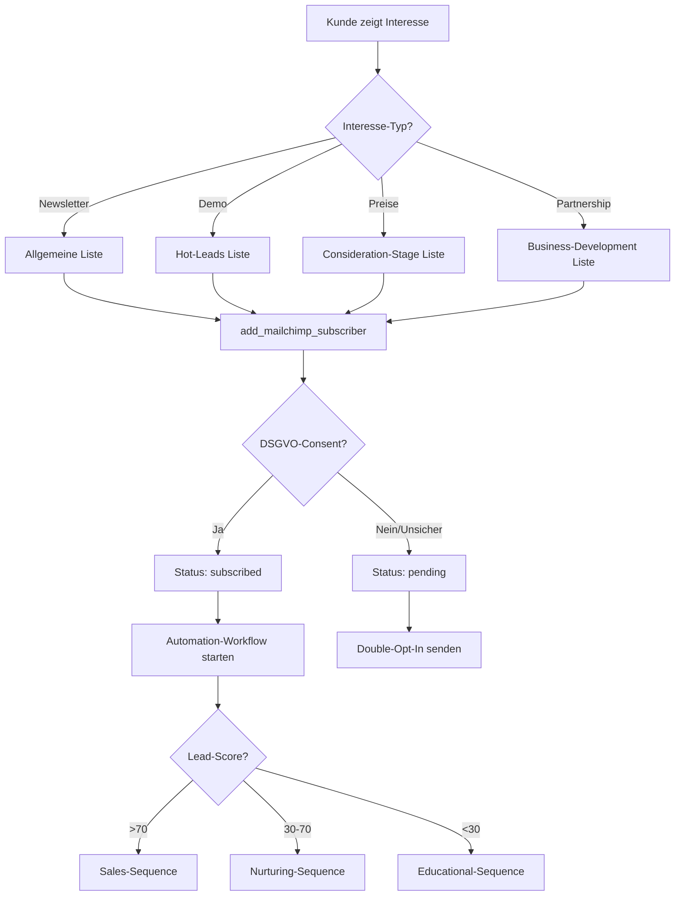
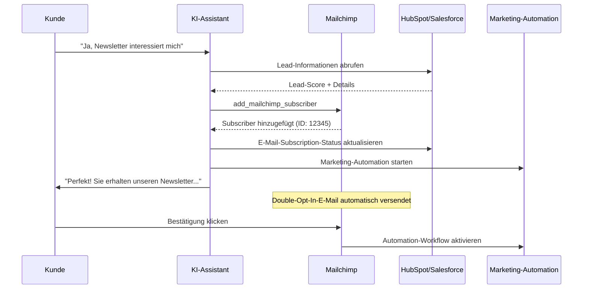

# Mailchimp Integration Template

Integrieren Sie Mailchimp-Subscriber-Management in Ihre Mid-Call-Tools und ermöglichen Sie es Ihrem KI-Assistenten, während Kundengesprächem automatisch interessierte Leads zu Marketing-Listen hinzuzufügen und Marketing-Automation-Workflows auszulösen.

## Überblick & Funktionen

<CardGroup cols={2}>
  <Card title="Automatische List-Building" icon="users">
    - Sofortiges Hinzufügen von Interessenten zu Mailchimp-Listen
    - Intelligente List-Segmentierung basierend auf Gespräch
    - Tag-basierte Kategorisierung für zielgerichtetes Marketing
    - Double-Opt-In-Compliance und DSGVO-Konformität
  </Card>
  <Card title="Marketing-Automation-Trigger" icon="magic">
    - Automatischer Start von E-Mail-Sequenzen
    - Verhaltensbasierte Marketing-Workflows
    - Lead-Scoring-Integration
    - Multi-Channel-Marketing-Orchestration
  </Card>
</CardGroup>

## Mailchimp API & Audience Setup

### 1. Mailchimp API-Zugang einrichten

<Steps>
  <Step title="Mailchimp Account vorbereiten">
    - Melden Sie sich bei Mailchimp an oder erstellen Sie einen Account
    - Navigieren Sie zu "Account" → "Extras" → "API keys"
    - Notieren Sie sich Ihr Datacenter (z.B. "us6", "eu1") aus der Login-URL
  </Step>
  
  <Step title="API Key generieren">
    ```yaml
    API-Key-Erstellung:
      1. "Create A Key" klicken
      2. Key-Name: "Famulor Mid-Call Integration"
      3. API-Key kopieren (Format: abc123def456-us6)
      4. Datacenter-Code notieren (letzter Teil nach dem Bindestrich)
    ```
  </Step>
  
  <Step title="Audience (Liste) vorbereiten">
    ```yaml
    Liste-Setup:
      1. "Audience" → "All contacts"
      2. "Settings" → "Audience name and defaults"
      3. List-ID kopieren (wird für API-Calls benötigt)
      4. Merge Fields konfigurieren:
         - FNAME (First Name)
         - LNAME (Last Name)
         - COMPANY (Company Name)
         - PHONE (Phone Number)
    ```
  </Step>
  
  <Step title="Tags und Segmente definieren">
    - Tags für verschiedene Lead-Quellen: "mid-call-lead", "phone-inquiry"
    - Segmente für Automatisierung: "Hot Leads", "Demo Requests"  
    - Custom Fields für Gesprächs-Metadaten
  </Step>
</Steps>

## Mid-Call-Tool konfigurieren

### Konfiguration im Famulor Interface

<Tabs>
  <Tab title="Werkzeugdetails">
    | Feld | Wert |
    |------|------|
    | **Name*** | `Mailchimp Subscriber hinzufügen` |
    | **Beschreibung** | "Fügt automatisch neue Subscriber zu Mailchimp-Listen hinzu für Marketing-Automation und Lead-Nurturing" |
    | **Funktionsname*** | `add_mailchimp_subscriber` |
    | **Funktionsbeschreibung*** | "Fügt einen Subscriber zu einer Mailchimp-Liste hinzu. Verwenden Sie dies, wenn ein Kunde Interesse an Updates, Newslettern oder weiteren Informationen zeigt." |
    | **HTTP-Methode** | `POST` |
    | **Timeout (ms)** | `5000` |
    | **Endpoint*** | `https://{{MAILCHIMP_DC}}.api.mailchimp.com/3.0/lists/{list_id}/members` |
  </Tab>
  
  <Tab title="Header-Konfiguration">
    ```json
    {
      "Authorization": "Bearer {{MAILCHIMP_API_KEY}}",
      "Content-Type": "application/json",
      "User-Agent": "Famulor-MidCall-Mailchimp/1.0"
    }
    ```
    
    <Info>**Datacenter-Variable**: `{{MAILCHIMP_DC}}` sollte durch Ihr Datacenter ersetzt werden (z.B. "us6", "eu1")</Info>
  </Tab>
  
  <Tab title="Request Body Template">
    ```json
    {
      "email_address": "{email}",
      "status": "{status}",
      "merge_fields": {
        "FNAME": "{first_name}",
        "LNAME": "{last_name}",
        "COMPANY": "{company_name}",
        "PHONE": "{phone_number}"
      },
      "interests": {
        "{interest_id_1}": true,
        "{interest_id_2}": false
      },
      "tags": "{tags}",
      "location": {
        "latitude": "{latitude}",
        "longitude": "{longitude}"
      },
      "marketing_permissions": [
        {
          "marketing_permission_id": "{permission_id}",
          "enabled": true
        }
      ]
    }
    ```
  </Tab>
</Tabs>

### Parameter-Schema

```json
{
  "type": "object",
  "properties": {
    "list_id": {
      "type": "string",
      "description": "Mailchimp Audience/List ID (z.B. 'abc123def4')"
    },
    "email": {
      "type": "string",
      "format": "email",
      "description": "E-Mail-Adresse des Subscribers"
    },
    "status": {
      "type": "string",
      "enum": ["subscribed", "unsubscribed", "pending"],
      "description": "Subscription-Status",
      "default": "pending"
    },
    "first_name": {
      "type": "string",
      "description": "Vorname des Subscribers"
    },
    "last_name": {
      "type": "string", 
      "description": "Nachname des Subscribers"
    },
    "company_name": {
      "type": "string",
      "description": "Firmenname (optional für B2B-Marketing)"
    },
    "phone_number": {
      "type": "string",
      "description": "Telefonnummer (optional)"
    },
    "tags": {
      "type": "array",
      "items": {"type": "string"},
      "description": "Tags für Segmentierung und Automatisierung",
      "examples": [["mid-call-lead", "demo-interest"], ["hot-prospect", "enterprise"]]
    },
    "interest_groups": {
      "type": "array",
      "items": {"type": "string"},
      "description": "Interest Group IDs für präzises Targeting"
    },
    "opt_in_confirmed": {
      "type": "boolean",
      "description": "Hat der Kunde explizit zugestimmt?",
      "default": true
    }
  },
  "required": ["list_id", "email", "status"]
}
```

## Praktische Anwendungsszenarien

### Szenario 1: Newsletter-Anmeldung während Gespräch

<Steps>
  <Step title="Interest-Erkennung">
    ```yaml
    Kunde äußert Interesse:
      "Können Sie mich über neue Features informieren?"
      "Gibt es einen Newsletter?"
      "Schicken Sie mir Updates zu..."
      
    KI-Reaktion:
      "Gerne! Ich füge Sie zu unserem Newsletter hinzu. 
       Sie erhalten dann regelmäßig Updates zu..."
    ```
  </Step>
  
  <Step title="DSGVO-konforme Einwilligung">
    ```yaml
    Einwilligungs-Dialog:
      "Ist es okay, wenn ich Sie zu unserem Newsletter hinzufüge? 
       Sie erhalten dann etwa einmal pro Woche Updates zu neuen Features 
       und können sich jederzeit wieder abmelden."
    
    Nur bei expliziter Zustimmung:
      → add_mailchimp_subscriber(status: "subscribed")
    
    Bei Unsicherheit:
      → add_mailchimp_subscriber(status: "pending")
      → Double-Opt-In-E-Mail wird automatisch gesendet
    ```
  </Step>
</Steps>

### Szenario 2: Lead-Segmentierung

<AccordionGroup>
  <Accordion title="Automatische Tag-Generierung">
    ```yaml
    Gesprächsbasierte Tag-Logik:
      
    Firmengröße:
      "Startup" → Tags: ["small-business", "growth-stage"]
      "Mittelstand" → Tags: ["smb", "established"]  
      "Konzern" → Tags: ["enterprise", "large-scale"]
      
    Interesse-Level:
      Demo angefragt → Tags: ["demo-interest", "hot-lead"]
      Preise erfragt → Tags: ["pricing-interest", "consideration-stage"]
      Konkurrent erwähnt → Tags: ["competitive-situation", "decision-stage"]
      
    Branche:
      "E-Commerce" → Tags: ["ecommerce", "online-retail"]
      "Healthcare" → Tags: ["healthcare", "medical"]
      "Finance" → Tags: ["fintech", "financial-services"]
    ```
  </Accordion>
  
  <Accordion title="Interest Groups Assignment">
    ```yaml
    Mailchimp-Interest-Groups:
      
    Produktkategorien:
      - Basic-Features: Für kleine Unternehmen
      - Advanced-Features: Für wachsende Unternehmen
      - Enterprise-Features: Für große Organisationen
      
    Content-Präferenzen:
      - Technical-Updates: Entwickler und IT-Teams
      - Business-Updates: Management und Entscheider
      - Industry-News: Branchenspezifische Insights
      
    Automatische-Zuweisung:
      Wenn Jobtitle == "CTO" → Technical-Updates
      Wenn Jobtitle == "CEO" → Business-Updates
      Wenn Branche == "Healthcare" → Industry-News: Healthcare
    ```
  </Accordion>
</AccordionGroup>

### Szenario 3: Marketing-Automation-Trigger



## Response-Verarbeitung

### Erfolgreiche Subscriber-Addition

```json
{
  "id": "abc123def456ghi789",
  "email_address": "max@beispiel.de",
  "unique_email_id": "abc123def456",
  "web_id": 123456,
  "email_type": "html",
  "status": "pending",
  "merge_fields": {
    "FNAME": "Max",
    "LNAME": "Mustermann", 
    "COMPANY": "Beispiel GmbH",
    "PHONE": "+49123456789"
  },
  "interests": {
    "abc123": true,
    "def456": false
  },
  "stats": {
    "avg_open_rate": 0,
    "avg_click_rate": 0
  },
  "ip_signup": "192.168.1.1",
  "timestamp_signup": "2024-01-15T10:30:00+00:00",
  "list_id": "abc123def4",
  "tags": [
    {"id": 123, "name": "mid-call-lead"},
    {"id": 456, "name": "demo-interest"}
  ]
}
```

### Natürliche Sprachintegration

<AccordionGroup>
  <Accordion title="Agent-Nachrichten vor API-Aufruf">
    **Template**: `"Ich füge {{email}} zur Mailchimp-Liste hinzu..."`
    
    **Kontextuelle Beispiele**:
    ```yaml
    Newsletter-Anmeldung:
      "Perfekt! Ich trage Sie in unseren Newsletter ein..."
    
    Demo-Interest:
      "Ich füge Sie zu unserer Demo-Liste hinzu, damit Sie keine Updates verpassen..."
    
    Product-Updates:
      "Sie werden ab sofort über alle neuen Features informiert..."
    ```
  </Accordion>
  
  <Accordion title="Erfolgsbestätigungen">
    **Standard-Template**: `"Subscriber wurde erfolgreich hinzugefügt."`
    
    **Status-spezifische Bestätigungen**:
    ```yaml
    Status "subscribed":
      "Sie sind jetzt in unserem Newsletter eingetragen und 
       erhalten die nächste Ausgabe automatisch."
    
    Status "pending":
      "Sie erhalten gleich eine Bestätigungs-E-Mail. 
       Bitte klicken Sie auf den Bestätigungslink."
    
    Mit Automation-Trigger:
      "Willkommen! Sie erhalten in den nächsten Minuten 
       eine Begrüßungs-E-Mail mit ersten Informationen."
    ```
  </Accordion>
</AccordionGroup>

## Erweiterte Marketing-Features

### Segment-basierte Listen-Zuordnung

<AccordionGroup>
  <Accordion title="Intelligente Listen-Auswahl">
    ```yaml
    Listen-Routing basierend auf Gesprächskontext:
      
    Lead-Score > 80:
      Liste: "Hot-Prospects" 
      Tags: ["hot-lead", "high-priority"]
      Automation: Sales-Ready-Sequence
      
    Demo angefragt:
      Liste: "Demo-Requests"
      Tags: ["demo-interest", "product-evaluation"] 
      Automation: Demo-Preparation-Sequence
      
    Preise erfragt:
      Liste: "Pricing-Interested"
      Tags: ["pricing-stage", "consideration"]
      Automation: ROI-Calculator-Sequence
      
    Newsletter-Interest:
      Liste: "General-Newsletter"
      Tags: ["newsletter", "general-interest"]
      Automation: Welcome-Series
    ```
  </Accordion>
  
  <Accordion title="Custom Merge Fields">
    ```yaml
    Erweiterte_Personalisierung:
      LEADSCORE: Calculated Lead Score (0-100)
      CALLDATE: Datum des Gesprächs
      CALLTYPE: Art des Gesprächs (Sales/Support/Info)
      PAINPOINTS: Identifizierte Herausforderungen
      BUDGET: Erwähnter Budget-Range
      TIMELINE: Kaufzeitrahmen
      INDUSTRY: Branchenzuordnung
      COMPANYSIZE: Unternehmensgröße
      
    Verwendung_in_E-Mails:
      "Hallo {{FNAME}}, basierend auf unserem Gespräch am {{CALLDATE}} 
       über {{PAINPOINTS}} haben wir einige Lösungsansätze für {{COMPANY}}..."
    ```
  </Accordion>
</AccordionGroup>

### Marketing-Automation-Integration

<Tabs>
  <Tab title="Automation-Workflows">
    ```yaml
    Lead-Nurturing-Automation:
      Trigger: Tag "mid-call-lead" hinzugefügt
      
      E-Mail 1 (sofort): Willkommen + Gesprächs-Zusammenfassung
      E-Mail 2 (+2 Stunden): Relevante Case Studies
      E-Mail 3 (+24 Stunden): Personalisierte Produktdemo
      E-Mail 4 (+3 Tage): Social Proof + Testimonials
      E-Mail 5 (+1 Woche): Sonder-Angebot oder Beratungstermin
    
    Bedingungen:
      - Stopp bei E-Mail-Öffnung von Sales-E-Mail
      - Stopp bei Website-Demo-Request
      - Escalation bei hohem Engagement-Score
    ```
  </Tab>
  
  <Tab title="Behavioral-Triggers">
    ```yaml
    Mailchimp-E-Commerce-Integration:
      
    Website-Aktivität-Tracking:
      - Pricing-Page-Besuche → Tag: "pricing-interested"
      - Feature-Page-Views → Tag: "feature-research"
      - Competitor-Comparison → Tag: "decision-stage"
      
    E-Mail-Engagement:
      - Hohe Open-Rate → Upgrade zu "Engaged" Liste
      - Click-Through → "Active-Interest" Tag
      - Forward-Rate → "Influencer" Tag
    ```
  </Tab>
</Tabs>

## Integration mit anderen Tools

### CRM-Synchronisation



## Fehlerbehandlung & Compliance

### Häufige API-Fehler

<AccordionGroup>
  <Accordion title="Member bereits vorhanden (400)">
    ```yaml
    Mailchimp-Response:
      "title": "Member Exists"
      "detail": "max@beispiel.de is already a list member"
    
    Intelligentes Handling:
      1. Member-Status prüfen
      2. Wenn "unsubscribed" → Update zu "pending"
      3. Wenn "subscribed" → Tags/Interests aktualisieren
      4. Wenn "pending" → Bestätigungs-E-Mail erneut senden
    
    Kunde-Information:
      "Sie sind bereits in unserem System. Ich aktualisiere Ihre Präferenzen 
       basierend auf unserem Gespräch."
    ```
  </Accordion>
  
  <Accordion title="Invalid E-Mail (400)">
    ```yaml
    Ursachen:
      - E-Mail-Format ungültig
      - Disposable/Temp-E-Mail-Adresse
      - Domain auf Blacklist
    
    Fallback-Strategie:
      "Die E-Mail-Adresse scheint ungültig zu sein. 
       Können Sie mir eine alternative E-Mail-Adresse geben?"
    
    Validation:
      - E-Mail-Format vor API-Call prüfen
      - Disposable-E-Mail-Detection
      - Domain-Reputation-Check
    ```
  </Accordion>
  
  <Accordion title="API-Quota erreicht (429)">
    ```yaml
    Mailchimp-Rate-Limits:
      - 10 simultane Verbindungen
      - Max 10.000 Requests/Stunde
      - Burst-Limits für kurze Spitzen
    
    Retry-Logic:
      - Exponential Backoff
      - Max 3 Wiederholungsversuche
      - Fallback auf manuelle Liste
    
    Graceful-Degradation:
      "Newsletter-Anmeldung wird verarbeitet. 
       Sie erhalten eine Bestätigung in den nächsten Minuten."
    ```
  </Accordion>
</AccordionGroup>

### DSGVO & Datenschutz

<Steps>
  <Step title="Einwilligung dokumentieren">
    ```yaml
    Consent-Tracking:
      - Timestamp der Einwilligung
      - Gesprächskontext dokumentieren  
      - IP-Adresse für Audit-Trail
      - Opt-In-Methode ("phone-call-consent")
    ```
  </Step>
  
  <Step title="Data-Minimization">
    ```yaml
    Nur_notwendige_Daten_sammeln:
      - E-Mail (erforderlich)
      - Name (für Personalisierung)
      - Interesse-Bereich (für Relevanz)
      
    Vermeiden:
      - Sensitive persönliche Daten
      - Unnötige Demografie-Informationen
      - Geschäftsdaten ohne Relevanz
    ```
  </Step>
  
  <Step title="Retention-Management">
    ```yaml
    Automatische_Bereinigung:
      - Inactive Subscribers nach 2 Jahren
      - Bounced E-Mails nach 6 Monaten
      - Unengaged Contacts nach 1 Jahr
      
    Right-to-Deletion:
      - API-Endpoint für Löschungsanfragen
      - Compliance-Dashboard für Anfragen
      - Audit-Log aller Löschungen
    ```
  </Step>
</Steps>

## Performance & Analytics

### Marketing-KPIs

| Metrik | Beschreibung | Zielwert |
|--------|-------------|----------|
| **Subscription Success Rate** | % erfolgreiche Anmeldungen | &gt;95% |
| **Double-Opt-In Conversion** | % Bestätigungen bei Pending-Status | &gt;60% |
| **List Growth Rate** | Monatliches Listen-Wachstum | &gt;15% |
| **Engagement Rate** | Durchschnittliche Open/Click-Rate | &gt;25%/5% |
| **Churn Rate** | Monatliche Abmelde-Rate | &lt;2% |

### ROI-Tracking

<Steps>
  <Step title="Attribution-Modeling">
    ```yaml
    Revenue-Attribution:
      Mid-Call-Subscription → E-Mail-Engagement → Demo-Request → Deal
      
    Tracking-Chain:
      1. UTM-Parameter in E-Mails
      2. Landing-Page-Conversion-Tracking
      3. CRM-Lead-Attribution
      4. Closed-Deal-Revenue-Zuordnung
    ```
  </Step>
  
  <Step title="Campaign-Performance">
    ```yaml
    A/B-Testing-Metriken:
      - Subject-Line-Performance
      - Template-Conversion-Rates  
      - Send-Time-Optimization
      - Audience-Segment-Effectiveness
    ```
  </Step>
</Steps>

---

<Warning>
**DSGVO-Compliance**: Stellen Sie sicher, dass alle Mailchimp-Anmeldungen mit expliziter Einwilligung erfolgen. Implementieren Sie Double-Opt-In für rechtssichere Marketing-Kommunikation.
</Warning>

<Info>
**Marketing-Tipp**: Verwenden Sie verschiedene Mailchimp-Listen für verschiedene Lead-Qualitätsstufen und Interesse-Bereiche. Dies ermöglicht zielgerichtete Marketing-Kampagnen mit höheren Conversion-Rates.
</Info>
