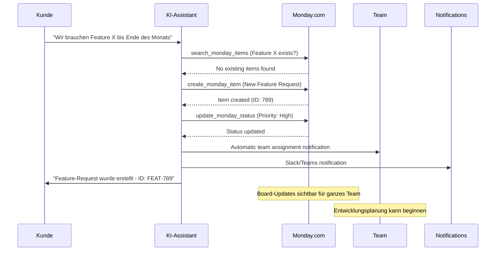

# Monday.com Integration Template

Integrieren Sie Monday.com Work OS in Ihre Mid-Call-Tools mit drei mächtigen Funktionen: Items suchen, Status aktualisieren und neue Items erstellen. Perfekt für Team-Koordination, Projekt-Tracking und agile Workflows.

## Überblick & Funktionen

<CardGroup cols={3}>
  <Card title="Items suchen" icon="magnifying-glass">
    - GraphQL-basierte Board-Durchsuchung
    - Multi-Board-Queries möglich
    - Column-Value-Filtering
    - Customer-spezifische Item-Lookups
  </Card>
  <Card title="Status aktualisieren" icon="trend-up">
    - Echtzeit-Status-Updates
    - Column-Value-Modifications
    - Priority und Assignment-Changes
    - Progress-Tracking-Integration
  </Card>
  <Card title="Items erstellen" icon="plus-circle">
    - Automatische Task-Creation aus Gespräch
    - Group-basierte Organisation
    - Custom Column-Values setzen
    - Team-Assignment und Deadline-Setting
  </Card>
</CardGroup>

## Monday.com API & Workspace Setup

### 1. Monday.com API-Zugang einrichten

<Steps>
  <Step title="Monday.com Account & Permissions">
    - Stellen Sie sicher, dass Sie Admin-Rechte in Ihrem Monday.com Account haben
    - Navigieren Sie zu "Profile" → "Admin" → "API"
    - Überprüfen Sie verfügbare Boards und deren IDs
  </Step>
  
  <Step title="API Token generieren">
    ```yaml
    API-Token-Erstellung:
      1. "Profile" → "Admin" → "API"
      2. "API v2 Token" → "Generate"
      3. Token-Name: "Famulor Mid-Call Integration"
      4. Token kopieren und sicher speichern
      5. Permissions: Lesen und Schreiben für relevante Boards
    ```
  </Step>
  
  <Step title="Board-IDs und Struktur analysieren">
    ```yaml
    Board-Information sammeln:
      1. Relevante Boards identifizieren:
         - Sales Pipeline Board (ID: 1234567890)
         - Support Tickets Board (ID: 2345678901)
         - Feature Requests Board (ID: 3456789012)
      
      2. Column-IDs dokumentieren:
         - Status Column: "status"
         - Priority Column: "priority" 
         - Assignee Column: "person"
         - Date Column: "date4"
      
      3. Group-IDs für Organisation:
         - "new_group" für neue Items
         - "topics" für Standard-Tasks
    ```
  </Step>
  
  <Step title="GraphQL-Schema verstehen">
    - Monday.com nutzt GraphQL für alle API-Operationen
    - Queries für Daten-Abruf (search_monday_items)
    - Mutations für Änderungen (update_monday_status, create_monday_item)
    - Strukturierte Response-Handling erforderlich
  </Step>
</Steps>

## Tool 1: Items suchen

### Konfiguration im Famulor Interface

<Tabs>
  <Tab title="Werkzeugdetails">
    | Feld | Wert |
    |------|------|
    | **Name*** | `Monday.com Items suchen` |
    | **Beschreibung** | "Sucht Items nach verschiedenen Kriterien in Monday.com Boards für Status-Updates und Follow-ups" |
    | **Funktionsname*** | `search_monday_items` |
    | **Funktionsbeschreibung*** | "Durchsucht Monday.com Boards. Verwenden Sie dies, um bestehende Tasks zu finden, Status zu prüfen oder Kundenbezogene Items zu lokalisieren." |
    | **HTTP-Methode** | `POST` |
    | **Timeout (ms)** | `5000` |
    | **Endpoint*** | `https://api.monday.com/v2` |
  </Tab>
  
  <Tab title="Request Body Template">
    ```json
    {
      "query": "query { boards (ids: {board_ids}) { items (limit: 50) { id name column_values { id text value } created_at updated_at } } }"
    }
    ```
  </Tab>
</Tabs>

### Parameter-Schema für Item-Suche

```json
{
  "type": "object",
  "properties": {
    "board_ids": {
      "type": "array",
      "items": {"type": "integer"},
      "description": "Monday.com Board IDs zum Durchsuchen",
      "examples": [[1234567890], [1234567890, 2345678901]]
    },
    "search_term": {
      "type": "string",
      "description": "Suchbegriff für Item-Namen oder Column-Values (wird in GraphQL-Filter integriert)"
    },
    "status_filter": {
      "type": "string",
      "enum": ["", "Working on it", "Done", "Stuck", "Not Started"],
      "description": "Filtert Items nach Status-Column"
    },
    "limit": {
      "type": "integer",
      "description": "Maximum number of items to return",
      "default": 20,
      "minimum": 1,
      "maximum": 100
    }
  },
  "required": ["board_ids"]
}
```

### Response-Mapping

```json
{
  "items": "data.boards[0].items",
  "totalCount": "data.boards[0].items.length"
}
```

## Tool 2: Status aktualisieren

### Konfiguration im Famulor Interface

<Tabs>
  <Tab title="Werkzeugdetails">
    | Feld | Wert |
    |------|------|
    | **Name*** | `Monday.com Status Update` |
    | **Beschreibung** | "Aktualisiert den Status oder andere Column-Values eines Monday.com Items" |
    | **Funktionsname*** | `update_monday_status` |
    | **Funktionsbeschreibung*** | "Aktualisiert ein Monday.com Item. Verwenden Sie dies, um Task-Status zu ändern, Assignees zu aktualisieren oder Deadline-Änderungen vorzunehmen." |
    | **HTTP-Methode** | `POST` |
    | **Timeout (ms)** | `5000` |
    | **Endpoint*** | `https://api.monday.com/v2` |
  </Tab>
  
  <Tab title="GraphQL Mutation">
    ```json
    {
      "query": "mutation { change_column_value (board_id: {board_id}, item_id: {item_id}, column_id: \"{column_id}\", value: \"{value}\") { id name column_values { id text value } } }"
    }
    ```
  </Tab>
</Tabs>

### Parameter-Schema für Updates

```json
{
  "type": "object",
  "properties": {
    "board_id": {
      "type": "integer",
      "description": "Monday.com Board ID des zu aktualisierenden Items"
    },
    "item_id": {
      "type": "integer", 
      "description": "Item ID (aus vorheriger Suche oder bekannt)"
    },
    "column_id": {
      "type": "string",
      "description": "Column ID für Update (z.B. 'status', 'priority', 'person')",
      "examples": ["status", "priority", "person", "date4", "text"]
    },
    "value": {
      "type": "string",
      "description": "Neuer Wert für die Column (JSON-String für komplexe Columns)"
    },
    "update_reason": {
      "type": "string",
      "description": "Grund für das Update (für Audit-Trail)",
      "examples": ["Customer Call Update", "Status Change", "Priority Escalation"]
    }
  },
  "required": ["board_id", "item_id", "column_id", "value"]
}
```

### Response-Mapping

```json
{
  "itemId": "data.change_column_value.id",
  "itemName": "data.change_column_value.name"
}
```

## Tool 3: Item erstellen

### Konfiguration im Famulor Interface

<Tabs>
  <Tab title="Werkzeugdetails">
    | Feld | Wert |
    |------|------|
    | **Name*** | `Monday.com Item erstellen` |
    | **Beschreibung** | "Erstellt ein neues Item (Task) in einem Monday.com Board basierend auf Gesprächsinhalten" |
    | **Funktionsname*** | `create_monday_item` |
    | **Funktionsbeschreibung*** | "Erstellt ein neues Item in Monday.com. Verwenden Sie dies für Action Items, Follow-up-Tasks oder Kundenanfragen aus dem Gespräch." |
    | **HTTP-Methode** | `POST` |
    | **Timeout (ms)** | `5000` |
    | **Endpoint*** | `https://api.monday.com/v2` |
  </Tab>
  
  <Tab title="GraphQL Mutation">
    ```json
    {
      "query": "mutation { create_item (board_id: {board_id}, group_id: \"{group_id}\", item_name: \"{item_name}\", column_values: \"{column_values}\") { id name created_at column_values { id text value } } }"
    }
    ```
  </Tab>
</Tabs>

### Parameter-Schema für Item-Creation

```json
{
  "type": "object",
  "properties": {
    "board_id": {
      "type": "integer",
      "description": "Monday.com Board ID wo das Item erstellt werden soll"
    },
    "group_id": {
      "type": "string",
      "description": "Gruppe/Sektion ID innerhalb des Boards (z.B. 'new_group', 'topics')",
      "examples": ["new_group", "topics", "this_week", "next_week"]
    },
    "item_name": {
      "type": "string", 
      "description": "Name des neuen Items/Tasks"
    },
    "column_values": {
      "type": "string",
      "description": "JSON-String mit Column-Values für Initialisierung",
      "examples": [
        "{\"status\": {\"label\": \"Working on it\"}, \"priority\": {\"label\": \"High\"}}",
        "{\"person\": {\"personsAndTeams\": [{\"id\": 12345}]}, \"date4\": {\"date\": \"2024-01-20\"}}"
      ]
    },
    "customer_name": {
      "type": "string",
      "description": "Kundenname für Item-Kategorisierung (wird in Text-Column eingefügt)"
    },
    "phone_number": {
      "type": "string",
      "description": "Kundenkontakt für Follow-ups (wird in Text-Column eingefügt)"
    },
    "priority": {
      "type": "string",
      "enum": ["Critical", "High", "Medium", "Low"],
      "description": "Prioritätsstufe basierend auf Gesprächskontext",
      "default": "Medium"
    },
    "due_date": {
      "type": "string",
      "format": "date",
      "description": "Deadline für die Aufgabe (YYYY-MM-DD)"
    },
    "estimated_hours": {
      "type": "number",
      "description": "Geschätzte Arbeitszeit in Stunden",
      "minimum": 0.5,
      "maximum": 100
    }
  },
  "required": ["board_id", "item_name"]
}
```

## Praktische Anwendungsszenarien

### Szenario 1: Customer-Support-Workflow

<Steps>
  <Step title="Problem-Assessment & Item-Lookup">
    ```yaml
    Kunde: "Mein Ticket SUP-123 - gibt es Updates?"
    
    KI: "Ich schaue nach Ihrem Ticket..."
    
    search_monday_items:
      board_ids: [2345678901]  # Support Board
      search_term: "SUP-123"
    
    GraphQL Query:
      query { 
        boards (ids: [2345678901]) { 
          items (limit: 50) { 
            id name 
            column_values { 
              id text value 
            } 
          } 
        } 
      }
    ```
  </Step>
  
  <Step title="Status-Update basierend auf Gespräch">
    ```yaml
    Wenn Problem gelöst:
      KI: "Ich markiere Ihr Ticket als erledigt..."
      
    update_monday_status:
      board_id: 2345678901
      item_id: 987654321  # Aus Search-Result
      column_id: "status"
      value: "{\"label\": \"Done\"}"
    
    GraphQL Mutation:
      mutation { 
        change_column_value (
          board_id: 2345678901, 
          item_id: 987654321, 
          column_id: "status", 
          value: "{\"label\": \"Done\"}"
        ) { 
          id name 
        } 
      }
    ```
  </Step>
</Steps>

### Szenario 2: Sales-Pipeline-Management

<AccordionGroup>
  <Accordion title="Lead-to-Item-Creation">
    **Sales-Call-Workflow**:
    ```yaml
    Kunde zeigt Interesse an Demo:
      
    create_monday_item:
      board_id: 1234567890  # Sales Board
      group_id: "new_leads"
      item_name: "Demo Request - Beispiel AG"
      column_values: "{
        \"status\": {\"label\": \"Working on it\"},
        \"priority\": {\"label\": \"High\"},
        \"person\": {\"personsAndTeams\": [{\"id\": 12345}]},
        \"date4\": {\"date\": \"2024-01-20\"},
        \"text\": \"Customer: Max Mustermann, Phone: +49123456789\"
      }"
    
    Ergebnis:
      - Item im Sales-Board erstellt
      - Automatische Assignment an Sales-Rep
      - Deadline für Demo-Vorbereitung gesetzt
      - Customer-Kontaktdaten hinterlegt
    ```
  </Accordion>
  
  <Accordion title="Deal-Status-Tracking">
    **Pipeline-Updates während Gespräch**:
    ```yaml
    Deal-Progress-Update:
      
    Kunde: "Wir haben das Budget genehmigt!"
    
    KI: "Fantastisch! Ich aktualisiere den Deal-Status..."
    
    update_monday_status (Status):
      column_id: "status"
      value: "{\"label\": \"Contract Negotiation\"}"
    
    update_monday_status (Budget):
      column_id: "budget_approved"  
      value: "{\"checked\": \"true\"}"
    
    update_monday_status (Notes):
      column_id: "text"
      value: "Budget approved in call on {date} - ready for contract phase"
    ```
  </Accordion>
</AccordionGroup>

### Szenario 3: Project-Koordination



## GraphQL-Queries & Mutations im Detail

### Erweiterte Search-Queries

<AccordionGroup>
  <Accordion title="Multi-Board-Search mit Filtering">
    ```graphql
    query SearchCustomerItems($boards: [Int!], $customerName: String!) {
      boards(ids: $boards) {
        id
        name
        items(limit: 50) {
          id
          name
          column_values {
            id
            text
            value
          }
          created_at
          updated_at
        }
      }
    }
    ```
    
    **Verwendung für Customer-Lookup**:
    - Customer-Name in Text-Columns suchen
    - Status-Filter anwenden
    - Cross-Board-Search möglich
  </Accordion>
  
  <Accordion title="Status-basierte Filtering">
    ```graphql
    query GetOpenTasks($boardId: Int!, $statusLabel: String!) {
      boards(ids: [$boardId]) {
        items {
          id
          name
          column_values(ids: ["status"]) {
            ... on StatusValue {
              text
              label
              color
            }
          }
        }
      }
    }
    ```
  </Accordion>
</AccordionGroup>

### Complex Column-Value-Updates

<Tabs>
  <Tab title="Status-Column-Updates">
    ```json
    {
      "Status": "{\"label\": \"Working on it\"}",
      "Priority": "{\"label\": \"High\"}",
      "Checkbox": "{\"checked\": \"true\"}"
    }
    ```
  </Tab>
  
  <Tab title="People & Date Columns">
    ```json
    {
      "Person Assignment": "{\"personsAndTeams\": [{\"id\": 12345, \"kind\": \"person\"}]}",
      "Date Column": "{\"date\": \"2024-01-20\"}",
      "Timeline": "{\"from\": \"2024-01-20\", \"to\": \"2024-01-25\"}"
    }
    ```
  </Tab>
  
  <Tab title="Complex Text & Numbers">
    ```json
    {
      "Long Text": "Detailed description from customer call...",
      "Numbers": "{\"number\": 50000}",
      "Email": "{\"email\": \"customer@example.com\", \"text\": \"Max Mustermann\"}"
    }
    ```
  </Tab>
</Tabs>

## Response-Verarbeitung

### Item-Search Response

```json
{
  "data": {
    "boards": [
      {
        "items": [
          {
            "id": "987654321",
            "name": "Demo Request - Beispiel AG",
            "column_values": [
              {
                "id": "status",
                "text": "Working on it",
                "value": "{\"label\": \"Working on it\", \"color\": \"#fdab3d\"}"
              },
              {
                "id": "person",
                "text": "Sales Team",
                "value": "{\"personsAndTeams\": [{\"id\": 12345, \"kind\": \"person\"}]}"
              }
            ],
            "created_at": "2024-01-15T10:30:00Z",
            "updated_at": "2024-01-15T14:20:00Z"
          }
        ]
      }
    ]
  }
}
```

### Natürliche Sprachintegration

<AccordionGroup>
  <Accordion title="Search-Results-Kommunikation">
    **Template**: `"{{totalCount}} Items gefunden. Erste Ergebnisse: {{items[0].name}}, {{items[1].name}}"`
    
    **Erweiterte Interpretationen**:
    ```yaml
    Wenn Items gefunden:
      "Ich habe 3 relevante Aufgaben gefunden. Ihr Demo-Request mit Beispiel AG 
       ist aktuell in Bearbeitung und wird von unserem Sales-Team betreut."
    
    Wenn keine Items:
      "Ich konnte keine passenden Aufgaben finden. Soll ich eine neue erstellen?"
    
    Mit Status-Context:
      "Ihr Support-Ticket ist seit gestern in Bearbeitung. 
       Das Team arbeitet aktiv an der Lösung."
    ```
  </Accordion>
  
  <Accordion title="Update & Creation-Bestätigungen">
    **Status-Update-Template**: `"Status aktualisiert für: {{itemName}}"`
    
    **Creation-Template**: `"Aufgabe erstellt: {{itemName}} (ID: {{itemId}})"`
    
    **Business-Context-Integration**:
    ```yaml
    Mit Team-Assignment:
      "Aufgabe wurde erstellt und an das Entwicklungsteam zugewiesen."
    
    Mit Deadline:
      "Feature-Request wurde mit Deadline Ende Januar eingeplant."
    
    Mit Priority-Escalation:
      "Support-Ticket wurde als High-Priority markiert und priorisiert bearbeitet."
    ```
  </Accordion>
</AccordionGroup>

## Erweiterte Monday.com Features

### Automation & Workflows

<AccordionGroup>
  <Accordion title="Monday.com Automation-Rules">
    ```yaml
    Board-Automation-Integration:
      
    Wenn Mid-Call-Item erstellt:
      → Automatische Email-Benachrichtigung an Assignee
      → Slack-Notification in Team-Channel
      → Due-Date-Reminder 24h vorher
      
    Wenn Status = "Done":
      → Customer-Benachrichtigung via Email
      → Move Item to "Completed" Group
      → Archive nach 30 Tagen
      
    Wenn Priority = "Critical":
      → Sofortige Manager-Benachrichtigung
      → Auto-assign to Senior Team Member
      → SLA-Timer activation
    ```
  </Accordion>
  
  <Accordion title="Cross-Board-Integration">
    ```yaml
    Multi-Board-Workflows:
      
    Sales-Support-Bridge:
      Sales-Item → Create linked Support-Item
      Support-Resolution → Update Sales-Status
      
    Development-Planning:
      Feature-Request → Create Epic in Dev-Board
      Epic-Progress → Update Customer-Communication-Board
      
    Customer-Success-Tracking:
      Support-Issue → Create CS-Follow-up-Item
      Project-Milestone → Create Customer-Check-in
    ```
  </Accordion>
</AccordionGroup>

### Advanced Column-Types

<Tabs>
  <Tab title="Customer-Management-Columns">
    ```yaml
    Customer-Database-Integration:
      
    Customer-Info-Columns:
      - "Customer Name": Text field
      - "Contact Email": Email field  
      - "Phone Number": Phone field
      - "Company Size": Dropdown (Small/Medium/Large)
      - "Industry": Dropdown (Tech/Healthcare/Finance/...)
      
    Business-Context:
      - "Deal Size": Numbers (€)
      - "Urgency": Rating (1-5 stars)
      - "Last Contact": Date
      - "Next Follow-up": Date
    ```
  </Tab>
  
  <Tab title="Project-Tracking-Columns">
    ```yaml
    Project-Management-Columns:
      
    Progress-Tracking:
      - "Completion %": Progress bar
      - "Time Spent": Time tracking
      - "Budget Used": Numbers with currency
      
    Dependencies:
      - "Blocked By": Connect boards (Dependencies)
      - "Related Items": Connect boards (Same board)
      - "Parent Epic": Connect boards (Cross-reference)
      
    Quality-Assurance:
      - "Review Status": Dropdown
      - "Testing Notes": Long text
      - "Acceptance Criteria": Checklist
    ```
  </Tab>
</Tabs>

## Performance & Analytics

### Monday.com Integration-KPIs

| Metrik | Beschreibung | Zielwert |
|--------|-------------|----------|
| **Item Creation Success Rate** | % erfolgreich erstellter Items | &gt;99% |
| **GraphQL Query Performance** | Durchschnittliche Response-Zeit | &lt;1.5 Sekunden |
| **Update Success Rate** | % erfolgreiche Column-Updates | &gt;98% |
| **Team Adoption Rate** | % der Items mit Mid-Call-Origin die bearbeitet werden | &gt;85% |

### Business Impact Tracking

<Steps>
  <Step title="Workflow-Efficiency">
    ```yaml
    Productivity-Metriken:
      - Reduzierte Zeit von Gespräch zu Task-Assignment
      - Höhere Follow-up-Rate durch automatische Item-Creation
      - Verbesserte Team-Coordination durch structured Data
      - Reduzierte "vergessene Action Items"
    ```
  </Step>
  
  <Step title="Customer-Experience-Impact">
    ```yaml
    Customer-Satisfaction:
      - Schnellere Problem-Resolution durch sofortige Ticket-Creation
      - Höhere Transparenz durch Item-Status-Sharing
      - Proaktive Updates durch Automation-Rules
      - Reduzierte "Lost in System"-Erfahrungen
    ```
  </Step>
</Steps>

## Fehlerbehandlung

### Monday.com GraphQL Errors

<AccordionGroup>
  <Accordion title="Authentication Error">
    ```yaml
    Error: "Invalid authentication credentials"
    
    Ursache: API-Token ungültig oder abgelaufen
    
    Fallback:
      "Monday.com-Synchronisation ist momentan nicht verfügbar. 
       Ich dokumentiere die Aufgabe für manuelle Erstellung."
    
    Resolution:
      - API-Token überprüfen und erneuern
      - Account-Permissions validieren
      - Board-Access-Rights überprüfen
    ```
  </Accordion>
  
  <Accordion title="Board/Item nicht gefunden">
    ```yaml
    Error: "Resource not found"
    
    Mögliche Ursachen:
      - Board-ID falsch oder Board gelöscht
      - Item-ID existiert nicht
      - Unzureichende Berechtigungen
    
    Intelligent-Fallback:
      - Alternative Board-IDs versuchen
      - Default-Board für neue Items verwenden
      - Admin-Benachrichtigung über Konfigurationsproblem
    ```
  </Accordion>
  
  <Accordion title="GraphQL-Syntax-Errors">
    ```yaml
    Error: "Query error: Syntax error"
    
    Handling:
      - Fallback auf einfachere Query
      - Parameter-Validation vor API-Call
      - Dynamic Query-Building mit Error-Checking
    
    Recovery-Strategy:
      "Es gab ein technisches Problem mit der Monday.com-Integration. 
       Ich verwende eine alternative Methode."
    ```
  </Accordion>
</AccordionGroup>

---

<Warning>
**GraphQL-Komplexität**: Monday.com verwendet GraphQL, was komplexere Query-Strukturen erfordert. Testen Sie alle Queries ausführlich in der Monday.com API-Playground bevor Sie sie in Production verwenden.
</Warning>

<Info>
**Productivity-Tipp**: Nutzen Sie Monday.com-Automation-Rules in Kombination mit den Mid-Call-Tools um vollständige Workflow-Automation zu erreichen. Dies maximiert den ROI der Integration.
</Info>
