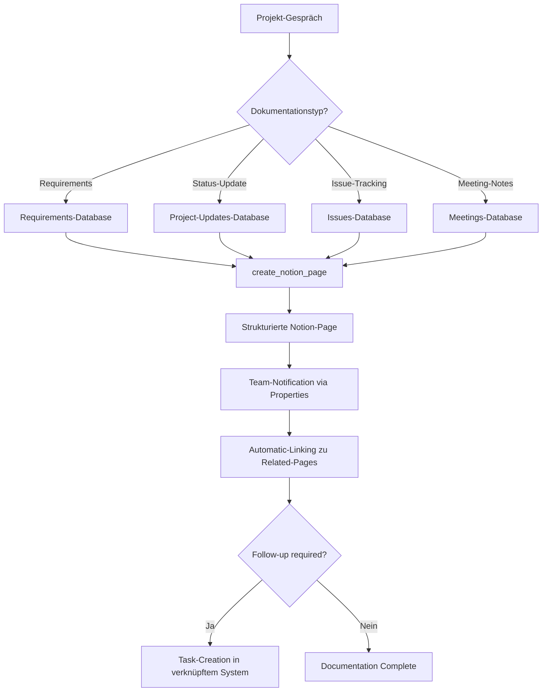

# Notion Integration Template

Integrieren Sie Notion-Page-Creation in Ihre Mid-Call-Tools und ermöglichen Sie es Ihrem KI-Assistenten, während Kundengesprächem automatisch strukturierte Dokumentationen, Meeting-Notes und Knowledge-Base-Einträge in Ihren Notion-Workspaces zu erstellen.

## Überblick & Funktionen

<CardGroup cols={2}>
  <Card title="Strukturierte Dokumentation" icon="file-text">
    - Automatische Meeting-Notes und Gesprächsprotokolle
    - Intelligente Database-Zuordnung basierend auf Kontext
    - Rich-Text-Formatierung mit Notion-Blocks
    - Verknüpfung mit bestehenden Notion-Pages und Templates
  </Card>
  <Card title="Knowledge-Management" icon="brain">
    - Customer-Knowledge-Base-Aufbau
    - Automatische FAQ-Dokumentation
    - Projekt-Dokumentation und Status-Updates
    - Team-Wiki-Erweiterung aus Live-Gesprächen
  </Card>
</CardGroup>

## Notion API & Integration Setup

### 1. Notion Integration erstellen

<Steps>
  <Step title="Notion Integration registrieren">
    - Gehen Sie zu [notion.so/my-integrations](https://www.notion.so/my-integrations)
    - Klicken Sie auf "Create new integration"
    - Name: "Famulor Mid-Call Tools"
    - Associated Workspace wählen
  </Step>
  
  <Step title="Integration Token generieren">
    ```yaml
    Token-Setup:
      1. Integration-Details ausfüllen
      2. "Submit" klicken
      3. Internal Integration Token kopieren
      4. Token sicher speichern (beginnt mit "secret_")
    ```
  </Step>
  
  <Step title="Database-Berechtigungen setzen">
    ```yaml
    Für jede relevante Notion-Database:
      1. Database öffnen
      2. "..." → "Add connections" 
      3. "Famulor Mid-Call Tools" Integration wählen
      4. "Confirm" klicken
      
    Wiederholen für:
      - Customer-Database
      - Meeting-Notes-Database  
      - Support-Tickets-Database
      - Project-Documentation-Database
    ```
  </Step>
  
  <Step title="Database-IDs sammeln">
    - Database-URLs kopieren: `notion.so/workspace/database_id?v=view_id`
    - Database-ID extrahieren (32-stelliger Code)
    - IDs für Tool-Konfiguration dokumentieren
  </Step>
</Steps>

## Mid-Call-Tool konfigurieren

### Konfiguration im Famulor Interface

<Tabs>
  <Tab title="Werkzeugdetails">
    | Feld | Wert |
    |------|------|
    | **Name*** | `Notion Seite erstellen` |
    | **Beschreibung** | "Erstellt automatisch strukturierte Dokumentationen und Meeting-Notes in Notion-Databases" |
    | **Funktionsname*** | `create_notion_page` |
    | **Funktionsbeschreibung*** | "Erstellt eine neue Seite in einer Notion-Database. Verwenden Sie dies für Meeting-Protokolle, Kundendokumentation oder Projekt-Updates basierend auf Gesprächsinhalten." |
    | **HTTP-Methode** | `POST` |
    | **Timeout (ms)** | `5000` |
    | **Endpoint*** | `https://api.notion.com/v1/pages` |
  </Tab>
  
  <Tab title="Header-Konfiguration">
    ```json
    {
      "Authorization": "Bearer {{NOTION_TOKEN}}",
      "Content-Type": "application/json", 
      "Notion-Version": "2022-06-28",
      "User-Agent": "Famulor-MidCall-Notion/1.0"
    }
    ```
  </Tab>
  
  <Tab title="Request Body Template">
    ```json
    {
      "parent": {
        "database_id": "{database_id}"
      },
      "properties": {
        "Name": {
          "title": [
            {
              "text": {
                "content": "{title}"
              }
            }
          ]
        },
        "Status": {
          "select": {
            "name": "{status}"
          }
        },
        "Date": {
          "date": {
            "start": "{date}"
          }
        },
        "Customer": {
          "rich_text": [
            {
              "text": {
                "content": "{customer_name}"
              }
            }
          ]
        },
        "Priority": {
          "select": {
            "name": "{priority}"
          }
        }
      },
      "children": [
        {
          "object": "block",
          "type": "heading_2",
          "heading_2": {
            "rich_text": [
              {
                "type": "text",
                "text": {
                  "content": "Gesprächsprotokoll"
                }
              }
            ]
          }
        },
        {
          "object": "block",
          "type": "paragraph", 
          "paragraph": {
            "rich_text": [
              {
                "type": "text",
                "text": {
                  "content": "{content}"
                }
              }
            ]
          }
        }
      ]
    }
    ```
  </Tab>
</Tabs>

### Parameter-Schema

```json
{
  "type": "object",
  "properties": {
    "database_id": {
      "type": "string",
      "description": "Notion Database-ID (32-stelliger Code aus der Database-URL)",
      "pattern": "^[a-f0-9]{32}$"
    },
    "title": {
      "type": "string",
      "description": "Titel der Notion-Seite",
      "examples": ["Meeting mit Beispiel AG - 15.01.2024", "Support-Case: API-Integration-Problem", "Partnership-Gespräch: Tech-Alliance"]
    },
    "status": {
      "type": "string",
      "enum": ["Neu", "In Bearbeitung", "Review", "Abgeschlossen", "Archiviert"],
      "description": "Status der Seite/des Eintrags",
      "default": "Neu"
    },
    "date": {
      "type": "string",
      "format": "date",
      "description": "Datum des Gesprächs oder der Erstellung (YYYY-MM-DD)"
    },
    "content": {
      "type": "string",
      "description": "Hauptinhalt der Seite - Gesprächsprotokoll, Details, Action Items"
    },
    "customer_name": {
      "type": "string",
      "description": "Name des Kunden/Unternehmens für Kategorisierung"
    },
    "priority": {
      "type": "string",
      "enum": ["Niedrig", "Normal", "Hoch", "Kritisch"],
      "description": "Prioritätsstufe basierend auf Gesprächsinhalt",
      "default": "Normal"
    },
    "tags": {
      "type": "array",
      "items": {"type": "string"},
      "description": "Tags für bessere Categorisierung und Suche"
    },
    "assignee": {
      "type": "string",
      "description": "Verantwortliche Person (wird als Rich Text eingetragen)"
    }
  },
  "required": ["database_id", "title", "content"]
}
```

## Praktische Anwendungsszenarien

### Szenario 1: Meeting-Protokoll-Automatisierung

<Steps>
  <Step title="Live-Meeting-Documentation">
    ```yaml
    Während Sales-Call mit Kunde:
      
    KI sammelt Informationen:
      - Teilnehmer und Rollen
      - Diskutierte Topics
      - Getroffene Entscheidungen
      - Action Items mit Verantwortlichkeiten
      - Nächste Schritte und Timelines
    ```
  </Step>
  
  <Step title="Strukturierte Page-Creation">
    ```yaml
    Notion-Page-Template:
      
    Title: "Sales Meeting: Beispiel AG - CRM-Evaluation (15.01.2024)"
    
    Content:
    "## Teilnehmer
    **Kunde:** Max Mustermann (CEO, Beispiel AG)
    **Unser Team:** Anna Sales (Account Manager)
    
    ## Agenda & Diskussion
    - CRM-Anforderungen: 500 User, DSGVO-konform
    - Budget-Discussion: €50k approved for Q1
    - Integration-Needs: Existing ERP-System (SAP)
    
    ## Entscheidungen
    ✅ Demo scheduled for next Thursday 14:00
    ✅ Technical Deep-Dive with IT-Team required
    ⏳ Proposal deadline: End of week
    
    ## Action Items
    - [ ] Anna: Technical specs zusammenstellen (bis Mi.)
    - [ ] Max: IT-Team für Demo koordinieren
    - [ ] Anna: SAP-Integration-Proposal vorbereiten
    
    ## Next Steps
    1. Demo-Termin: 18.01.2024 14:00
    2. Proposal-Versand: bis 19.01.2024
    3. Entscheidung erwartet: Ende Januar"
    ```
  </Step>
</Steps>

### Szenario 2: Customer-Knowledge-Base

<AccordionGroup>
  <Accordion title="Automatische Kundendokumentation">
    **Customer-Database-Entry**:
    ```yaml
    Database: "Customer Knowledge Base"
    
    Properties:
      Company: "Beispiel AG"
      Industry: "Manufacturing"
      Size: "500+ Employees"
      Tech Stack: "SAP ERP, Custom CRM"
      Decision Maker: "Max Mustermann (CEO)"
      Budget Range: "€50-100k"
      Timeline: "Q1 2024"
      
    Content:
    "## Firmenübersicht
    Beispiel AG ist ein etablierter Mittelständler im Manufacturing-Bereich mit 500+ Mitarbeitern.
    
    ## Tech-Environment  
    - ERP: SAP (seit 5 Jahren)
    - CRM: Legacy Custom Solution (Performance-Probleme)
    - Integration-Needs: API-basiert, Real-time Sync
    
    ## Entscheidungsprozess
    - Primary Decision Maker: Max Mustermann (CEO)
    - Technical Stakeholder: IT-Leiter (noch zu identifizieren)
    - Timeline: Q1 2024 Implementation
    
    ## Conversation History
    15.01.2024: Erstes Gespräch, Demo vereinbart
    [Automatisch erweitert bei weiteren Gesprächen]"
    ```
  </Accordion>
  
  <Accordion title="Support-Case-Documentation">
    **Support-Tickets-Database**:
    ```yaml
    Automatische-Case-Creation:
      
    Title: "API-Gateway Ausfall - Beispiel AG"
    Status: "Kritisch"
    Customer: "Beispiel AG"
    Reported By: "Max Mustermann"
    Priority: "Hoch"
    
    Structured-Content:
    "## Problem Description
    API-Gateway nicht erreichbar seit 14:00 Uhr heute.
    
    ## Impact Assessment
    - Affected Systems: Produktions-API
    - Business Impact: Complete Service Outage
    - Estimated Revenue Loss: €5k/hour
    
    ## Technical Details
    - Error Messages: 503 Service Unavailable
    - Affected Endpoints: /api/v1/*
    - Last Working: 13:45 Uhr
    
    ## Resolution Steps
    1. [ ] Infrastructure-Team benachrichtigen
    2. [ ] Load-Balancer-Status prüfen  
    3. [ ] Backup-Systems aktivieren
    4. [ ] Customer-Communication-Update"
    ```
  </Accordion>
</AccordionGroup>

### Szenario 3: Project-Documentation



## Response-Verarbeitung

### Erfolgreiche Page-Creation

```json
{
  "object": "page",
  "id": "abc123def456-ghi789-jkl012",
  "created_time": "2024-01-15T10:30:00.000Z",
  "last_edited_time": "2024-01-15T10:30:00.000Z",
  "created_by": {
    "object": "user",
    "id": "integration-user-id"
  },
  "parent": {
    "type": "database_id",
    "database_id": "database-abc123def456"
  },
  "archived": false,
  "properties": {
    "Name": {
      "id": "title",
      "type": "title",
      "title": [
        {
          "type": "text",
          "text": {
            "content": "Meeting mit Beispiel AG - 15.01.2024"
          }
        }
      ]
    },
    "Status": {
      "id": "status-id",
      "type": "select", 
      "select": {
        "id": "status-neu-id",
        "name": "Neu",
        "color": "blue"
      }
    }
  },
  "url": "https://www.notion.so/Meeting-mit-Beispiel-AG-abc123def456"
}
```

### Natürliche Sprachintegration

<AccordionGroup>
  <Accordion title="Agent-Nachrichten vor API-Aufruf">
    **Template**: `"Ich erstelle eine neue Seite '{{title}}' in Notion..."`
    
    **Kontextuelle Beispiele**:
    ```yaml
    Meeting-Protokoll:
      "Ich dokumentiere unser Gespräch in Notion..."
    
    Customer-Profile:
      "Ich lege eine Kundendokumentation in unserer Knowledge-Base an..."
    
    Project-Update:
      "Ich erstelle ein Projekt-Update in Notion für das Team..."
    ```
  </Accordion>
  
  <Accordion title="Erfolgsbestätigungen">
    **Standard-Template**: `"Notion-Seite wurde erfolgreich erstellt."`
    
    **Erweiterte Bestätigungen**:
    ```yaml
    Mit Team-Kontext:
      "Dokumentation wurde erstellt und das Team kann sie einsehen."
    
    Mit Verlinkung:
      "Meeting-Protokoll ist in Notion verfügbar - Ihr Team wurde benachrichtigt."
    
    Mit Follow-up:
      "Kundenprofil wurde in unserer Knowledge-Base angelegt. 
       Das Account-Team kann es für zukünftige Gespräche verwenden."
    ```
  </Accordion>
</AccordionGroup>

## Erweiterte Notion-Features

### Database-Templates & Properties

<AccordionGroup>
  <Accordion title="Customer-Database-Schema">
    ```yaml
    Properties-Configuration:
      
    Name: Title field (automatically created)
    Company Size: Select (Startup/SMB/Enterprise)
    Industry: Multi-select (Tech/Healthcare/Finance/...)
    Status: Select (Lead/Prospect/Customer/Churned)
    Last Contact: Date
    Revenue Potential: Number (€)
    Assigned To: Person
    Tags: Multi-select
    Notes: Rich text
    
    Custom-Views:
      - Hot Prospects (Status=Prospect, Revenue>50k)
      - Needs Follow-up (Last Contact >7 days ago)
      - Enterprise Accounts (Company Size=Enterprise)
    ```
  </Accordion>
  
  <Accordion title="Project-Documentation-Schema">
    ```yaml
    Properties für Projekt-Tracking:
      
    Project Name: Title
    Client: Relation (to Customer Database)
    Project Phase: Select (Planning/Development/Testing/Delivery)
    Start Date: Date
    Due Date: Date  
    Budget: Number
    Team Lead: Person
    Status: Select (On Track/At Risk/Blocked/Complete)
    Risk Level: Select (Low/Medium/High)
    
    Block-Content-Template:
      ## Projektziele
      {project_objectives}
      
      ## Aktuelle Phase
      {current_phase_details}
      
      ## Nächste Schritte
      {action_items}
      
      ## Risiken & Herausforderungen
      {identified_risks}
    ```
  </Accordion>
</AccordionGroup>

### Rich-Text-Block-Management

<Tabs>
  <Tab title="Gesprächsprotokoll-Struktur">
    ```json
    {
      "children": [
        {
          "object": "block",
          "type": "heading_1",
          "heading_1": {
            "rich_text": [{"type": "text", "text": {"content": "Gespräch mit {customer_name}"}}]
          }
        },
        {
          "object": "block",
          "type": "callout",
          "callout": {
            "rich_text": [{"type": "text", "text": {"content": "📞 Live Call - {date} {time}"}}],
            "icon": {"emoji": "📞"},
            "color": "blue_background"
          }
        },
        {
          "object": "block", 
          "type": "heading_2",
          "heading_2": {
            "rich_text": [{"type": "text", "text": {"content": "Key Discussion Points"}}]
          }
        },
        {
          "object": "block",
          "type": "bulleted_list_item",
          "bulleted_list_item": {
            "rich_text": [{"type": "text", "text": {"content": "{discussion_point_1}"}}]
          }
        }
      ]
    }
    ```
  </Tab>
  
  <Tab title="Action-Items-Template">
    ```json
    {
      "object": "block",
      "type": "heading_2", 
      "heading_2": {
        "rich_text": [{"type": "text", "text": {"content": "Action Items"}}]
      }
    },
    {
      "object": "block",
      "type": "to_do",
      "to_do": {
        "rich_text": [
          {
            "type": "text",
            "text": {"content": "{action_item}"}
          }
        ],
        "checked": false
      }
    }
    ```
  </Tab>
</Tabs>

## Integration mit anderen Systemen

### CRM-Dokumentation-Sync

<AccordionGroup>
  <Accordion title="HubSpot-Notion-Workflow">
    ```yaml
    Bidirectional-Sync-Pattern:
      
    1. Mid-Call-Tool erstellt Notion-Page
    2. Notion-Page-URL wird in HubSpot-Contact als Note hinzugefügt
    3. HubSpot-Updates triggern Notion-Page-Updates
    4. Notion-Comments werden als HubSpot-Activities geloggt
    
    Implementation:
      - Notion Database mit HubSpot-Contact-ID-Property
      - Webhook-Integration für bidirectionale Updates
      - Conflict-Resolution bei simultanen Änderungen
    ```
  </Accordion>
  
  <Accordion title="Asana-Notion-Integration">
    ```yaml
    Task-Documentation-Workflow:
      
    1. create_asana_task für Action Items
    2. create_notion_page für detaillierte Dokumentation
    3. Asana-Task verlinkt auf Notion-Page
    4. Notion-Page referenziert Asana-Task-ID
    
    Cross-Platform-Benefits:
      - Asana: Task-Tracking und Deadlines
      - Notion: Rich Documentation und Context
      - Team: Vollständige Transparenz und Nachverfolgbarkeit
    ```
  </Accordion>
</AccordionGroup>

## Performance & Monitoring

### Notion-spezifische Metriken

| Metrik | Beschreibung | Zielwert |
|--------|-------------|----------|
| **Page Creation Success Rate** | % erfolgreich erstellter Notion-Pages | &gt;98% |
| **Content Quality Score** | Vollständigkeit und Struktur der Dokumentation | &gt;85% |
| **Team Engagement Rate** | % der Pages mit Team-Interaktionen | &gt;70% |
| **Documentation Findability** | % der Pages die via Suche gefunden werden | &gt;90% |

### Knowledge-Management-Analytics

<Steps>
  <Step title="Content-Utilization tracking">
    ```yaml
    Metriken:
      - Page-Views nach Creation
      - Comment-Activity von Team-Mitgliedern
      - Internal-Link-Clicks zwischen Pages
      - Search-Query-Performance
    ```
  </Step>
  
  <Step title="Business-Impact-Messung">
    ```yaml
    Knowledge-Base-ROI:
      - Reduzierte Meeting-Vorbereitung-Zeit
      - Weniger "Information-nicht-verfügbar"-Situationen  
      - Verbesserte Customer-Onboarding-Effizienz
      - Höhere Team-Alignment-Scores
    ```
  </Step>
</Steps>

## Fehlerbehandlung

### Häufige Notion-API-Probleme

<AccordionGroup>
  <Accordion title="Database nicht gefunden (404)">
    ```yaml
    Ursache: Database-ID falsch oder Integration hat keine Berechtigung
    
    Notion-Error:
      "object": "error",
      "status": 404,
      "code": "object_not_found",
      "message": "Could not find database"
    
    Fallback:
      "Die Dokumentation konnte nicht in der spezifizierten Database erstellt werden. 
       Ich erstelle eine alternative Dokumentation."
    
    Resolution:
      - Database-ID validieren
      - Integration-Permissions prüfen
      - Fallback auf Default-Database
    ```
  </Accordion>
  
  <Accordion title="Invalid Properties (400)">
    ```yaml
    Häufige-Property-Errors:
      - Select-Wert existiert nicht in Database-Options
      - Date-Format ungültig
      - Required-Properties fehlen
      - Property-Type-Mismatch
    
    Graceful-Handling:
      - Property-Defaults verwenden
      - Ungültige Werte als Rich-Text speichern
      - Page trotzdem erstellen (mit Warnings)
      
    Error-Recovery:
      "Dokumentation wurde mit Standard-Werten erstellt. 
       Das Team kann Details manuell anpassen."
    ```
  </Accordion>
  
  <Accordion title="Rate Limiting (429)">
    ```yaml
    Notion-Limits:
      - 3 Requests pro Sekunde
      - Burst-Capacity: 10 Requests
      - Content-Limits: 100 Blocks per Request
    
    Retry-Strategy:
      - Jitter-basierter Backoff
      - Content-Splitting bei großen Pages
      - Priority-Queue für kritische Dokumentation
    
    User-Experience:
      "Die Dokumentation wird erstellt - bei umfangreichen Inhalten 
       kann das einen Moment dauern."
    ```
  </Accordion>
</AccordionGroup>

## Advanced Use Cases

### Template-basierte Page-Creation

<Tabs>
  <Tab title="Meeting-Types-Templates">
    ```yaml
    Sales-Meeting-Template:
      Blocks: [Teilnehmer, Agenda, Budget, Timeline, Next Steps]
      Properties: [Company, Deal Size, Close Date, Assigned Sales Rep]
      
    Support-Case-Template:
      Blocks: [Problem, Impact, Technical Details, Resolution]
      Properties: [Severity, Customer Tier, SLA, Assigned Engineer]
      
    Partnership-Meeting-Template:
      Blocks: [Partnership Type, Mutual Benefits, Timeline, Legal]
      Properties: [Partner Category, Revenue Potential, Contract Type]
    ```
  </Tab>
  
  <Tab title="Content-AI-Enhancement">
    ```yaml
    KI-gestützte Content-Erweiterung:
      
    1. Basis-Gespräch-Transkriktion
    2. KI extrahiert Struktur-Elemente:
       - Key Decisions
       - Action Items  
       - Risks & Challenges
       - Success Criteria
    3. Automatische Notion-Block-Generierung
    4. Template-basierte Formatierung
    5. Cross-Reference zu bestehenden Pages
    ```
  </Tab>
</Tabs>

---

<Warning>
**Database-Schema**: Stellen Sie sicher, dass Ihre Notion-Database-Properties mit den Parameter-Schema-Definitionen übereinstimmen. Änderungen am Database-Schema erfordern Updates der Tool-Konfiguration.
</Warning>

<Info>
**Collaboration-Tipp**: Verwenden Sie Notion-Comments und @-Mentions in den automatisch erstellten Pages um Team-Diskussionen zu fördern und Follow-up-Actions zu koordinieren.
</Info>
