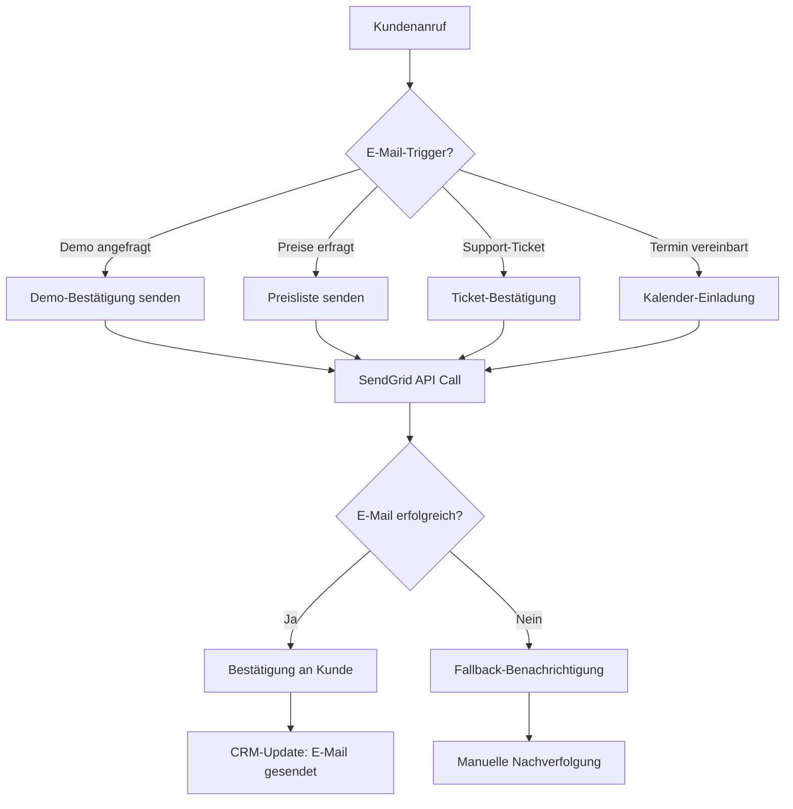
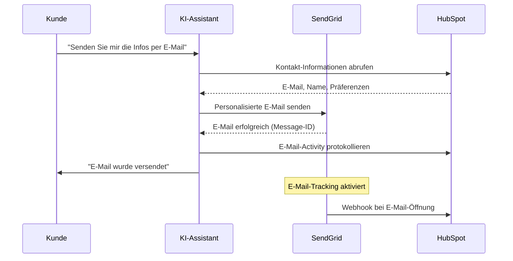

# SendGrid Integration Template

Integrieren Sie SendGrid E-Mail-Versand in Ihre Mid-Call-Tools und ermöglichen Sie es Ihrem KI-Assistenten, während Kundengesprächem automatisch personalisierte E-Mails zu versenden - ideal für Follow-ups, Bestätigungen und Marketing-Kommunikation.

## Überblick & Funktionen

<CardGroup cols={2}>
  <Card title="Professioneller E-Mail-Versand" icon="paper-plane">
    - Sofortiger E-Mail-Versand während des Gesprächs
    - Personalisierte Templates und Inhalte
    - Zustellbarkeits-Optimierung durch SendGrid
    - DSGVO-konforme E-Mail-Kommunikation
  </Card>
  <Card title="Marketing-Automation" icon="chart-line">
    - Automatische Follow-up-E-Mails
    - Lead-Nurturing-Sequenzen
    - Event-basierte Trigger-E-Mails
    - A/B-Testing und Analytics-Integration
  </Card>
</CardGroup>

## SendGrid Account & API Setup

### 1. SendGrid Account vorbereiten

<Steps>
  <Step title="SendGrid Account erstellen">
    - Registrieren Sie sich bei [SendGrid](https://sendgrid.com)
    - Wählen Sie einen passenden Plan (Free Plan für bis zu 100 E-Mails/Tag)
    - Verifizieren Sie Ihre E-Mail-Adresse und Account
  </Step>
  
  <Step title="Sender Authentication">
    ```yaml
    Domain-Authentifizierung (empfohlen):
      1. "Settings" → "Sender Authentication"
      2. "Authenticate Your Domain" klicken
      3. DNS-Einträge bei Ihrem Domain-Provider hinzufügen
      4. Verifizierung abwarten (kann bis 24h dauern)
      
    Single Sender Verification (schnell):
      1. "Settings" → "Sender Authentication" 
      2. "Verify a Single Sender" wählen
      3. Absender-E-Mail und -Details eingeben
      4. Bestätigungs-E-Mail überprüfen
    ```
  </Step>
  
  <Step title="API Key generieren">
    ```yaml
    API-Key-Erstellung:
      1. "Settings" → "API Keys"
      2. "Create API Key" klicken
      3. Name: "Famulor Mid-Call Integration"
      4. Permissions: "Full Access" oder "Restricted Access"
      
    Restricted Access (empfohlen):
      - Mail Send: Full Access
      - Stats: Read Access (optional für Analytics)
      - Suppressions: Read Access (optional)
    ```
  </Step>
  
  <Step title="API Key sichern">
    - API Key kopieren (beginnt mit "SG.")
    - Sicher speichern - wird als {{SENDGRID_API_KEY}} verwendet
    - Test-E-Mail über API senden zur Validierung
  </Step>
</Steps>

## Mid-Call-Tool konfigurieren

### Konfiguration im Famulor Interface

<Tabs>
  <Tab title="Werkzeugdetails">
    | Feld | Wert |
    |------|------|
    | **Name*** | `SendGrid E-Mail versenden` |
    | **Beschreibung** | "Versendet professionelle E-Mails über SendGrid für Follow-ups, Bestätigungen und Marketing-Kommunikation" |
    | **Funktionsname*** | `send_sendgrid_email` |
    | **Funktionsbeschreibung*** | "Versendet eine E-Mail über SendGrid. Verwenden Sie dies für sofortige Bestätigungen, Follow-up-E-Mails oder wichtige Informationsübermittlung nach dem Gespräch." |
    | **HTTP-Methode** | `POST` |
    | **Timeout (ms)** | `10000` |
    | **Endpoint*** | `https://api.sendgrid.com/v3/mail/send` |
  </Tab>
  
  <Tab title="Header-Konfiguration">
    ```json
    {
      "Authorization": "Bearer {{SENDGRID_API_KEY}}",
      "Content-Type": "application/json",
      "User-Agent": "Famulor-MidCall-SendGrid/1.0"
    }
    ```
  </Tab>
  
  <Tab title="Request Body Template">
    ```json
    {
      "personalizations": [
        {
          "to": [
            {
              "email": "{to_email}",
              "name": "{to_name}"
            }
          ],
          "subject": "{subject}",
          "dynamic_template_data": {
            "customer_name": "{to_name}",
            "company_name": "{company_name}",
            "call_summary": "{call_summary}"
          }
        }
      ],
      "from": {
        "email": "{from_email}",
        "name": "{from_name}"
      },
      "content": [
        {
          "type": "text/html",
          "value": "{content}"
        }
      ],
      "categories": ["mid-call-tool", "customer-communication"],
      "tracking_settings": {
        "click_tracking": {"enable": true},
        "open_tracking": {"enable": true}
      }
    }
    ```
  </Tab>
</Tabs>

### Parameter-Schema

```json
{
  "type": "object",
  "properties": {
    "to_email": {
      "type": "string",
      "format": "email",
      "description": "E-Mail-Adresse des Empfängers"
    },
    "to_name": {
      "type": "string",
      "description": "Name des Empfängers (wird für Personalisierung verwendet)"
    },
    "subject": {
      "type": "string",
      "description": "E-Mail-Betreff",
      "examples": ["Vielen Dank für Ihr Gespräch", "Ihre angeforderten Informationen", "Follow-up zu unserem Termin"]
    },
    "content": {
      "type": "string",
      "description": "E-Mail-Inhalt (HTML und Plain Text möglich)"
    },
    "from_email": {
      "type": "string",
      "format": "email", 
      "description": "Absender-E-Mail (muss authentifiziert sein)"
    },
    "from_name": {
      "type": "string",
      "description": "Name des Absenders",
      "default": "Ihr Famulor-Team"
    },
    "template_id": {
      "type": "string",
      "description": "SendGrid Dynamic Template ID (optional für vorgefertigte Templates)"
    },
    "company_name": {
      "type": "string",
      "description": "Firmenname für Template-Personalisierung (optional)"
    },
    "call_summary": {
      "type": "string",
      "description": "Zusammenfassung des Gesprächs für E-Mail-Inhalt (optional)"
    }
  },
  "required": ["to_email", "subject", "content", "from_email"]
}
```

## Praktische Anwendungsszenarien

### Szenario 1: Sofortige Follow-up-E-Mail

<Steps>
  <Step title="Gespräch-Kontext erfassen">
    ```yaml
    Während des Gesprächs:
      Kunde: "Können Sie mir die Preisliste per E-Mail senden?"
      
    KI-Assistent: "Gerne! Ich sende Ihnen sofort unsere aktuelle Preisliste."
    
    → Automatischer E-Mail-Versand mit Preisliste als Anhang
    ```
  </Step>
  
  <Step title="Personalisierte E-Mail-Generierung">
    ```yaml
    E-Mail-Template:
      Betreff: "Ihre angeforderte Preisliste - {company_name}"
      
      Inhalt:
      "Hallo {to_name},
      
      vielen Dank für das informative Gespräch eben. 
      Wie besprochen, sende ich Ihnen hiermit unsere aktuelle Preisliste.
      
      Falls Sie weitere Fragen haben, melden Sie sich gerne.
      
      Mit freundlichen Grüßen,
      {from_name}"
    ```
  </Step>
</Steps>

### Szenario 2: Lead-Nurturing-Automation

<AccordionGroup>
  <Accordion title="Qualifizierte Leads">
    **Automatische Nurturing-Sequenz**:
    ```yaml
    Lead-Score > 70:
      E-Mail 1: Sofortige Bestätigung + Firmenbroschüre
      E-Mail 2: Case Studies relevanter Kunden (nach 2 Stunden)
      E-Mail 3: Persönliches Angebot (nach 24 Stunden)
      
    Template-Personalisierung:
      - Branche-spezifische Inhalte
      - Erwähnte Pain Points aus dem Gespräch
      - Individueller Ansprechpartner
    ```
  </Accordion>
  
  <Accordion title="Interessierte Prospects">
    **Informative Follow-up-Serie**:
    ```yaml
    Lead-Score 40-70:
      E-Mail 1: Gesprächszusammenfassung + nächste Schritte
      E-Mail 2: Relevante Blog-Artikel (nach 3 Tagen)
      E-Mail 3: Webinar-Einladung (nach 1 Woche)
      
    Content-Strategie:
      - Educational Content vor Sales-Pitch
      - Vertrauen aufbauen durch Expertise
      - Sanfte Lead-Weiterqualifizierung
    ```
  </Accordion>
</AccordionGroup>

### Szenario 3: Transaktions-E-Mails



## Response-Verarbeitung

### Erfolgreiche E-Mail-Sendung

```json
{
  "message_id": "WyJ1c2VyXzEyMyIsICJtZXNzYWdlXzQ1NiJd",
  "status": "queued",
  "timestamp": 1640995200
}
```

### Natürliche Sprachintegration

<AccordionGroup>
  <Accordion title="Agent-Nachrichten vor Versand">
    **Template**: `"Ich versende die E-Mail an {{to_email}}..."`
    
    **Kontextuelle Beispiele**:
    ```yaml
    Preisliste:
      "Ich sende Ihnen sofort die Preisliste an max@beispiel.de..."
    
    Demo-Bestätigung:
      "Ich schicke Ihnen die Demo-Details per E-Mail..."
    
    Follow-up:
      "Sie erhalten in Kürze eine Zusammenfassung unseres Gesprächs..."
    ```
  </Accordion>
  
  <Accordion title="Erfolgsbestätigungen">
    **Standard-Template**: `"E-Mail wurde erfolgreich versendet."`
    
    **Erweiterte Bestätigungen**:
    ```yaml
    Mit Tracking:
      "E-Mail wurde versendet. Sie erhalten eine Benachrichtigung, 
       wenn die E-Mail geöffnet wird."
    
    Mit nächsten Schritten:
      "E-Mail ist unterwegs. Ich empfehle ein Follow-up in 2-3 Tagen, 
       falls keine Antwort kommt."
    
    Mit Template-Info:
      "Personalisierte Preisliste wurde an {to_name} gesendet."
    ```
  </Accordion>
</AccordionGroup>

## Erweiterte SendGrid-Features

### Dynamic Templates

<Tabs>
  <Tab title="Template-Erstellung">
    ```yaml
    SendGrid-Template-Setup:
      1. "Email API" → "Dynamic Templates"
      2. "Create a Dynamic Template"
      3. Template-Name: "Mid-Call Follow-up"
      4. Template-Design mit Variablen:
         - {{customer_name}}
         - {{company_name}} 
         - {{call_summary}}
         - {{next_steps}}
    ```
  </Tab>
  
  <Tab title="Template-Integration">
    ```json
    {
      "template_id": "d-abc123def456ghi789",
      "personalizations": [
        {
          "to": [{"email": "{to_email}", "name": "{to_name}"}],
          "dynamic_template_data": {
            "customer_name": "{to_name}",
            "company_name": "{company_name}",
            "call_summary": "{call_summary}",
            "next_steps": "{next_steps}",
            "meeting_link": "{meeting_link}",
            "contact_person": "{from_name}"
          }
        }
      ],
      "from": {"email": "{from_email}", "name": "{from_name}"}
    }
    ```
  </Tab>
</Tabs>

### E-Mail-Analytics Integration

<AccordionGroup>
  <Accordion title="Tracking & Metriken">
    ```yaml
    SendGrid-Analytics:
      Opens: Wann und wie oft E-Mail geöffnet wurde
      Clicks: Link-Klicks und Engagement
      Bounces: Unzustellbare E-Mails
      Spam Reports: Spam-Beschwerden
      Unsubscribes: Abmeldungen
      
    CRM-Integration:
      - E-Mail-Öffnung → Lead-Score +5
      - Link-Klick → Lead-Score +10  
      - Bounce → E-Mail-Status aktualisieren
      - Spam → Kontakt aus Listen entfernen
    ```
  </Accordion>
  
  <Accordion title="Webhook-Events">
    ```json
    {
      "sg_event_id": "abc123",
      "sg_message_id": "message_id_from_response",
      "event": "open",
      "email": "max@beispiel.de",
      "timestamp": 1640995800,
      "useragent": "Mozilla/5.0...",
      "ip": "192.168.1.1"
    }
    ```
    
    **Webhook-URL**: `https://your-api.com/sendgrid-webhook`
    **Events**: delivered, open, click, bounce, dropped, spamreport
  </Accordion>
</AccordionGroup>

## Compliance & Datenschutz

### DSGVO-Konformität

<CardGroup cols={2}>
  <Card title="Einverständnis-Management" icon="shield-check">
    **Vor E-Mail-Versand prüfen**:
    - Explizite Einverständniserklärung
    - Opt-in-Status validieren
    - Zweckbindung beachten
    - Widerrufsrecht informieren
  </Card>
  <Card title="Datenminimierung" icon="lock">
    **Best Practices**:
    - Nur notwendige Personalisierung
    - Keine sensiblen Daten in E-Mails
    - Automatische Löschung nach Retention-Period
    - Pseudonymisierung wo möglich
  </Card>
</CardGroup>

### Suppression Management

```yaml
Bounce-Handling:
  Hard Bounces: Automatisch zur Suppression-Liste
  Soft Bounces: Nach 3 Versuchen supprimieren
  Invalid E-Mails: Sofortige Suppression
  
Unsubscribe-Management:
  Global Unsubscribes: Alle E-Mails blockieren
  Group Unsubscribes: Nur spezifische Kategorien
  Resubscribe-Handling: Double-Opt-In erforderlich
```

## Fehlerbehandlung

### Häufige API-Fehler

<AccordionGroup>
  <Accordion title="Authentication Error (401)">
    ```yaml
    Ursache: Ungültiger oder abgelaufener API-Key
    
    SendGrid-Response:
      "errors": [{
        "message": "The provided authorization grant is invalid",
        "field": null,
        "help": null
      }]
    
    Fallback: "Die E-Mail konnte nicht versendet werden. 
              Ich dokumentiere die Anfrage für manuelle Nachbearbeitung."
    
    Lösung: API-Key überprüfen und erneuern
    ```
  </Accordion>
  
  <Accordion title="Invalid From Address (400)">
    ```yaml
    Ursache: Absender-E-Mail nicht authentifiziert
    
    SendGrid-Response:
      "errors": [{
        "message": "The from address does not match a verified Sender Identity",
        "field": "from.email",
        "help": "https://sendgrid.com/docs/User_Guide/Settings/Sender_authentication.html"
      }]
    
    Graceful Handling:
      "E-Mail-Konfiguration wird überprüft. 
       Die Informationen werden Ihnen alternativ zugesendet."
    ```
  </Accordion>
  
  <Accordion title="Rate Limiting (429)">
    ```yaml
    SendGrid-Limits:
      Free Plan: 100 E-Mails/Tag
      Essentials: 40.000 E-Mails/Monat
      Pro: 1.5M E-Mails/Monat
    
    Retry-Strategie:
      - Exponential Backoff: 1s, 2s, 4s, 8s
      - Max 3 Retry-Versuche
      - Queue-System für Peak-Zeiten
    
    Business-Continuity:
      "E-Mail-Versand ist temporär ausgelastet. 
       Die E-Mail wird in den nächsten Minuten nachgesendet."
    ```
  </Accordion>
</AccordionGroup>

## Performance & Monitoring

### E-Mail-Delivery-Metriken

| Metrik | Zielwert | Kritischer Wert |
|--------|----------|-----------------|
| **Delivery Rate** | &gt;98% | &lt;95% |
| **Open Rate** | &gt;25% | &lt;15% |
| **Click-through Rate** | &gt;5% | &lt;2% |
| **Bounce Rate** | &lt;2% | &gt;5% |
| **Spam Rate** | &lt;0.1% | &gt;0.5% |

### Business Impact Analytics

<Steps>
  <Step title="Engagement-Tracking">
    ```yaml
    Key-Metriken:
      - E-Mail-to-Meeting-Conversion
      - Follow-up-Response-Rate  
      - Lead-Scoring-Impact
      - Customer-Journey-Progression
    ```
  </Step>
  
  <Step title="ROI-Messung">
    ```yaml
    Revenue-Attribution:
      - Mid-Call-E-Mail → Demo-Buchung
      - Follow-up → Deal-Abschluss
      - Nurturing → Lead-Qualifizierung
      - Template-Performance-Vergleich
    ```
  </Step>
</Steps>

## Integration mit CRM-Systemen

### HubSpot-Integration



## Best Practices

### E-Mail-Content-Optimierung

<CardGroup cols={2}>
  <Card title="Subject Line Optimization" icon="bullseye">
    **Effective Patterns**:
    - Personalisierung: "[Firma] - Ihre Anfrage"
    - Dringlichkeit: "Zeitlich begrenzt: ..."
    - Nutzen: "Sparen Sie 30% mit..."
    - Frage: "Haben Sie 5 Minuten für...?"
  </Card>
  <Card title="Content-Struktur" icon="list">
    **Template-Aufbau**:
    - Persönliche Anrede
    - Bezug zum Gespräch
    - Hauptinformation/CTA
    - Nächste Schritte
    - Kontaktinformationen
  </Card>
</CardGroup>

### Automation-Strategien

<AccordionGroup>
  <Accordion title="Trigger-basierte E-Mails">
    ```yaml
    Lead-Status-Änderungen:
      "Cold" → "Warm": Welcome-Serie starten
      "Warm" → "Hot": Sales-Team benachrichtigen
      "Hot" → "Qualified": Demo-Scheduling-E-Mail
      
    Verhaltens-Trigger:
      Preisabfrage → Pricing-Guide senden
      Demo-Interesse → Kalendar-Link senden
      Konkurrent erwähnt → Battle-Card-E-Mail
    ```
  </Accordion>
  
  <Accordion title="Zeitbasierte Sequenzen">
    ```yaml
    Follow-up-Zeitplan:
      Sofort: Bestätigungs-E-Mail
      +2 Stunden: Zusätzliche Ressourcen
      +24 Stunden: Persönliches Angebot
      +3 Tage: Check-in-E-Mail
      +1 Woche: Case Study
      +2 Wochen: Letzte Follow-up mit Incentive
    ```
  </Accordion>
</AccordionGroup>

---

<Warning>
**DSGVO-Compliance**: Stellen Sie sicher, dass Sie für alle E-Mail-Sendungen eine rechtsgültige Einverständniserklärung haben und alle Datenschutzbestimmungen einhalten.
</Warning>

<Info>
**Performance-Tipp**: Verwenden Sie SendGrid Dynamic Templates für konsistente Formatierung und bessere Personalisierung. Test Sie verschiedene Subject Lines für optimale Open Rates.
</Info>
