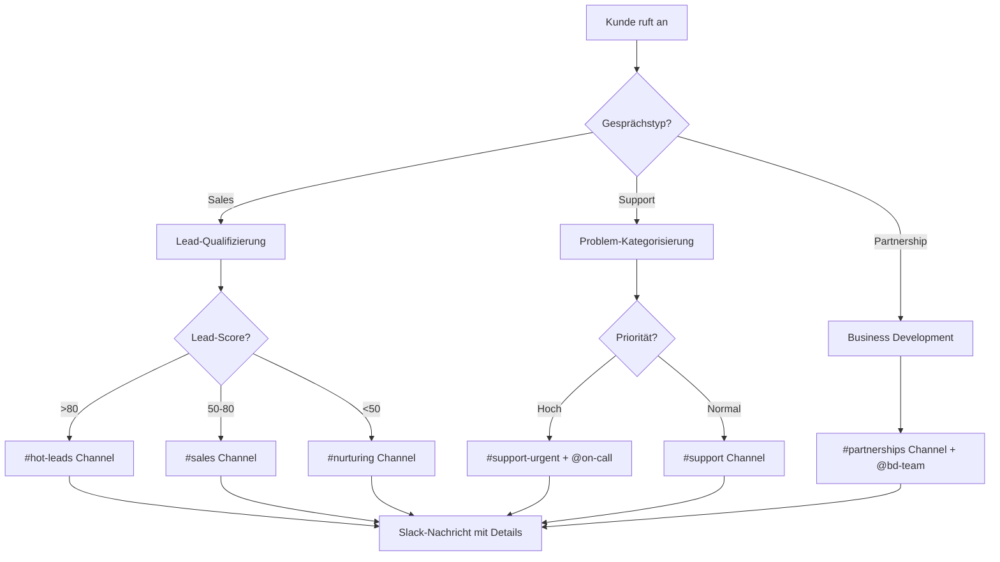
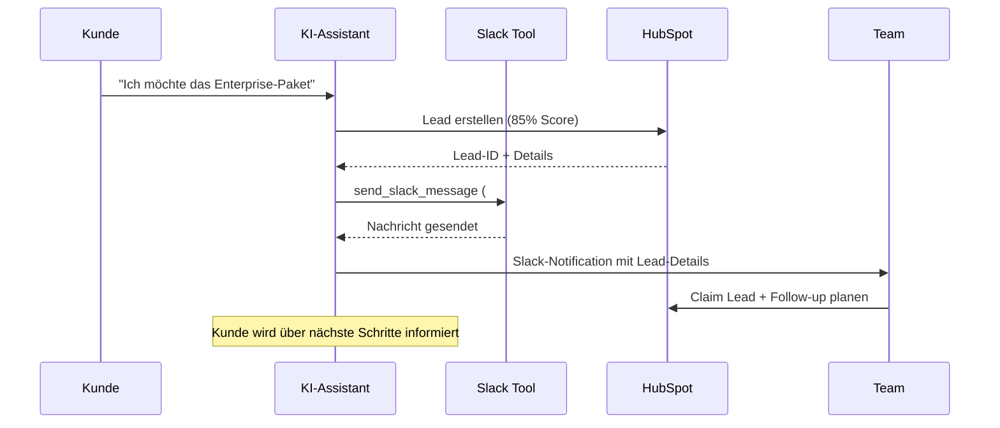

# Slack Integration Template

Integrieren Sie Slack-Messaging in Ihre Mid-call Actions und ermöglichen Sie es Ihrem KI-Assistenten, während Kundengesprächem automatisch Nachrichten, Benachrichtigungen und Updates an die relevanten Team-Channels zu senden.

## Überblick & Funktionen

<CardGroup cols={2}>
  <Card title="Echtzeit-Team-Benachrichtigungen" icon="bell">
    - Sofortige Alerts bei wichtigen Kundenanfragen
    - Automatische Lead-Benachrichtigungen an Sales-Team
    - Support-Tickets direkt an entsprechende Channels
    - Eskalations-Nachrichten bei kritischen Issues
  </Card>
  <Card title="Smart Channel-Routing" icon="route">
    - Automatische Channel-Auswahl basierend auf Gesprächstyp
    - Rich-Text-Formatierung mit Slack Blocks
    - Erwähnung von spezifischen Team-Mitgliedern
    - Integration mit Slack-Workflows und Bots
  </Card>
</CardGroup>

## Slack App & Bot Setup

### 1. Slack App erstellen

<Steps>
  <Step title="Workspace Admin-Zugang">
    - Melden Sie sich als Workspace-Admin bei Slack an
    - Navigieren Sie zu [api.slack.com/apps](https://api.slack.com/apps)
    - Klicken Sie auf "Create New App"
  </Step>
  
  <Step title="App-Konfiguration">
    ```yaml
    App-Details:
      App Name: "Famulor Mid-Call Integration"
      Development Workspace: [Ihr Workspace]
      App Icon: Famulor Logo (optional)
      
    OAuth & Permissions:
      Bot Token Scopes erforderlich:
        - "chat:write"
        - "chat:write.public"
        - "channels:read"
        - "users:read"
    ```
  </Step>
  
  <Step title="Bot-Token generieren">
    ```yaml
    Installation:
      1. "Install to Workspace" klicken
      2. Berechtigungen bestätigen
      3. Bot User OAuth Token kopieren
      4. Token sicher speichern (beginnt mit "xoxb-")
    ```
  </Step>
  
  <Step title="Channel-Einladung">
    - Bot zu gewünschten Channels einladen: `/invite @Famulor`
    - Channel-IDs notieren für Konfiguration
    - Test-Nachricht senden zur Validierung
  </Step>
</Steps>

## Mid-call Action konfigurieren

### Konfiguration im Famulor Interface

<Tabs>
  <Tab title="Werkzeugdetails">
    | Feld | Wert |
    |------|------|
    | **Name*** | `Slack Nachricht senden` |
    | **Beschreibung** | "Sendet automatisch Nachrichten an Slack-Channels für Team-Koordination und Benachrichtigungen" |
    | **Funktionsname*** | `send_slack_message` |
    | **Funktionsbeschreibung*** | "Sendet eine Nachricht an einen Slack-Channel. Verwenden Sie dies für Team-Benachrichtigungen, Lead-Alerts oder wichtige Updates während des Gesprächs." |
    | **HTTP-Methode** | `POST` |
    | **Timeout (ms)** | `5000` |
    | **Endpoint*** | `https://slack.com/api/chat.postMessage` |
  </Tab>
  
  <Tab title="Header-Konfiguration">
    ```json
    {
      "Authorization": "Bearer {{SLACK_BOT_TOKEN}}",
      "Content-Type": "application/json",
      "User-Agent": "Famulor-MidCall-Slack/1.0"
    }
    ```
  </Tab>
  
  <Tab title="Request Body Template">
    ```json
    {
      "channel": "{channel}",
      "text": "{text}",
      "blocks": "{blocks}",
      "username": "Famulor Assistant",
      "icon_emoji": ":telephone_receiver:",
      "unfurl_links": false,
      "unfurl_media": false
    }
    ```
  </Tab>
</Tabs>

### Parameter-Schema

```json
{
  "type": "object",
  "properties": {
    "channel": {
      "type": "string",
      "description": "Channel-ID oder Name (z.B. '#general', '#sales', oder 'C1234567890')",
      "examples": ["#general", "#sales", "C1234567890"]
    },
    "text": {
      "type": "string", 
      "description": "Die zu sendende Nachricht (Plain Text oder mit Markdown-Formatierung)"
    },
    "blocks": {
      "type": "array",
      "description": "Rich-Text Blocks für erweiterte Formatierung (optional)",
      "items": {
        "type": "object"
      }
    },
    "thread_ts": {
      "type": "string",
      "description": "Timestamp einer Nachricht für Thread-Antwort (optional)"
    },
    "reply_broadcast": {
      "type": "boolean",
      "description": "Thread-Antwort auch im Channel anzeigen (optional)",
      "default": false
    }
  },
  "required": ["channel", "text"]
}
```

## Praktische Anwendungsszenarien

### Szenario 1: Lead-Benachrichtigung

<Steps>
  <Step title="Lead-Erkennung">
    ```yaml
    Trigger: KI erkennt qualifizierten Lead im Gespräch
    
    Nachricht-Template:
      "🎯 Neuer qualifizierter Lead!
       
       👤 Name: Max Mustermann
       🏢 Firma: Beispiel GmbH
       📧 E-Mail: max@beispiel.de
       📊 Score: 85/100
       💰 Budget: ~50k€
       
       @sales-team"
    ```
  </Step>
  
  <Step title="Smart Channel-Routing">
    ```yaml
    Routing-Logik:
      Wenn Lead-Score > 80:
        → Channel: "#hot-leads"
        → Erwähnung: "@sales-manager"
      
      Wenn Lead-Score 50-80:
        → Channel: "#sales"
        → Erwähnung: "@sales-team"
      
      Wenn Budget > 100k:
        → Channel: "#enterprise"
        → Erwähnung: "@enterprise-team"
    ```
  </Step>
</Steps>

### Szenario 2: Support-Eskalation

<AccordionGroup>
  <Accordion title="Kritischer Bug-Report">
    **Automatische Support-Nachricht**:
    ```json
    {
      "channel": "#support-critical",
      "text": "🚨 Kritisches Problem gemeldet!",
      "blocks": [
        {
          "type": "section",
          "text": {
            "type": "mrkdwn",
            "text": "*Kunde:* Max Mustermann (Beispiel GmbH)\n*Problem:* System-Ausfall seit 2 Stunden\n*Priorität:* 🔴 HOCH"
          }
        },
        {
          "type": "actions",
          "elements": [
            {
              "type": "button",
              "text": {"type": "plain_text", "text": "Ticket öffnen"},
              "value": "create_ticket",
              "style": "danger"
            }
          ]
        }
      ]
    }
    ```
  </Accordion>
  
  <Accordion title="Terminabsage-Notification">
    **Business-Impact-Alert**:
    ```yaml
    Kontext: Kunde sagt wichtigen Termin ab
    
    Nachricht:
      "⚠️ Terminabsage - Handlungsbedarf
      
      📅 Termin: Demo für Enterprise Deal (50k€)
      👤 Kunde: Beispiel GmbH - Max Mustermann  
      📞 Grund: Budget eingefroren Q1
      ⏰ Nächste Aktion: Follow-up in Q2
      
      @account-manager - bitte alternative Termine prüfen"
    ```
  </Accordion>
</AccordionGroup>

### Szenario 3: Team-Koordination



## Response-Verarbeitung

### Erfolgreiche Nachricht

```json
{
  "ok": true,
  "channel": "C1234567890",
  "ts": "1640995200.000100",
  "message": {
    "type": "message",
    "subtype": "bot_message",
    "text": "Neuer Lead: Max Mustermann - Beispiel GmbH",
    "ts": "1640995200.000100",
    "username": "Famulor Assistant",
    "bot_id": "B12345"
  }
}
```

### Natürliche Sprachintegration

<Tabs>
  <Tab title="Agent-Nachrichten">
    **Vor API-Aufruf**: `"Ich sende die Information an das {{team}}-Team..."`
    
    **Beispiele**:
    - "Ich informiere unser Sales-Team über den neuen Lead..."
    - "Ich eskaliere das Problem an den Support..."
    - "Ich benachrichtige das Entwickler-Team über den Bug..."
  </Tab>
  
  <Tab title="Erfolgs-Bestätigungen">
    **Template**: `"Nachricht wurde an {{channel}} gesendet."`
    
    **Dynamische Antworten**:
    ```yaml
    Bei #sales Channel:
      "Das Sales-Team wurde über den Lead informiert."
    
    Bei #support Channel:
      "Ein Support-Ticket wurde erstellt und das Team benachrichtigt."
    
    Bei Thread-Antwort:
      "Antwort wurde in den bestehenden Thread eingefügt."
    ```
  </Tab>
</Tabs>

## Erweiterte Features

### Rich-Text-Formatting mit Blocks

<AccordionGroup>
  <Accordion title="Lead-Notification mit Buttons">
    ```json
    {
      "blocks": [
        {
          "type": "section",
          "text": {
            "type": "mrkdwn",
            "text": "*Neuer qualifizierter Lead!*\n\n:bust_in_silhouette: *Name:* Max Mustermann\n:office: *Firma:* Beispiel GmbH\n:chart_with_upwards_trend: *Score:* 85/100"
          }
        },
        {
          "type": "actions",
          "elements": [
            {
              "type": "button",
              "text": {"type": "plain_text", "text": "Lead übernehmen"},
              "value": "claim_lead",
              "style": "primary"
            },
            {
              "type": "button", 
              "text": {"type": "plain_text", "text": "Follow-up planen"},
              "value": "schedule_followup"
            }
          ]
        }
      ]
    }
    ```
  </Accordion>
  
  <Accordion title="Support-Ticket mit Priorität">
    ```json
    {
      "blocks": [
        {
          "type": "header",
          "text": {
            "type": "plain_text",
            "text": "🚨 Neues Support-Ticket"
          }
        },
        {
          "type": "section",
          "fields": [
            {"type": "mrkdwn", "text": "*Kunde:*\nMax Mustermann"},
            {"type": "mrkdwn", "text": "*Priorität:*\n🔴 Hoch"},
            {"type": "mrkdwn", "text": "*Problem:*\nAPI-Ausfall"},
            {"type": "mrkdwn", "text": "*Geschätzte Ausfallzeit:*\n2 Stunden"}
          ]
        },
        {
          "type": "divider"
        },
        {
          "type": "context",
          "elements": [
            {"type": "mrkdwn", "text": "📞 Anruf aktiv | 🕒 " + new Date().toLocaleString()}
          ]
        }
      ]
    }
    ```
  </Accordion>
</AccordionGroup>

### Multi-Channel-Broadcasting

<Tabs>
  <Tab title="Parallel-Benachrichtigungen">
    ```yaml
    Workflow für Critical-Issues:
      1. Primäre Nachricht: "#support-critical"
      2. Management-Info: "#management"  
      3. Developer-Alert: "#dev-team"
      4. Customer-Success: "#customer-success"
      
    Implementation:
      - Mehrere send_slack_message Calls
      - Angepasste Nachrichten pro Channel
      - Unterschiedliche @mentions
    ```
  </Tab>
  
  <Tab title="Thread-basierte Updates">
    ```yaml
    Follow-up-Nachrichten:
      Erstnachricht → Thread-ID speichern
      Updates → thread_ts Parameter verwenden
      
    Beispiel-Flow:
      1. "Lead erstellt" → Haupt-Nachricht
      2. "Demo geplant" → Thread-Antwort  
      3. "Deal closed" → Thread-Antwort mit Broadcast
    ```
  </Tab>
</Tabs>

## Fehlerbehandlung

### Häufige Probleme

<AccordionGroup>
  <Accordion title="Channel nicht gefunden (channel_not_found)">
    ```yaml
    Ursache: Bot nicht zum Channel eingeladen oder falscher Channel-Name
    
    Fallback: "Die Team-Benachrichtigung konnte nicht gesendet werden. 
              Ich dokumentiere die Information für manuelle Weiterleitung."
    
    Lösung:
      - Bot zum Channel einladen: /invite @Famulor
      - Channel-ID statt Name verwenden
      - Permissions überprüfen
    ```
  </Accordion>
  
  <Accordion title="Token ungültig (invalid_auth)">
    ```yaml
    Ursache: Bot-Token abgelaufen oder ungültig
    
    Graceful Handling:
      "Die Slack-Integration ist momentan nicht verfügbar. 
       Ich notiere die wichtigen Informationen für das Team."
    
    Action: Admin-Benachrichtigung über Token-Problem
    ```
  </Accordion>
  
  <Accordion title="Rate Limiting (rate_limited)">
    ```yaml
    Slack Limits:
      - Tier 1: 1+ Nachricht pro Sekunde
      - Tier 2: 20+ Nachrichten pro Minute
      - Tier 3: 50+ Nachrichten pro Minute
    
    Handling:
      - Exponential Backoff
      - Message-Queuing implementieren
      - Prioritäts-basierte Verzögerung
    ```
  </Accordion>
</AccordionGroup>

## Performance & Best Practices

### Nachricht-Optimierung

<CardGroup cols={2}>
  <Card title="Relevante Informationen" icon="filter">
    **Do's**:
    - Nur geschäftskritische Nachrichten
    - Klare, actionable Inhalte  
    - Kontext für Entscheidungen
    
    **Don'ts**:
    - Spam-artige Benachrichtigungen
    - Redundante Informationen
    - Reine Statistik-Updates
  </Card>
  <Card title="Timing & Frequenz" icon="clock">
    **Intelligente Verzögerung**:
    - Nicht während Meetings
    - Batch-Updates statt Einzelnachrichten
    - Zeitzonenberücksichtigung
    
    **Eskalations-Regeln**:
    - Sofort: Kritische Issues
    - 5 Min: Wichtige Leads
    - 15 Min: Standard-Updates
  </Card>
</CardGroup>

## Integration mit anderen Tools

### CRM-Sync-Workflows



## Analytics & Monitoring

### KPIs für Slack-Integration

| Metrik | Beschreibung | Zielwert |
|--------|-------------|----------|
| **Message Success Rate** | % erfolgreich gesendeter Nachrichten | &gt;99% |
| **Response Time** | Zeit bis Team auf Slack-Alert reagiert | &lt;5 Minuten |
| **Conversion Rate** | Slack-Leads → geschlossene Deals | &gt;15% |
| **Team Engagement** | Interaktion mit Bot-Nachrichten | &gt;80% |

### Reporting Dashboard

<Steps>
  <Step title="Message Analytics">
    - Anzahl Nachrichten pro Channel/Tag
    - Erfolgreichste Nachrichtentypen
    - Peak-Hours für Benachrichtigungen
  </Step>
  
  <Step title="Business Impact">
    - Lead-Conversion-Rate via Slack
    - Support-Response-Zeiten
    - Team-Produktivitäts-Metriken
  </Step>
  
  <Step title="Optimization Insights">
    - Häufigste Fehlertypen
    - Ungenutzte Channels identifizieren
    - Message-Template-Performance
  </Step>
</Steps>

---

<Warning>
**Datenschutz-Hinweis**: Stellen Sie sicher, dass sensible Kundendaten nur in privaten Channels geteilt werden und Ihr Slack-Workspace den Unternehmens-Compliance-Richtlinien entspricht.
</Warning>

<Info>
**Pro-Tipp**: Beginnen Sie mit einem dedizierten Test-Channel für die Slack-Integration, bevor Sie sie in produktiven Channels verwenden. Dies hilft beim Fine-Tuning der Nachrichten-Templates und -Frequenz.
</Info>
