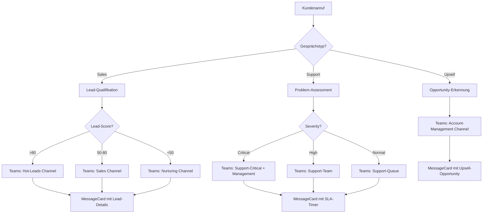

# Microsoft Teams Integration Template

Integrieren Sie Microsoft Teams Messaging in Ihre Mid-Call-Tools und ermöglichen Sie es Ihrem KI-Assistenten, während Kundengesprächem automatisch Nachrichten und Updates an Teams-Channels zu senden - perfekt für Enterprise-Umgebungen.

## Überblick & Funktionen

<CardGroup cols={2}>
  <Card title="Enterprise-Team-Kommunikation" icon="building">
    - Automatische Benachrichtigungen an Teams-Channels
    - Rich-Card-Formatierung für professionelle Darstellung
    - Integration in bestehende Microsoft 365 Workflows
    - Compliance-konforme Unternehmens-Kommunikation
  </Card>
  <Card title="Adaptive Cards & Webhooks" icon="webhook">
    - Webhook-basierte Integration (keine App-Installation nötig)
    - Adaptive Cards für interaktive Nachrichten
    - Farbkodierung für Prioritäten und Kategorien
    - Links zu SharePoint, Power BI und anderen MS-Tools
  </Card>
</CardGroup>

## Teams Webhook Setup

### 1. Incoming Webhook erstellen

<Steps>
  <Step title="Teams-Channel vorbereiten">
    - Öffnen Sie Microsoft Teams
    - Navigieren Sie zum gewünschten Channel (z.B. "Sales", "Support")
    - Klicken Sie auf "..." (Mehr Optionen) neben dem Channel-Namen
  </Step>
  
  <Step title="Webhook konfigurieren">
    ```yaml
    Webhook-Setup:
      1. "Connectors" → "Configure" wählen
      2. Nach "Incoming Webhook" suchen
      3. "Add" → "Configure" klicken
      4. Webhook-Details eingeben:
         - Name: "Famulor Mid-Call Integration"
         - Bild: Famulor Logo (optional)
         - Beschreibung: "Automatische Benachrichtigungen aus Kundengesprächem"
    ```
  </Step>
  
  <Step title="Webhook-URL sichern">
    ```yaml
    Nach der Konfiguration:
      1. Webhook-URL kopieren (sehr lang, beginnt mit https://...)
      2. URL sicher speichern - wird als {{TEAMS_WEBHOOK_URL}} verwendet
      3. Test-Nachricht senden zur Validierung
      
    Format: https://outlook.office.com/webhook/abc.../IncomingWebhook/def.../ghi...
    ```
  </Step>
  
  <Step title="Berechtigungen validieren">
    - Webhook funktioniert für alle Channel-Mitglieder
    - Keine zusätzlichen App-Berechtigungen nötig
    - Nachrichten erscheinen als "Famulor Mid-Call Integration"
  </Step>
</Steps>

## Mid-Call-Tool konfigurieren

### Konfiguration im Famulor Interface

<Tabs>
  <Tab title="Werkzeugdetails">
    | Feld | Wert |
    |------|------|
    | **Name*** | `Microsoft Teams Nachricht` |
    | **Beschreibung** | "Sendet automatisch formatierte Nachrichten an Microsoft Teams-Channels für Enterprise-Team-Koordination" |
    | **Funktionsname*** | `send_teams_message` |
    | **Funktionsbeschreibung*** | "Sendet eine Nachricht an einen Teams-Channel via Webhook. Verwenden Sie dies für wichtige Business-Updates, Lead-Benachrichtigungen oder Support-Eskalationen." |
    | **HTTP-Methode** | `POST` |
    | **Timeout (ms)** | `5000` |
    | **Endpoint*** | `{{TEAMS_WEBHOOK_URL}}` |
  </Tab>
  
  <Tab title="Header-Konfiguration">
    ```json
    {
      "Content-Type": "application/json",
      "User-Agent": "Famulor-MidCall-Teams/1.0"
    }
    ```
    
    <Info>**Hinweis**: Teams Webhooks benötigen keine Authorization-Header - die URL selbst dient als Authentifizierung.</Info>
  </Tab>
  
  <Tab title="Request Body Template">
    ```json
    {
      "@type": "MessageCard",
      "@context": "https://schema.org/extensions",
      "title": "{title}",
      "summary": "{title}",
      "text": "{message}",
      "themeColor": "{color}",
      "sections": [
        {
          "activityTitle": "Famulor Mid-Call Assistant",
          "activitySubtitle": "Live-Gespräch Update",
          "facts": [
            {
              "name": "Zeit:",
              "value": "{timestamp}"
            },
            {
              "name": "Typ:",
              "value": "{call_type}"
            }
          ]
        }
      ]
    }
    ```
  </Tab>
</Tabs>

### Parameter-Schema

```json
{
  "type": "object",
  "properties": {
    "title": {
      "type": "string",
      "description": "Nachrichtentitel (wird prominent angezeigt)",
      "examples": ["Neuer qualifizierter Lead", "Support-Eskalation", "Deal Update"]
    },
    "message": {
      "type": "string", 
      "description": "Hauptinhalt der Nachricht (unterstützt Markdown-Formatierung)"
    },
    "color": {
      "type": "string",
      "description": "Theme-Farbe als Hex-Code für visuelle Kategorisierung",
      "default": "0078D4",
      "examples": ["0078D4", "28A745", "DC3545", "FFC107"]
    },
    "call_type": {
      "type": "string",
      "enum": ["Sales", "Support", "Partnership", "General"],
      "description": "Art des Gesprächs für Kategorisierung",
      "default": "General"
    },
    "priority": {
      "type": "string",
      "enum": ["Low", "Normal", "High", "Critical"],
      "description": "Prioritätsstufe für Farbkodierung",
      "default": "Normal"
    },
    "timestamp": {
      "type": "string",
      "description": "Zeitstempel des Gesprächs (wird automatisch generiert)",
      "format": "date-time"
    }
  },
  "required": ["title", "message"]
}
```

## Praktische Anwendungsszenarien

### Szenario 1: Sales-Lead-Benachrichtigung

<AccordionGroup>
  <Accordion title="Enterprise-Lead-Alert">
    **MessageCard-Template für High-Value-Lead**:
    ```json
    {
      "@type": "MessageCard",
      "@context": "https://schema.org/extensions",
      "title": "🎯 Neuer Enterprise-Lead",
      "summary": "Qualifizierter Lead mit hohem Potenzial",
      "text": "Ein neuer qualifizierter Lead wurde während des Live-Gesprächs identifiziert.",
      "themeColor": "28A745",
      "sections": [
        {
          "activityTitle": "Lead-Details",
          "activitySubtitle": "Sofortige Bearbeitung empfohlen",
          "facts": [
            {"name": "Kontakt:", "value": "Max Mustermann"},
            {"name": "Unternehmen:", "value": "Beispiel AG"},
            {"name": "E-Mail:", "value": "max@beispiel.de"},
            {"name": "Lead-Score:", "value": "92/100"},
            {"name": "Geschätztes Volumen:", "value": "€150.000"},
            {"name": "Zeitrahmen:", "value": "Q1 2024"}
          ]
        }
      ],
      "potentialAction": [
        {
          "@type": "OpenUri",
          "name": "CRM öffnen",
          "targets": [{"os": "default", "uri": "https://your-crm.com/leads/12345"}]
        },
        {
          "@type": "HttpPOST",
          "name": "Lead übernehmen",
          "target": "https://your-api.com/leads/claim/12345"
        }
      ]
    }
    ```
  </Accordion>
  
  <Accordion title="Prioritäts-basierte Farbkodierung">
    ```yaml
    Farbschema für verschiedene Prioritäten:
      
      Critical (Kritisch):
        Farbe: "DC3545" (Rot)
        Beispiel: System-Ausfall, Großkunden-Beschwerde
        
      High (Hoch):
        Farbe: "FF6B00" (Orange) 
        Beispiel: Hot Lead >100k€, Eskalation Manager
        
      Normal:
        Farbe: "0078D4" (Microsoft Blau)
        Beispiel: Standard-Leads, Info-Updates
        
      Success:
        Farbe: "28A745" (Grün)
        Beispiel: Deal closed, Problem gelöst
    ```
  </Accordion>
</AccordionGroup>

### Szenario 2: Support-Ticket-Eskalation

<Tabs>
  <Tab title="Kritischer Support-Fall">
    ```json
    {
      "@type": "MessageCard",
      "@context": "https://schema.org/extensions", 
      "title": "🚨 Kritisches Support-Ticket",
      "summary": "Sofortige Aufmerksamkeit erforderlich",
      "text": "Ein kritisches Problem wurde während des Kundengesprächs gemeldet und erfordert sofortige Bearbeitung.",
      "themeColor": "DC3545",
      "sections": [
        {
          "activityTitle": "Problem-Details",
          "activitySubtitle": "SLA: 1 Stunde Response-Zeit",
          "facts": [
            {"name": "Kunde:", "value": "Beispiel AG"},
            {"name": "Kontakt:", "value": "Max Mustermann"},
            {"name": "Problem:", "value": "API-Gateway nicht erreichbar"},
            {"name": "Betroffene Services:", "value": "Produktionsumgebung"},
            {"name": "Geschätzte Ausfallzeit:", "value": "30 Minuten"},
            {"name": "Business Impact:", "value": "Hoch - Revenue-kritisch"}
          ]
        },
        {
          "activityTitle": "Nächste Schritte",
          "facts": [
            {"name": "Zugewiesen an:", "value": "@DevOps-Team"},
            {"name": "Ticket-ID:", "value": "#SUP-2024-0123"},
            {"name": "Priorität:", "value": "P1 - Kritisch"}
          ]
        }
      ],
      "potentialAction": [
        {
          "@type": "OpenUri",
          "name": "Ticket öffnen", 
          "targets": [{"os": "default", "uri": "https://support.company.com/tickets/SUP-2024-0123"}]
        }
      ]
    }
    ```
  </Tab>
  
  <Tab title="Automatische Team-Mentions">
    ```yaml
    Teams-Mention-Integration:
      
    In MessageCard-Text:
      "text": "<at>DevOps Team</at> - Sofortige Aufmerksamkeit erforderlich!"
      
    Erweiterte Mentions:
      - Benutzer: "<at>Max Mustermann</at>"
      - Teams: "<at>Support-Team</at>" 
      - Channel: "<at>Channel Name</at>"
      
    Hinweis: Teams-Webhooks unterstützen @mentions in MessageCards begrenzt
    ```
  </Tab>
</Tabs>

### Szenario 3: Business-Intelligence-Updates



## Response-Verarbeitung & Erfolg

### Erfolgreiche Nachricht

```
Status: 200 OK
Body: "1" (Teams antwortet nur mit "1" bei Erfolg)
```

### Natürliche Sprachintegration

<AccordionGroup>
  <Accordion title="Agent-Nachrichten vor API-Aufruf">
    **Template**: `"Ich sende die Information an Microsoft Teams..."`
    
    **Kontextuelle Beispiele**:
    ```yaml
    Bei Sales-Lead:
      "Ich informiere das Sales-Team über diesen qualifizierten Lead..."
    
    Bei Support-Issue:
      "Ich eskaliere das Problem an das Support-Team in Microsoft Teams..."
    
    Bei Partnership-Anfrage:
      "Ich leite die Partnership-Anfrage an das Business Development Team weiter..."
    ```
  </Accordion>
  
  <Accordion title="Erfolgsbestätigungen">
    **Template**: `"Nachricht wurde an Teams gesendet."`
    
    **Erweiterte Bestätigungen**:
    ```yaml
    Mit Priorität:
      "Kritische Benachrichtigung wurde an das Team gesendet."
    
    Mit Follow-up:
      "Das Team wurde benachrichtigt und wird sich innerhalb von [SLA-Zeit] melden."
    
    Mit Action Items:
      "Teams-Benachrichtigung gesendet - das Team kann direkt vom Chat aus reagieren."
    ```
  </Accordion>
</AccordionGroup>

## Erweiterte MessageCard-Features

### Interaktive Elemente

<AccordionGroup>
  <Accordion title="Action Buttons">
    ```json
    {
      "potentialAction": [
        {
          "@type": "OpenUri",
          "name": "CRM öffnen",
          "targets": [
            {"os": "default", "uri": "https://crm.company.com/lead/12345"}
          ]
        },
        {
          "@type": "HttpPOST", 
          "name": "Lead übernehmen",
          "target": "https://api.company.com/leads/claim",
          "body": "{\"lead_id\": \"12345\", \"user\": \"{{user}}\"}"
        },
        {
          "@type": "ActionCard",
          "name": "Notiz hinzufügen",
          "inputs": [
            {
              "@type": "TextInput",
              "id": "note",
              "title": "Ihre Notiz",
              "isMultiline": true
            }
          ],
          "actions": [
            {
              "@type": "HttpPOST",
              "name": "Speichern",
              "target": "https://api.company.com/leads/note"
            }
          ]
        }
      ]
    }
    ```
  </Accordion>
  
  <Accordion title="Multi-Section-Layout">
    ```json
    {
      "sections": [
        {
          "activityTitle": "Lead-Informationen",
          "activitySubtitle": "Primäre Kontaktdaten",
          "activityImage": "https://company.com/images/lead-icon.png",
          "facts": [
            {"name": "Name:", "value": "Max Mustermann"},
            {"name": "Firma:", "value": "Beispiel AG"}
          ]
        },
        {
          "activityTitle": "Qualifikation",
          "activitySubtitle": "BANT-Bewertung",
          "facts": [
            {"name": "Budget:", "value": "€100k+ bestätigt"},
            {"name": "Authority:", "value": "Entscheidungsbefugnis"},
            {"name": "Need:", "value": "Akuter Bedarf"},
            {"name": "Timeline:", "value": "Q1 2024"}
          ]
        }
      ]
    }
    ```
  </Accordion>
</AccordionGroup>

## Microsoft 365 Integration

### SharePoint & Power BI Links

<Tabs>
  <Tab title="SharePoint-Dokumente">
    ```json
    {
      "potentialAction": [
        {
          "@type": "OpenUri",
          "name": "Sales-Unterlagen öffnen",
          "targets": [
            {
              "os": "default", 
              "uri": "https://company.sharepoint.com/sites/sales/Documents/Proposals/"
            }
          ]
        },
        {
          "@type": "OpenUri", 
          "name": "Kundenhistorie",
          "targets": [
            {
              "os": "default",
              "uri": "https://company.sharepoint.com/sites/crm/Lists/Customers/"
            }
          ]
        }
      ]
    }
    ```
  </Tab>
  
  <Tab title="Power BI Dashboards">
    ```yaml
    Dashboard-Integration:
      Sales-Performance: "https://app.powerbi.com/groups/.../reports/sales-dashboard"
      Support-Metrics: "https://app.powerbi.com/groups/.../reports/support-metrics"
      Customer-Analytics: "https://app.powerbi.com/groups/.../reports/customer-insights"
    
    Dynamic-Links basierend auf call_type:
      Sales → Sales-Dashboard
      Support → Support-Metrics
      Partnership → Business-Development-Dashboard
    ```
  </Tab>
</Tabs>

## Fehlerbehandlung & Troubleshooting

### Häufige Probleme

<AccordionGroup>
  <Accordion title="Webhook URL ungültig (400 Bad Request)">
    ```yaml
    Ursachen:
      - Webhook wurde deaktiviert oder gelöscht
      - Falsche URL-Formatierung
      - Expired Webhook-Konfiguration
    
    Lösungsschritte:
      1. Teams-Channel prüfen
      2. Webhook-Konfiguration erneuern  
      3. Neue URL in Tool-Konfiguration aktualisieren
      
    Fallback-Nachricht:
      "Die Teams-Benachrichtigung konnte nicht zugestellt werden. 
       Das Team wird manuell informiert."
    ```
  </Accordion>
  
  <Accordion title="MessageCard-Format-Fehler">
    ```yaml
    Häufige Formatfehler:
      - Ungültiges JSON
      - Fehlende @type oder @context
      - Zu lange title/text-Felder
      - Ungültige Action-Definitionen
    
    Debugging:
      - MessageCard-Validator verwenden
      - Payload-Größe prüfen (max 28KB)
      - Spezialzeichen escapen
    
    Fallback:
      Einfache Text-Nachricht ohne erweiterte Features
    ```
  </Accordion>
</AccordionGroup>

## Performance & Monitoring

### Teams-spezifische Metriken

| Metrik | Beschreibung | Zielwert |
|--------|-------------|----------|
| **Webhook Success Rate** | % erfolgreich zugestellter Nachrichten | &gt;99.5% |
| **Message Delivery Time** | Zeit bis Nachricht in Teams erscheint | &lt;2 Sekunden |
| **Action Button Usage** | % der Nachrichten mit Button-Interaktion | &gt;60% |
| **Webhook Uptime** | Verfügbarkeit der Webhook-Endpoints | &gt;99.9% |

### Business Impact Tracking

<Steps>
  <Step title="Reaktionszeiten messen">
    ```yaml
    KPIs:
      - Zeit bis zur ersten Team-Reaktion auf Alert
      - Durchschnittliche Problem-Lösungszeit
      - Lead-Response-Zeit nach Teams-Benachrichtigung
    ```
  </Step>
  
  <Step title="Engagement-Analyse">
    ```yaml
    Metriken:
      - Anzahl Button-Clicks pro MessageCard-Typ
      - Häufigste Action-Types
      - Team-Member-Participation-Rate
    ```
  </Step>
</Steps>

## Enterprise-Compliance

### Sicherheits-Überlegungen

<AccordionGroup>
  <Accordion title="Datenklassifizierung">
    ```yaml
    Sensitivity-Labels für Teams-Nachrichten:
      Public: Allgemeine Benachrichtigungen
      Internal: Team-spezifische Updates
      Confidential: Kundendaten mit Lead-Informationen
      Highly Confidential: Kritische Business-Intelligence
    
    Implementation:
      - Webhook-URLs nach Sensitivity-Level trennen
      - Verschiedene Teams-Channels für verschiedene Classifications
      - Automatische Data-Loss-Prevention-Checks
    ```
  </Accordion>
  
  <Accordion title="Audit & Compliance">
    ```yaml
    Microsoft 365 Compliance-Features:
      - Message-Retention-Policies
      - eDiscovery für Teams-Nachrichten
      - Communication-Compliance-Monitoring
      - Data-Loss-Prevention (DLP)
    
    Logging:
      - Alle Webhook-Calls in Audit-Log
      - Message-Content-Classification
      - User-Interaction-Tracking
    ```
  </Accordion>
</AccordionGroup>

---

<Warning>
**Enterprise-Hinweis**: Stellen Sie sicher, dass Ihre Teams-Webhooks den IT-Security-Richtlinien Ihres Unternehmens entsprechen und regelmäßig auf Sicherheitslücken überprüft werden.
</Warning>

<Info>
**Integration-Tipp**: Verwenden Sie verschiedene Webhook-URLs für verschiedene Channel-Typen (Sales, Support, etc.) um bessere Kontrolle über Nachrichten-Routing und -Formatierung zu haben.
</Info>
