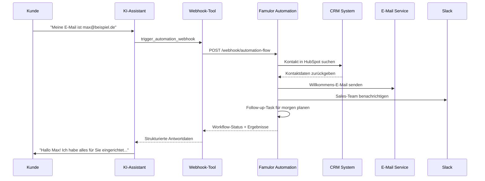
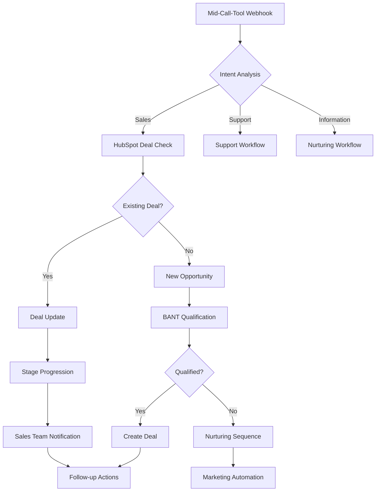

# Webhook-Integration mit Famulor Automation

Mid-Call-Tools können nicht nur direkte API-Calls ausführen, sondern auch über Webhooks mit der Famulor Automation Platform verbunden werden. Dies ermöglicht komplexe, mehrstufige Workflows und die Nutzung aller verfügbaren Integrationen der No-Code-Plattform.

## Überblick der Webhook-Integration

<CardGroup cols={2}>
  <Card title="Direkte API vs. Webhook" icon="arrows-split">
    **Direkter API-Call**: Einfache 1:1 Datenabfrage oder -übertragung
    
    **Webhook-Integration**: Komplexe Workflows mit mehreren Systemen, Datenverarbeitung und Geschäftslogik
  </Card>
  <Card title="Erweiterte Möglichkeiten" icon="magic">
    - Multi-System-Integrationen in einem Workflow
    - Bedingte Logik und Entscheidungsbäume
    - Datenaufbereitung und -transformation
    - Zeitverzögerte Aktionen und Follow-ups
  </Card>
</CardGroup>

## Funktionsweise



## Webhook-Tool konfigurieren

### 1. Basis-Konfiguration

<Tabs>
  <Tab title="Tool-Setup">
    | Parameter | Wert |
    |-----------|------|
    | **Funktionsname** | `trigger_famulor_automation` |
    | **Beschreibung** | "Startet einen Famulor Automation-Workflow mit Gesprächsdaten als Input. Verwenden Sie dies für komplexe Multi-System-Operationen." |
    | **HTTP-Methode** | `POST` |
    | **URL** | `https://app.famulor.de/api/webhook/automation/{flow_id}` |
    | **Timeout** | `15000ms` |
  </Tab>
  
  <Tab title="Headers">
    ```yaml
    Authorization: "Bearer FAMULOR_API_KEY"
    Content-Type: "application/json"
    X-Webhook-Source: "mid-call-tool"
    X-Conversation-ID: "{conversation_id}"
    ```
  </Tab>
</Tabs>

### 2. Request Body Template

```json
{
  "trigger_source": "mid_call_tool",
  "conversation_context": {
    "customer_email": "{email}",
    "customer_phone": "{phone}",
    "customer_name": "{full_name}",
    "company_name": "{company}",
    "conversation_summary": "{summary}",
    "detected_intent": "{intent}",
    "urgency_level": "{urgency}",
    "timestamp": "{current_timestamp}"
  },
  "workflow_parameters": {
    "lead_source": "phone_call",
    "follow_up_required": true,
    "priority": "{calculated_priority}",
    "assigned_team": "{team_assignment}"
  },
  "custom_data": {
    "budget_mentioned": "{budget_info}",
    "timeline_mentioned": "{timeline}",
    "pain_points": "{pain_points}",
    "competitor_mentioned": "{competitors}"
  }
}
```

### 3. Parameter-Schema

```json
{
  "type": "object",
  "properties": {
    "flow_id": {
      "type": "string",
      "description": "ID des Famulor Automation Workflows, der ausgeführt werden soll"
    },
    "email": {
      "type": "string",
      "format": "email",
      "description": "E-Mail-Adresse des Kunden"
    },
    "phone": {
      "type": "string", 
      "description": "Telefonnummer des Kunden"
    },
    "full_name": {
      "type": "string",
      "description": "Vollständiger Name des Kunden"
    },
    "company": {
      "type": "string",
      "description": "Firmenname des Kunden"
    },
    "summary": {
      "type": "string",
      "description": "Zusammenfassung der wichtigsten Gesprächspunkte"
    },
    "intent": {
      "type": "string",
      "enum": ["support", "sales", "information", "complaint", "partnership"],
      "description": "Erkannte Gesprächsabsicht"
    },
    "urgency": {
      "type": "string",
      "enum": ["low", "medium", "high", "critical"],
      "description": "Dringlichkeitsstufe basierend auf Gesprächsinhalt"
    },
    "calculated_priority": {
      "type": "string",
      "enum": ["low", "medium", "high"],
      "description": "Berechnete Priorität für Follow-up-Aktionen"
    },
    "team_assignment": {
      "type": "string",
      "enum": ["sales", "support", "success", "technical"],
      "description": "Empfohlenes Team für Follow-up"
    },
    "budget_info": {
      "type": "string",
      "description": "Erwähnte Budget-Informationen"
    },
    "timeline": {
      "type": "string", 
      "description": "Genannter Zeitrahmen oder Deadline"
    },
    "pain_points": {
      "type": "array",
      "items": {"type": "string"},
      "description": "Array der identifizierten Pain Points"
    },
    "competitors": {
      "type": "array",
      "items": {"type": "string"},
      "description": "Erwähnte Konkurrenten oder alternative Lösungen"
    }
  },
  "required": ["flow_id", "email", "summary", "intent"]
}
```

## Praxisbeispiele für Webhook-Workflows

### 1. Lead-Qualifizierung & -Routing

<AccordionGroup>
  <Accordion title="Workflow-Logik">
```yaml
Workflow-Name: "Smart Lead Processing"
Trigger: Webhook von Mid-Call-Tool

Schritte:
  1. Duplicate-Check in HubSpot
  2. Wenn neu → Lead erstellen
  3. Wenn bekannt → Kontakt-Historie abrufen
  4. Lead-Scoring basierend auf:
     - Firmengröße (Clearbit/LinkedIn)
     - Budgetangaben aus Gespräch
     - Urgency-Level
     - Bisherige Interaktionen
  5. Team-Assignment basierend auf Score:
     - >80: Enterprise Sales Team
     - 50-80: Standard Sales Team  
     - <50: Inside Sales/Nurturing
  6. Follow-up-Sequence starten:
     - E-Mail-Bestätigung an Kunde
     - Slack-Notification an Team
     - Task-Creation in CRM
     - Calendar-Invite für Follow-up-Call
```
  </Accordion>
  
  <Accordion title="Bedingte Verzweigungen">
```yaml
Bedingungen_im_Workflow:
  Wenn urgency == "critical":
    → Sofortige SMS an Sales Manager
    → Prioritäts-Flag in CRM setzen
    → Meeting innerhalb 4 Stunden buchen
  
  Wenn competitor_mentioned:
    → Competitive Intelligence Tool triggern
    → Battle Card an Sales-Rep senden
    → Pricing-Strategy-Alert
  
  Wenn budget > 100k:
    → Enterprise Team assignment
    → C-Level Executive als Contact Owner
    → Custom Demo-Environment bereitstellen
```
  </Accordion>
</AccordionGroup>

### 2. Customer Success Automation

<Tabs>
  <Tab title="Support-Ticket-Workflow">
    ```yaml
    Trigger: intent == "support"
    
    Workflow-Steps:
      1. HubSpot-Ticket erstellen
      2. Ähnliche Tickets suchen (Knowledge Base)
      3. Wenn FAQ-Lösung existiert:
         → Automated Response E-Mail
         → Ticket als "self-service" markieren
      4. Wenn komplex:
         → Technical Team assignment
         → SLA-Timer starten
         → Kunden-Benachrichtigung über Response-Zeit
      5. Integration mit:
         → Jira (für Bug-Tracking)
         → Confluence (Knowledge Base Update)
         → Slack (Team-Communication)
    ```
  </Tab>
  
  <Tab title="Onboarding-Automation">
    ```yaml
    Trigger: intent == "onboarding"
    
    Multi-System-Integration:
      1. Customer Success Platform:
         → Onboarding-Plan erstellen
         → Success Manager zuweisen
      2. E-Mail-Marketing:
         → Welcome-Serie starten
         → Resource-E-Mails senden
      3. Learning Management:
         → Training-Account erstellen
         → Kurse zuweisen
      4. Calendar:
         → Kickoff-Meeting buchen
         → Check-in-Termine setzen
      5. CRM-Updates:
         → Customer Journey Stage
         → Health Score initialisieren
    ```
  </Tab>
</Tabs>

### 3. Sales Opportunity Management



## Erweiterte Webhook-Konfigurationen

### Multi-Workflow-Orchestration

<AccordionGroup>
  <Accordion title="Parallel-Workflows">
    ```yaml
    Haupt-Workflow: "Customer Intake Processing"
    
    Parallel_ausgeführte_Sub-Workflows:
      1. CRM_Processing:
         - Lead/Contact Creation
         - Deal Management
         - Activity Logging
      
      2. Communication_Automation:
         - E-Mail Sequences
         - SMS Notifications
         - Slack Updates
      
      3. Data_Enrichment:
         - Company Information (Clearbit)
         - Social Media Profiles
         - Technographic Data
      
      4. Compliance_Processing:
         - DSGVO Consent Management
         - Data Retention Policies  
         - Audit Trail Creation
    ```
  </Accordion>
  
  <Accordion title="Sequential-Workflows mit Approval">
    ```yaml
    Workflow: "High-Value-Lead-Processing"
    
    Sequence:
      1. Initial_Processing:
         - Lead erstellen
         - Basic Enrichment
         - Score berechnen
      
      2. Approval_Gate:
         Wenn Lead-Score > 90:
           → Manager Approval erforderlich
           → Hold bis Approval
         Sonst:
           → Direct Processing
      
      3. Post_Approval:
         - Enterprise Team Assignment
         - Premium Onboarding initiieren
         - Executive Sponsor definieren
      
      4. Follow_up:
         - 24h Check-in
         - Weekly Status Updates
         - Quarterly Business Reviews planen
    ```
  </Accordion>
</AccordionGroup>

### Error Handling & Retry Logic

<Tabs>
  <Tab title="Retry-Mechanismen">
    ```yaml
    Retry-Konfiguration:
      Max_Retries: 3
      Backoff_Strategy: exponential
      Initial_Delay: 2s
      Max_Delay: 30s
      
    Retry-Bedingungen:
      - HTTP 429 (Rate Limiting)
      - HTTP 502/503 (Service Unavailable)
      - Timeout Errors
      - Network Connection Issues
    
    Fallback_bei_Final_Failure:
      - Error-Notification an Admin
      - Fallback auf einfachen Direct API Call
      - Manual Processing Queue
    ```
  </Tab>
  
  <Tab title="Partial Failure Handling">
    ```yaml
    Workflow_mit_Fehlerbehandlung:
      Step_1_CRM_Update:
        Success: Continue to Step 2
        Failure: Log Error, Continue with Fallback
      
      Step_2_Email_Send:
        Success: Continue to Step 3
        Failure: Retry 2x, dann Skip
      
      Step_3_Slack_Notification:
        Success: Workflow Complete
        Failure: Log Warning, Complete Anyway
    
    Compensation_Actions:
      Wenn kritische Steps fehlschlagen:
        → Alternative Notification Methods
        → Manual Task Creation
        → Admin Escalation
    ```
  </Tab>
</Tabs>

## Response-Verarbeitung

### Webhook Response Format

```json
{
  "workflow_id": "wf_12345",
  "execution_id": "exec_67890", 
  "status": "completed",
  "execution_time_ms": 3450,
  "results": {
    "lead_created": {
      "hubspot_contact_id": "12345",
      "lead_score": 85,
      "assigned_owner": "sales@beispiel.de"
    },
    "notifications_sent": {
      "email_confirmation": "sent",
      "slack_notification": "sent",
      "sms_alert": "skipped"
    },
    "follow_up_scheduled": {
      "task_id": "task_98765",
      "due_date": "2024-01-16T10:00:00Z",
      "assigned_to": "max.sales@beispiel.de"
    }
  },
  "errors": [],
  "warnings": [
    "SMS service temporarily unavailable"
  ]
}
```

### KI-Integration der Webhook-Results

```yaml
Natural_Language_Processing:
  Success_Response:
    "Perfekt! Ich habe Ihre Anfrage bearbeitet und ein Follow-up 
     für morgen um 10 Uhr eingeplant. Mein Kollege Max wird 
     sich bei Ihnen melden."
  
  Partial_Success:
    "Alles ist eingerichtet. Es gab einen kleinen technischen 
     Hinweis mit dem SMS-Service, aber die E-Mail-Bestätigung 
     haben Sie erhalten."
  
  Warning_Handling:
    "Ihre Anfrage wurde erfolgreich verarbeitet. Sollten Sie 
     nicht innerhalb der nächsten Stunde eine Bestätigung 
     erhalten, melden Sie sich gerne."
```

## Performance & Monitoring

### Webhook-Performance-Metriken

| Metrik | Zielwert | Kritischer Wert |
|--------|----------|-----------------|
| **Execution Time** | <5 Sekunden | >15 Sekunden |
| **Success Rate** | >95% | <85% |
| **Retry Rate** | <10% | >25% |
| **Partial Success Rate** | >98% | <90% |

### Monitoring & Alerting

<Steps>
  <Step title="Real-time Monitoring">
    ```yaml
    Dashboard-Metriken:
      - Webhook-Erfolgsrate
      - Durchschnittliche Execution Time
      - Error-Rate nach Workflow-Type
      - Queue-Größe bei High Load
    ```
  </Step>
  
  <Step title="Alerting-Rules">
    ```yaml
    Kritische_Alerts:
      - Success Rate <90% über 5 Minuten
      - Execution Time >10s für >10 Requests
      - Error Rate >20% über 2 Minuten
    
    Warning_Alerts:
      - Queue-Größe >50 Pending
      - Retry-Rate >15%
      - einzelne Workflow-Failures
    ```
  </Step>
</Steps>

## Best Practices

### Workflow-Design

<CardGroup cols={2}>
  <Card title="Idempotenz sicherstellen" icon="shield">
    - Workflows können mehrfach ausgeführt werden
    - Duplicate-Checks implementieren
    - State-Management für Retry-Szenarien
    - Transaktionale Operationen verwenden
  </Card>
  <Card title="Performance-Optimierung" icon="rocket">
    - Parallel ausführbare Steps identifizieren
    - Timeout-Werte angemessen setzen
    - Unnötige API-Calls vermeiden
    - Caching für häufige Abfragen nutzen
  </Card>
</CardGroup>

### Security Considerations

<AccordionGroup>
  <Accordion title="Webhook-Sicherheit">
    ```yaml
    Authentication:
      - Bearer Token für Famulor API
      - Webhook-Signatur-Verification
      - IP-Whitelisting für Webhook-Endpoints
      - Rate-Limiting für Webhook-Calls
    
    Data_Protection:
      - Sensitive Daten nicht in URL-Parametern
      - HTTPS für alle Webhook-Calls
      - Payload-Verschlüsselung bei Bedarf
      - Automatic PII-Redaction in Logs
    ```
  </Accordion>
  
  <Accordion title="Compliance & Auditability">
    ```yaml
    Audit_Trail:
      - Alle Webhook-Executions loggen
      - Data-Processing-Nachweise
      - User-Consent-Tracking
      - Retention-Policy-Compliance
    
    DSGVO_Considerations:
      - Right-to-Deletion unterstützen
      - Data-Minimization-Principles
      - Purpose-Limitation beachten
      - Cross-Border-Transfer-Controls
    ```
  </Accordion>
</AccordionGroup>

---

<Card title="Integration-Beispiele" icon="code">
Entdecken Sie praktische Webhook-Workflow-Beispiele:

- [Lead-to-Cash-Automation](/automation-platform/mid-call-tools/integration-templates/lead-to-cash-webhook)
- [Customer-Onboarding-Flow](/automation-platform/mid-call-tools/integration-templates/onboarding-webhook)
- [Support-Ticket-Automation](/automation-platform/mid-call-tools/integration-templates/support-webhook)
</Card>

<Info>
**Tipp**: Beginnen Sie mit einfachen Webhook-Workflows und erweitern Sie schrittweise. Die Famulor Automation Platform bietet umfangreiche Debugging-Tools, um Workflow-Executions zu verfolgen und zu optimieren.
</Info>

<Warning>
**Wichtiger Hinweis**: Webhook-Workflows können komplexe Geschäftsprozesse automatisieren. Testen Sie alle Workflows ausführlich in einer Staging-Umgebung, bevor Sie sie in der Produktion einsetzen.
</Warning>
