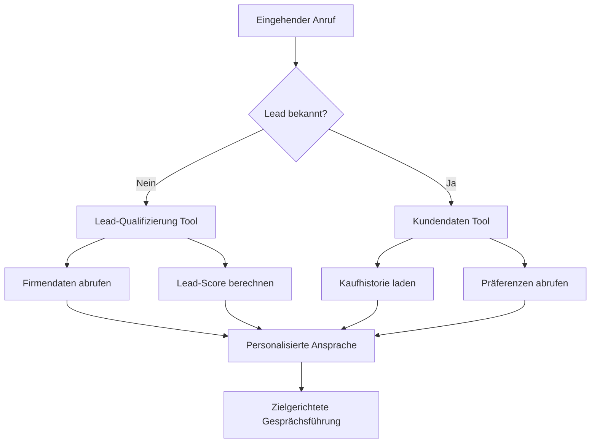
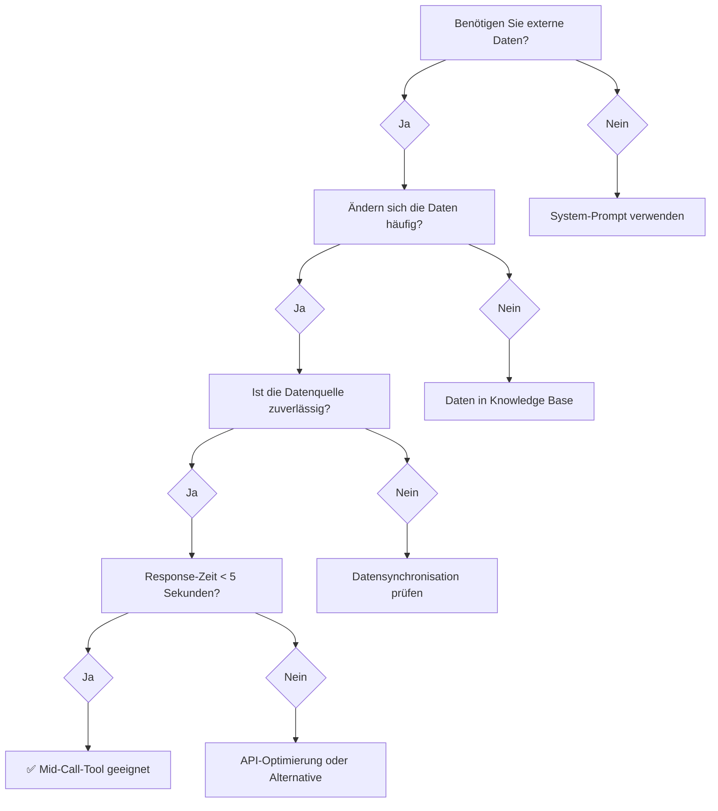

# Wann sollten Sie Mid-Call-Tools verwenden?

Mid-Call-Tools bieten den größten Mehrwert, wenn Ihre KI-Assistenten während Gesprächen auf externe Daten zugreifen müssen. Diese Seite hilft Ihnen zu identifizieren, wann der Einsatz sinnvoll ist und welche Szenarien am besten geeignet sind.

## Ideal geeignete Szenarien

### Kundenservice und Support

<CardGroup cols={2}>
  <Card title="Kontoverifizierung" icon="user-check">
    **Wann einsetzen**: Bei jeder Kundenanfrage wo Identitätsprüfung erforderlich ist
    
    **Typischer Ablauf**:
    - Kunde nennt E-Mail oder Kundennummer
    - Automatischer Abgleich mit CRM-System
    - Sofortige Bestätigung und Personalisierung
    
    **ROI**: Hoch - reduziert Bearbeitungszeit um 60-80%
  </Card>
  
  <Card title="Bestellstatus-Abfragen" icon="package">
    **Wann einsetzen**: Bei E-Commerce oder Versanddienstleistern
    
    **Typischer Ablauf**:
    - Kunde fragt nach Lieferstatus
    - Echtzeit-Abfrage bei Logistiksystem
    - Präzise Auskunft ohne Wartezeit
    
    **ROI**: Mittel-Hoch - eliminiert 40-60% der Support-Tickets
  </Card>
</CardGroup>

<AccordionGroup>
  <Accordion title="Technischer Support">
    **Optimale Anwendung**:
    - Abruf der Geräte-/Software-Konfiguration
    - Zugriff auf bekannte Probleme und Lösungen
    - Automatische Ticket-Erstellung mit Systemdaten
    
    **Messbare Vorteile**:
    - 70% weniger Rückfragen zur Systemkonfiguration
    - 45% schnellere Problemdiagnose
    - 25% Steigerung der First-Call-Resolution
  </Accordion>
  
  <Accordion title="Billing & Rechnungswesen">
    **Perfekt geeignet für**:
    - Rechnungsdetails und -historie abrufen
    - Zahlungsstatus in Echtzeit prüfen
    - Automatische Mahnungsbearbeitung
    
    **Geschäftsnutzen**:
    - Sofortige Klärung von Zahlungsfragen
    - Reduzierte Bearbeitungszeit um 50-70%
    - Automatisierte Zahlungsvereinbarungen
  </Accordion>
</AccordionGroup>

### Vertrieb und Lead-Management



<Tabs>
  <Tab title="Lead-Qualifizierung">
    **Ideale Szenarien**:
    - B2B-Vertrieb mit komplexen Entscheidungsprozessen
    - Hochwertige Produkte/Services mit längeren Sales-Zyklen
    - Multi-Stakeholder-Entscheidungen
    
    **Tool-Einsatz**:
    ```yaml
    Firmendatenbank-Abfrage:
      - Unternehmensgröße und -struktur
      - Branche und Marktposition
      - Technologie-Stack
      - Budget-Range
    
    Leadbewertung:
      - Automatischer BANT-Score
      - Buying-Intent-Analyse
      - Stakeholder-Mapping
    ```
  </Tab>
  
  <Tab title="Account-Based Sales">
    **Wann besonders wertvoll**:
    - Bestehende Kundenbeziehungen
    - Cross-Selling/Up-Selling-Opportunitäten
    - Enterprise-Accounts
    
    **Datenintegration**:
    ```yaml
    CRM-Integration:
      - Kontakthistorie und -präferenzen
      - Vergangene Käufe und Verträge
      - Open Opportunities
      - Support-Tickets und Zufriedenheit
    
    Personalisierung:
      - Individuelle Ansprache
      - Relevante Produktvorschläge
      - Terminkoordination mit Account-Team
    ```
  </Tab>
  
  <Tab title="Terminbuchung">
    **Optimale Einsatzgebiete**:
    - Beratungsdienstleistungen
    - Medizinische Praxen
    - Service-Termine
    
    **Workflow-Integration**:
    ```yaml
    Kalender-Tools:
      - Echtzeit-Verfügbarkeitscheck
      - Automatische Terminvorschläge
      - Sofortige Buchungsbestätigung
      - E-Mail/SMS-Benachrichtigungen
    
    CRM-Synchronisation:
      - Lead-Status-Update
      - Follow-up-Aufgaben
      - Team-Benachrichtigungen
    ```
  </Tab>
</Tabs>

### E-Commerce und Retail

<CardGroup cols={3}>
  <Card title="Produktberatung" icon="shopping-cart">
    **Anwendungsfall**: Kunde sucht spezifisches Produkt oder Beratung
    
    **Tool-Funktionen**:
    - Lagerbestandsabfrage
    - Produktspezifikationen
    - Preisvergleiche
    - Verfügbarkeit und Lieferzeiten
  </Card>
  
  <Card title="Bestellabwicklung" icon="credit-card">
    **Anwendungsfall**: Telefonische Bestellungen oder Änderungen
    
    **Tool-Funktionen**:
    - Warenkorb-Integration
    - Zahlungsabwicklung
    - Versandoptionen
    - Bestellbestätigung
  </Card>
  
  <Card title="After-Sales-Service" icon="headset">
    **Anwendungsfall**: Support nach dem Kauf
    
    **Tool-Funktionen**:
    - Garantieabfrage
    - Reparaturstatus
    - Ersatzteil-Verfügbarkeit
    - Return-Management
  </Card>
</CardGroup>

## Situationen, wo Mid-Call-Tools NICHT geeignet sind

### Vermeiden Sie den Einsatz bei:

<Warning>
**Einfache Informationsabfragen**: Wenn die benötigten Informationen statisch sind und sich selten ändern (z.B. Öffnungszeiten, allgemeine Firmeninfos), ist ein Mid-Call-Tool überdimensioniert.
</Warning>

<AccordionGroup>
  <Accordion title="Reine Informationsweitergabe">
    **Ungeeignete Szenarien**:
    - FAQ-ähnliche Anfragen
    - Standardisierte Produktinformationen
    - Allgemeine Unternehmensdaten
    
    **Bessere Alternative**: Diese Informationen direkt in den System-Prompt integrieren
  </Accordion>
  
  <Accordion title="Hochkomplexe Datenverarbeitung">
    **Problematische Situationen**:
    - Berechnungen die &gt;5 Sekunden dauern
    - Multi-System-Abfragen mit komplexer Logik
    - Datenanalysen mit großen Datenmengen
    
    **Warum problematisch**: Unterbricht den Gesprächsfluss und führt zu unbequemen Pausen
  </Accordion>
  
  <Accordion title="Instabile oder langsame APIs">
    **Risikofaktoren**:
    - APIs mit &gt;30% Ausfallrate
    - Durchschnittliche Antwortzeiten &gt;8 Sekunden
    - Systeme ohne SLA-Garantien
    
    **Konsequenzen**: Schlechte Kundenerfahrung und Frustration
  </Accordion>
</AccordionGroup>

## Entscheidungshilfe: Tool vs. Alternative

### Decision Tree für Mid-Call-Tool-Einsatz



### Bewertungsmatrix für Tool-Eignung

| Kriterium | Hoch geeignet | Mittel geeignet | Nicht geeignet |
|-----------|---------------|-----------------|----------------|
| **Datenaktualität** | Sekunden/Minuten | Stunden/Täglich | Wochen/Monate |
| **API-Response Zeit** | &lt;3 Sekunden | 3-7 Sekunden | &gt;7 Sekunden |
| **API-Zuverlässigkeit** | &gt;99% Uptime | 95-99% Uptime | &lt;95% Uptime |
| **Datenvolumen** | &lt;1MB | 1-5MB | &gt;5MB |
| **Nutzungshäufigkeit** | Täglich | Wöchentlich | Monatlich |
| **Geschäftskritikalität** | Hoch | Mittel | Niedrig |

## Implementation Roadmap

### Phase 1: Foundation (Woche 1-2)
<Steps>
  <Step title="Use Case Identifikation">
    - Analyse der häufigsten Kundenanfragen
    - Identifikation von Datenquellen
    - Bewertung des Automatisierungspotentials
  </Step>
  
  <Step title="System Assessment">
    - API-Dokumentation prüfen
    - Performance-Tests durchführen  
    - Sicherheitsanforderungen evaluieren
  </Step>
</Steps>

### Phase 2: Pilot Implementation (Woche 3-4)
<Steps>
  <Step title="Einfacher Use Case">
    - Start mit Read-Only-Operation
    - Beispiel: Kontaktdatenabfrage
    - Monitoring und Performance-Messung
  </Step>
  
  <Step title="Feedback Collection">
    - Kundenreaktionen bewerten
    - Technische Metriken analysieren
    - Optimierungsbedarf identifizieren
  </Step>
</Steps>

### Phase 3: Scale & Optimize (Woche 5-8)
<Steps>
  <Step title="Erweiterte Use Cases">
    - Write-Operationen einführen
    - Multi-System-Integrationen
    - Complex Workflows implementieren
  </Step>
  
  <Step title="Continuous Improvement">
    - A/B-Testing verschiedener Ansätze
    - Performance-Optimierung
    - Neue Integrationen evaluieren
  </Step>
</Steps>

## Kosten-Nutzen-Analyse

### Investitionsrechnung

<Tabs>
  <Tab title="Einmalige Kosten">
    ```yaml
    Entwicklung & Setup:
      - API-Integration: €2,000 - €8,000
      - Testing & QA: €1,000 - €3,000
      - Dokumentation: €500 - €1,500
      - Training: €500 - €2,000
    
    Gesamt: €4,000 - €14,500
    ```
  </Tab>
  
  <Tab title="Laufende Kosten">
    ```yaml
    Betrieb & Wartung:
      - API-Gebühren: €50 - €500/Monat
      - Monitoring: €30 - €200/Monat
      - Support: €100 - €800/Monat
      - Updates: €200 - €1,000/Quartal
    
    Monatlich: €180 - €1,500
    ```
  </Tab>
  
  <Tab title="Einsparungen">
    ```yaml
    Direkte Einsparungen:
      - Personalkosten: €2,000 - €10,000/Monat
      - Bearbeitungszeit: 40-70% Reduktion
      - Fehlerkosten: 50-80% Reduktion
      - Kundenzufriedenheit: +15-30%
    
    ROI: 3-12 Monate
    ```
  </Tab>
</Tabs>

## Nächste Schritte

<CardGroup cols={2}>
  <Card title="Template-Bibliothek erkunden" icon="template" href="/automation-platform/mid-call-tools/integration-templates/hubspot-kontakt-abruf">
    Starten Sie mit bewährten Integration-Templates für beliebte CRM-Systeme
  </Card>
  <Card title="Custom Integration planen" icon="code" href="/automation-platform/mid-call-tools/custom-api-integration">
    Entwickeln Sie maßgeschneiderte Lösungen für Ihre spezifischen Anforderungen
  </Card>
</CardGroup>

---

<Tip>
**Best Practice**: Beginnen Sie immer mit einem einfachen, risikoarmen Use Case und erweitern Sie schrittweise. Messen Sie kontinuierlich die Performance und Auswirkungen auf die Kundenerfahrung.
</Tip>
