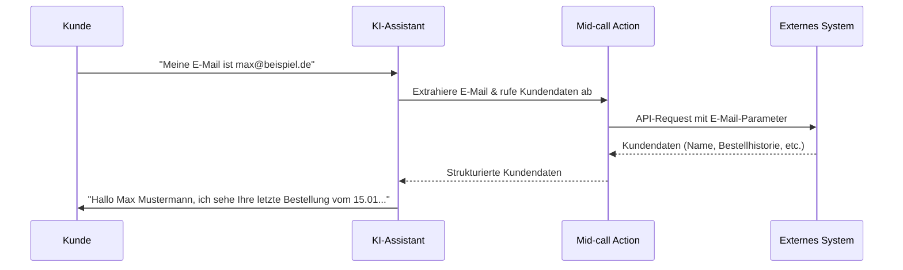
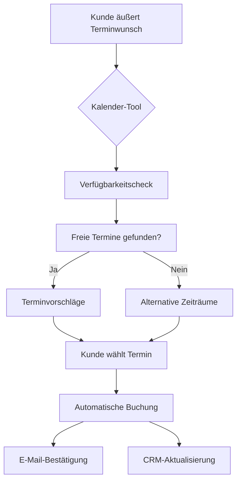

# Was sind Mid-call Actions?

Mid-call Actions sind spezialisierte Funktionen, die während aktiver Telefongespräche ausgeführt werden und Ihrem KI-Assistenten ermöglichen, in Echtzeit auf externe Systeme und Datenquellen zuzugreifen. Diese Tools transformieren statische Gesprächsführung in dynamische, datengesteuerte Interaktionen.

## Definition und Kernfunktionen

<CardGroup cols={2}>
  <Card title="Echtzeit-Datenintegration" icon="database">
    Zugriff auf Kunden- und Unternehmensdaten während des laufenden Gesprächs
  </Card>
  <Card title="API-basierte Konnektivität" icon="plug">
    Nahtlose Integration mit CRM-Systemen, Datenbanken und externen Services
  </Card>
  <Card title="Kontext-sensitive Verarbeitung" icon="brain">
    Automatische Extraktion und Verarbeitung von Gesprächsparametern
  </Card>
  <Card title="Dynamische Gesprächsanpassung" icon="comments">
    Personalisierung der Antworten basierend auf abgerufenen Daten
  </Card>
</CardGroup>

## Funktionsweise im Detail



## Vorteile und Mehrwert

### Für das Kundenerlebnis

<AccordionGroup>
  <Accordion title="Personalisierte Interaktionen">
    - **Sofortige Kundenerkennung**: "Ich sehe, Sie sind Max Mustermann von der Beispiel GmbH..."
    - **Kontextbezogene Antworten**: Berücksichtigung der Kundenhistorie und -präferenzen  
    - **Proaktive Problemlösung**: Zugriff auf Support-Tickets und bekannte Probleme
  </Accordion>
  
  <Accordion title="Reduzierte Wartezeiten">
    - **Eliminierung von Rückfragen**: Automatischer Zugriff auf relevante Informationen
    - **Verkürzte Gesprächsdauer**: Effiziente Datenabfrage ohne manuelle Suche
    - **First-Call-Resolution**: Lösung von Anfragen im ersten Gespräch
  </Accordion>
  
  <Accordion title="Konsistente Service-Qualität">
    - **Standardisierte Datenzugriffe**: Immer aktuelle und vollständige Informationen
    - **24/7-Verfügbarkeit**: Rund-um-die-Uhr-Zugriff auf alle Kundendaten
    - **Fehlerreduktion**: Minimierung manueller Eingabefehler
  </Accordion>
</AccordionGroup>

### Für Ihr Unternehmen

<CardGroup cols={3}>
  <Card title="Effizienzsteigerung" icon="rocket">
    Automatisierung wiederkehrender Datenabfragen und -verarbeitungen
  </Card>
  <Card title="Kostenreduktion" icon="coins">
    Weniger Personalaufwand durch automatisierte Informationsbeschaffung
  </Card>
  <Card title="Datenqualität" icon="shield-check">
    Immer aktuelle Daten direkt aus den Quellsystemen
  </Card>
</CardGroup>

## Typische Anwendungsszenarien

### Kundenservice & Support

| Szenario | Mid-call Action Aktion | Kundenvorteil |
|----------|---------------------|---------------|
| **Kontoabfrage** | Abruf der Kontodaten über Kunden-ID | Sofortige Bereitstellung des Kontostands |
| **Bestellstatus** | Prüfung der Bestellhistorie und Lieferstatus | Echzeit-Updates ohne Wartezeit |
| **Ticket-Verfolgung** | Zugriff auf Support-Ticket-System | Aktueller Status und nächste Schritte |
| **Produktverfügbarkeit** | Lagerbestandsabfrage | Sofortige Auskunft über Verfügbarkeit |

### Vertrieb & Leadqualifizierung

<Tabs>
  <Tab title="Leadbewertung">
    ```yaml
    Prozess:
      1. Automatische Firmendatenabfrage bei Nennung des Unternehmens
      2. Bewertung basierend auf Größe, Branche, Budget
      3. Dynamische Gesprächsführung je nach Lead-Score
      4. Automatische CRM-Aktualisierung mit Gesprächsnotizen
    ```
  </Tab>
  
  <Tab title="Terminbuchung">
    ```yaml
    Workflow:
      1. Verfügbarkeitscheck im Kalendersystem
      2. Automatische Terminvorschläge basierend auf Präferenzen
      3. Sofortige Buchungsbestätigung
      4. E-Mail-Versand mit Termininformationen
    ```
  </Tab>
  
  <Tab title="Preisabfrage">
    ```yaml
    Dynamik:
      1. Produktkonfigurator-Integration
      2. Kundensegment-spezifische Preisberechnung  
      3. Rabatt- und Aktionsberücksichtigung
      4. Sofortige Angebotserstellung
    ```
  </Tab>
</Tabs>

### Appointment Scheduling



## Technische Grundlagen

### Integration-Architectures

Mid-call Actions bieten zwei Haupt-Integrationsmöglichkeiten:

<CardGroup cols={2}>
  <Card title="Direkte API-Integration" icon="globe">
    - Standard HTTP/REST-APIs für einfache Datenabfragen
    - JSON-Datenformat für strukturierten Austausch
    - Sichere Authentifizierung über API-Keys oder OAuth
    - Ideal für 1:1-Operationen (Kontakt abrufen, Status prüfen)
  </Card>
  <Card title="Webhook-Integration mit Famulor Automation" icon="webhook">
    - Komplexe Multi-System-Workflows möglich
    - Bedingte Logik und Geschäftsregeln
    - Zeitverzögerte Aktionen und Follow-ups
    - Ideal für Prozess-Automatisierung und Datenorchestrierung
  </Card>
</CardGroup>

### Echtzeit-Verarbeitung

<AccordionGroup>
  <Accordion title="Performance-Features">
    - Timeout-Management für schnelle Reaktionszeiten
    - Asynchrone Datenverarbeitung 
    - Fehlerbehandlung und Fallback-Mechanismen
    - Caching für optimierte Performance
  </Accordion>
  
  <Accordion title="Webhook-Vorteile">
    - **Multi-System-Integration**: Ein Workflow kann mehrere APIs und Services orchestrieren
    - **Geschäftslogik**: Implementierung komplexer Entscheidungsbäume
    - **Skalierbarkeit**: Automatische Lastverteilung und Retry-Mechanismen
    - **No-Code-Konfiguration**: Workflows über visuelle Oberfläche erstellen
  </Accordion>
</AccordionGroup>

### Unterstützte Integrationen

<AccordionGroup>
  <Accordion title="CRM-Systeme">
    - **HubSpot**: Kontakte, Deals, Unternehmen, Tickets
    - **Salesforce**: Leads, Opportunities, Accounts, Cases  
    - **Pipedrive**: Personen, Organisationen, Deals, Aktivitäten
    - **Customizable**: Jedes System mit REST-API
  </Accordion>
  
  <Accordion title="Business Applications">
    - **Google Sheets**: Datenabfrage und -aktualisierung
    - **Microsoft Excel**: Online-Tabellen und -Berichte
    - **Notion**: Datenbanken und Dokumentenmanagement
    - **Airtable**: Strukturierte Datenbanken
  </Accordion>
  
  <Accordion title="Kommunikations-Tools">
    - **Slack**: Nachrichten und Benachrichtigungen
    - **Microsoft Teams**: Chat und Dateiaustausch
    - **WhatsApp Business**: Messaging-Integration
    - **E-Mail-Services**: Automatisierter E-Mail-Versand
  </Accordion>
  
  <Accordion title="Specialized Services">
    - **Kalendersysteme**: Terminbuchung und -verwaltung
    - **Zahlungssysteme**: Transaktionsstatus und -historie
    - **Inventar-Management**: Lagerbestände und Verfügbarkeit
    - **Custom APIs**: Maßgeschneiderte Geschäftslogik
  </Accordion>
</AccordionGroup>

## Sicherheit und Datenschutz

<Warning>
**Wichtiger Hinweis zur Datensicherheit**: Mid-call Actions verarbeiten sensible Kundendaten in Echtzeit. Stellen Sie sicher, dass alle integrierten Systeme den geltenden Datenschutzbestimmungen (DSGVO) entsprechen.
</Warning>

### Best Practices für sichere Implementierung

<Steps>
  <Step title="API-Authentifizierung">
    - Verwendung von sicheren API-Keys oder OAuth 2.0
    - Regelmäßige Rotation von Zugangsdaten
    - Minimale Berechtigungen (Principle of Least Privilege)
  </Step>
  
  <Step title="Datenminimierung">
    - Abruf nur der tatsächlich benötigten Informationen
    - Keine dauerhafte Speicherung sensibler Daten
    - Automatische Datenbereinigung nach Gesprächsende
  </Step>
  
  <Step title="Übertragungssicherheit">
    - Ausschließlich verschlüsselte HTTPS-Verbindungen
    - Validierung von SSL-Zertifikaten
    - Schutz vor Man-in-the-Middle-Angriffen
  </Step>
  
  <Step title="Error Handling">
    - Graceful Degradation bei API-Ausfällen
    - Keine Preisgabe sensibler Informationen in Fehlermeldungen
    - Logging und Monitoring für Sicherheitsaudits
  </Step>
</Steps>

## Performance und Optimierung

### Reaktionszeit-Optimierung

| Parameter | Empfohlener Wert | Kritischer Wert |
|-----------|------------------|-----------------|
| **API-Timeout** | 5 Sekunden | 10 Sekunden |
| **Datenübertragung** | < 2 MB | < 5 MB |
| **Verarbeitungszeit** | < 1 Sekunde | < 3 Sekunden |
| **Fallback-Zeit** | < 500ms | < 1 Sekunde |

### Caching-Strategien

<Tabs>
  <Tab title="Session-Cache">
    ```yaml
    Zweck: Wiederverwendung von Daten innerhalb eines Gesprächs
    Dauer: Bis Gesprächsende
    Anwendung: Kundendaten, Produktkataloge
    Vorteil: Reduzierte API-Calls, bessere Performance
    ```
  </Tab>
  
  <Tab title="Time-based Cache">  
    ```yaml
    Zweck: Temporäre Speicherung häufig abgerufener Daten
    Dauer: 5-15 Minuten
    Anwendung: Lagerbestände, Preislisten
    Vorteil: Aktualität bei geringerer Serverlast
    ```
  </Tab>
  
  <Tab title="Smart Invalidation">
    ```yaml
    Zweck: Intelligent Caches basierend auf Datenänderungen
    Trigger: Webhook-Benachrichtigungen
    Anwendung: CRM-Updates, Bestellstatusänderungen  
    Vorteil: Optimale Balance zwischen Performance und Aktualität
    ```
  </Tab>
</Tabs>

## Nächste Schritte

<CardGroup cols={3}>
  <Card title="Integration Templates ansehen" icon="template" href="/automation-platform/mid-call-actions/integration-templates/hubspot-kontakt-abruf">
    Erkunden Sie vorgefertigte Templates für beliebte CRM-Systeme und Services
  </Card>
  <Card title="Webhook-Automation" icon="webhook" href="/automation-platform/mid-call-actions/integration-templates/webhook-automation">
    Entdecken Sie komplexe Multi-System-Workflows über die Famulor Automation Platform
  </Card>
  <Card title="Eigene Tools erstellen" icon="code" href="/automation-platform/mid-call-actions/custom-api-integration">
    Lernen Sie, wie Sie maßgeschneiderte Mid-call Actions für Ihre spezifischen Anforderungen entwickeln
  </Card>
</CardGroup>

---

<Info>
**Tipp**: Beginnen Sie mit einfachen Read-Only-Integrationen (z.B. Kontaktdatenabfrage) bevor Sie komplexere Write-Operationen (z.B. Lead-Erstellung) implementieren.
</Info>
