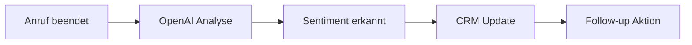

# KI & Machine Learning Integrationen

Nutzen Sie die Kraft modernster KI-Technologien, um Ihre Telefonassistenten noch intelligenter und effektiver zu machen. Famulor Automation bietet nahtlose Integrationen mit führenden KI-Plattformen für erweiterte Analyse, Verarbeitung und Entscheidungsfindung.

## OpenAI Integration

### Überblick
OpenAI bietet hochmoderne KI-Modelle für natürliche Sprachverarbeitung, Textgenerierung und -analyse. Die Integration ermöglicht es Ihren Telefonassistenten, komplexe Sprachaufgaben zu bewältigen und intelligent auf Kundenanfragen zu reagieren.

### Integrationsfähigkeiten
- **Erweiterte Textverarbeitung und -analyse**
- **Gesprächsverbesserung und -zusammenfassung** 
- **Sentiment-Analyse von Anruftranskripten**
- **Dynamische Antwortgenerierung**
- **Multimodale KI-Funktionen**

### KI-Telefonassistent Anwendungsfälle

#### 📊 Anruftranskript-Analyse
**Beschreibung**: Nach jedem Anruf automatisch Gesprächsstimmung analysieren und wichtige Erkenntnisse extrahieren, um zukünftige Interaktionen zu verbessern.

**Workflow-Beispiel**:

**Vorteile**:
- Automatische Stimmungserfassung
- Qualitätssicherung für Gespräche
- Datengesteuerte Verbesserungen

#### 🎯 Dynamische Antwortgenerierung
**Beschreibung**: Generierung kontextueller Follow-up-Antworten basierend auf Gesprächsmustern und Kundenverhalten.

**Implementierung**:
- Analyse des Gesprächsverlaufs in Echtzeit
- Generierung personalisierter Antworten
- Anpassung an Kundenpräferenzen

#### 🏆 Lead-Qualifizierungs-Scoring
**Beschreibung**: Nutzen Sie KI, um Leads basierend auf Gesprächsqualität und Kundenreaktionen zu bewerten.

**Metriken**:
- Interesse-Level (1-10)
- Kaufbereitschaft-Score
- Dringlichkeits-Indikator
- Budgeteinschätzung

### Einrichtung
1. OpenAI API-Schlüssel in Famulor Automation hinzufügen
2. Gewünschte Modelle (GPT-4, GPT-3.5-turbo) auswählen
3. Automatisierungs-Workflow erstellen
4. Tests durchführen und optimieren

---

## Anthropic Claude Integration

### Überblick
Anthropic Claude bietet fortschrittliche KI-Funktionen mit Fokus auf Sicherheit und Vertrauenswürdigkeit. Ideal für Unternehmen, die hochwertige Sprachverarbeitung mit ethischen KI-Prinzipien benötigen.

### Integrationsfähigkeiten
- **Natürliches Sprachverständnis und -generierung**
- **Inhaltsanalyse und -verarbeitung**
- **Erweiterte Reasoning-Fähigkeiten**
- **Sicherheitsorientierte KI-Antworten**

### KI-Telefonassistent Anwendungsfälle

#### 📋 Gesprächsqualitäts-Bewertung
**Beschreibung**: Analysieren Sie Anrufqualität und bieten Sie Coaching-Empfehlungen zur Verbesserung des KI-Assistenten.

**Bewertungskriterien**:
- Professionalität der Kommunikation
- Problemlösungseffizienz
- Kundenzufriedenheits-Indikatoren
- Compliance-Einhaltung

#### 🧠 Komplexe Anfragenlösung
**Beschreibung**: Bewältigung anspruchsvoller Kundenanfragen, die mehrstufiges Reasoning erfordern.

**Anwendungsbeispiele**:
- Technische Problemdiagnose
- Produktempfehlungen basierend auf komplexen Kriterien
- Rechtliche oder regulatorische Fragen
- Individuelle Lösungsfindung

#### ⚖️ Compliance-Monitoring
**Beschreibung**: Sicherstellen, dass Gespräche regulatorische Anforderungen durch automatisierte Analyse erfüllen.

**Überwachungsbereiche**:
- DSGVO-Konformität
- Branchenspezifische Vorschriften
- Ethische Kommunikationsstandards
- Datenschutz-Compliance

### Einrichtung
1. Anthropic API-Zugang konfigurieren
2. Claude-Modell auswählen (Claude-3, Claude-2)
3. Sicherheitsrichtlinien definieren
4. Compliance-Parameter einstellen

---

## Google AI Integration

### Überblick
Google AI bietet eine umfassende Suite von KI-Tools und -services, einschließlich Gemini-Modellen, Vertex AI und spezialisierte APIs für verschiedene Anwendungsfälle.

### Integrationsfähigkeiten
- **Multimodale KI-Verarbeitung**
- **Echtzeit-Übersetzung**
- **Bild- und Dokumentenanalyse**
- **Predictive Analytics**

### KI-Telefonassistent Anwendungsfälle

#### 🌍 Mehrsprachige Unterstützung
**Beschreibung**: Automatische Erkennung und Übersetzung für internationale Kundenbetreuung.

**Features**:
- Automatische Spracherkennung
- Echtzeit-Übersetzung während des Gesprächs
- Kulturell angepasste Antworten
- Lokalisierte Produktinformationen

#### 📄 Dokumentenverarbeitung
**Beschreibung**: Analyse und Verarbeitung von Dokumenten, die während Anrufen geteilt werden.

**Möglichkeiten**:
- PDF-Analyse in Echtzeit
- Vertragsinhalt-Extraktion
- Formular-Ausfüllung
- Dokumenten-Klassifizierung

### Einrichtung
1. Google Cloud Projekt erstellen
2. Benötigte APIs aktivieren
3. Service Account und Credentials einrichten
4. Famulor Automation mit Google AI verbinden

---

## Cohere Integration

### Überblick
Cohere spezialisiert sich auf Enterprise-KI-Lösungen mit Fokus auf natürliche Sprachverarbeitung und Textgenerierung für Geschäftsanwendungen.

### Integrationsfähigkeiten
- **Enterprise-optimierte Sprachmodelle**
- **Semantische Suche**
- **Text-Klassifizierung**
- **Inhalts-Generierung**

### KI-Telefonassistent Anwendungsfälle

#### 🔍 Intelligente Wissenssuche
**Beschreibung**: Durchsuchen Sie große Wissensdatenbanken, um präzise Antworten während Anrufen zu finden.

**Implementierung**:
- Semantische Suche in Produktkatalogen
- FAQ-Matching in Echtzeit
- Personalisierte Empfehlungen
- Kontextuelle Hilfeartikel

#### 📊 Kundenkategorisierung
**Beschreibung**: Automatische Klassifizierung von Kunden basierend auf Gesprächsinhalten.

**Kategorien**:
- Kundentyp (B2B, B2C, Enterprise)
- Interesse-Level
- Kaufwahrscheinlichkeit
- Support-Kategorie

---

## Weitere KI-Integrationen

### Hugging Face
- **Open-Source KI-Modelle**
- **Spezialisierte NLP-Tasks**
- **Custom Model Deployment**

### IBM Watson
- **Enterprise AI Services**
- **Branchenspezifische Lösungen**
- **Advanced Analytics**

### Azure Cognitive Services
- **Microsoft AI Ecosystem**
- **Speech Services Integration**
- **Vision API Capabilities**

## Best Practices für KI-Integrationen

### 🎯 Optimierung
- **Modell-Auswahl**: Wählen Sie das passende Modell für Ihren Anwendungsfall
- **Prompt Engineering**: Optimieren Sie Prompts für bessere Ergebnisse
- **Response-Zeit**: Balancieren Sie Qualität und Geschwindigkeit
- **Kosten-Kontrolle**: Überwachen Sie API-Nutzung und Kosten

### 🔒 Sicherheit
- **Daten-Anonymisierung**: Entfernen Sie sensible Informationen vor KI-Verarbeitung
- **API-Sicherheit**: Verwenden Sie sichere Authentifizierung
- **Compliance**: Stellen Sie DSGVO- und branchenspezifische Konformität sicher
- **Audit-Trails**: Dokumentieren Sie alle KI-Interaktionen

### 📈 Monitoring
- **Performance-Metriken**: Überwachen Sie Antwortzeiten und Genauigkeit
- **Qualitätssicherung**: Regelmäßige Bewertung der KI-Ausgaben
- **Fehlerbehandlung**: Implementieren Sie Fallback-Mechanismen
- **Kontinuierliche Verbesserung**: Nutzen Sie Feedback für Optimierungen

## Erste Schritte

<Steps>
  <Step title="Integration auswählen">
    Wählen Sie die KI-Plattform, die am besten zu Ihren Anforderungen passt
  </Step>
  <Step title="API-Zugang einrichten">
    Konfigurieren Sie die notwendigen API-Schlüssel und Authentifizierung
  </Step>
  <Step title="Workflow erstellen">
    Nutzen Sie den visuellen Builder, um KI-gesteuerte Automatisierungen zu erstellen
  </Step>
  <Step title="Testen und optimieren">
    Führen Sie Tests durch und optimieren Sie die Performance
  </Step>
</Steps>

## Nächste Schritte

<CardGroup cols={2}>
  <Card title="CRM-Integrationen" icon="users" href="/de/automation-platform/integrations/crm">
    Verbinden Sie KI-Erkenntnisse mit Ihrem CRM-System
  </Card>
  <Card title="Kommunikationstools" icon="comments" href="/de/automation-platform/integrations/communication">
    Automatisierte Benachrichtigungen basierend auf KI-Analyse
  </Card>
  <Card title="Analytics Integration" icon="chart-line" href="/de/automation-platform/integrations/analytics">
    Erweiterte Datenanalyse und Reporting
  </Card>
  <Card title="E-Mail Marketing" icon="envelope" href="/de/automation-platform/integrations/email-marketing">
    KI-gesteuerte E-Mail-Kampagnen
  </Card>
</CardGroup>

---

**Support**: Bei Fragen zu KI-Integrationen steht Ihnen unser technisches Support-Team zur Verfügung. Kontaktieren Sie uns über [support@famulor.io](mailto:support@famulor.io).