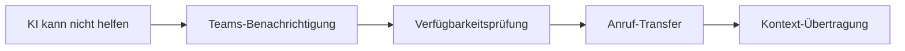

# Kommunikationsplattformen-Integrationen

Sorge für nahtlose Team-Kommunikation und sofortige Benachrichtigungen durch die Integration deiner KI-Telefonassistenten mit modernen Kommunikationsplattformen. Famulor Automation ermöglicht es, wichtige Anrufinformationen automatisch mit deinem Team zu teilen.

## Slack Integration

### Überblick
Slack ist die führende Business-Kommunikationsplattform für Teams. Die Integration mit Famulor Automation bringt Anruf-Intelligence direkt in deine Slack-Workflows.

### Integrationsfähigkeiten
- **Channel-Messaging und Benachrichtigungen**
- **Dateifreigabe und Zusammenarbeit**
- **Workflow-Automatisierung**
- **Custom Bot-Integration**
- **Rich Message Formatting**

### KI-Telefonassistent Anwendungsfälle

#### 🚨 Sofortige Anruf-Benachrichtigungen
**Beschreibung**: Benachrichtige Vertriebsteams sofort, wenn hochwertige Prospects anrufen.

**Benachrichtigungs-Triggers**:
- High-value leads (basierend auf Unternehmensgröße/Budget)
- Bestandskunden mit Upgrade-Interesse
- Dringende Support-Anfragen
- Abwanderungsgefährdete Kunden

**Slack-Nachricht Beispiel**:
```
🔥 HOT LEAD ALERT
Kunde: Max Mustermann (Mustermann GmbH)
Telefon: +49 30 12345678
Interesse: Enterprise-Lösung
Budget: €50,000+
Nächste Schritte: Demo gewünscht
Zuständig: @vertrieb-team
```

#### 📋 Automatische Gesprächszusammenfassungen
**Beschreibung**: Poste automatisierte Anrufzusammenfassungen in relevante Team-Channels.

**Channel-Routing**:
- **#sales**: Verkaufsbezogene Anrufe
- **#support**: Support- und Service-Anfragen  
- **#product**: Feature-Requests und Produktfeedback
- **#management**: Executive-Level Gespräche

**Zusammenfassung-Template**:
```
📞 ANRUF ZUSAMMENFASSUNG
Zeit: 2024-01-15 14:30
Dauer: 12 Minuten
Kunde: TechCorp AG
Status: Qualifizierter Lead

Key Points:
• Interesse an AI-Phone-Lösung
• Budget: €25,000 verfügbar
• Entscheidung bis Ende Q1
• Demo für nächste Woche angesetzt

Action Items:
- [ ] Demo-Termin bestätigen (@sales-rep)
- [ ] Proposal vorbereiten (@sales-manager)
- [ ] Technical Requirements sammeln (@solutions-engineer)
```

#### ⚠️ Eskalations-Management
**Beschreibung**: Benachrichtige Manager sofort, wenn Anrufe menschliche Intervention erfordern.

**Eskalations-Szenarien**:
- Kunde unzufrieden mit Service
- Technische Probleme außerhalb KI-Kompetenz
- Preisverhandlungen über Limit
- Rechtliche oder Compliance-Fragen

### Einrichtung
1. Slack App für Famulor Automation installieren
2. Workspace-Berechtigungen konfigurieren
3. Channel-Mapping für verschiedene Anruftypen
4. Custom Bot-Commands einrichten

---

## Microsoft Teams Integration

### Überblick
Microsoft Teams ist die zentrale Kommunikationsplattform im Microsoft 365-Ecosystem. Die Integration ermöglicht nahtlose Zusammenarbeit und Anruf-Handoffs.

### Integrationsfähigkeiten
- **Team-Zusammenarbeit und Messaging**
- **Meeting-Scheduling und -Management**
- **Datei- und Dokumentfreigabe**
- **Power Platform Integration**
- **Adaptive Cards für Rich Content**

### KI-Telefonassistent Anwendungsfälle

#### 🤝 Nahtlose Team-Anruf-Handoffs
**Beschreibung**: Übertrage Anrufe nahtlos an verfügbare Teammitglieder durch Teams-Integration.

**Handoff-Workflow**:


**Verfügbarkeitsprüfung**:
- Online/Offline Status
- Kalender-Verfügbarkeit
- "Do Not Disturb" Einstellungen
- Fähigkeiten-Match für Anfrage

#### 📅 Automatische Meeting-Planung
**Beschreibung**: Plane Follow-up-Meetings direkt über Teams basierend auf Anrufdiskussionen.

**Meeting-Typen**:
- **Sales Demo**: Nach Produktinteresse
- **Technical Discussion**: Bei technischen Fragen
- **Contract Review**: Bei Vertragsverhandlungen
- **Support Session**: Bei komplexen Support-Cases

**Automatische Meeting-Einladung**:
- Relevante Teilnehmer basierend auf Gesprächsinhalt
- Agenda aus Anrufnotizen generiert
- Dokumente und Ressourcen angehängt
- Kalender-Integration für alle Beteiligten

#### 📢 Abteilungs-Benachrichtigungen
**Beschreibung**: Benachrichtige spezifische Abteilungen, wenn Anrufe ihre Services oder Produkte erwähnen.

**Abteilungs-Mapping**:
- **Marketing**: Erwähnung von Kampagnen oder Marketing-Materialien
- **Product**: Feature-Requests oder Produktfeedback
- **Finance**: Billing- oder Payment-Fragen
- **Legal**: Compliance- oder Vertragsfragen

---

## Discord Integration

### Überblick
Discord ist besonders populär in Gaming-, Tech- und Community-orientierten Unternehmen. Die Integration eignet sich hervorragend für Community-Support und informelle Team-Kommunikation.

### Integrationsfähigkeiten
- **Community-Messaging und Voice**
- **Bot-Integration**
- **Server-Management**
- **Rich Embeds und Reactions**
- **Webhook-Unterstützung**

### KI-Telefonassistent Anwendungsfälle

#### 👥 Community-Support-Verbindung
**Beschreibung**: Verbinde Telefon-Support mit Discord-Community-Channels für fortlaufende Unterstützung.

**Support-Workflow**:
1. Anruf identifiziert Community-relevantes Thema
2. Discord-Invitation automatisch gesendet
3. Support-Ticket in entsprechendem Channel erstellt
4. Community-Moderatoren benachrichtigt

#### 🎉 Event-Benachrichtigungen
**Beschreibung**: Kündige geplante Anrufe oder wichtige Kundenkontakte bei Community-Moderatoren an.

**Event-Typen**:
- **VIP Customer Calls**: Wichtige Kundengespräche
- **Product Launch Calls**: Gespräche zu neuen Features
- **Community Feedback Sessions**: Anrufe für Community-Input
- **Support Escalations**: Wenn Community-Hilfe benötigt wird

#### 🔄 Kunden-Feedback-Loop
**Beschreibung**: Teile anonymisierte Anruf-Feedback mit Community-Teams für Produktverbesserungen.

**Feedback-Kategorien**:
- Feature-Requests und Verbesserungsvorschläge
- Bug-Reports und technische Probleme
- User Experience Feedback
- Performance-Probleme

### Discord Bot Commands
```
/call-summary - Zeigt letzte Anruf-Zusammenfassungen
/escalate - Eskaliert aktuellen Support-Case
/feedback - Sammelt Community-Feedback zu Anrufen
/stats - Zeigt Anruf-Statistiken für heute
```

---

## Telegram Integration

### Überblick
Telegram bietet sichere Messaging-Funktionen und ist besonders in internationalen Teams beliebt.

### KI-Telefonassistent Anwendungsfälle

#### 🌍 Internationale Team-Benachrichtigungen
**Beschreibung**: Benachrichtige globale Teams über wichtige Anrufe in verschiedenen Zeitzonen.

#### 🔐 Sichere Anruf-Updates
**Beschreibung**: Nutze Telegrams Verschlüsselung für sensible Anruf-Informationen.

#### 📱 Mobile-First Benachrichtigungen
**Beschreibung**: Sofortige Push-Benachrichtigungen für zeit-kritische Anrufe.

---

## WhatsApp Business Integration

### Überblick
WhatsApp Business ermöglicht professionelle Kommunikation mit Kunden über die weltweit populärste Messaging-App.

### KI-Telefonassistent Anwendungsfälle

#### 💬 Nahtlose Anruf-zu-Chat Übergänge
**Beschreibung**: Wechsle von Telefonanrufen zu WhatsApp-Chats für fortlaufende Kommunikation.

**Transition-Workflow**:
1. Anruf endet mit Folgeaktionen
2. WhatsApp-Link automatisch gesendet
3. Gesprächskontext in Chat übertragen
4. Fortlaufende Unterstützung über WhatsApp

#### 📋 Anruf-Follow-ups über WhatsApp
**Beschreibung**: Sende automatische Follow-up-Nachrichten nach Anrufen.

**Follow-up-Typen**:
- Anrufzusammenfassung und nächste Schritte
- Dokumente und Ressourcen-Links
- Terminbestätigungen
- Feedback-Anfragen

#### 🌐 Internationale Kundenkommunikation
**Beschreibung**: Nutze WhatsApp für kostengünstige internationale Kundenkommunikation.

---

## Zoom Integration

### Überblick
Zoom ist die führende Video-Konferenz-Plattform für Business-Meetings und Webinare.

### KI-Telefonassistent Anwendungsfälle

#### 🎥 Automatische Demo-Scheduling
**Beschreibung**: Plane automatisch Zoom-Demos basierend auf Anrufinteresse.

#### 📺 Webinar-Registrierung
**Beschreibung**: Registriere interessierte Anrufer automatisch für relevante Webinare.

#### 🔄 Meeting-zu-Anruf Workflows
**Beschreibung**: Erstelle Follow-up-Anrufe basierend auf Zoom-Meeting-Outcomes.

---

## Kommunikations-Integration Best Practices

### 🎯 Channel-Management
- **Klare Channel-Zuordnung**: Definiere spezifische Channels für verschiedene Anruftypen
- **Spam-Vermeidung**: Implementiere Filter für relevante Benachrichtigungen
- **Message Formatting**: Nutze konsistente, lesbare Message-Formate
- **Threading**: Verwende Threads für Follow-up-Diskussionen

### ⚡ Real-time Responsiveness
- **Sofortige Benachrichtigungen**: Stelle minimale Latenz für kritische Alerts sicher
- **Status Indicators**: Zeige Bearbeitungsstatus von Anruf-Items an
- **Auto-Acknowledge**: Implementiere automatische Bestätigungen
- **Escalation Timers**: Setze Timeouts für Response-Zeiten

### 🔔 Notification Management
- **Priority Levels**: Implementiere verschiedene Prioritätsstufen
- **Quiet Hours**: Respektiere Team-Ruhezeiten
- **Role-based Routing**: Sende relevante Nachrichten an passende Rollen
- **Digest Options**: Biete zusammengefasste Updates an

### 📊 Analytics Integration
- **Response Time Tracking**: Miss Team-Response-Zeiten
- **Engagement Metrics**: Verfolge Nachrichtenwirksamkeit
- **Channel Performance**: Analysiere Channel-spezifische Metriken
- **Team Productivity**: Miss Auswirkungen auf Team-Effizienz

## Erweiterte Integration-Szenarien

### Multi-Platform Orchestration
- **Cross-Platform Workflows**: Orchestriere Nachrichten über mehrere Plattformen
- **Unified Inbox**: Zentralisiere Antworten von verschiedenen Channels
- **Smart Routing**: Intelligente Weiterleitung basierend auf Team-Präferenzen
- **Context Preservation**: Bewahre Kontext über Platform-Grenzen hinweg

### AI-Enhanced Communication
- **Sentiment-Based Routing**: Route Nachrichten basierend auf Anruf-Sentiment
- **Auto-Summarization**: Generiere automatische Zusammenfassungen
- **Language Translation**: Übersetze Nachrichten für internationale Teams
- **Predictive Notifications**: Vorhersage wichtiger Benachrichtigungsbedarfe

## Erste Schritte

<Steps>
  <Step title="Plattform auswählen">
    Wähle deine primäre Kommunikationsplattform für die Integration
  </Step>
  <Step title="Bot/App installieren">
    Installiere die entsprechende Famulor Automation App
  </Step>
  <Step title="Channels konfigurieren">
    Richte spezifische Channels für verschiedene Benachrichtigungstypen ein
  </Step>
  <Step title="Notification Rules">
    Definiere Regeln für wann und wie Benachrichtigungen gesendet werden
  </Step>
  <Step title="Team Training">
    Schule dein Team in der Nutzung der neuen Kommunikations-Workflows
  </Step>
</Steps>

## Nächste Schritte

<CardGroup cols={2}>
  <Card title="E-Mail Integration" icon="envelope" href="/de/automation-platform/integrations/email-marketing">
    Erweitere Kommunikation um E-Mail-Automatisierung
  </Card>
  <Card title="CRM-Integration" icon="users" href="/de/automation-platform/integrations/crm">
    Verbinde Kommunikation mit Kundendaten
  </Card>
  <Card title="Projektmanagement" icon="tasks" href="/de/automation-platform/integrations/productivity">
    Automatisierte Task-Erstellung aus Kommunikation
  </Card>
  <Card title="Analytics" icon="chart-line" href="/de/automation-platform/integrations/analytics">
    Miss Kommunikationseffektivität
  </Card>
</CardGroup>

---

**Support**: Für Hilfe bei Kommunikations-Integrationen kontaktiere uns über [support@famulor.io](mailto:support@famulor.io).

<Tip>
Passende Seiten: [Introduction](/de/automation-platform/introduction) und [Building Flows](/de/automation-platform/building-flows) und [Debugging Runs](/de/automation-platform/debugging-runs).
</Tip>
