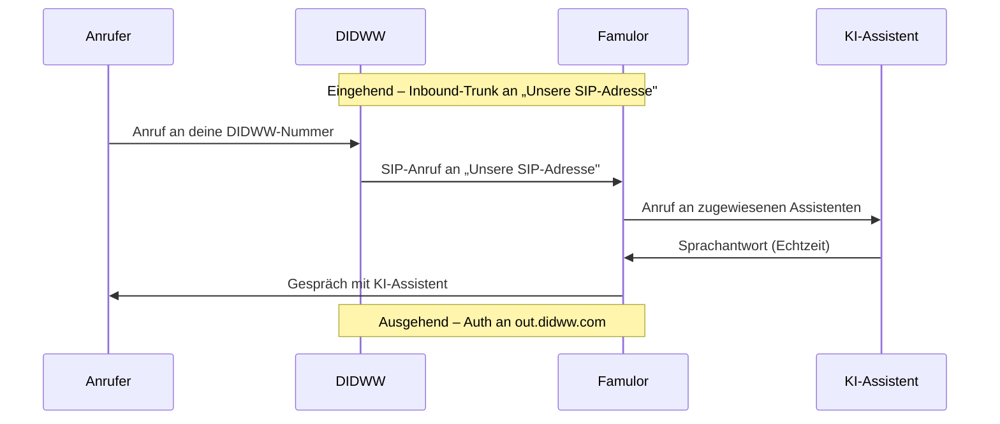

import SipDoneForYou from '/de/snippets/sip-done-for-you-partner-de.mdx';

<SipDoneForYou />

# DIDWW-Nummer mit Famulor verbinden

In dieser Anleitung verbindest du eine **DIDWW**-Telefonnummer über SIP-Trunks mit Famulor.

<Note>
  **DIDWW** (mit POPs u. a. in Frankfurt, Amsterdam, London und Madrid) ist **nicht** dasselbe wie **DIDLogic** – es ist ein eigener Anbieter. Eine Anleitung für DIDLogic findest du unter [DIDLogic-Integration](/de/provisioning/sip-ai/didlogic-integration).
</Note>

<Note>
  Famulor hat **kein** spezielles DIDWW-Import-Feature. Bei DIDWW legst du **zwei Trunks** an:
  - **Inbound-Trunk** (eingehende Anrufe): leitet deine Nummer an die **SIP-Adresse von Famulor**.
  - **Outbound-Trunk** (ausgehende Anrufe): liefert die Zugangsdaten, mit denen Famulor über `out.didww.com` telefoniert.
</Note>

## Funktionsweise

## Voraussetzungen

- Aktives **DIDWW**-Konto mit mindestens einer Telefonnummer (DID)
- Famulor-Konto

---

## Schritt 1: Inbound-Trunk in DIDWW anlegen (eingehende Anrufe)

1. Öffne zuerst in einem zweiten Tab Famulor unter [app.famulor.de/phone-numbers?lang=de](https://app.famulor.de/phone-numbers?lang=de) → **Deine Telefonnummern → + SIP-Trunk integrieren** und kopiere unter **Einstellungen für eingehende Anrufe** den Wert **Unsere SIP-Adresse** (z. B. `xxxxxx.eu.sip.livekit.cloud`).
2. Gehe im DIDWW-Portal zu **Voice → Inbound Trunks** und klicke auf **Create New → SIP Trunk**.

3. Trage ein:
   - **Friendly Name:** z. B. `Famulor`
   - **SIP Endpoint Hostname:** deine **Unsere SIP-Adresse** aus Famulor
   - **Transport Protocol Type:** TCP/UDP (Port 5060) oder TLS (Port 5061)
4. Klicke auf **Create**.

---

## Schritt 2: Rufnummer dem Inbound-Trunk zuordnen

1. Gehe zu **Phone Numbers → My Numbers**.
2. Wähle die gewünschte(n) DID-Nummer(n) aus.
3. Klicke auf **Batch Actions → Update Trunks**.
4. Wähle den eben angelegten **Famulor**-Inbound-Trunk und bestätige mit **Confirm**.

---

## Schritt 3: Outbound-Trunk in DIDWW anlegen (ausgehende Anrufe)

1. Gehe zu **Voice → Outbound Trunks** und klicke auf **Create New**.

2. Trage einen **Friendly Name** ein (z. B. `Famulor`).
3. Lass die Authentifizierung auf **Credentials & IP-based** stehen.
4. Trage unter **Allowed SIP IP addresses** die **feste Outbound-IP von Famulor** ein (aktuell `34.195.177.252/32`).
5. Klicke auf **Create**.
6. Öffne anschließend in der Spalte **Credentials** das **Schlüssel-Symbol** und notiere dir **Username** und **Password** (Passwort über das Augensymbol einblenden).

<Note>
  Bestätige die aktuell angezeigte **feste Outbound-IP** direkt im Famulor-Dialog, falls sie von `34.195.177.252` abweicht.
</Note>

---

## Schritt 4: SIP-Trunk in Famulor einrichten

1. Gehe in Famulor zu **Deine Telefonnummern** und klicke auf **+ SIP-Trunk integrieren**.
2. Trage die Daten wie folgt ein:

| Feld | Wert |
| --- | --- |
| **SIP-Trunk-Typ** | **Telefonnummer (DID)** |
| **Telefonnummer** | Deine DIDWW-Nummer im E.164-Format (z. B. `+12025550123`) |
| **Benutzername** | Der **Username** des DIDWW-Outbound-Trunks (Schritt 3) |
| **Passwort** | Das **Password** des DIDWW-Outbound-Trunks (Schritt 3) |
| **SIP-Adresse** (ausgehend) | `out.didww.com` (ohne Port) |
| **Format der ausgehenden Telefonnummer** | **International (ohne + vorne)** – DIDWW erwartet E.164 **ohne** `+` |
| **Feste Outbound-IP** | **Aktivieren** („Ausgehender Anruf erfolgt von einer festen IP-Adresse"), damit Anrufe von der in DIDWW freigeschalteten IP kommen |
| **Land** | Das Land deines DIDWW-Trunks |

3. Unter **Einstellungen für eingehende Anrufe** steht **Unsere SIP-Adresse** – dieselbe Adresse, die du in **Schritt 1** als DIDWW-**SIP Endpoint Hostname** eingetragen hast.
4. Klicke auf **SIP-Nummer hinzufügen**.

---

## Schritt 5: Assistenten zuweisen und testen

1. Öffne in Famulor den Bereich **Assistenten** und bearbeite den gewünschten Assistenten.
2. Wähle den passenden **Empfangstyp** (eingehende Anrufe).
3. Wähle deine verbundene DIDWW-Telefonnummer aus der Liste.
4. Klicke auf **Assistent speichern**.
5. Führe einen **Testanruf** auf deine DIDWW-Nummer durch und prüfe, ob der KI-Assistent antwortet.

---

## Häufige Probleme

<AccordionGroup>
  <Accordion title="Eingehende Anrufe kommen nicht an" icon="phone-slash">
    Prüfe den **Inbound-Trunk** (Schritt 1): Der **SIP Endpoint Hostname** muss die **genaue** „Unsere SIP-Adresse" aus Famulor sein. Stelle sicher, dass die **DID dem Inbound-Trunk zugeordnet** ist (Schritt 2).
  </Accordion>

  <Accordion title="Ausgehende Anrufe schlagen fehl" icon="arrow-up-right-from-square">
    Prüfe in Famulor die **SIP-Adresse** (`out.didww.com`), **Username** und **Password** des Outbound-Trunks. Stelle sicher, dass die **feste Outbound-IP** in Famulor aktiviert und exakt diese IP (`34.195.177.252/32`) im DIDWW-Outbound-Trunk unter **Allowed SIP IP addresses** freigeschaltet ist.
  </Accordion>

  <Accordion title="Ausgehende Anrufe werden abgewiesen (Nummernformat)" icon="hashtag">
    DIDWW erwartet ausgehend **E.164 ohne `+`** (z. B. `18489005419`). Wähle in Famulor **International (ohne + vorne)**.
  </Accordion>

  <Accordion title="Falsche oder unbekannte SIP-Adresse" icon="server">
    Verwende immer die **exakte** „Unsere SIP-Adresse" aus Famulor (Telefonnummern → SIP-Trunk integrieren → Einstellungen für eingehende Anrufe).
  </Accordion>
</AccordionGroup>

---

## Hilfe

<Tip>
  Bei Problemen kontaktiere unser Support-Team unter [support@famulor.io](mailto:support@famulor.io). Allgemeine Hinweise findest du unter [SIP-Integration](/de/provisioning/sip-ai/sip-integration) und [SIP-Integrationsprobleme](/de/troubleshooting/sip-integration-issues).
</Tip>
