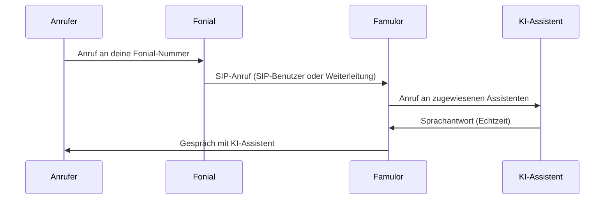

import SipDoneForYou from '/de/snippets/sip-done-for-you-partner-de.mdx';

<SipDoneForYou />


# Fonial-Nummer mit Famulor verbinden

In dieser Anleitung zeigen wir dir Schritt für Schritt, wie du eine Fonial-Rufnummer mit Famulor verbindest.

<Note>
  Famulor hat **keinen** speziellen „Fonial-Import". Du verbindest deine Fonial-Nummer wie jeden anderen Anbieter über die Funktion **SIP-Trunk integrieren** in Famulor. Dafür gibt es **zwei Wege** – wähle unten deinen Weg und folge der passenden Schritt-für-Schritt-Anleitung.
</Note>

<Warning>
  **Nur für fonial-PLUS-Kunden:** Die Voice-KI-Integration kann nur von **PLUS-Kunden** von Fonial genutzt werden. Wenn du bisher **FREE-Kunde** bei Fonial bist, musst du deinen Tarif wechseln, um die Funktion zu nutzen. Kontaktiere den Fonial-Support telefonisch unter **0221 66966966** oder per Mail an [support@fonial.de](mailto:support@fonial.de) und frage nach, ob die Funktion in deinem Paket enthalten ist.
</Warning>

## Welchen Weg wählen?

| Du möchtest … | Dann folge … |
|---------------|--------------|
| Famulor per **SIP-Zugangsdaten** anbinden (SIP-Benutzer / Registrierung) | [Weg 1: SIP-Erweiterung](#weg-1-sip-erweiterung-sip-benutzer) |
| Anrufe per **Weiterleitung auf SIP-URI** an Famulor schicken (wie in der offiziellen Fonial-Anleitung) | [Weg 2: Weiterleitung auf SIP-URI](#weg-2-weiterleitung-auf-sip-uri) |

- **Weg 1 (SIP-Erweiterung):** Famulor registriert sich mit Benutzername und Passwort an Fonial. Empfohlen, wenn du einen SIP-Benutzer in Fonial anlegst.
- **Weg 2 (Weiterleitung auf SIP-URI):** Fonial leitet eingehende Anrufe an die SIP-Adresse von Famulor weiter. Entspricht der offiziellen Fonial-Anleitung für Voice-KI.

## Voraussetzungen

- Aktives Fonial-Kundenkonto mit mindestens einer Rufnummer
- In deinem Fonial-Tarif verfügbares **SIP-Trunking / SIP-Benutzer** (siehe [Fonial-Hilfe: Einrichtung Trunking](https://www.fonial.de/hilfe/trunking/einrichtung-trunking))
- Famulor-Konto
- Zugriff auf den Fonial-Kundenbereich unter [kundenkonto.fonial.de](https://kundenkonto.fonial.de)

## Funktionsweise

Eingehende Anrufe laufen über Fonial zu Famulor und werden dort deinem KI-Assistenten zugeordnet.



---

## Weg 1: SIP-Erweiterung (SIP-Benutzer)

Bei diesem Weg legst du in Fonial einen **SIP-Benutzer** an und trägst dessen Zugangsdaten in Famulor ein. Famulor registriert sich an Fonials SIP-Server (`sip.plusnet.de`).

### Schritt 1: SIP-Benutzer in Fonial anlegen

1. Logge dich in dein [Fonial-Kundenkonto](https://kundenkonto.fonial.de) ein.
2. Öffne in der Seitenleiste **SIP-Benutzer**.
3. Klicke oben rechts auf **Neuen SIP-Benutzer anlegen**.


4. Vergib einen Namen für den SIP-Benutzer (z. B. `Famulor`) und klicke auf **Speichern**.


5. Der neue SIP-Benutzer erscheint in der Liste. Der **Status** ist zunächst **Offline** – das ist normal, solange noch kein Gerät verbunden ist.


### Schritt 2: Zugangsdaten des SIP-Benutzers öffnen

1. Klicke in der Zeile des SIP-Benutzers unter **Aktionen** auf das Symbol für die **Zugangsdaten**.


2. Notiere dir die angezeigten **Zugangsdaten SIP-Benutzer**:

| Feld | Bedeutung |
| --- | --- |
| **Benutzername** | SIP-Benutzername (brauchst du in Famulor) |
| **Passwort** | SIP-Passwort (brauchst du in Famulor) |
| **Server URL** | `sip.plusnet.de` – die SIP-Adresse für Famulor |


<Note>
  Bewahre **Benutzername** und **Passwort** sicher auf. Du brauchst beide in **Schritt 4** für die Famulor-SIP-Trunk-Einrichtung.
</Note>

### Schritt 3: Rufnummer dem SIP-Benutzer zuordnen

Damit eingehende Anrufe über den SIP-Benutzer laufen, ordnest du deine Fonial-Rufnummer diesem Benutzer zu.

1. Öffne in der Seitenleiste **Rufnummern**.
2. Setze links das **Häkchen** bei der Rufnummer, die du mit Famulor verbinden möchtest.
3. Klicke unten auf **SIP-Benutzer zuordnen**.


4. Wähle im Dialog **SIP-Benutzer festlegen** den soeben angelegten SIP-Benutzer (z. B. `Famulor`) aus und klicke auf **Speichern**.


<Note>
  Notiere dir deine Fonial-Rufnummer im **E.164-Format** mit Landesvorwahl, z. B. `+498956546546`. Du brauchst sie im nächsten Schritt in Famulor.
</Note>

### Schritt 4: SIP-Trunk in Famulor einrichten

1. Öffne Famulor unter [app.famulor.de/phone-numbers?lang=de](https://app.famulor.de/phone-numbers?lang=de).
2. Gehe in der Seitenleiste zu **Deine Telefonnummern**.
3. Klicke oben rechts auf **+ SIP-Trunk integrieren**.
4. Trage die Daten wie folgt ein:

| Feld | Wert |
| --- | --- |
| **SIP-Trunk-Typ** | **SIP-Erweiterung** |
| **Deine SIP-Erweiterung** | Deine Fonial-Rufnummer im E.164-Format (z. B. `+498956546546`) |
| **Benutzername** | Der **Benutzername** des Fonial-SIP-Benutzers (aus Schritt 2) |
| **Passwort** | Das **Passwort** des Fonial-SIP-Benutzers (aus Schritt 2) |
| **SIP-Adresse** (ausgehend) | `sip.plusnet.de` (die Server URL aus Schritt 2, ohne Port) |
| **Format der ausgehenden Telefonnummer** | **International (mit + vorne)** |
| **Authentifizierungsart** (eingehend) | **Benutzername und Passwort** (gleiche Zugangsdaten wie ausgehend) |
| **Land** | **Germany (DE)** |

5. Klicke auf **SIP-Nummer hinzufügen**.


<Note>
  Beim Trunk-Typ **SIP-Erweiterung** registriert sich Famulor direkt mit Benutzername und Passwort an Fonial. Du musst in Fonial **keine** Weiterleitung und **keine** SIP-URI eintragen – die Zuordnung der Rufnummer zum SIP-Benutzer (Schritt 3) genügt.
</Note>

### Schritt 5: Verbindung prüfen

Prüfe in Fonial unter **SIP-Benutzer**, ob der **Status** auf **Online** wechselt. Das bestätigt, dass Famulor erfolgreich verbunden ist.


Fahre anschließend mit [Assistenten zuweisen und testen](#assistenten-zuweisen-und-testen) fort.

---

## Weg 2: Weiterleitung auf SIP-URI

Bei diesem Weg legst du in Fonial deinen KI-Telefonassistenten als **Ziel** (Weiterleitung) an. Fonial leitet eingehende Anrufe an die **SIP-Adresse von Famulor** weiter. Das entspricht der offiziellen Fonial-Anleitung für Voice-KI – nur dass du statt einer „Origination-URL" die **SIP-Adresse aus Famulor** verwendest.

### Schritt 1: SIP-Adresse in Famulor holen

1. Öffne Famulor unter [app.famulor.de/phone-numbers?lang=de](https://app.famulor.de/phone-numbers?lang=de) und gehe zu **Deine Telefonnummern → + SIP-Trunk integrieren**.
2. Lege deine Fonial-Nummer als Trunk an und kopiere unter **Einstellungen für eingehende Anrufe** den Wert **Unsere SIP-Adresse** (z. B. `xxxxxx.eu.sip.livekit.cloud`).
3. Bilde daraus die **SIP-URI** für Fonial:

```text
sip:<Fonial-Nummer ohne +>@<Unsere SIP-Adresse>
```

**Beispiel:** Aus der Nummer `+498956546546` und der Adresse `xxxxxx.eu.sip.livekit.cloud` wird:

```text
sip:498956546546@xxxxxx.eu.sip.livekit.cloud
```

<Note>
  Die Telefonnummer in der SIP-URI wird **ohne Pluszeichen (`+`)** angegeben.
</Note>

### Schritt 2: Ziel im Fonial-Kundenkonto anlegen

Als Nächstes legst du deinen KI-Telefonassistenten als Ziel in deiner Telefonanlage an.

1. Wähle im Navigationsmenü unter **Telefonanlage** den Punkt **Ziele**.
2. Klicke auf **Neues Ziel anlegen**.


### Schritt 3: Weiterleitung auf SIP-URI konfigurieren

1. Wähle als **Typ des Weiterleitungsziels** den Punkt **Weiterleitung (Mobilfunk, Festnetz, Fax oder SIP-URI)**.
2. Gib einen **Namen** für das Weiterleitungsziel an (z. B. `Famulor`).
3. Wähle im Dropdown-Menü den Punkt **Weiterleitung auf SIP-URI**.
4. Füge unter **SIP-URI** die in Schritt 1 gebildete SIP-Adresse aus Famulor ein.
5. Wähle als **ausgehende Rufnummer** die Fonial-Nummer, die du mit Famulor verbinden möchtest.
6. Klicke abschließend auf **Speichern**.


Fahre anschließend mit [Assistenten zuweisen und testen](#assistenten-zuweisen-und-testen) fort.

---

## Assistenten zuweisen und testen

Damit eingehende Anrufe von deinem KI-Assistenten beantwortet werden, weist du der verbundenen Nummer einen Assistenten zu.

1. Öffne in Famulor den Bereich **Assistenten** und bearbeite den gewünschten Assistenten.
2. Wähle den passenden **Empfangstyp** (eingehende Anrufe).
3. Wähle deine verbundene Fonial-Telefonnummer aus der Liste.
4. Klicke auf **Assistent speichern**.
5. Führe einen **Testanruf** auf deine Fonial-Nummer durch und prüfe, ob der KI-Assistent antwortet.

---

## Häufige Probleme

<AccordionGroup>
  <Accordion title="SIP-Benutzer bleibt Offline (Weg 1)" icon="plug-circle-xmark">
    Solange sich kein Gerät verbunden hat, ist **Offline** normal. Sobald der Famulor-SIP-Trunk eingerichtet ist (Weg 1, Schritt 4), sollte der Status auf **Online** wechseln. Prüfe sonst **Benutzername**, **Passwort** und die **SIP-Adresse** (`sip.plusnet.de`) in Famulor.
  </Accordion>

  <Accordion title="Anrufe kommen nicht an" icon="phone-slash">
    **Weg 1:** Stelle sicher, dass die Rufnummer in Fonial dem **richtigen SIP-Benutzer zugeordnet** ist und in Famulor die richtige **SIP-Erweiterung** (deine Fonial-Nummer im E.164-Format) eingetragen ist.

    **Weg 2:** Prüfe die **SIP-URI** im Fonial-Ziel – Format `sip:<Nummer ohne +>@<Unsere SIP-Adresse>` – und ob die richtige **ausgehende Rufnummer** gewählt ist.
  </Accordion>

  <Accordion title="Falsche oder unbekannte SIP-Adresse (Weg 2)" icon="server">
    Übernimm die **genaue** „Unsere SIP-Adresse" aus Famulor (Telefonnummern → SIP-Trunk integrieren → Einstellungen für eingehende Anrufe). Die Telefonnummer in der SIP-URI wird **ohne** Pluszeichen angegeben.
  </Accordion>

  <Accordion title="Falsche Rufnummernanzeige bei ausgehenden Anrufen" icon="id-card">
    Wähle in Famulor unter **Format der ausgehenden Telefonnummer** die Option **International (mit + vorne)**.
  </Accordion>
</AccordionGroup>

---

## Hilfe

<Tip>
  Bei Problemen kontaktiere direkt den Famulor-Support unter [support@famulor.io](mailto:support@famulor.io). Den Fonial-Support erreichst du telefonisch unter **0221 66966966** oder per Mail an [support@fonial.de](mailto:support@fonial.de) – weitere Infos im [Fonial Hilfebereich](https://www.fonial.de/hilfe/trunking/einrichtung-trunking).
</Tip>
