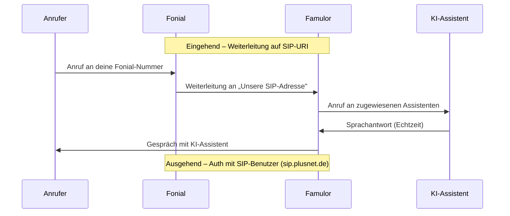

import SipDoneForYou from '/de/snippets/sip-done-for-you-partner-de.mdx';

<SipDoneForYou />


# Fonial-Nummer mit Famulor verbinden

In dieser Anleitung zeigen wir dir Schritt für Schritt, wie du eine Fonial-Rufnummer mit Famulor verbindest.

<Note>
  Famulor hat **keinen** speziellen „Fonial-Import". Du verbindest deine Fonial-Nummer wie jeden anderen Anbieter über die Funktion **SIP-Trunk integrieren** in Famulor.

  Das vollständige Setup besteht aus zwei Teilen, die zusammenarbeiten:
  - **Ausgehende Anrufe:** ein **SIP-Benutzer** in Fonial liefert die Zugangsdaten, mit denen sich Famulor an Fonial authentifiziert.
  - **Eingehende Anrufe:** eine **Weiterleitung auf SIP-URI** in Fonial schickt Anrufe an die SIP-Adresse von Famulor.
</Note>

<Warning>
  **Nur für fonial-PLUS-Kunden:** Die Voice-KI-Integration kann nur von **PLUS-Kunden** von Fonial genutzt werden. Wenn du bisher **FREE-Kunde** bei Fonial bist, musst du deinen Tarif wechseln, um die Funktion zu nutzen. Kontaktiere den Fonial-Support telefonisch unter **0221 66966966** oder per Mail an [support@fonial.de](mailto:support@fonial.de) und frage nach, ob die Funktion in deinem Paket enthalten ist.
</Warning>

## Funktionsweise



- **Eingehend:** Famulor **registriert sich nicht** per SIP REGISTER an Fonial. Eingehende Anrufe gelangen über die **Weiterleitung auf SIP-URI** zu Famulor (Schritt 5).
- **Ausgehend:** Famulor authentifiziert sich pro Anruf mit den **SIP-Benutzer-Zugangsdaten** an `sip.plusnet.de`.

<Note>
  Der **SIP-Benutzer bleibt in Fonial auf „Offline"** – das ist korrekt und kein Fehler. Famulor registriert sich nicht, daher wechselt der Status nicht auf „Online". Eingehende Anrufe laufen über die Weiterleitung, **nicht** über die Registrierung.
</Note>

## Voraussetzungen

- Aktives Fonial-Kundenkonto mit mindestens einer Rufnummer
- In deinem Fonial-Tarif verfügbares **SIP-Trunking / SIP-Benutzer** (siehe [Fonial-Hilfe: Einrichtung Trunking](https://www.fonial.de/hilfe/trunking/einrichtung-trunking))
- Famulor-Konto
- Zugriff auf den Fonial-Kundenbereich unter [kundenkonto.fonial.de](https://kundenkonto.fonial.de)

---

## Schritt 1: SIP-Benutzer in Fonial anlegen

Der SIP-Benutzer liefert die Zugangsdaten für **ausgehende** Anrufe.

1. Logge dich in dein [Fonial-Kundenkonto](https://kundenkonto.fonial.de) ein.
2. Öffne in der Seitenleiste **SIP-Benutzer**.
3. Klicke oben rechts auf **Neuen SIP-Benutzer anlegen**.


4. Vergib einen Namen für den SIP-Benutzer (z. B. `Famulor`) und klicke auf **Speichern**.


5. Der neue SIP-Benutzer erscheint in der Liste mit dem **Status Offline**. Das bleibt auch nach der Einrichtung so – siehe Hinweis oben.


---

## Schritt 2: Zugangsdaten des SIP-Benutzers öffnen

1. Klicke in der Zeile des SIP-Benutzers unter **Aktionen** auf das Symbol für die **Zugangsdaten**.


2. Notiere dir die angezeigten **Zugangsdaten SIP-Benutzer**:

| Feld | Bedeutung |
| --- | --- |
| **Benutzername** | SIP-Benutzername (brauchst du in Famulor) |
| **Passwort** | SIP-Passwort (brauchst du in Famulor) |
| **Server URL** | `sip.plusnet.de` – die SIP-Adresse für Famulor |


<Note>
  Bewahre **Benutzername** und **Passwort** sicher auf. Du brauchst beide in **Schritt 4** für die Famulor-SIP-Trunk-Einrichtung.
</Note>

---

## Schritt 3: Rufnummer dem SIP-Benutzer zuordnen

1. Öffne in der Seitenleiste **Rufnummern**.
2. Setze links das **Häkchen** bei der Rufnummer, die du mit Famulor verbinden möchtest.
3. Klicke unten auf **SIP-Benutzer zuordnen**.


4. Wähle im Dialog **SIP-Benutzer festlegen** den soeben angelegten SIP-Benutzer (z. B. `Famulor`) aus und klicke auf **Speichern**.


<Note>
  Notiere dir deine Fonial-Rufnummer im **E.164-Format** mit Landesvorwahl, z. B. `+498956546546`. Du brauchst sie in den nächsten Schritten.
</Note>

---

## Schritt 4: SIP-Trunk in Famulor einrichten

1. Öffne Famulor unter [app.famulor.de/phone-numbers?lang=de](https://app.famulor.de/phone-numbers?lang=de).
2. Gehe in der Seitenleiste zu **Deine Telefonnummern**.
3. Klicke oben rechts auf **+ SIP-Trunk integrieren**.
4. Trage die Daten wie folgt ein:

| Feld | Wert |
| --- | --- |
| **SIP-Trunk-Typ** | **SIP-Erweiterung** |
| **Deine SIP-Erweiterung** | Deine Fonial-Rufnummer im E.164-Format (z. B. `+498956546546`) |
| **Benutzername** | Der **Benutzername** des Fonial-SIP-Benutzers (aus Schritt 2) |
| **Passwort** | Das **Passwort** des Fonial-SIP-Benutzers (aus Schritt 2) |
| **SIP-Adresse** (ausgehend) | `sip.plusnet.de` (die Server URL aus Schritt 2, ohne Port) |
| **Format der ausgehenden Telefonnummer** | **International (mit + vorne)** |
| **Land** | **Germany (DE)** |

5. Kopiere unter **Einstellungen für eingehende Anrufe** den Wert **Unsere SIP-Adresse** (z. B. `xxxxxx.eu.sip.livekit.cloud`). Du brauchst ihn in Schritt 5.
6. Klicke auf **SIP-Nummer hinzufügen**.


<Note>
  Mit dieser Konfiguration sind **ausgehende** Anrufe bereits abgedeckt: Famulor authentifiziert sich mit Benutzername und Passwort an `sip.plusnet.de`. Für **eingehende** Anrufe richtest du in Schritt 5 die Weiterleitung in Fonial ein.
</Note>

---

## Schritt 5: Weiterleitung auf SIP-URI in Fonial anlegen (eingehende Anrufe)

Damit eingehende Anrufe bei Famulor ankommen, legst du in Fonial deinen KI-Telefonassistenten als **Ziel** an. Fonial leitet die Anrufe dann an die SIP-Adresse von Famulor weiter.

### SIP-URI aus „Unsere SIP-Adresse" bilden

Bilde aus deiner Fonial-Nummer und der in Schritt 4 kopierten **Unsere SIP-Adresse** die SIP-URI:

```text
sip:<Fonial-Nummer ohne +>@<Unsere SIP-Adresse>
```

**Beispiel:** Aus `+498956546546` und `xxxxxx.eu.sip.livekit.cloud` wird:

```text
sip:498956546546@xxxxxx.eu.sip.livekit.cloud
```

<Note>
  Die Telefonnummer in der SIP-URI wird **ohne Pluszeichen (`+`)** angegeben.
</Note>

### Ziel im Fonial-Kundenkonto anlegen

1. Wähle im Navigationsmenü unter **Telefonanlage** den Punkt **Ziele**.
2. Klicke auf **Neues Ziel anlegen**.


3. Wähle als **Typ des Weiterleitungsziels** den Punkt **Weiterleitung (Mobilfunk, Festnetz, Fax oder SIP-URI)**.
4. Gib einen **Namen** für das Weiterleitungsziel an (z. B. `Famulor`).
5. Wähle im Dropdown-Menü den Punkt **Weiterleitung auf SIP-URI**.
6. Füge unter **SIP-URI** die oben gebildete SIP-Adresse aus Famulor ein.
7. Wähle als **ausgehende Rufnummer** die Fonial-Nummer, die du mit Famulor verbinden möchtest.
8. Klicke abschließend auf **Speichern**.


---

## Schritt 6: Assistenten zuweisen und testen

Damit eingehende Anrufe von deinem KI-Assistenten beantwortet werden, weist du der Nummer einen Assistenten zu.

1. Öffne in Famulor den Bereich **Assistenten** und bearbeite den gewünschten Assistenten.
2. Wähle den passenden **Empfangstyp** (eingehende Anrufe).
3. Wähle deine verbundene Fonial-Telefonnummer aus der Liste.
4. Klicke auf **Assistent speichern**.
5. Führe einen **Testanruf** auf deine Fonial-Nummer durch und prüfe, ob der KI-Assistent antwortet.

---

## Häufige Probleme

<AccordionGroup>
  <Accordion title="SIP-Benutzer steht auf „Offline“" icon="circle-info">
    Das ist **normal und kein Fehler**. Famulor registriert sich **nicht** per SIP REGISTER an Fonial, daher bleibt der SIP-Benutzer auf „Offline". Eingehende Anrufe laufen über die **Weiterleitung auf SIP-URI** (Schritt 5), nicht über die Registrierung.
  </Accordion>

  <Accordion title="Eingehende Anrufe kommen nicht an" icon="phone-slash">
    Prüfe die **Weiterleitung auf SIP-URI** in Fonial (Schritt 5): SIP-URI im Format `sip:<Nummer ohne +>@<Unsere SIP-Adresse>`, korrekt gewählte **ausgehende Rufnummer** und die **genaue** „Unsere SIP-Adresse" aus Famulor (ohne `sip:` ein zweites Mal, ohne Leerzeichen).
  </Accordion>

  <Accordion title="Ausgehende Anrufe schlagen fehl" icon="arrow-up-right-from-square">
    Prüfe in Famulor **Benutzername**, **Passwort** und die **SIP-Adresse** (`sip.plusnet.de`) aus den Fonial-Zugangsdaten (Schritt 2). Wähle unter **Format der ausgehenden Telefonnummer** die Option **International (mit + vorne)**.
  </Accordion>

  <Accordion title="Falsche oder unbekannte SIP-Adresse" icon="server">
    Übernimm die **genaue** „Unsere SIP-Adresse" aus Famulor (Telefonnummern → SIP-Trunk integrieren → Einstellungen für eingehende Anrufe). Die Telefonnummer in der SIP-URI wird **ohne** Pluszeichen angegeben.
  </Accordion>
</AccordionGroup>

---

## Hilfe

<Tip>
  Bei Problemen kontaktiere direkt den Famulor-Support unter [support@famulor.io](mailto:support@famulor.io). Den Fonial-Support erreichst du telefonisch unter **0221 66966966** oder per Mail an [support@fonial.de](mailto:support@fonial.de) – weitere Infos im [Fonial Hilfebereich](https://www.fonial.de/hilfe/trunking/einrichtung-trunking).
</Tip>
