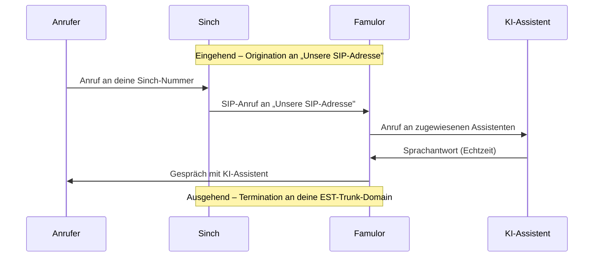

import SipDoneForYou from '/de/snippets/sip-done-for-you-partner-de.mdx';

<SipDoneForYou />


# Sinch-Nummer mit Famulor verbinden

In dieser Anleitung verbindest du eine **Sinch**-Telefonnummer über **Elastic SIP Trunking (EST)** mit Famulor.

<Note>
  Famulor hat **kein** spezielles Sinch-Import-Feature. Du richtest in Sinch einen **Elastic SIP Trunk** ein und verbindest ihn über **SIP-Trunk integrieren** in Famulor.

  - **Termination** (ausgehende Anrufe): Famulor sendet Anrufe an deine **Sinch-EST-Trunk-Domain**.
  - **Origination** (eingehende Anrufe): Sinch leitet Anrufe an die **SIP-Adresse von Famulor** weiter.
</Note>

## Funktionsweise



- **Eingehend:** Famulor **registriert sich nicht** per SIP REGISTER. Sinch schickt Anrufe über die **Origination** an „Unsere SIP-Adresse".
- **Ausgehend:** Famulor sendet Anrufe an die **Termination**-Domain deines Sinch-Trunks.

## Voraussetzungen

- Aktives **Sinch**-Konto mit **Elastic SIP Trunking**
- Mindestens eine Sinch-Telefonnummer (DID)
- Famulor-Konto

---

## Schritt 1: Elastic SIP Trunk in Sinch erstellen

1. Erstelle in deinem Sinch-Dashboard einen **Elastic SIP Trunk**.
2. Notiere dir die **EST-Trunk-Domain (FQDN)** deines Trunks – diese brauchst du als ausgehende SIP-Adresse in Famulor.
3. Ordne dem Trunk deine **Telefonnummer (DID)** zu.

<Note>
  Die genaue **EST-Trunk-Domain** und die zugehörige Authentifizierungsart (IP-ACL oder Digest) findest du in deinem Sinch-Dashboard.
</Note>

---

## Schritt 2: SIP-Trunk in Famulor einrichten

1. Öffne Famulor unter [app.famulor.de/phone-numbers?lang=de](https://app.famulor.de/phone-numbers?lang=de) → **Deine Telefonnummern** → **+ SIP-Trunk integrieren**.
2. Trage die Daten wie folgt ein:

| Feld | Wert |
| --- | --- |
| **SIP-Trunk-Typ** | **Telefonnummer (DID)** |
| **Telefonnummer** | Deine Sinch-Nummer im E.164-Format (z. B. `+12025550123`) |
| **SIP-Adresse** (ausgehend) | Deine **Sinch-EST-Trunk-Domain** aus Schritt 1 (ohne Port) |
| **Format der ausgehenden Telefonnummer** | **International (mit + vorne)** |
| **Authentifizierungsart** | Passend zu deinem Sinch-Trunk – **IP-Adresse** oder **Benutzername und Passwort** (siehe Schritt 3) |
| **Land** | Das Land deines Sinch-Trunks |

3. Kopiere unter **Einstellungen für eingehende Anrufe** den Wert **Unsere SIP-Adresse** (z. B. `xxxxxx.eu.sip.livekit.cloud`). Du brauchst ihn in Schritt 3.
4. Klicke auf **SIP-Nummer hinzufügen**.


---

## Schritt 3: Origination und Authentifizierung in Sinch konfigurieren

### Origination (eingehende Anrufe)

Lege in den **Inbound-Einstellungen** deines Sinch-Trunks einen **statischen Endpunkt** an, der auf die SIP-Adresse von Famulor zeigt:

```text
<Unsere SIP-Adresse>:5060;transport=udp
```

**Beispiel:** `xxxxxx.eu.sip.livekit.cloud:5060;transport=udp`

### Termination-Authentifizierung (ausgehende Anrufe)

Wähle eine der beiden Methoden – passend zu Schritt 2:

- **IP-ACL (empfohlen):** Trage in der Termination-ACL deines Sinch-Trunks die **feste Outbound-IP von Famulor** ein (aktuell `34.195.177.252/32`). Aktiviere dazu in Famulor die Option **„Ausgehender Anruf erfolgt von einer festen IP-Adresse"**.
- **Digest (Benutzername/Passwort):** Falls dein Sinch-Trunk Digest-Auth nutzt, trage die Zugangsdaten in Famulor unter **Authentifizierung** ein.

<Note>
  Bestätige die aktuell angezeigte **feste Outbound-IP** direkt im Famulor-Dialog („SIP-Trunk integrieren" → ausgehende Einstellungen), falls sie von `34.195.177.252` abweicht.
</Note>

---

## Schritt 4: Assistenten zuweisen und testen

1. Öffne in Famulor den Bereich **Assistenten** und bearbeite den gewünschten Assistenten.
2. Wähle den passenden **Empfangstyp** (eingehende Anrufe).
3. Wähle deine verbundene Sinch-Telefonnummer aus der Liste.
4. Klicke auf **Assistent speichern**.
5. Führe einen **Testanruf** auf deine Sinch-Nummer durch und prüfe, ob der KI-Assistent antwortet.

---

## Häufige Probleme

<AccordionGroup>
  <Accordion title="Eingehende Anrufe kommen nicht an" icon="phone-slash">
    Prüfe die **Origination** in Sinch (Schritt 3): Der statische Endpunkt muss auf die **genaue** „Unsere SIP-Adresse" aus Famulor zeigen. Stelle sicher, dass die **DID dem Trunk zugeordnet** ist.
  </Accordion>

  <Accordion title="Ausgehende Anrufe schlagen fehl" icon="arrow-up-right-from-square">
    Prüfe die **EST-Trunk-Domain** als SIP-Adresse in Famulor und die **Authentifizierung**: Bei **IP-ACL** muss Famulors **feste Outbound-IP** (`34.195.177.252/32`) im Sinch-Trunk freigeschaltet und in Famulor die feste IP aktiviert sein. Wähle als Rufnummernformat **International (mit + vorne)**.
  </Accordion>

  <Accordion title="Falsche oder unbekannte SIP-Adresse" icon="server">
    Verwende immer die **exakte** „Unsere SIP-Adresse" aus Famulor (Telefonnummern → SIP-Trunk integrieren → Einstellungen für eingehende Anrufe).
  </Accordion>
</AccordionGroup>

---

## Hilfe

<Tip>
  Bei Problemen kontaktiere unser Support-Team unter [support@famulor.io](mailto:support@famulor.io). Allgemeine Hinweise findest du unter [SIP-Integration](/de/provisioning/sip-ai/sip-integration) und [SIP-Integrationsprobleme](/de/troubleshooting/sip-integration-issues).
</Tip>
