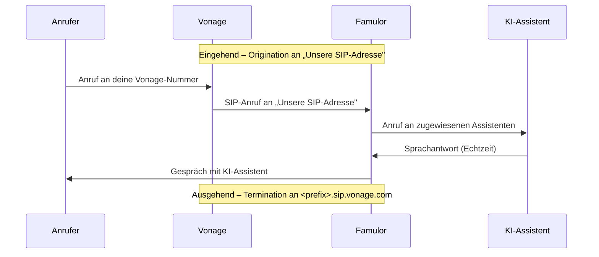

import SipDoneForYou from '/de/snippets/sip-done-for-you-partner-de.mdx';

<SipDoneForYou />

# Vonage-Nummer mit Famulor verbinden

In dieser Anleitung verbindest du eine **Vonage**-Telefonnummer über **Elastic SIP Trunking** mit Famulor.

<Note>
  Famulor hat **kein** spezielles Vonage-Import-Feature. Du richtest in Vonage einen **Elastic SIP Trunk** ein und verbindest ihn über **SIP-Trunk integrieren** in Famulor.

  Der Trunk hat zwei Richtungen:
  - **Termination** (ausgehende Anrufe): Vonage gibt dir eine SIP-Domain + Zugangsdaten, an die Famulor ausgehende Anrufe sendet.
  - **Origination** (eingehende Anrufe): Vonage leitet Anrufe an die **SIP-Adresse von Famulor** weiter.
</Note>

## Funktionsweise

- **Eingehend:** Famulor **registriert sich nicht** per SIP REGISTER. Vonage schickt Anrufe über die **Origination** an „Unsere SIP-Adresse".
- **Ausgehend:** Famulor sendet Anrufe an die **Termination**-SIP-Domain von Vonage und authentifiziert sich mit Benutzername und Passwort.

## Voraussetzungen

- Aktives **Vonage**-Konto mit Zugriff auf **Programmable SIP / Elastic SIP Trunking**
- Mindestens eine Vonage-Telefonnummer (oder eine neue Nummer zum Kaufen)
- Famulor-Konto

---

## Schritt 1: Elastic SIP Trunk in Vonage erstellen

1. Öffne das **Vonage-Dashboard** und navigiere zum Bereich **SIP**.

2. Lege einen neuen SIP-Trunk an und wähle als Anbieter **„Something else"** (also keinen vordefinierten Anbieter).

---

## Schritt 2: Termination einrichten (ausgehende Anrufe)

Die **Termination** liefert die SIP-Domain und die Zugangsdaten, mit denen Famulor ausgehende Anrufe sendet.

1. Folge in Vonage der Einrichtung der **Termination**.
2. Notiere dir die angezeigten Werte:

| Feld | Beispiel / Bedeutung |
| --- | --- |
| **SIP-Domain** | `<dein-prefix>.sip.vonage.com` (Termination SIP URI) |
| **Benutzername (User name)** | Zugangsdaten für ausgehende Anrufe |
| **Passwort (Password)** | Zugangsdaten für ausgehende Anrufe |

<Note>
  Speichere **SIP-Domain**, **Benutzername** und **Passwort** sicher. Du brauchst sie in **Schritt 5** für die Famulor-Einrichtung.
</Note>

---

## Schritt 3: Origination einrichten (eingehende Anrufe)

Bei der **Origination** legst du fest, wohin Vonage eingehende Anrufe weiterleitet – nämlich an die **SIP-Adresse von Famulor**.

1. Öffne in einem zweiten Tab Famulor unter [app.famulor.de/phone-numbers?lang=de](https://app.famulor.de/phone-numbers?lang=de) → **Deine Telefonnummern → + SIP-Trunk integrieren** und kopiere unter **Einstellungen für eingehende Anrufe** den Wert **Unsere SIP-Adresse** (z. B. `xxxxxx.eu.sip.livekit.cloud`).
2. Füge diese Adresse in Vonage unter **Origination** als **SIP-URI** ein.

<Note>
  Übernimm die **genaue** „Unsere SIP-Adresse" aus Famulor – ohne Leerzeichen.
</Note>

---

## Schritt 4: Nummer dem Trunk zuordnen

Verknüpfe eine Telefonnummer mit deinem Elastic SIP Trunk – entweder eine **bestehende Nummer** oder eine **neu gekaufte**.

<Note>
  Notiere dir die Vonage-Nummer im **E.164-Format** mit Landesvorwahl (z. B. `+12025550123`). Du brauchst sie in Schritt 5.
</Note>

---

## Schritt 5: SIP-Trunk in Famulor einrichten

1. Gehe in Famulor zu **Deine Telefonnummern** und klicke auf **+ SIP-Trunk integrieren**.
2. Trage die Daten wie folgt ein:

| Feld | Wert |
| --- | --- |
| **SIP-Trunk-Typ** | **Telefonnummer (DID)** |
| **Telefonnummer** | Deine Vonage-Nummer im E.164-Format (z. B. `+12025550123`) |
| **Benutzername** | Der **Termination**-Benutzername aus Schritt 2 |
| **Passwort** | Das **Termination**-Passwort aus Schritt 2 |
| **SIP-Adresse** (ausgehend) | Die Vonage-**SIP-Domain** aus Schritt 2 (z. B. `<dein-prefix>.sip.vonage.com`, ohne Port) |
| **Format der ausgehenden Telefonnummer** | **International (mit + vorne)** |
| **Land** | Das Land deines Vonage-Trunks |

3. Unter **Einstellungen für eingehende Anrufe** steht **Unsere SIP-Adresse** – dieselbe Adresse, die du in **Schritt 3** als Vonage-Origination eingetragen hast.
4. Klicke auf **SIP-Nummer hinzufügen**.

---

## Schritt 6: Assistenten zuweisen und testen

1. Öffne in Famulor den Bereich **Assistenten** und bearbeite den gewünschten Assistenten.
2. Wähle den passenden **Empfangstyp** (eingehende Anrufe).
3. Wähle deine verbundene Vonage-Telefonnummer aus der Liste.
4. Klicke auf **Assistent speichern**.
5. Führe einen **Testanruf** auf deine Vonage-Nummer durch und prüfe, ob der KI-Assistent antwortet.

---

## Anrufweiterleitung an einen Menschen (kalt & warm)

Famulor kann ein laufendes Gespräch an einen echten Ansprechpartner übergeben – als **Kaltweiterleitung** oder **Warmweiterleitung**. Die vollständige Einrichtung findest du unter [Anrufsweiterleitung](/de/platform/anrufsweiterleitung). Für **Vonage** gibt es eine wichtige Besonderheit.

<Warning>
  **Vonage unterstützt kein SIP REFER.** Famulor führt **Kaltweiterleitungen** über **SIP REFER** durch – der Carrier verbindet den Anrufer dabei direkt weiter. Da Vonage-SIP-Trunks REFER **nicht** unterstützen, funktioniert die **Kaltweiterleitung über den Vonage-Trunk nicht zuverlässig**.

  **Empfehlung für Vonage:** Nutze die **Warmweiterleitung**. Dabei erstellt Famulor ein **neues SIP INVITE** (einen separaten ausgehenden Anruf über den Vonage-Trunk) und **führt die beiden Gespräche zusammen** – das benötigt **kein** REFER und funktioniert daher auch mit SIP-Trunks ohne REFER-Unterstützung wie Vonage.
</Warning>

### Optionen pro Weiterleitungsziel

Bei jedem Weiterleitungsziel (Kalt wie Warm) hast du zwei Möglichkeiten:

- **Telefonnummer:** Die Rufnummer des echten Ansprechpartners, an die übergeben wird (z. B. `+49 1512 3456789`).
- **(Advanced) Is custom SIP transfer?** Aktiviere diese Option, um statt einer Telefonnummer eine **eigene SIP-Anfrage** anzugeben (Feld **Custom SIP transfer**). Nützlich, wenn dein SIP-Trunk-Anbieter ein bestimmtes Format verlangt – z. B. `tel:1234567890` oder eine SIP-URI wie `sip:200@dein-anbieter`.

<Note>
  **Custom SIP transfer** hebt die REFER-Beschränkung von Vonage **nicht** auf: Auch eine eigene SIP-Anfrage wird bei der Kaltweiterleitung per REFER gesendet. Für Vonage bleibt die **Warmweiterleitung** der zuverlässige Weg, um an einen Menschen zu übergeben.
</Note>

---

## Häufige Probleme

<AccordionGroup>
  <Accordion title="Eingehende Anrufe kommen nicht an" icon="phone-slash">
    Prüfe die **Origination** in Vonage (Schritt 3): Dort muss die **genaue** „Unsere SIP-Adresse" aus Famulor stehen. Stelle außerdem sicher, dass die **Nummer dem Trunk zugeordnet** ist (Schritt 4).
  </Accordion>

  <Accordion title="Ausgehende Anrufe schlagen fehl" icon="arrow-up-right-from-square">
    Prüfe in Famulor die **Termination**-Werte aus Schritt 2: **SIP-Adresse** (`<dein-prefix>.sip.vonage.com`), **Benutzername** und **Passwort**. Wähle als Rufnummernformat **International (mit + vorne)**.
  </Accordion>

  <Accordion title="Falsche oder unbekannte SIP-Adresse" icon="server">
    Verwende immer die **exakte** „Unsere SIP-Adresse" aus Famulor (Telefonnummern → SIP-Trunk integrieren → Einstellungen für eingehende Anrufe).
  </Accordion>

  <Accordion title="Kaltweiterleitung funktioniert nicht" icon="phone-arrow-up-right">
    **Vonage unterstützt kein SIP REFER**, das Famulor für die Kaltweiterleitung nutzt. Verwende stattdessen die **Warmweiterleitung** – sie erstellt ein neues SIP INVITE und führt die Gespräche zusammen (kein REFER), funktioniert also mit Vonage. Details: [Anrufsweiterleitung](/de/platform/anrufsweiterleitung).
  </Accordion>
</AccordionGroup>

---

## Hilfe

<Tip>
  Bei Problemen kontaktiere unser Support-Team unter [support@famulor.io](mailto:support@famulor.io). Allgemeine Hinweise findest du auch unter [SIP-Integration](/de/provisioning/sip-ai/sip-integration) und [SIP-Integrationsprobleme](/de/troubleshooting/sip-integration-issues).
</Tip>
